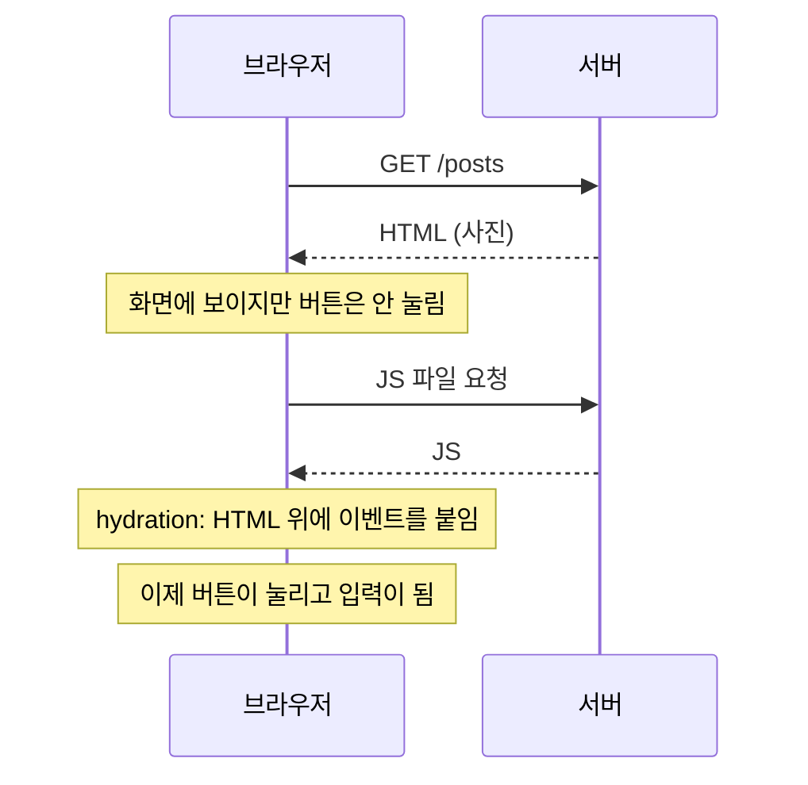
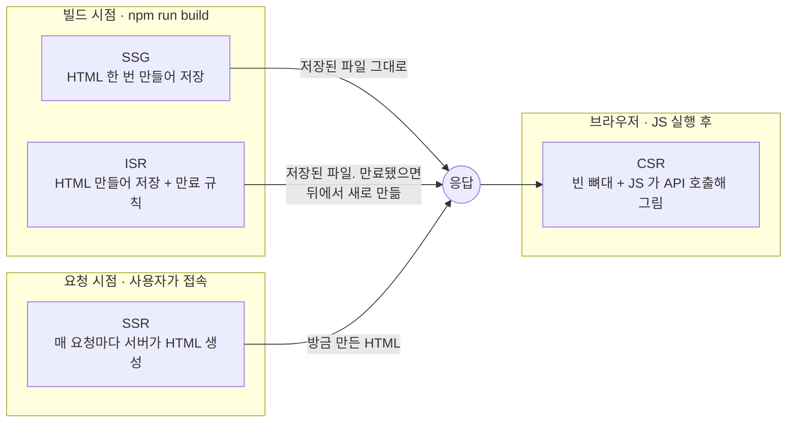
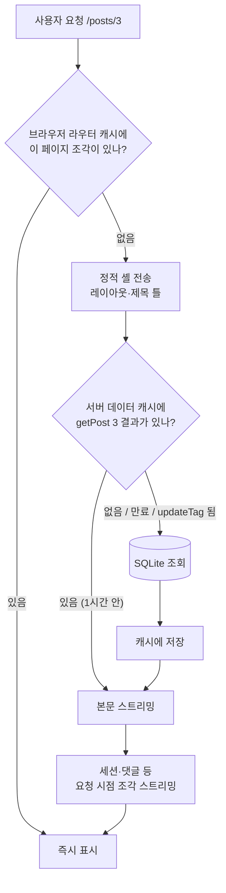
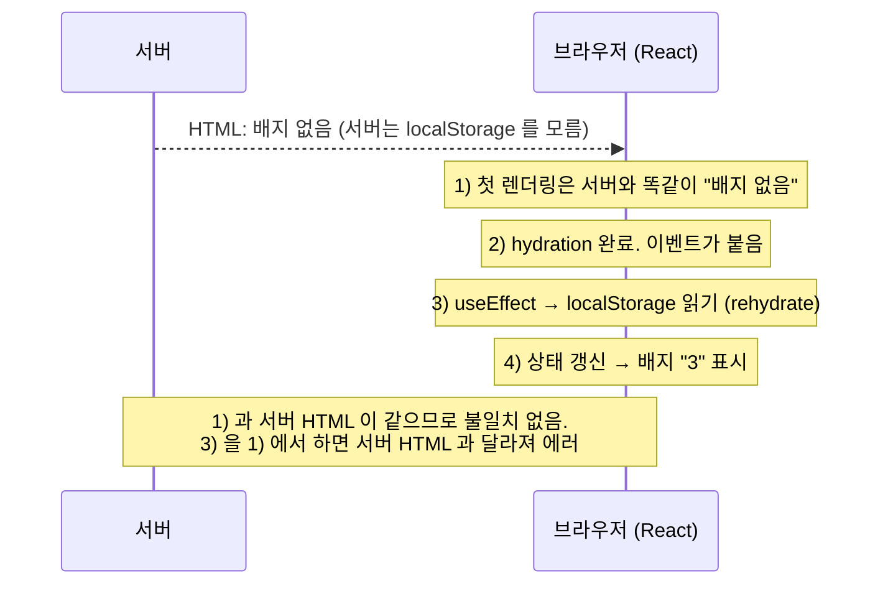
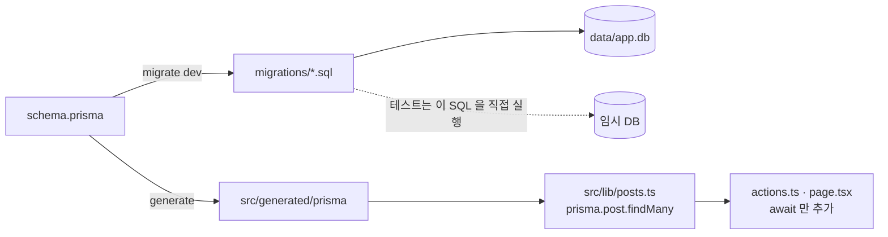
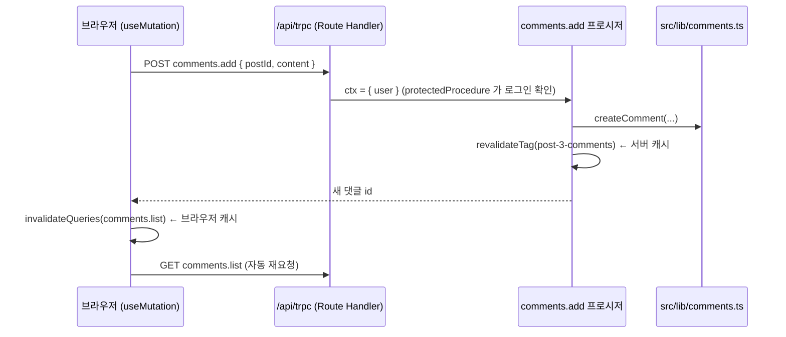

# next-js-study-app

Next.js 16 (App Router) 학습용 프로젝트. SQLite 를 붙인 작은 앱 두 개(todos, posts)에 핵심 개념을 하나씩 심어 두었다.
**README 의 개념 설명 → 해당 파일의 주석 → 브라우저에서 동작 확인** 순서로 보면 된다.

## 스택

- Next.js 16 (App Router, Turbopack, Cache Components)
- React 19, TypeScript
- Tailwind CSS v4, shadcn/ui (style: base-nova)
- SQLite (Node.js 내장 `node:sqlite`, 별도 패키지 없음)
- SWR, TanStack Query (클라이언트 사이드 페칭 비교용)
- Zod (폼 검증)
- jose (세션 JWT 서명). 비밀번호 해시는 Node 내장 crypto.scrypt
- 공개 REST API `/api/v1` (Bearer 인증, 레이트 리밋, OpenAPI 3.1 명세)
- zustand (클라이언트 전역 상태)
- Vitest + React Testing Library (단위/컴포넌트 테스트), Playwright (E2E)
- ESLint

## 시작하기

```bash
npm install
cp .env.example .env   # DB 파일 경로 + 세션 서명 키
# .env 의 SESSION_SECRET 을 아래 명령 결과로 바꾼다
openssl rand -base64 32
npm run db:seed        # 샘플 데이터 넣기 (계정 2개 포함)
npm run dev            # http://localhost:3000
```

공개 REST API 는 `http://localhost:3000/api/v1` 에 있다 (명세: `/api/v1/openapi.json`). 자세한 내용은 [Part 5](#part-5-공개-api-apiv1--외부-개발자에게-열어-주기).

그 외 명령:

```bash
npm run build          # 프로덕션 빌드. 라우트별 렌더링 방식(○ ◐ ƒ)이 출력된다
npm run start          # 빌드 결과 실행
npm run lint
npm test               # 단위/컴포넌트 테스트 (Vitest)
npm run test:e2e       # 브라우저 E2E 테스트 (Playwright)
npm run db:init        # DB 파일/테이블만 생성 (앱 첫 실행 시 자동으로도 됨)
npm run db:seed -- --reset   # 샘플 데이터로 초기화
```

샘플 계정 (비밀번호는 둘 다 `password123`):

| 이메일 | 이름 | 용도 |
| --- | --- | --- |
| demo@example.com | 데모 | 샘플 글 대부분의 작성자 |
| guest@example.com | 게스트 | "남의 글은 읽기만" 되는지 확인할 때 |

---

## 용어 사전 (모르는 말이 나오면 여기로)

이 문서에는 낯선 용어가 많이 나온다. 각 용어를 **쉬운 말 한두 줄** 로 풀고, 자세한 설명이 있는 절 번호를 붙였다. 본문을 읽다 막히면 이 표로 돌아온다.

### 기본 구조

| 용어 | 쉬운 말로 | 자세히 |
| --- | --- | --- |
| **컴포넌트** | 화면 조각을 만드는 함수. `<TodoItem/>` 처럼 태그로 쓴다. 조각을 조립해 페이지를 만든다 | 1-5 |
| **라우트 / 라우팅** | URL(`/posts/3`)과 그 URL 에서 보여 줄 화면을 짝짓는 것. App Router 에서는 **폴더 구조가 곧 URL** 이다 | 1-1, 2-4 |
| **세그먼트** | URL 을 `/` 로 자른 조각 하나. `/posts/3/edit` 은 `posts`, `3`, `edit` 세 세그먼트. 폴더 하나가 세그먼트 하나 | 2-4 |
| **동적 세그먼트** `[id]` | 값이 정해지지 않은 세그먼트. 폴더 이름을 `[id]` 로 만들면 `/posts/1`, `/posts/2` 모두 이 폴더가 처리하고, 값은 `params` 로 받는다 | 2-4 |
| **layout.tsx** | 여러 페이지가 공유하는 틀(헤더, 메뉴). 페이지를 옮겨도 다시 그려지지 않는다 | 2-15 |
| **page.tsx** | 그 URL 에서 실제로 보여 줄 내용. 이 파일이 있어야 URL 이 열린다 | 1-3 |
| **라우트 그룹** `(이름)` | 괄호 폴더. URL 에는 안 들어가고 파일을 묶거나 레이아웃을 공유하는 용도 | 3-1, 2-14 |
| **App Router** | Next.js 13 부터의 라우팅 방식. `src/app/` 폴더를 쓴다. 예전 방식은 Pages Router(`pages/` 폴더) | 스택 |

### 서버와 브라우저

| 용어 | 쉬운 말로 | 자세히 |
| --- | --- | --- |
| **서버** | 코드를 실행해 HTML 과 데이터를 만들어 주는 컴퓨터. 개발 중에는 내 PC 의 `npm run dev` 가 서버다 | 왕초보 0 |
| **클라이언트 / 브라우저** | 사용자가 보는 쪽. Chrome 같은 프로그램 | 왕초보 0 |
| **요청 / 응답** | 브라우저가 "이 페이지 주세요" 하는 것이 요청, 서버가 돌려주는 것이 응답 | 왕초보 0 |
| **서버 컴포넌트** | 서버에서만 실행되는 컴포넌트. DB 를 바로 읽을 수 있고 `async` 가 된다. App Router 의 기본값 | 1-3 |
| **클라이언트 컴포넌트** | 브라우저에서도 실행되는 컴포넌트. 파일 맨 위에 `"use client"` 를 쓴다. 클릭·입력 같은 상호작용을 담당 | 1-5 |
| **Server Action** | 브라우저에서 부르면 서버에서 실행되는 함수. 파일 맨 위에 `"use server"`. 폼 제출이나 버튼 클릭으로 데이터를 바꿀 때 쓴다 | 1-4 |
| **Route Handler** | `route.ts` 파일. URL 로 오는 HTTP 요청(GET/POST 등)을 직접 처리해 JSON 등을 돌려주는 API | 1-6, Part 5 |
| **API** | 프로그램끼리 데이터를 주고받는 약속된 창구. 이 프로젝트에서는 `/api/...` URL 들 | 1-6 |
| **HTML** | 브라우저가 화면으로 그리는 문서. 서버가 만들어 보내는 "완성된 그림" | 왕초보 0 |
| **JS 번들** | 브라우저로 보내는 자바스크립트 파일 묶음. 이게 도착해야 버튼이 눌린다 | 왕초보 4 |
| **hydration** | 서버가 보낸 HTML(그림)에 JS 가 붙어 살아나는 과정. 이 전에는 클릭이 안 된다 | 왕초보 4 |
| **hydration 불일치** | 서버가 만든 HTML 과 브라우저가 처음 그린 결과가 달라서 나는 에러 | 왕초보 4, 6-2 |
| **HMR** (Hot Module Replacement) | 개발 중 파일을 저장하면 새로고침 없이 바뀐 부분만 교체해 주는 기능 | 1-2 |

### 렌더링과 캐시

| 용어 | 쉬운 말로 | 자세히 |
| --- | --- | --- |
| **렌더링** | 코드와 데이터로 HTML(화면)을 만드는 일 | 왕초보 1 |
| **SSG / SSR / CSR / ISR** | HTML 을 "언제 어디서" 만드느냐의 네 방식. 빌드 때 / 요청 때 / 브라우저에서 / 빌드 때 + 주기적 갱신 | 왕초보 1~2 |
| **빌드** (`npm run build`) | 배포용으로 코드를 변환하고, 미리 만들 수 있는 HTML 을 만들어 두는 과정 | 빌드 결과 읽는 법 |
| **프리렌더** | 빌드 때 미리 HTML 을 만들어 두는 것. SSG 와 같은 말에 가깝다 | 2-1 |
| **정적 / 동적** | 정적 = 누가 언제 봐도 같은 것(미리 만들 수 있음). 동적 = 요청마다 달라질 수 있는 것(그때 만들어야 함) | 2-1 |
| **정적 셸** | 페이지에서 미리 만들어 둘 수 있는 부분(레이아웃, 제목 틀). 먼저 보내고 나머지를 채운다 | 2-1, 왕초보 5 |
| **Partial Prerender** `◐` | 정적 셸 + 동적 부분 스트리밍. 한 페이지에 둘이 섞인 상태 | 빌드 결과 읽는 법 |
| **스트리밍** | 페이지를 한 번에 보내지 않고 준비된 조각부터 차례로 보내는 것 | 2-6 |
| **Suspense** | "이 안은 늦게 올 수 있으니 그동안 이걸(fallback) 보여 줘" 라고 표시하는 React 도구 | 2-5, 2-6 |
| **loading.tsx** | 페이지 전체를 Suspense 로 감싸는 파일. 로딩 중 스켈레톤을 보여 준다 | 2-5 |
| **캐시** | 한 번 만든 결과를 보관해 두고 다시 쓰는 것. 다시 만드는 비용을 아낀다 | 왕초보 3 |
| **Cache Components** | Next.js 16 의 캐싱 모드 이름(컴포넌트 종류가 아님). `"use cache"` 로 표시한 것만 캐시한다 | 2-1 |
| **`"use cache"`** | 함수나 컴포넌트 맨 위에 쓰면 그 결과가 캐시된다 | 2-1 |
| **`cacheLife`** | 캐시를 얼마나 오래 쓸지(수명). `"minutes"`, `"hours"` 등 | 2-2 |
| **`cacheTag` / 태그** | 캐시에 붙이는 이름표. 나중에 이 이름으로 골라서 지울 수 있다 | 2-3 |
| **무효화 / 재검증** | 캐시를 "낡았다" 고 표시해 다음에 새로 만들게 하는 것. `updateTag`, `revalidateTag`, `revalidatePath` | 2-3 |
| **`connection()`** | "이 아래 코드는 요청이 온 다음에 실행하라" 는 표시. 빌드 때 실행되어 굳는 것을 막는다 | 1-1 |
| **`generateStaticParams`** | 동적 세그먼트 중 빌드 때 미리 만들 값들의 목록을 돌려주는 함수 | 2-4 |
| **낙관적 업데이트** | 서버 응답을 기다리지 않고 화면을 먼저 바꾸는 것. 실패하면 되돌린다 (`useOptimistic`) | 1-5 |
| **트랜지션** (`useTransition`) | "이 상태 변경은 급하지 않으니 화면을 멈추지 말고 처리해" 라고 React 에 알리는 것. 진행 중 여부(`isPending`)를 준다 | 1-5, 2-9 |

### 데이터와 폼

| 용어 | 쉬운 말로 | 자세히 |
| --- | --- | --- |
| **DB / SQLite** | 데이터를 저장하는 곳. SQLite 는 파일 하나짜리 가벼운 DB | 1-2 |
| **SQL** | DB 에 명령하는 언어. `SELECT * FROM todos` 같은 문장 | 1-2 |
| **스키마** | 테이블과 컬럼의 구조 정의 | 3-6 |
| **마이그레이션** | 스키마를 바꾸는 작업(컬럼 추가 등)과 그 이력 | 3-6 |
| **ORM** (Prisma 등) | SQL 대신 코드로 DB 를 다루게 해 주는 도구. 이 프로젝트는 안 쓰고 SQL 을 직접 쓴다 | NEXT_STEPS |
| **DAL** (Data Access Layer) | DB 접근과 권한 검사를 모아 둔 계층. `src/lib/` 폴더 | 3-3 |
| **DTO** | 밖으로 내보내도 되는 필드만 담은 객체. 비밀번호 해시 같은 건 뺀다 | 3-1, 5-9 |
| **검증** (validation) | 입력값이 규칙에 맞는지 확인하는 것. Zod 는 규칙을 선언하는 라이브러리 | 2-8 |
| **`useActionState`** | 폼에 Server Action 을 연결하고 결과 상태와 진행 중 여부를 주는 훅 | 1-5 |
| **제어 / 비제어 입력** | 제어 = 입력값을 React state 가 들고 있음(`value=`). 비제어 = DOM 이 들고 있음(`defaultValue=`) | 2-9 |
| **디바운스** | 연속 입력이 멈춘 뒤 일정 시간이 지나면 한 번만 실행하는 기법 | 2-9 |
| **커서 페이지네이션** | "마지막으로 본 id 다음부터 N개" 로 다음 페이지를 가져오는 방식. 무한 스크롤에 쓴다 | 2-13 |
| **searchParams** | URL 의 `?q=검색어&page=2` 부분. 페이지에서 Promise 로 받는다 | 2-9 |

### 인증과 보안

| 용어 | 쉬운 말로 | 자세히 |
| --- | --- | --- |
| **인증 / 인가** | 인증 = 네가 누구인지 확인(로그인). 인가 = 네가 이걸 해도 되는지 확인(내 글만 수정) | Part 3 |
| **세션** | 로그인 상태를 요청 사이에 기억하는 것 | 3-2 |
| **쿠키** | 브라우저가 보관했다가 요청마다 자동으로 같이 보내는 작은 값. 세션을 여기에 담는다 | 3-2 |
| **JWT** | 서명이 붙은 토큰 문자열. 내용을 바꾸면 서명이 안 맞아 들킨다 | 3-2 |
| **해시** | 되돌릴 수 없게 뒤섞은 값. 비밀번호는 원문 대신 해시를 저장한다 | 3-1 |
| **Bearer 토큰** | `Authorization: Bearer <값>` 헤더로 보내는 자격증명. API 호출에 쓴다 | 5-4 |
| **API 키** | 봇이나 다른 서버가 쓰는 긴 비밀 문자열. 만료가 없고 개별 폐기가 된다 | 5-4 |
| **proxy.ts** | 모든 요청이 페이지에 닿기 전에 먼저 거치는 코드. 예전 이름은 middleware | 3-3 |
| **CSRF** | 남의 사이트가 내 브라우저를 시켜 우리 서버에 몰래 요청하는 공격. `sameSite` 쿠키와 Bearer 헤더로 막는다 | 3-2, 5-4 |
| **XSS** | 남이 심은 스크립트가 내 브라우저에서 실행되는 공격. `httpOnly` 쿠키로 피해를 줄인다 | 3-2 |
| **CORS** | 다른 도메인의 브라우저 JS 가 우리 API 를 부를 수 있게 허용하는 규칙 | 5-10 |
| **레이트 리밋** | 일정 시간에 부를 수 있는 횟수 상한 | 5-6 |

### API 와 테스트

| 용어 | 쉬운 말로 | 자세히 |
| --- | --- | --- |
| **REST** | URL 과 HTTP 메서드(GET 읽기, POST 만들기, PATCH 고치기, DELETE 지우기)로 자원을 다루는 API 스타일 | Part 5 |
| **상태 코드** | 응답의 결과 번호. 200 성공, 404 없음, 401 로그인 필요, 403 권한 없음, 422 입력 오류, 429 너무 잦음 | 5-3 |
| **응답 봉투** | 모든 응답을 `{ data }` 또는 `{ error }` 로 감싸는 통일된 모양 | 5-3 |
| **OpenAPI** | API 의 모양을 기계가 읽는 형식으로 적은 명세. Swagger 가 이걸 화면으로 보여 준다 | 5-11 |
| **curl** | 터미널에서 HTTP 요청을 보내는 프로그램 | 5-1 |
| **jq** | JSON 을 보기 좋게 출력하고 골라내는 터미널 프로그램 | 5-1 |
| **단위 / 통합 / E2E 테스트** | 함수 하나 / 여러 부품 함께 / 실제 브라우저로 사용자처럼. 각각 Vitest / Vitest+SQLite / Playwright | Part 4 |
| **mock** | 테스트에서 진짜 대신 쓰는 가짜(예: 실제 요청 없이 `cookies()` 흉내) | 4-3 |
| **hydration 대기** | E2E 에서 JS 가 붙기 전에 조작하면 실패하므로 페이지가 안정될 때까지 기다리는 것 | 2-9 |

---

## 왕초보를 위한 개념 잡기: 렌더링 · 캐싱 · hydration

아래 "렌더링 방식 개념" 절이 어렵게 느껴지면 이 절부터 읽는다. 비유 하나로 전부 이어서 설명하고, 각 개념마다 이 프로젝트에서 눈으로 확인하는 방법을 붙였다.

### 0. 먼저: 웹 페이지가 화면에 뜨기까지

브라우저에 주소를 치면 이런 일이 일어난다.

```
1. 브라우저 → 서버: "/posts 주세요" (요청)
2. 서버 → 브라우저: HTML 파일 (응답)        ← 이 HTML 을 "누가, 언제 만드느냐" 가 오늘의 주제
3. 브라우저가 HTML 을 화면에 그린다            ← 여기까지는 "사진" 이다. 버튼을 눌러도 아무 일도 안 일어난다
4. 브라우저 → 서버: "JS 파일도 주세요"
5. JS 가 도착해 HTML 위에 붙는다               ← 이때부터 버튼이 눌리고 입력이 된다. 이것이 hydration
```



기억할 것 두 가지. **HTML 은 그 자체로는 그림이다.** 상호작용은 JS 가 붙어야 생긴다. 그리고 **HTML 을 만드는 데는 시간과 데이터가 든다.** DB 를 읽어야 하고 사용자가 누군지 봐야 할 수도 있다. 그래서 "언제 만들어 둘까" 가 성능과 최신성을 가르는 선택이 된다.

### 1. 비유: 도시락 가게

SSG · SSR · CSR · ISR 은 전부 **"HTML 이라는 도시락을 언제 만드느냐"** 의 차이다.

| 방식 | 도시락 가게라면 | 장점 | 단점 |
| --- | --- | --- | --- |
| **SSG** (Static Site Generation) | 아침에 미리 100개 만들어 진열. 손님이 오면 그냥 집어 준다 | 가장 빠르다. 손님이 몰려도 주방이 안 바쁘다 | 재료(데이터)가 바뀌어도 진열된 건 옛날 것이다 |
| **SSR** (Server-Side Rendering) | 주문이 들어오면 그때 조리해서 준다 | 항상 방금 만든 것. 손님마다 다르게(로그인 사용자 이름 등) 만들 수 있다 | 손님마다 기다린다. 손님이 몰리면 주방이 힘들다 |
| **CSR** (Client-Side Rendering) | 빈 도시락통과 재료, 조립 설명서를 준다. 손님이 자기 자리에서 조립한다 | 가게는 편하다. 조립하면서 이것저것 바꿔 볼 수 있다(상호작용) | 손님이 조립할 때까지 빈 통만 보인다. 검색엔진(로봇 손님)은 조립을 못 한다 |
| **ISR** (Incremental Static Regeneration) | 미리 만들어 진열하되, "1분 지나면 다음 손님 올 때 새로 만들어 교체" 규칙을 둔다 | SSG 의 속도 + 가끔 갱신 | 교체 직전엔 잠깐 옛 도시락이 나간다 |

여기서 "손님" 은 브라우저, "주방" 은 서버, "재료" 는 DB 데이터다.

네 방식을 "HTML 을 언제, 어디서 만드나" 로 그리면 이렇다. 위로 갈수록 빠르고, 아래로 갈수록 최신이다.



### 2. 네 가지를 한 줄씩

**SSG — 빌드할 때 만든다.** `npm run build` 가 미리 HTML 을 만들어 파일로 저장한다. 요청이 오면 파일을 그냥 준다.
→ 이 프로젝트: `/api/v1` 안내 응답, `/api/v1/openapi.json`. (홈 `/` 도 원래 SSG 였는데 헤더에 로그인 상태를 넣으면서 아래 "섞기" 로 바뀌었다)
→ 확인: `npm run build` 표에서 `○ Static`.

**SSR — 요청이 올 때마다 만든다.** 서버가 매번 DB 를 읽고 HTML 을 만든다.
→ 이 프로젝트: `/todos` 목록. `src/lib/todos.ts` 의 `await connection()` 이 "요청이 온 다음에 실행하라" 는 표시다 (1-1 에 자세히).
→ 확인: 할 일을 추가하고 새로고침하면 바로 반영된다.

**CSR — 브라우저가 만든다.** 서버는 뼈대만 주고, 브라우저의 JS 가 API 를 불러 화면을 그린다.
→ 이 프로젝트: `/client-fetch` 의 검색 결과, `/feed` 의 두 번째 페이지부터. 개발자 도구 Network 탭에서 `/api/posts` 요청이 보인다.
→ 확인: `/client-fetch` 에서 검색어를 치면 서버 HTML 은 안 바뀌고 브라우저가 API 를 부른다.

**ISR — 미리 만들되 주기적으로 다시 만든다.** SSG 로 만들어 두고, 시간이 지나거나(1분, 1시간) 데이터가 바뀌면(`updateTag`) 다시 만든다.
→ 이 프로젝트: `/posts` 목록(1분), `/posts/[id]` 상세(1시간), `/releases`(1시간).
→ 확인: `/posts` 의 "캐시 생성 시각" 이 새로고침해도 안 바뀌다가, 글을 쓰거나 1분이 지나면 바뀐다.

### 3. 캐싱: 한 번 만든 걸 보관했다가 다시 쓰기

**캐시(cache) = 다시 만들기 아까운 결과를 보관해 두는 곳.** ISR 은 결국 "HTML 을 캐시해 두고 가끔 새로 만든다" 는 뜻이고, SSG 는 "빌드 때 만든 캐시를 영원히 쓴다" 는 뜻이다. 그래서 캐싱을 이해하면 네 가지 방식이 하나로 보인다.

캐시는 여러 층에 있다. 이 프로젝트에서 실제로 쓰는 층:

| 층 | 어디에 | 무엇을 | 언제 버리나 | 이 프로젝트 |
| --- | --- | --- | --- | --- |
| 서버 데이터 캐시 | 서버 메모리 | 함수의 반환값 (`"use cache"`) | `cacheLife` 시간이 지나거나 `updateTag` 로 지울 때 | `getPostsPage`, `getPost`, `getCommentThreads`, `getNextReleases` |
| 정적 셸 | 빌드 결과 파일 | 페이지의 정적인 부분 HTML | 다시 빌드할 때 | 모든 `◐` 페이지의 레이아웃·제목 |
| 브라우저 라우터 캐시 | 브라우저 메모리 | 방문했거나 미리 가져온 페이지 조각 | 일정 시간 뒤, 또는 새로고침 | `<Link>` 로 이동할 때 빠른 이유 |
| 클라이언트 라이브러리 캐시 | 브라우저 메모리 | API 응답 | 라이브러리 규칙(`staleTime` 등) | SWR, TanStack Query (`/client-fetch`, `/feed`) |
| localStorage | 브라우저 디스크 | 사용자가 남긴 값 | 지울 때까지 | 최근 본 글 (zustand persist) |
| HTTP 캐시 | 브라우저/CDN | 파일 응답 | `Cache-Control` 헤더 | 업로드 이미지 (`immutable`) |

요청 하나가 어떤 캐시들을 지나는지 그리면 이렇다. 위쪽 캐시에서 걸리면 아래로 내려가지 않는다.



초보가 헷갈리는 지점: **"캐시가 있다" 와 "캐시된다" 는 다르다.** Cache Components 모드는 캐시를 켜는 것이 아니라 "캐시할 곳을 네가 `"use cache"` 로 표시하라" 는 규칙이다. 표시 안 한 것은 캐시되지 않는다. `/todos` 에 캐시가 하나도 없는 이유다(1-1 "오해 주의").

캐시를 버리는 두 가지 방법도 기억하자. **시간**(`cacheLife("minutes")`: 1분 지나면 다음 요청 때 새로 만듦)과 **이벤트**(`updateTag("posts")`: 글을 쓰는 순간 지움). 실무에서는 둘을 같이 쓴다. 이벤트를 놓쳐도 시간이 지나면 어차피 갱신되니까.

### 4. hydration: 사진에 생명 불어넣기

서버가 보낸 HTML 은 사진이다. 버튼 모양은 있지만 눌러도 아무 일도 안 일어난다. 브라우저가 JS 를 받아 실행하면서 **"이 버튼에는 이 함수, 이 입력창에는 이 핸들러"** 를 붙이는 과정이 hydration(수화, 물 붓기)이다. 마른 화분에 물을 부어 살리는 그림을 떠올리면 된다.

순서:
```
서버 HTML 도착 → 화면에 사진처럼 보임 (빠름) → JS 도착 → React 가 HTML 을 한 번 훑으며 같은 트리를 만들고 이벤트를 붙임 → 상호작용 가능
```



**왜 문제가 생기나: hydration 불일치.** React 는 "서버가 만든 HTML" 과 "브라우저에서 처음 그린 결과" 가 **똑같아야** 한다고 가정한다. 다르면 경고나 에러가 나고 화면이 깨질 수 있다. 서버와 브라우저에서 결과가 달라지는 대표 원인:
- `localStorage`, `window` 처럼 브라우저에만 있는 것 (서버에는 없다)
- `new Date()`, `Math.random()` 처럼 실행할 때마다 다른 값
- 로그인 상태처럼 요청마다 다른 것

이 프로젝트에서 실제로 부딪힌 사례와 해결:

| 사례 | 문제 | 해결 |
| --- | --- | --- |
| 최근 본 글 배지 (헤더) | 서버는 localStorage 를 모르니 0, 브라우저는 3 → 불일치 | 첫 렌더링은 서버처럼 0 으로 그리고, 마운트 후 `rehydrate()` 로 값을 채운다 (Part 6-2) |
| 최근 본 글 위젯 (상세) | 위와 같음 | `next/dynamic` `ssr:false` 로 서버에서는 아예 안 그린다 (2-12) |
| 무한 스크롤 | TanStack Query 가 `Date.now()` 를 써서 빌드 시점에 굳음 | `use(io())` 로 프리렌더 때는 건너뛴다 (2-13) |
| 검색창 | hydration 전에 타이핑한 글자가 hydration 순간 사라짐 | 제어 컴포넌트 대신 비제어(`defaultValue`) 사용 (2-9) |

**"클라이언트 컴포넌트도 서버에서 그려진다"** 는 점이 초보에게 가장 낯설다. `"use client"` 는 "브라우저에서**도** 실행된다" 는 뜻이지 "브라우저에서**만** 실행된다" 는 뜻이 아니다. 서버가 먼저 HTML 을 만들고(SSR), 브라우저가 이어받는다(hydration). 서버에서 실행되면 안 되는 코드(localStorage 등)만 `useEffect` 안이나 `ssr:false` 로 뺀다.

### 5. 한 페이지 안에 다 섞여 있다

Next.js 16 에서는 "이 페이지는 SSG, 저 페이지는 SSR" 처럼 페이지 단위로 고르지 않는다. **한 페이지 안의 조각마다** 다르다. `/posts/[id]` 글 상세를 뜯어 보면:

```
글 상세 페이지 (/posts/3)
├─ 헤더의 메뉴, 글 제목·본문 틀           → 정적 셸. 빌드 때 만들어 즉시 나감 (SSG 성격)
├─ 글 본문 데이터 getPost(3)               → 서버 데이터 캐시. 1시간 보관, 글 수정 시 updateTag (ISR 성격)
├─ 헤더의 "OO 님" 로그인 표시               → 요청마다 쿠키를 읽어 스트리밍 (SSR 성격, Suspense 안)
├─ 수정/삭제 버튼 (작성자만)               → 요청마다 세션 확인 (SSR 성격, Suspense 안)
├─ 댓글 목록                               → 캐시 + 현재 사용자 (ISR + SSR 이 합쳐진 조각)
├─ "다른 글" (1.5초 지연)                  → 요청마다, 늦게 스트리밍 (SSR 성격)
├─ 최근 본 글 위젯                          → 브라우저에서만 (CSR 성격, localStorage)
└─ 체크박스·버튼의 클릭 반응                → hydration 후 JS 가 처리 (CSR 성격)
```

시간 순서로 보면 "먼저 도착하는 것" 과 "나중에 채워지는 것" 이 나뉜다.

```mermaid
gantt
    title /posts/3 한 번 열 때 화면이 채워지는 순서 — 가로축은 시간
    dateFormat X
    axisFormat %L ms
    section 정적 셸 (빌드 때 만듦)
    레이아웃·메뉴·제목 틀            :done, 0, 20
    section 서버 데이터 캐시
    글 본문 getPost (캐시 히트)       :active, 20, 60
    section 요청 시점 (Suspense 안)
    로그인 표시 (쿠키 읽기)           :60, 120
    수정·삭제 버튼 (세션 확인)        :60, 120
    댓글 목록 (캐시) + 내 댓글 표시   :60, 150
    다른 글 (일부러 1.5초 지연)       :60, 1560
    section 브라우저 (hydration 후)
    최근 본 글 위젯 (localStorage)    :150, 300
    버튼 클릭 반응 가능               :150, 300
```



빌드 표의 `◐ Partial Prerender` 가 바로 이 "섞임" 을 뜻한다. 정적인 조각은 먼저 보내고(빠름), 동적인 조각은 준비되는 대로 스트리밍한다(최신). 어느 조각이 어디에 속하는지 정하는 도구가 `"use cache"`(캐시), `connection()`·`cookies()`(요청 시점), `<Suspense>`(경계), `"use client"`(브라우저 상호작용) 네 가지다.

### 6. 자주 하는 오해

- **"SSR 이면 캐시가 없고, SSG 면 캐시가 있다?"** 아니다. SSR 페이지 안에서도 `"use cache"` 함수는 캐시된다(`/posts` 목록). 페이지의 방식과 데이터의 캐시는 별개다.
- **"`"use client"` 를 붙이면 CSR 이다?"** 아니다. 서버에서 먼저 그려지고(HTML 있음) 브라우저가 이어받는다. 순수 CSR 은 `ssr:false` 나 `useEffect` 안의 fetch 처럼 "브라우저에서만 실행되는 부분" 이다.
- **"loading.tsx 나 Suspense 가 캐시를 만든다?"** 아니다. 그건 "여기부터는 나중에 채운다" 는 경계선일 뿐이다. 캐시는 `"use cache"` 만 만든다.
- **"ISR 은 별도 기능이다?"** Next.js 16 에서는 `"use cache"` + `cacheLife` 조합의 다른 이름이다. 문서도 ISR 을 "Revalidation" 이라고 부른다.
- **"캐시 시각이 안 바뀌면 고장이다?"** 그게 캐시가 동작하는 모습이다. 바뀌길 원하면 `updateTag` 를 부르거나 `cacheLife` 시간을 기다린다.

이 절이 이해됐으면 바로 아래 "렌더링 방식 개념" 절의 표가 요약본으로 읽힐 것이다.

---

## 렌더링 방식 개념 (SSG · SSR · CSR · ISR)

"HTML 을 **언제, 어디서** 만드는가" 로 구분한다. 이 프로젝트에서 각 방식이 어디에 쓰였는지 함께 적었다.

| 방식 | 언제 | 어디서 | 장점 | 단점 | 이 프로젝트 |
| --- | --- | --- | --- | --- | --- |
| **SSG** (Static Site Generation) | 빌드 시 1회 | 서버(빌드 머신) | 가장 빠름. CDN 에 그대로 올릴 수 있음 | 데이터가 바뀌면 다시 빌드해야 함 | `/api/v1`, `/api/v1/openapi.json`. 페이지들은 헤더가 세션을 읽어 `◐` 가 됐지만 세션 부분을 뺀 나머지는 SSG 와 같다 |
| **SSR** (Server-Side Rendering) | 요청마다 | 서버 | 항상 최신 데이터. 첫 화면에 내용이 있어 SEO 유리 | 요청마다 서버 부하. 응답까지 기다려야 함 | `/todos`, `/api/*` |
| **CSR** (Client-Side Rendering) | 브라우저에서 JS 실행 후 | 브라우저 | 상호작용이 풍부. 서버 부담 적음 | 첫 화면이 비어 있음(로딩). SEO 불리 | `/client-fetch` 의 검색 결과, `"use client"` 컴포넌트의 상호작용 |
| **ISR** (Incremental Static Regeneration) | 빌드 시 1회 + 주기/이벤트로 재생성 | 서버 | SSG 의 속도 + 데이터 갱신 가능 | 갱신 직후 잠깐 이전 데이터가 보일 수 있음 | `/posts` 목록, `/posts/[id]` 상세 |

### SSG — 미리 만들어 두기

빌드할 때 HTML 을 만들어 두고, 요청이 오면 그 파일을 그대로 준다. 방문자 수와 무관하게 서버가 일을 하지 않는다.
App Router 에서는 **요청별 데이터를 안 쓰면 자동으로 SSG** 가 된다. 인증을 붙이기 전까지 `src/app/page.tsx` 는 아무 설정이 없는데도 빌드 결과에 `○ Static` 으로 나왔다. 지금은 루트 레이아웃의 헤더가 세션 쿠키를 읽기 때문에 `◐ Partial Prerender` 로 표시되지만, 세션 부분만 Suspense 안에서 스트리밍되고 페이지 본문은 여전히 빌드 때 만들어진 정적 셸이다.

### SSR — 요청마다 만들기

요청이 올 때마다 서버가 DB 를 읽고 HTML 을 만들어 준다. 항상 최신이지만 매번 비용이 든다.
`/todos` 가 SSR 인 이유는 `src/lib/todos.ts` 의 `await connection()` 때문이다. "요청이 들어온 다음에 실행하라" 는 표시라서, 이 줄이 없으면 빌드 시점에 한 번 실행되어 SSG 가 되어 버린다.

### CSR — 브라우저에서 만들기

서버는 거의 빈 HTML 과 JS 만 주고, 브라우저가 JS 를 실행해 API 를 호출하고 화면을 그린다. 예전 SPA(React 만 쓰던 시절) 의 기본 방식이다.
App Router 에서 순수 CSR 은 드물다. `/client-fetch` 가 가장 가깝다: 페이지 뼈대는 SSG 로 미리 만들어지고, **검색 결과만** 브라우저에서 `/api/posts` 를 호출해 그린다.

또 하나 중요한 점: `"use client"` 컴포넌트도 **서버에서 먼저 HTML 로 렌더링된다.** 브라우저에서는 그 HTML 위에 JS 가 붙어 살아나는데(hydration), 이때부터 클릭·입력 같은 상호작용이 동작한다. 즉 App Router 의 한 페이지 안에는 SSR/SSG 로 만든 HTML 과 CSR 로 동작하는 상호작용이 섞여 있다.

### ISR — 미리 만들되 갱신하기

SSG 처럼 미리 만들어 두지만, 조건이 되면 서버가 **백그라운드에서 다시 만든다.** 방문자는 항상 캐시된 페이지를 즉시 받고, 갱신은 뒤에서 일어난다.

갱신 조건 두 가지:
- **시간**: `cacheLife("minutes")` → 1분이 지난 뒤 첫 요청에서 재생성. 빌드 결과의 `Revalidate 1m`.
- **이벤트**: 글을 쓰거나 지울 때 `updateTag("posts")` / `revalidateTag("posts", "max")` 로 즉시 무효화.

Next.js 16 에서는 ISR 을 별도 설정이 아니라 `"use cache"` + `cacheLife` + `cacheTag` 조합으로 표현한다. `/posts` 목록 상단의 "캐시 생성 시각" 이 새로고침해도 안 바뀌다가, 1분 뒤 또는 버튼을 누르면 바뀌는 것이 ISR 의 동작이다.

### Partial Prerender 와 스트리밍 — 한 페이지에 섞기

위 네 가지는 "페이지 단위" 구분이다. Next.js 16 은 여기에 **한 페이지 안에서 부분별로 다르게** 하는 방식을 더했다.

- 정적인 부분(레이아웃, 제목, 캐시된 데이터)은 빌드 시 만들어 **정적 셸** 로 즉시 보낸다.
- 동적인 부분(`connection()`, `params`, 느린 조회)은 `<Suspense>` 로 감싸 두면 **나중에 스트리밍** 되어 채워진다.
- 빌드 결과의 `◐ Partial Prerender` 가 이것이다. `/posts/[id]` 에서 본문은 즉시 나오고 "다른 글" 이 1.5초 뒤에 채워지는 것, `/todos` 에서 스켈레톤이 먼저 보이는 것이 예다.

### 어떤 것을 골라야 하나

- 바뀌지 않는 페이지(소개, 약관) → SSG
- 자주 바뀌지만 약간 늦어도 되는 목록(블로그, 상품 목록) → ISR
- 사용자마다 다르거나 항상 최신이어야 하는 것(대시보드, 장바구니) → SSR + Suspense
- 입력에 따라 계속 바뀌는 것(검색, 자동완성, 실시간) → CSR (SWR / TanStack Query)

실제로는 한 페이지 안에서 이것들을 섞는다. "페이지 뼈대는 정적, 데이터 영역은 스트리밍, 검색창은 클라이언트" 처럼.

---

## 학습 순서

아래 순서대로 따라가면 "서버에서 데이터를 읽고 → 바꾸고 → 캐시하고 → 브라우저에서 가져오는" 흐름을 한 바퀴 돌게 된다.

| 단계 | 주제 | 어디서 |
| --- | --- | --- |
| 0 | 렌더링 방식 개념 (SSG · SSR · CSR · ISR), 캐싱, hydration | 위의 "왕초보를 위한 개념 잡기" 와 "렌더링 방식 개념" |
| 1 | 프로젝트 구조, 레이아웃, 페이지, 정적 렌더링 | `src/app/layout.tsx`, `src/app/page.tsx` |
| 2 | SQLite 연결과 데이터 접근 계층 | `src/lib/db.ts`, `src/lib/todos.ts` |
| 3 | 서버 컴포넌트 데이터 조회 (SSR) | `src/app/todos/page.tsx` |
| 4 | Server Action 으로 데이터 변경 | `src/app/todos/actions.ts` |
| 5 | 클라이언트 컴포넌트와 React 19 훅 | `src/app/todos/*.tsx` |
| 6 | Route Handler (REST API) | `src/app/api/todos/route.ts` |
| 7 | Cache Components: `"use cache"`, ISR | `src/lib/posts.ts`, `src/app/posts/page.tsx` |
| 8 | 캐시 무효화: `updateTag` vs `revalidateTag` | `src/app/posts/actions.ts`, `cache-controls.tsx` |
| 9 | 동적 라우트 `[id]`, `generateStaticParams` | `src/app/posts/[id]/page.tsx` |
| 10 | 특수 파일: `loading`, `error`, `not-found` | `src/app/posts/[id]/`, `src/app/posts/error.tsx` |
| 11 | Suspense 스트리밍 | `src/app/posts/[id]/other-posts.tsx` |
| 12 | 클라이언트 사이드 페칭: fetch, SWR, TanStack Query | `src/app/(demos)/client-fetch/` |
| 13 | 폼 검증: 손 검증 vs Zod 스키마 | `src/app/todos/actions.ts` vs `src/lib/schemas/post.ts` |
| 14 | 인증: 회원 가입, 로그인, 세션 쿠키(JWT) | `src/lib/password.ts`, `src/lib/session.ts`, `src/app/(auth)/` |
| 15 | 인가: DAL, 작성자만 수정/삭제, proxy | `src/lib/dal.ts`, `src/app/posts/actions.ts`, `src/proxy.ts` |
| 16 | Cache Components 에서 세션 다루기 | `src/app/layout.tsx`, `src/app/posts/[id]/page.tsx` |
| 17 | 2단 댓글: 트리 조립, CASCADE, 태그별 캐시 | `src/lib/comments.ts`, `src/app/posts/[id]/comments-section.tsx` |
| 18 | 테스트: 단위 · 컴포넌트 · Route Handler · E2E | `src/**/*.test.ts(x)`, `e2e/`, Part 4 |
| 19 | `searchParams`: URL 로 검색·페이지네이션 상태 관리 | `src/app/posts/page.tsx`, `getPostsPage` |
| 20 | 외부 API `fetch` 캐시 + `use()` 로 Promise 넘기기 | `src/lib/github.ts`, `src/app/(demos)/releases/` |
| 21 | 이미지 업로드, 파일 응답 Route Handler, `next/image` | `src/lib/uploads.ts`, `src/app/api/uploads/[name]/route.ts` |
| 22 | `next/dynamic` (`ssr: false`) 로 브라우저 전용 컴포넌트 지연 로딩 | `src/app/posts/[id]/recently-viewed*.tsx` |
| 23 | 무한 스크롤: 커서 페이지네이션 + `useInfiniteQuery` + IntersectionObserver | `src/app/(demos)/feed/`, `getPostsByCursor` |
| 24 | 병렬 라우트 + 인터셉팅 라우트로 모달 | `src/app/posts/@modal/`, `src/components/modal.tsx` |
| 25 | `template.tsx` 와 layout 의 차이 | `src/app/(demos)/template.tsx` |
| 26 | 리다이렉트: `redirects` 설정, `redirect()`, `permanentRedirect()` | `next.config.ts`, `src/app/p/[id]/page.tsx` |
| 27 | 공개 API 설계: 버전 경로, 응답 봉투, 에러 코드 | `src/lib/api/http.ts`, `src/app/api/v1/`, Part 5 |
| 28 | Bearer 인증: 액세스 토큰(JWT) vs API 키(해시 저장) | `src/lib/api/auth.ts`, `src/lib/api-keys.ts` |
| 29 | 레이트 리밋과 CORS | `src/lib/api/rate-limit.ts`(5-6), `src/proxy.ts`(5-10) |
| 30 | Route Handler 의 캐시 무효화 (`updateTag` 를 못 쓰는 이유) | `src/app/api/v1/posts/route.ts` |
| 31 | OpenAPI 명세로 API 문서화 | `src/lib/api/openapi.ts`, `/api/v1/openapi.json` |
| 32 | zustand 기본: 형제 컴포넌트가 공유하는 UI 상태 (todos 다중 선택) | `src/stores/todo-selection-store.ts`, Part 6 |
| 33 | zustand persist: localStorage 영속과 SSR hydration (최근 본 글) | `src/stores/recently-viewed-store.ts`, Part 6 |
| 34 | 디바운스 검색: 입력이 멈추면 URL 갱신, `useTransition` 으로 깜빡임 방지 | `src/hooks/use-debounced-callback.ts`, `src/app/posts/post-search-form.tsx` (2-9) |
| 35 | 이 방식의 한계와 Prisma · tRPC 를 쓰는 이유. 비교 브랜치 | Part 7, `feat/prisma`, `feat/trpc` 브랜치 |

이후에 볼 항목은 [docs/NEXT_STEPS.md](docs/NEXT_STEPS.md) 에 정리해 두었다.

---

## Part 1. todos — 서버 컴포넌트, Server Action, 기본 CRUD

경로 `/todos`. 할 일 추가 / 완료 토글 / 제목 수정 / 삭제 / 완료 항목 일괄 삭제.

### 1-1. 렌더링 방식: SSG 와 SSR

- `/` 홈은 요청별 데이터가 없어 **빌드 시 정적 HTML** 로 만들어진다 (SSG 성격). `src/app/page.tsx` 에 특별한 설정이 없는데도 그렇게 되는 것이 App Router 의 기본 동작이다. (Part 3 에서 헤더에 로그인 표시를 넣은 뒤로는 그 부분만 요청 시점에 스트리밍되어 빌드 표에 `◐` 로 나온다. 본문은 그대로 정적이다.)
- `/todos` 는 **요청마다 DB 를 읽는다** (SSR). 이렇게 만드는 스위치는 `src/lib/todos.ts` 의 `await connection()` 한 줄이다. 아래에서 자세히 설명한다.

#### `await connection()` 한 줄이 SSG 를 SSR 로 바꾸는 이유

핵심은 **"이 코드가 언제 실행되는가"** 다. 빌드할 때 한 번인지, 사용자가 접속할 때마다인지를 Next.js 가 정해야 한다.

**Next.js 의 기본 태도: 미리 만들 수 있으면 미리 만든다.** `npm run build` 는 모든 페이지를 한 번씩 실행해 보고 결과 HTML 을 파일로 저장한다. 요청이 오면 그 파일을 그냥 준다(SSG). 빠르므로 이것이 기본값이다.
"이 페이지는 요청마다 새로 만들어야 한다" 는 것은 페이지가 **요청에 의존하는 API** (`cookies()`, `headers()`, `searchParams`) 를 쓰는지로 판단한다. 요청이 있어야 값이 생기는 것들이라 빌드 시점에는 만들 수 없기 때문이다.

**문제: DB 조회는 요청에 의존하는 API 가 아니다.**

```ts
const rows = db.prepare("SELECT * FROM todos").all();
```

이 코드는 쿠키도 헤더도 안 쓴다. 파일을 읽는 동기 함수 호출일 뿐이라, Next.js 눈에는 `JSON.parse` 나 `fs.readFileSync` 처럼 "언제 실행해도 같은 결과가 나오는 계산" 으로 보인다. 그래서 빌드 때 한 번 실행하고 그 결과를 HTML 에 굳혀 버린다.

```
빌드 시점  →  DB 에 todo 3개 있음        →  HTML 에 3개가 박힘
다음 날    →  사용자가 todo 10개 추가     →  여전히 3개만 보임
```

**`await connection()` 이 하는 일**: Next.js 에게 보내는 신호다. "이 줄 아래 코드는 실제 사용자 요청(connection)이 들어온 다음에 실행하라." 빌드 시점의 프리렌더에서는 이 줄에서 멈추고(suspend) 아래를 실행하지 않는다. 요청이 오면 즉시 통과한다. 그래서 DB 조회가 빌드 결과에 굳지 않고 요청마다 실행된다.
`cookies()` 가 "요청이 필요하다" 는 신호를 부수적으로 주는 것이라면, `connection()` 은 그 신호만 순수하게 보내는 함수다. 요청 데이터를 읽을 필요는 없지만 요청 시점에 실행되어야 하는 코드, 즉 `Math.random()`, `new Date()`, 동기 DB 드라이버를 위해 있다.

**직접 확인해 보기**
1. `src/lib/todos.ts` 에서 `await connection();` 줄을 지운다.
2. `npm run build` → 결과 표에서 `/todos` 가 `◐ Partial Prerender` 에서 `○ Static` 으로 바뀐다.
3. `npm run start` 로 띄우고 `/todos` 를 연다. `npm run db:seed -- --reset` 으로 DB 를 바꾼 뒤 새로고침해도 화면은 빌드 때 그대로다.
4. 줄을 되돌리고 다시 빌드하면 요청마다 최신 데이터가 나온다.

**Cache Components 에서의 추가 규칙**: `connection()` 아래 코드는 요청 시점에 실행되므로 정적 셸에 들어갈 수 없고 반드시 `<Suspense>` 안에 있어야 한다. `/todos` 에 `loading.tsx` 를 둔 이유가 그것이다(페이지 전체를 Suspense 로 감싼다). 그래서 빌드 표에 `○ Static` 이 아니라 `◐ Partial Prerender` 로 나온다. 셸(레이아웃, 스켈레톤)은 정적이고 목록 부분만 요청 시점에 채워진다는 뜻이다.

**오해 주의: `/todos` 는 "캐시 컴포넌트" 가 아니다.** "Cache Components 모드 안에 있다" 와 "캐시된다" 는 다른 말이다. todos 페이지에는 `"use cache"` 가 어디에도 없으므로 캐시 엔트리도, `cacheLife` 도, 태그도 없다. 목록은 요청마다 DB 에서 새로 읽는다. `◐` 기호는 "일부가 캐시됨" 이 아니라 **"정적 셸 + 요청 시점에 채워지는 부분"** 이라는 뜻이고, todos 에서 정적 셸은 레이아웃과 `loading.tsx` 의 스켈레톤뿐이다. 캐시된 조각은 0개다. `/todos` 옆에 `Revalidate` 값이 안 붙는 것도 그래서다.
"추가 규칙" 이 요구하는 것은 **캐시하라** 가 아니라 **요청 시점 코드의 경계를 Suspense 로 그으라** 는 것이다. 이전 모델에서는 이 경계 없이도 페이지가 통째로 동적이 되며 조용히 넘어갔지만, Cache Components 는 빌드 에러로 강제한다. 캐시를 만드는 것은 오직 `"use cache"` 뿐이며, `loading.tsx` 와 `<Suspense>` 는 캐시와 무관한 경계선이다.

| 페이지 | `"use cache"` | 요청 시점 부분 | 빌드 표 |
| --- | --- | --- | --- |
| `/todos` | 없음 | 목록 전체 (`connection()`) | `◐` 셸만 정적, 내용은 매번 새로 |
| `/posts` | `getPostsPage` 함수 | `searchParams` 읽기, 세션 확인 | `◐` 셸 정적, 목록은 캐시 함수 결과 |
| `/posts/[id]` | `getPost` 함수 | 세션 확인, 댓글, "다른 글" | `◐` + `Revalidate 1h` (캐시 수명이 있어 표시됨) |

**한 줄 요약**: DB 조회는 겉보기에 "그냥 계산" 이라 Next.js 가 빌드 때 실행해 굳혀 버린다. `await connection()` 은 "이 아래는 요청이 온 뒤에 실행하라" 는 표시라서, 이 한 줄이 페이지를 빌드 시점 렌더링(SSG)에서 요청 시점 렌더링(SSR)으로 바꾼다.

### 1-2. 데이터 접근 계층 (`src/lib/`)

- `db.ts`: SQLite 연결 하나를 앱 전체에서 공유. 개발 모드 HMR 로 모듈이 다시 로드돼도 연결이 중복 생성되지 않도록 `globalThis` 에 캐시한다. 맨 위의 `import "server-only"` 는 클라이언트 컴포넌트에서 실수로 import 하면 빌드 에러를 내는 안전장치.
- `todos.ts`: todos 에 대한 SQL 은 이 파일에만 둔다 (화면, `/api/todos`, `/api/v1/todos` 모두 여기 함수를 쓴다). DB 행(snake_case, 0/1) 을 앱 타입(camelCase, boolean) 으로 변환하는 `toTodo` 패턴.
- 환경 변수: DB 경로는 `.env` 의 `DATABASE_PATH`. Next.js 가 `.env` 를 자동 로드하고, `scripts/` 는 `node --env-file-if-exists=.env` 로 직접 읽는다 (`package.json` 의 `db:init`, `db:seed`).

#### 최초 DB 연결은 어디서 일어나나

명시적인 `connect()` 호출이 없다. `src/lib/db.ts` 파일 맨 아래의 한 줄이 **모듈이 처음 import 될 때** 실행되는 구조다.

```
1. 브라우저 → GET /todos
2. Next.js 가 src/app/todos/page.tsx 를 로드
3. page.tsx 가 import { getTodos } from "@/lib/todos"   → todos.ts 로드
4. todos.ts 가 import { db } from "@/lib/db"             → db.ts 로드 (여기서 연결)
5. db.ts 모듈 평가:
     DB_PATH 계산 (.env 의 DATABASE_PATH)
     globalThis.__db 가 있는지 확인
     없으면 openDatabase() 호출                              ← 최초 연결
6. openDatabase():
     data/ 폴더 생성 (없으면)
     new DatabaseSync(DB_PATH)      ← 파일 열기. 없으면 생성
     PRAGMA journal_mode = WAL, foreign_keys = ON
     ensureSchema(database)         → src/lib/schema.ts: 테이블 생성 + 빠진 컬럼 추가
7. 반환된 연결이 export const db 에 담김. 이후 모든 import 는 이 값을 재사용
8. 그제야 page.tsx 의 await getTodos() 가 실행되어 db.prepare(...).all()
```

핵심은 5번이다. `export const db = globalForDb.__db ?? openDatabase();` 는 함수 안이 아니라 **파일 최상위** 에 있어서 이 파일을 처음 import 하는 순간 한 번 실행된다. ES 모듈은 프로세스 안에서 한 번만 평가되므로 두 번째 import 부터는 이미 만들어진 `db` 를 그대로 받는다.

| 상황 | 최초 연결 시점 |
| --- | --- |
| `npm run dev` | 서버가 뜰 때가 아니라 DB 를 쓰는 라우트에 **첫 요청** 이 왔을 때. 홈(`/`)만 열면 연결이 생기지 않는다 |
| `npm run build` | 빌드 중 `generateStaticParams` 나 프리렌더가 `posts.ts` 를 로드할 때. 그래서 빌드 시점에 `data/app.db` 가 없으면 파일이 생성된다 |
| `npm run start` | 빌드 결과에서 첫 요청 때 |
| `npm run db:init`, `db:seed` | `db.ts` 를 쓰지 않는다. `scripts/*.mts` 가 직접 `new DatabaseSync` 를 열고 `ensureSchema` 만 공유한다 |
| Vitest | `src/test/setup.ts` 가 `DATABASE_PATH` 를 임시 파일로 바꾼 뒤, 테스트 파일이 `db.ts` 를 import 하는 순간 |

**개발 모드에서 두 번 열리지 않는 장치**: 파일을 저장할 때마다 HMR 이 모듈을 다시 평가하는데, 그때마다 `openDatabase()` 가 실행되면 연결이 계속 쌓인다. 그래서 만든 연결을 `globalThis.__db` 에 넣어 두고 다음 평가 때는 `??` 왼쪽에서 걸려 재사용한다. 프로덕션에는 HMR 이 없어 이 캐시를 쓰지 않는다.

**직접 확인해 보기**: `openDatabase()` 첫 줄에 `console.log("DB 연결 열림")` 을 넣고 `npm run dev` 를 하면, `/` 를 열 때는 안 찍히고 `/todos` 를 처음 열 때 한 번만 찍힌다. 이후 새로고침해도 다시 찍히지 않는다.

### 1-3. 서버 컴포넌트에서 데이터 읽기

`src/app/todos/page.tsx` 는 `async` 컴포넌트다. `"use client"` 가 없으므로 서버에서만 실행되고, `await getTodos()` 로 DB 를 직접 읽어 클라이언트 컴포넌트에 props 로 넘긴다. fetch 도, useEffect 도, API 도 필요 없다.

#### 왜 서버 컴포넌트에는 `async` 가 붙고 클라이언트 컴포넌트에는 안 붙나

```ts
export default async function TodosPage() { ... }     // 서버 컴포넌트 (page.tsx)
export function TodoItem({ todo }: { todo: Todo }) { ... }   // 클라이언트 컴포넌트 (todo-item.tsx)
```

차이는 **"어디서, 몇 번 실행되는가"** 에서 온다.

**서버 컴포넌트는 `async` 가 가능하다.** 서버에서 요청당 **한 번만** 실행되고, 결과(HTML 과 직렬화된 트리)를 브라우저로 보내면 끝이다. 다시 실행될 일이 없으니 함수 안에서 `await` 로 기다렸다가 완성된 결과를 돌려주는 것이 자연스럽다. "컴포넌트가 Promise 를 반환해도 된다" 는 것은 React 19 의 서버 컴포넌트에서만 허용되는 형태이며, 덕분에 데이터 가져오기를 `useEffect` 나 별도 API 없이 컴포넌트 본문에서 바로 할 수 있다.

**클라이언트 컴포넌트는 `async` 가 안 된다.** 브라우저에서 **여러 번** 실행된다. state 가 바뀔 때마다, 부모가 다시 렌더링될 때마다 함수가 다시 호출되고 그 반환값으로 화면을 갱신한다. React 는 이 함수가 **동기적으로 즉시** JSX 를 돌려주기를 기대한다. `async` 로 만들면 JSX 대신 Promise 를 돌려주므로 그릴 수 없고, 렌더링마다 새 Promise 가 생겨 무한 루프나 훅 순서 깨짐이 생긴다. 그래서 React 가 막고, `"use client"` 파일의 컴포넌트에 `async` 를 붙이면 Next.js 가 에러를 낸다.

클라이언트에서 비동기 작업이 필요하면 렌더 함수 **밖** 으로 뺀다. 이 프로젝트에 네 가지 방법이 모두 있다.

| 방법 | 예 |
| --- | --- |
| 이벤트 핸들러 안에서 | `todo-item.tsx` 의 `startTransition(async () => { await toggleTodoAction(...) })`. 컴포넌트는 동기, 핸들러는 비동기 |
| `useEffect` 안에서 | `client-fetch/post-count.tsx` 의 fetch |
| 라이브러리로 | SWR, TanStack Query (`client-fetch/`, `feed/`) |
| 서버가 만든 Promise 를 `use()` 로 읽기 | `releases/release-list.tsx`. 컴포넌트는 동기지만 `use()` 가 Promise 를 풀고, 준비 안 됐으면 Suspense 가 대신 기다린다 |

| | 서버 컴포넌트 | 클라이언트 컴포넌트 |
| --- | --- | --- |
| 실행 위치 | 서버 | 브라우저 (SSR 시 서버에서도 한 번) |
| 실행 횟수 | 요청당 한 번 | state 가 바뀔 때마다 반복 |
| `async` | 가능. `await` 로 데이터를 바로 가져온다 | 불가. 동기적으로 JSX 를 돌려줘야 한다 |
| 비동기 작업 | 본문에서 `await` | 이벤트 핸들러, `useEffect`, `use()`, 라이브러리 |
| 훅 (`useState` 등) | 못 쓴다 (유지할 상태가 없다) | 쓴다 |

`TodosPage`(서버, async) 가 데이터를 가져와 `TodoItem`(클라이언트, 동기) 에 props 로 넘기는 구조가 App Router 의 기본 분업이다. "데이터는 서버가 async 로 가져오고, 상호작용은 클라이언트가 동기 함수로 그린다." 두 파일의 함수 시그니처 차이가 그 분업을 그대로 보여 준다.

참고로 서버 컴포넌트라고 반드시 `async` 일 필요는 없다. `src/app/page.tsx` 의 `Home` 은 기다릴 데이터가 없어서 `async` 가 아니다. `async` 는 "`await` 가 필요할 때" 붙이는 것이고, 붙일 수 있는 자격이 서버 컴포넌트에만 있을 뿐이다.

### 1-4. Server Action 으로 데이터 바꾸기

`src/app/todos/actions.ts` 맨 위의 `"use server"` 가 이 파일의 모든 export 를 Server Action 으로 만든다.

- 클라이언트 컴포넌트에서 일반 함수처럼 `await toggleTodoAction(id, true)` 하면 내부적으로 POST 요청이 나가고 서버에서 실행된다.
- 데이터를 바꾼 뒤 `revalidatePath("/todos")` 를 호출하면 서버가 페이지를 다시 렌더링해 응답에 실어 보내고, 화면이 갱신된다.
- 입력 검증(`parseTitle`)은 반드시 서버 쪽에서 한다. 브라우저의 `required`, `maxLength` 는 편의일 뿐 우회 가능하다.

### 1-5. 클라이언트 컴포넌트와 React 19 훅

상호작용이 필요한 부분만 `"use client"` 로 분리했다.

| 파일 | 훅 | 배우는 것 |
| --- | --- | --- |
| `add-todo-form.tsx` | `useActionState` | 폼 `action` 에 Server Action 연결. `[상태, 액션, pending]` 세 값을 돌려준다 |
| `todo-item.tsx` | `useOptimistic` | 서버 응답 전에 화면을 먼저 바꾸는 낙관적 업데이트. 액션이 끝나면 실제 값으로 동기화 |
| `todo-item.tsx` | `useTransition` | 액션 실행 중 `isPending` 으로 로딩 표시 |
| `clear-completed-button.tsx` | `useTransition` | 버튼 클릭 이벤트에서 Server Action 을 호출하는 가장 단순한 형태 |

App Router 의 CSR 은 "빈 HTML 에 JS 로 전부 그리기" 가 아니다. 서버가 그린 HTML 위에 클라이언트 컴포넌트만 hydration 되어 살아난다. 한 페이지 안에 SSR 과 CSR 이 섞여 있다.

### 1-6. Route Handler

`src/app/api/todos/route.ts` 의 `GET()` 은 `/api/todos` 로 오는 HTTP 요청을 처리한다. Server Action 과의 차이:

| | Route Handler | Server Action |
| --- | --- | --- |
| 형태 | REST API. URL + HTTP 메서드 | 함수 호출 |
| 호출 주체 | 누구나 (외부 시스템, 모바일 앱, curl) | 같은 앱의 React 컴포넌트 |
| 용도 | 외부에 API 공개, 웹훅, 파일 응답 | 폼 제출, 버튼 클릭 같은 앱 내부 변경 |

---

## Part 2. posts — 캐싱, 동적 라우트, 스트리밍, 클라이언트 페칭

경로 `/posts`. `next.config.ts` 의 `cacheComponents: true` 가 이 파트의 전제다.

### 2-1. Cache Components 모델

Next.js 16 의 캐싱 규칙은 단순하다.

- **기본은 캐시하지 않는다.** 캐시하고 싶은 함수/컴포넌트에만 `"use cache"` 를 붙인다.
- `cacheLife("minutes")` 로 수명을, `cacheTag("posts")` 로 무효화용 이름표를 붙인다.
- **캐시되지 않은 동적 데이터** (`connection()`, `cookies()`, `params` 등) 는 반드시 `<Suspense>` 또는 `loading.tsx` 안에 있어야 한다. 그래야 정적 셸을 먼저 보내고 나머지를 스트리밍할 수 있다. 어기면 빌드 에러가 안내한다.
- 이 규칙 때문에 `/todos` 에 `loading.tsx` 를 추가했고, `/api/todos` 는 `connection()` 을 넣어야 정적으로 굳지 않는다.

`src/lib/posts.ts` 를 보면 캐시되는 함수(`getPostsPage`, `getPost`) 와 안 되는 함수(`getOtherPosts`, `getPostsByCursor`, `searchPosts`) 가 나뉘어 있다.

#### "Cache Components" 는 컴포넌트 종류가 아니라 캐싱 모드의 이름이다

이름 때문에 헷갈리기 쉬운데, **Cache Components 는 Next.js 16 의 캐싱 모드(기능) 이름** 이다. `next.config.ts` 의 `cacheComponents: true` 스위치 하나로 켜고 끈다.
그래서 "Non Cache Components" 라는 컴포넌트가 따로 있는 것이 아니라, 반대편은 **이 기능을 끈 상태, 즉 Next.js 13~15 가 쓰던 이전 캐싱 모델** 이다. 공식 문서도 이전 모델을 "Caching without Cache Components (Previous Model)" 라고 부른다.
이 문서에서 "Cache Components 에서의 추가 규칙" 이라고 쓴 곳은 모두 "이 프로젝트가 켠 모드에서만 적용되는 규칙" 이라는 뜻이다.

| | 이전 모델 (`cacheComponents` 끔, 기본값) | Cache Components (`cacheComponents: true`, 이 프로젝트) |
| --- | --- | --- |
| 캐시 기본 태도 | 페이지 단위로 "가능하면 전부 캐시". 정적/동적이 **페이지 전체** 에 대해 결정됨 | 기본은 캐시 안 함. **함수·컴포넌트 단위** 로 `"use cache"` 를 붙인 것만 캐시 |
| 캐시를 켜는 방법 | `fetch(url, { next: { revalidate, tags } })`, `export const revalidate = 60` 같은 라우트 세그먼트 설정 | `"use cache"` + `cacheLife()` + `cacheTag()` |
| 동적으로 만드는 방법 | `export const dynamic = "force-dynamic"`, `cookies()` 사용 등 | `connection()`, `cookies()`, `searchParams` 등 요청 API 사용. 세그먼트 설정(`dynamic`, `revalidate`)은 쓰면 빌드 에러 |
| 한 페이지 안의 혼합 | 어려움. 동적 부분이 하나라도 있으면 페이지 전체가 요청마다 렌더링 | 기본 동작. 정적 셸을 먼저 보내고 동적 부분만 스트리밍 (빌드 표의 `◐ Partial Prerender`) |
| Suspense 요구 | 선택 사항 | **필수**. 캐시되지 않은 동적 데이터는 `<Suspense>` 안에 있어야 한다. 없으면 빌드 에러 |
| 검증 | 없음. 의도치 않게 정적으로 굳거나 동적이 되어도 조용하다 | 개발 서버와 빌드가 "이 컴포넌트는 셸에 못 들어간다" 를 에러/인사이트로 지적 |
| `Date.now()` 같은 값 | 빌드 시점 값이 그냥 박힌다 | 프리렌더 중 사용하면 에러. `io()` 나 `connection()` 뒤로 옮겨야 한다 |
| ISR 표현 | `revalidate = 60` | `cacheLife("minutes")` |
| 온디맨드 무효화 | `revalidatePath`, `revalidateTag` | 같은 것들 + `updateTag` (즉시 만료) |

한 문장으로: 이전 모델은 **"페이지가 정적이냐 동적이냐"** 를 고르는 방식이고, Cache Components 는 **"페이지 안의 각 조각이 캐시되느냐 요청 시점이냐"** 를 고르는 방식이다.

**이 프로젝트에서 직접 겪은 차이들** — 이전 모델이었다면 모두 에러 없이 조용히 지나갔을 것들이다.
- `/api/todos` Route Handler 가 빌드 시 정적으로 굳어 `connection()` 을 넣어야 했다 (1-1).
- 세션을 읽는 헤더를 `<Suspense>` 로 감싸야 했다 (3-4).
- 무한 스크롤의 TanStack Query 가 내부에서 `Date.now()` 를 써서 `use(io())` 가 필요했다 (2-13).
- 외부 API `fetch` 를 `next: { revalidate }` 옵션 대신 `"use cache"` 함수로 감쌌다 (2-10).

대신 이전 모델이었다면 `/todos` 가 통째로 동적이 되거나, 세션 확인 때문에 홈 페이지 전체가 요청마다 렌더링되는 식으로 성능이 떨어졌을 것이다.

**왜 이 프로젝트는 켰나.** Next.js 16 문서가 이 모델을 기본 방향으로 설명하고 이전 모델은 "Previous Model" 로 분류하기 때문이다. 차이를 체감하고 싶으면 `cacheComponents: true` 를 지우고 `npm run build` 를 해 보자. `"use cache"` 를 쓰는 코드들 때문에 그대로는 빌드가 안 되는데, 그 자체가 두 모델이 얼마나 다른지 보여 준다.

### 2-2. ISR (Incremental Static Regeneration)

"정적으로 만들어 두고, 시간이 지나거나 이벤트가 생기면 다시 만든다."

- `/posts` 목록: `getPostsPage(query, page)` 에 `cacheLife("minutes")`. 검색어와 페이지 조합마다 캐시 엔트리가 생기고, 1분이 지난 뒤 첫 요청에서 백그라운드로 재생성된다. 이 함수는 `searchParams` 를 읽는 `<Suspense>` 안에서 호출되므로 빌드 표의 `/posts` 줄에는 `Revalidate` 값이 표시되지 않는다. 캐시는 요청 시점에 조합별로 만들어진다 (`/posts/[id]` 처럼 빌드 때 미리 렌더링되는 경로에만 `Revalidate` 가 붙는다).
- 화면에 **캐시 생성 시각** 을 표시해 두었다. 새로고침해도 시각이 안 바뀌면 캐시가 동작하는 것이다.
- `/posts/[id]` 상세: `getPost(id)` 에 `cacheLife("hours")`. 인자 `id` 가 캐시 키에 들어가 글마다 별도 엔트리가 만들어진다.

### 2-3. 캐시 무효화 두 가지 (`src/app/posts/actions.ts`)

| 함수 | 동작 | 언제 |
| --- | --- | --- |
| `updateTag("posts")` | 즉시 만료. 다음 요청은 새 데이터를 만들 때까지 기다린다 | 내가 방금 쓴 글이 바로 보여야 할 때 (read-your-own-writes). Server Action 에서만 호출 가능 |
| `revalidateTag("posts", "max")` | 다음 요청엔 기존 캐시를 주고 백그라운드에서 재생성 (stale-while-revalidate) | 약간 늦게 반영돼도 되는 경우. Route Handler 에서도 호출 가능 |

`/posts` 상단의 두 버튼(`cache-controls.tsx`)으로 차이를 직접 볼 수 있다. `updateTag` 는 누르자마자 시각이 바뀌고, `revalidateTag` 는 한 번 더 새로고침해야 바뀐다.

### 2-4. 동적 라우트와 generateStaticParams (`src/app/posts/[id]/page.tsx`)

- 폴더 이름 `[id]` 가 URL 의 해당 부분을 `params` 로 넘겨준다. `params` 는 Promise 라 `await` 해야 한다.
- `generateStaticParams` 가 돌려준 id(최신 2개) 는 **빌드 시 완전히 렌더링** 된다. 빌드 결과에 `/posts/5`, `/posts/4` 가 따로 보이는 이유다.
- 나머지 id 는 **첫 요청 때 렌더링** 되고, `getPost` 가 캐시되어 두 번째부터는 빠르다. Cache Components 에서는 최소 1개는 돌려줘야 한다.
- `params` 를 페이지 최상위에서 await 하지 않고 `<Suspense>` 안의 자식(`PostDetail`) 에서 await 한다. 그래야 "id 와 무관한 정적 셸" 이 만들어져 처음 보는 id 도 셸을 즉시 보낼 수 있다.

### 2-5. 특수 파일: loading, error, not-found

같은 폴더에 두면 Next.js 가 자동으로 감싸 준다. 감싸는 순서는 `layout > error > loading > not-found > page`.

| 파일 | 역할 | 확인 방법 |
| --- | --- | --- |
| `[id]/loading.tsx` | page 를 `<Suspense fallback>` 으로 감싼다 | 목록에서 글 클릭 시 스켈레톤이 먼저 보임 |
| `[id]/not-found.tsx` | `notFound()` 호출 시 렌더링 | `/posts/9999`, `/posts/abc` |
| `posts/error.tsx` | Error Boundary. 반드시 클라이언트 컴포넌트 | 글 상세의 "에러 발생시키기" 버튼 → "다시 시도" 로 `retry()` |

`error-trigger.tsx` 는 렌더 단계에서 throw 한다. 이벤트 핸들러 안의 throw 는 Error Boundary 가 잡지 못하기 때문이다.

### 2-6. Suspense 스트리밍

글 상세 하단의 "다른 글" (`other-posts.tsx`) 은 `getOtherPosts` 가 일부러 1.5초 걸린다. `<Suspense>` 로 감싸 두었기 때문에 본문은 즉시 나오고 이 부분만 나중에 채워진다.

curl 로 보면 첫 바이트(TTFB) 는 수 ms, 전체 완료는 1.5초다. 서버가 HTML 을 조각내어 순서대로 보내는 것이 스트리밍이다.

### 2-7. 클라이언트 사이드 페칭 (`src/app/(demos)/client-fetch/`)

서버 컴포넌트가 아니라 브라우저에서 `/api/posts` 를 호출한다. 검색처럼 사용자 입력에 따라 계속 바뀌는 데이터에 적합하다. 같은 검색 기능을 세 가지로 구현해 비교한다.

| 파일 | 방식 | 특징 |
| --- | --- | --- |
| `post-count.tsx` | `useEffect` + `fetch` | 라이브러리 없음. 로딩/에러/취소(`AbortController`) 를 직접 처리해야 한다 |
| `post-search.tsx` | SWR `useSWR(key, fetcher)` | 키(URL) 기반 캐시, 중복 요청 제거, 포커스 시 자동 갱신. 작고 단순 |
| `post-search-query.tsx` | TanStack Query `useQuery({ queryKey, queryFn })` | 배열 쿼리 키, 풍부한 옵션, DevTools. `src/components/query-providers.tsx` 의 `QueryClientProvider` 가 필요 |

SWR 과 TanStack Query 는 같은 문제를 푸는 경쟁 라이브러리다. Next.js 의 `"use cache"` 가 **서버 캐시** 라면 이들은 **브라우저 캐시** 로, 층위가 달라 대체 관계가 아니다.

`QueryClientProvider` 는 `src/app/(demos)/layout.tsx` 에서 데모 페이지 그룹에만 적용했다. 앱 전체(root layout)에 두지 않은 것은 필요한 범위에만 두기 위해서다.

### 2-8. 폼 검증: 손 검증 vs Zod

같은 "서버에서 입력값 검증" 을 두 방식으로 구현해 두었다. 어느 쪽이든 **검증은 서버에서** 한다. 브라우저의 `required`, `maxLength` 는 편의일 뿐 우회할 수 있다.

| | 손 검증 — todos | Zod — posts |
| --- | --- | --- |
| 파일 | `src/app/todos/actions.ts` 의 `parseTitle` | `src/lib/schemas/post.ts` + `src/app/posts/actions.ts` |
| 규칙 정의 | `if` 문 나열 | `z.object({...})` 스키마 하나에 선언 |
| 에러 형태 | 문자열 하나 (`{ error: "..." }`) | 필드별 배열 (`{ title: [...], content: [...] }`) |
| 화면 표시 | 토스트 한 번 | 각 입력창 아래에 해당 메시지 |
| 타입 | 직접 작성 | `z.infer<typeof schema>` 로 자동 추출 |
| 재사용 | 어려움 | 같은 스키마를 API, 브라우저 검증에도 사용 가능 |

판단 기준: 필드가 하나뿐인 todos 는 손 검증이 더 짧고 명확하다. 필드가 여럿이고 각각 다른 메시지가 필요한 posts 부터 Zod 가 값어치를 한다.

Zod 쪽 핵심 코드 흐름 (`createPostAction`):
1. `formData` 에서 값을 꺼내 문자열로 만든다.
2. `postSchema.safeParse(raw)` — 예외 대신 `{ success, data | error }` 를 돌려준다.
3. 실패면 `z.flattenError(error).fieldErrors` 와 입력값을 함께 반환한다. 폼이 `useActionState` 로 받아 표시한다.
4. 성공이면 `result.data` 는 trim 이 적용된 `PostInput` 타입이다.

확인 방법: `/posts` 하단 폼에서 빈 제목, 101자 제목, 빈 내용을 넣어 보면 입력창별로 다른 메시지가 붙는다. 폼에 `noValidate` 를 둬서 브라우저 검증을 끄고 서버 검증만 보이게 했다.

다음 단계로는 같은 스키마를 브라우저에서도 써서 전송 전에 검증하는 방식(react-hook-form + `@hookform/resolvers/zod`)이 있다. 이때도 서버 검증은 그대로 둔다.

### 2-9. `searchParams` 로 검색과 페이지네이션 (`src/app/posts/page.tsx`)

검색어와 페이지 번호를 컴포넌트 state 가 아니라 **URL** 에 둔다 (`/posts?q=스트리밍&page=2`). 새로고침, 뒤로 가기, 링크 공유가 모두 자연스럽게 동작한다.

- `searchParams` 는 `params` 처럼 Promise 이고, **요청 시점 데이터** 다. Cache Components 에서는 이걸 읽는 컴포넌트(`PostList`)만 `<Suspense>` 안에 두고, 제목/버튼은 정적 셸에 남긴다.
- 캐시 함수 안에서는 요청 API 를 읽을 수 없으므로 값을 꺼낸 뒤 **인자로** 넘긴다: `getPostsPage(query, page)`. 인자가 캐시 키에 들어가 "검색어 × 페이지" 조합마다 별도 엔트리가 생기고, 태그(`posts`)는 같아서 글이 바뀌면 전부 무효화된다.
- 검색 폼은 `<form method="get">`. JS 없이도 브라우저가 `?q=` 로 이동시켜 준다. 페이지 링크는 `<Link href="/posts?q=...&page=2">`.
- **디바운스 검색** (`post-search-form.tsx`, `src/hooks/use-debounced-callback.ts`): 실무에서는 버튼을 누르지 않아도 입력이 멈추면 검색된다. 키 입력마다 요청하면 서버와 네트워크가 낭비되므로 "마지막 입력 뒤 400ms 동안 조용하면 한 번" 실행하는 것이 디바운스다.
  - 입력창은 로컬 `useState` 로 즉시 반응하고, 디바운스된 콜백이 `router.replace("/posts?q=…")` 로 URL 만 바꾼다. 검색 자체는 여전히 서버 컴포넌트가 `searchParams` 로 한다. 클라이언트 페칭으로 바꾼 것이 아니다.
  - `push` 대신 `replace`: 키 입력마다 히스토리가 쌓이면 뒤로 가기가 글자 단위로 되돌아간다.
  - `useTransition` 으로 감싸서 이동 중에도 현재 목록이 그대로 보이고 입력창의 스피너만 돈다. 감싸지 않으면 Suspense fallback(스켈레톤)으로 깜빡인다.
  - Enter 와 검색 버튼은 디바운스를 취소하고 즉시 이동. JS 가 없으면 `<form method="get">` 이 그대로 동작한다(점진적 향상).
  - 훅은 직접 구현했다: 새 호출이 오면 이전 타이머 취소, 언마운트 시 취소, 최신 콜백을 `ref` 로 보관. `use-debounced-callback.test.tsx` 가 가짜 타이머로 검증한다.
  - 입력창은 **비제어(`defaultValue`)** 로 둔다. E2E 를 돌리다 발견한 것: 제어 컴포넌트(`value={state}`)로 만들면 hydration 이 끝나는 순간 React 가 DOM 값을 초기 state 로 되돌려, 사용자가 hydration 전에 타이핑한 글자가 사라진다. `onChange` 자체도 hydration 뒤에야 붙으므로 E2E 는 `waitForLoadState("networkidle")` 뒤에 타이핑한다.
- 잘못된 값(`page=abc`, `page=999`)은 서버에서 보정한다. URL 은 사용자 입력이다.

### 2-10. 외부 API `fetch` 와 `use()` (`src/lib/github.ts`, `/releases`)

GitHub API 에서 Next.js 릴리스 목록을 가져온다. 두 가지를 배운다.

**외부 fetch 캐시**: Cache Components 에서는 DB 조회와 똑같이 `"use cache"` + `cacheLife("hours")` + `cacheTag` 로 감싼다. 예전 모델의 `fetch(url, { next: { revalidate: 3600, tags } })` 옵션이 이렇게 바뀌었다. 실패하면 throw 하는데, 던져진 에러는 캐시되지 않아 다음 요청에서 다시 시도되고 화면에서는 `error.tsx` 가 잡는다. "다시 가져오기" 버튼은 `updateTag` 로 캐시를 지운다. 외부 데이터든 DB 데이터든 무효화 방법이 같다.

**`use()` 패턴**: 서버 컴포넌트가 `getNextReleases()` 를 **await 하지 않고** Promise 를 만들어 `<Suspense>` 안의 클라이언트 컴포넌트(`release-list.tsx`)에 props 로 넘긴다. 클라이언트는 `use(promise)` 로 값을 꺼낸다. 데이터 가져오기는 서버가, 필터 토글 같은 상호작용은 클라이언트가 맡는 분업이다. 스트리밍의 다른 절반이라고 보면 된다.

### 2-11. 이미지 업로드와 `next/image` (`src/lib/uploads.ts`, `/api/uploads/[name]`)

- 폼에 `<input type="file" name="image">` 를 두면 Server Action 이 `formData.get("image")` 로 `File` 을 받는다. 별도 업로드 API 가 필요 없다.
- 파일은 `data/uploads/` 에 서버가 만든 UUID 이름으로 저장하고 DB 에는 파일명만 둔다. `public/` 에 두지 않는 이유는 배포 환경에서 런타임에 추가한 파일이 서빙되지 않을 수 있어서다. 대신 `GET /api/uploads/[name]` Route Handler 가 파일을 읽어 `Content-Type` 과 긴 `Cache-Control` 로 응답한다 (바이너리 응답 예).
- 검증(`uploads-validate.ts`): 타입 4종, 2MB 이하. 순수 함수라 단위 테스트가 있다. 파일명은 정규식으로 검사해 경로 탈출(`../`)을 막는다.
- 표시는 `next/image`. 크기를 모르는 업로드 이미지는 `fill` + 부모의 `relative` 와 `aspect-video` 로 자리를 잡고, `sizes` 로 브라우저가 적절한 해상도를 고르게 한다. 최적화된 결과는 `/_next/image?url=...` 로 내려온다 (Network 탭에서 WebP 로 변환된 것을 볼 수 있다). 목록의 작은 썸네일은 일부러 `` 를 써서 차이를 비교한다.
- 수정 시 새 파일이면 교체(이전 파일 삭제), "현재 이미지 삭제" 체크면 제거, 글 삭제 시 파일도 삭제.

### 2-12. `next/dynamic` 으로 브라우저 전용 컴포넌트 (`recently-viewed*.tsx`)

"최근 본 글" 위젯. 데이터는 zustand persist 스토어(Part 6)에서 오는데, 그 값은 브라우저의 localStorage 에만 있어 서버 HTML 에는 그릴 것이 없다.

- `dynamic(() => import("./recently-viewed"), { ssr: false, loading })` 로 감싸면 (1) 서버 HTML 에 포함되지 않고 (2) 별도 JS 청크로 분리되어 (3) hydration 뒤 브라우저에서 로드된다.
- `ssr: false` 는 **클라이언트 컴포넌트 안에서만** 쓸 수 있다. 그래서 `recently-viewed-loader.tsx` 라는 얇은 `"use client"` 래퍼를 두고 서버 컴포넌트(`page.tsx`)는 그 래퍼를 쓴다.
- 언제 쓰나: `window` 에 의존하는 라이브러리(차트, 에디터, 지도), 처음엔 안 보이는 무거운 UI(모달). 그 외에는 서버 컴포넌트가 이미 자동으로 코드 분할하므로 불필요하다.

### 2-13. 무한 스크롤 (`/feed`)

`/posts` 의 번호 페이지네이션과 같은 데이터를 다른 UX 로 보여 준다. 세 가지 조각으로 이루어진다.

| 조각 | 파일 | 역할 |
| --- | --- | --- |
| 커서 조회 | `src/lib/posts.ts` 의 `getPostsByCursor` | "마지막으로 본 id 보다 작은 것 N개". `limit+1` 개를 읽어 다음 페이지 유무를 판단 |
| API | `src/app/api/posts/route.ts` (`?cursor=&limit=`) | `{ posts, nextCursor }` 를 돌려준다. `nextCursor` 가 `null` 이면 끝 |
| 클라이언트 | `src/app/(demos)/feed/post-feed.tsx` | `useInfiniteQuery` 로 페이지를 쌓고, `IntersectionObserver` 로 끝을 감지 |

**offset 과 cursor 의 차이**: `/posts` 는 `OFFSET (page-1)*5` 로 건너뛰는 방식이라 스크롤 중에 새 글이 추가되면 항목이 밀려 중복이나 누락이 생길 수 있다. 커서 방식은 `id < 마지막 id` 조건이라 그런 문제가 없고, 큰 offset 을 세지 않아 뒤 페이지도 빠르다. 대신 "3페이지로 바로 가기" 는 못 한다.

**첫 페이지는 서버에서**: 서버 컴포넌트가 캐시된 `getPostsPage("", 1)` 로 첫 5개를 렌더링해 `initialData` 로 넘긴다. 정적 셸에 목록이 들어가므로 빈 화면 없이 바로 보이고, 이후 페이지만 브라우저가 가져온다. 이렇게 서버 데이터와 클라이언트 페칭 라이브러리의 캐시를 이어 붙이는 것이 문서의 "Provide initial data from a Server Component" 패턴이다.

**끝 감지**: 목록 아래에 빈 `div`(sentinel) 를 두고 `IntersectionObserver` 로 화면에 들어오는지 본다. `rootMargin: "200px"` 로 끝에 닿기 전에 미리 요청해 끊김을 줄인다. 화면이 커서 스크롤이 안 생기는 경우를 위해 "더 보기" 버튼도 둔다.

**Cache Components 와의 충돌 한 가지**: TanStack Query 는 내부에서 `Date.now()` 를 쓰는데, 빌드 프리렌더 중에 이런 값이 정적 셸에 굳는 것을 Next.js 가 에러로 막는다 (`Route "/feed": Next.js encountered the unstable value Date.now() in a Client Component`). 문서의 처방은 클라이언트 컴포넌트 첫 줄에서 `use(io())` 를 호출하는 것이다. 프리렌더 중에는 suspend 해서 부모 `<Suspense>` 의 fallback 이 셸에 들어가고, 실제 요청과 브라우저에서는 즉시 통과한다. 그래서 `page.tsx` 는 같은 첫 페이지를 정적 `StaticList` 로 fallback 에 그려 두어, 셸에도 목록이 보이게 했다.

TanStack Query 의 `QueryClientProvider` 는 이 페이지와 `/client-fetch` 가 함께 쓰므로 두 페이지가 속한 `(demos)` 그룹의 레이아웃(`src/app/(demos)/layout.tsx`)에 둔다.

### 2-14. 병렬 라우트 + 인터셉팅 라우트: 목록 위의 모달 (`src/app/posts/@modal/`)

목록에서 글을 클릭하면 **모달** 로 열리고, 그 상태에서 새로고침하거나 주소를 공유하면 **전체 페이지** 가 되는 패턴. App Router 고유 기능 두 개를 조합한다.

| 개념 | 폴더 | 역할 |
| --- | --- | --- |
| 병렬 라우트 (슬롯) | `posts/@modal/` | `@폴더` 는 URL 에 안 들어가고, `layout.tsx` 에 `modal` prop 으로 전달된다. `children` 과 나란히 렌더링 |
| 인터셉팅 라우트 | `posts/@modal/(.)[id]/page.tsx` | `(.)` = 같은 레벨. 클라이언트 이동으로 `/posts/3` 에 갈 때 진짜 `posts/[id]` 대신 이 파일이 슬롯에 렌더링된다 |
| 슬롯 기본값 | `posts/@modal/default.tsx` | 인터셉트 대상이 아닐 때(`/posts`, 새로고침) `null`. 없으면 404 |

동작 흐름:
1. `/posts` 에서 `<Link href="/posts/3">` 클릭 → 클라이언트 이동 → 인터셉트 → `@modal` 슬롯에 모달, URL 은 `/posts/3`, 뒤의 목록은 그대로.
2. 닫기(ESC, 바깥 클릭, X) → `router.back()` → URL 이 `/posts` 로 돌아가며 슬롯이 `default`(null) 로 바뀐다. 브라우저 뒤로/앞으로 버튼과도 맞물린다.
3. `/posts/3` 에서 새로고침 → 하드 내비게이션 → 인터셉트 없음 → 원래 `posts/[id]/page.tsx`(댓글, 수정 버튼 포함).
4. 모달 안의 "전체 페이지로 보기" 는 일부러 `<a>` 를 써서 하드 내비게이션으로 원래 페이지를 연다.
5. 모달이 열리면 뒤의 목록은 접근성 트리에서 숨겨진다(`inert`). 화면에는 보이지만 스크린리더와 `getByRole` 은 무시한다. 테스트에서 CSS 셀렉터로 찾는 이유다.

`@modal` 은 슬롯이라 세그먼트로 세지 않으므로 `posts/@modal/(.)[id]` 가 `posts/[id]` 를 가리킨다. 파일 시스템 깊이가 아니라 "라우트 세그먼트" 기준이다.

**직접 부딪힌 함정**: 인터셉터 `(.)[id]` 는 클라이언트 이동으로 `/posts/<무엇이든>` 에 가면 전부 가로챈다. 원래 `/posts/feed`, `/posts/client`, `/posts/releases` 에 있던 정적 페이지들이 `[id]="feed"` 로 잡혀 "글을 찾을 수 없습니다" 모달이 떠 버렸다 (E2E 가 잡아냈다). 서버 라우팅에서는 정적 라우트가 동적보다 우선하지만, 인터셉트 판단은 URL 패턴으로 이루어지기 때문이다. 해결은 구조 변경: 그 페이지들을 `src/app/(demos)/` 라우트 그룹으로 옮겨 `/feed`, `/client-fetch`, `/releases` 로 만들고, 옛 URL 은 `next.config.ts` 의 `redirects` 로 308 리다이렉트했다. **동적 세그먼트를 인터셉트하는 슬롯 옆에는 정적 형제 라우트를 두지 말 것.** `e2e/routing.spec.ts` 의 마지막 테스트가 이 회귀를 감시한다.

### 2-15. `template.tsx` (`src/app/(demos)/template.tsx`)

`layout.tsx` 와 같은 자리에서 페이지를 감싸지만, **그 레벨의 세그먼트가 바뀔 때마다 새로 마운트** 된다. `(demos)` 그룹의 layout 은 `/releases` → `/feed` 로 옮겨도 그대로 유지되어 네비게이션이 깜빡이지 않는 반면, template 은 자식 세그먼트(releases → feed)가 바뀌었으므로 새 key 로 만들어진다. 깊은 세그먼트만 바뀌는 이동(예: `/posts` → `/posts/3/edit` 에서 `posts` 레벨 template)은 상위 template 을 재마운트하지 않는다.

- 그래서 template 의 진입 애니메이션(`animate-in fade-in`)은 이동할 때마다 재생되고, 그 안의 클라이언트 state 와 `useEffect` 는 초기화된다.
- 렌더링 순서: `layout > template > error > loading > not-found > page`.
- template 은 `children` 뿐 아니라 같은 레벨의 **슬롯(`@modal` 등)도 각각** 감싼다. 슬롯이 있는 레이아웃에 template 을 두면 같은 template 이 여러 개 렌더링된다.
- 쓰는 곳: 페이지 진입 효과, 이동마다 리셋돼야 하는 입력 상태, 이동마다 다시 실행해야 하는 효과(페이지뷰 로깅). 대부분의 경우에는 layout 이 맞다.
- E2E(`e2e/routing.spec.ts`)는 DOM 노드에 표식을 남긴 뒤 이동해서, 새 노드로 바뀌었는지로 재마운트를 확인한다.
- 여기서 Cache Components 의 특성 하나가 드러난다: 이동한 뒤에도 **이전 라우트의 DOM 이 `<Activity mode="hidden">` 으로 숨겨진 채 남아 있다** (뒤로 가기 때 상태 그대로 복원하기 위해). 그래서 표식이 남은 옛 template 노드가 숨겨진 채 존재하고, 화면에 보이는 것은 새로 마운트된 노드다. 테스트에서 "보이는 노드" 를 골라야 하는 이유다.

### 2-16. 리다이렉트 (`next.config.ts`, `src/app/p/[id]/page.tsx`)

| 방법 | 어디서 | 상태 코드 | 이 프로젝트 |
| --- | --- | --- | --- |
| `redirects()` in `next.config.ts` | 경로 패턴만으로 정해질 때. 라우트보다 먼저 검사 | 308(`permanent: true`) / 307 | `/blog/:id` → `/posts/:id`, `/articles` → `/posts`, 옮긴 데모 페이지 `/posts/feed` → `/feed` 등, 임시 `/latest` → `/feed` |
| `redirect()` | 서버 컴포넌트, Server Action, Route Handler. 조건이 코드에 있을 때 | 307 (Server Action 에서는 303) | 글 작성 후 상세로, 로그인 필요 시 `/login` 으로 |
| `permanentRedirect()` | 위와 같되 "영구" 로 알릴 때 (URL 체계 변경 등) | 308 | `/p/3` → `/posts/3` (DB 확인 후) |
| `NextResponse.redirect` in `proxy.ts` | 요청 전 단계, 쿠키/헤더 조건 | 임의 | 비로그인 → `/login` |
| `router.push()` | 클라이언트 이벤트 핸들러 | 없음 (클라이언트 이동) | 모달 닫기의 `router.back()` |

- 307/308 의 차이: 브라우저와 검색엔진이 308 은 영구 기억한다. 되돌릴 가능성이 있으면 307.
- `redirects` 는 쿼리스트링을 목적지로 그대로 넘긴다 (`/articles?page=2` → `/posts?page=2`).
- `redirect()`/`permanentRedirect()` 는 **예외를 던지는** 방식이라 그 아래 코드는 실행되지 않고, `try/catch` 로 감싸면 삼켜진다.
- **상태 코드가 진짜로 나가려면 스트리밍 전에 리다이렉트해야 한다.** `<Suspense>` 안에서 리다이렉트하면 이미 정적 셸(200)이 전송된 뒤라서 HTTP 308 이 아니라 스트림 속 "클라이언트 리다이렉트 지시" 가 된다. 브라우저는 이동하지만 curl 이나 검색엔진은 200 을 본다. 그래서 `src/app/p/[id]/page.tsx` 는 일부러 Suspense 없이 페이지 최상위에서 `params` 를 읽고 리다이렉트한다. 정적 셸을 포기하는 대신 실제 308/404 를 얻는다. 글 수정 페이지의 "남의 글 → 상세로" 는 반대로 Suspense 안이라 200 + 클라이언트 리다이렉트다. 둘의 차이를 `curl -I` 로 비교해 보자.

---

## Part 3. 인증과 권한, 댓글

라이브러리 없이 공식 문서의 방식대로 직접 구현했다. 문서는 인증을 세 개념으로 나눈다.

| 개념 | 하는 일 | 파일 |
| --- | --- | --- |
| 인증 (Authentication) | 본인 확인. 회원 가입, 로그인 | `src/app/(auth)/actions.ts`, `src/lib/password.ts`, `src/lib/users.ts` |
| 세션 (Session) | 로그인 상태를 요청 간에 유지 | `src/lib/session.ts` |
| 인가 (Authorization) | 누가 무엇을 할 수 있는지 | `src/lib/dal.ts`, 각 Server Action, `src/proxy.ts` |

### 3-1. 회원 가입과 로그인 (`src/app/(auth)/`)

- `(auth)` 는 **라우트 그룹**. 괄호 폴더는 URL 에 안 들어가서 `/login`, `/signup` 이 되고, 두 페이지가 `layout.tsx` 를 공유한다.
- 가입 흐름: Zod 검증 → 이메일 중복 확인 → 비밀번호 **해시** → DB 저장 → 세션 쿠키 발급 → `redirect`.
- 비밀번호는 `crypto.scrypt` 로 해시한다 (`src/lib/password.ts`). 사용자마다 다른 salt 를 붙여 같은 비밀번호도 다른 해시가 되고, 비교는 `timingSafeEqual` 로 해서 응답 시간으로 정보가 새지 않게 한다. 문서 예제는 bcrypt 를 쓰는데 원리는 같다.
- 로그인 실패 메시지는 "이메일 또는 비밀번호가 올바르지 않습니다" 하나로 통일한다. 이메일 존재 여부를 알려 주면 계정 탐색에 쓰일 수 있다.

### 3-2. 세션: 서명된 JWT 쿠키 (`src/lib/session.ts`)

문서가 말하는 두 방식 중 **stateless** 방식이다. 세션을 DB 에 저장하지 않고, `{ userId }` 를 `SESSION_SECRET` 으로 서명한 JWT 를 쿠키에 넣는다.

- 브라우저가 쿠키 내용을 바꾸면 서명 검증에 실패한다. 서명 키는 서버만 안다.
- 쿠키 옵션: `httpOnly`(JS 로 못 읽음), `sameSite: lax`(CSRF 완화), `secure`(프로덕션에서 https 만), 7일 만료.
- 쿠키는 반드시 **서버에서** 설정한다. Server Action 안에서 `cookies().set()` 을 호출한다.
- JWT 안에는 id 정도만 넣는다. 이메일, 비밀번호 같은 것은 넣지 않는다.

### 3-3. 인가: DAL 과 Server Action

문서가 가장 강조하는 원칙은 **"권한 검사는 데이터에 가장 가까운 곳에서"** 다.

- `src/lib/dal.ts` 의 `getCurrentUser()` 가 쿠키 → 세션 → 사용자 조회를 한 곳에서 한다. React `cache()` 로 감싸서 한 렌더링 안에서 여러 번 불려도 한 번만 실행된다.
- 모든 Server Action 이 첫 줄에서 세션을 **다시 읽고** 검사한다 (`src/app/posts/actions.ts`). 화면에서 버튼을 숨기는 것은 편의일 뿐이다. Server Action 은 브라우저에서 직접 POST 로 호출할 수 있으므로 공개 API 와 같은 수준으로 방어해야 한다.
- 규칙: 글 작성·댓글 작성은 로그인 필요, 글 수정·삭제·댓글 삭제는 **작성자 본인만**. demo 계정으로 게스트의 글(#6)을 열어 보면 수정 버튼이 없고, URL 로 `/posts/6/edit` 에 직접 들어가도 상세로 돌려보낸다.
- `src/proxy.ts` 는 요청이 라우트에 닿기 전에 쿠키만 보고 낙관적으로 리다이렉트한다 (비로그인 → `/login`, 로그인 상태에서 `/login` → `/posts`). 문서가 "보조 수단이지 보안 경계가 아니다" 라고 못 박는 부분이다. DB 조회는 하지 않는다.

### 3-4. Cache Components 에서 세션 다루기

세션은 요청 시점 데이터라 정적 셸에 들어갈 수 없다. 그래서 세션을 읽는 컴포넌트는 **항상 `<Suspense>` 안에** 둔다. 이 프로젝트에서 그 경계가 어디에 있는지 보면 패턴이 잡힌다.

| 위치 | 캐시/정적 부분 | Suspense 안 (요청 시 스트리밍) |
| --- | --- | --- |
| `src/app/layout.tsx` | 헤더 링크 | `<UserMenu />` 로그인 상태 |
| `src/app/posts/page.tsx` | 글 목록 (`"use cache"`) | 새 글 폼 (로그인 여부) |
| `src/app/posts/[id]/page.tsx` | 글 본문 (`"use cache"`) | 수정/삭제 버튼, 댓글 영역 |

레이아웃 최상위에서 세션을 `await` 하면 모든 페이지가 그걸 기다리게 되므로, 반드시 컴포넌트 안으로 밀어 넣어야 한다. 빌드 결과에서 모든 페이지가 `◐ Partial Prerender` 로 바뀐 이유가 헤더의 `<UserMenu />` 다.

캐시된 데이터(댓글 목록)와 요청별 데이터(현재 사용자)를 합치는 방법은 `comments-section.tsx` 에 있다. 캐시된 목록은 모두가 공유하므로 "누가 삭제할 수 있는지" 를 캐시 안에서 판단하면 안 되고, 화면을 그릴 때 현재 사용자와 `authorId` 를 비교한다.

### 3-5. 2단 댓글 (`src/lib/comments.ts`)

- 테이블 하나로 표현한다. `parent_id` 가 NULL 이면 최상위 댓글, 값이 있으면 그 댓글의 답글.
- 조회는 쿼리 한 번으로 평탄한 목록을 가져와 서버에서 트리로 조립한다 (`getCommentThreads`).
- **2단 제한** 은 액션에서 검사한다: 부모가 같은 글의 최상위 댓글일 때만 답글을 허용한다.
- 최상위 댓글을 지우면 답글도 함께 지워진다. `ON DELETE CASCADE` 와 `PRAGMA foreign_keys = ON` 이 그 역할을 한다. 글을 지우면 댓글 전체가 같이 지워지는 것도 같은 원리.
- 댓글 목록은 글마다 다른 태그(`post-3-comments`)로 캐시된다. 댓글을 쓰면 그 글의 태그만 무효화되고 다른 글의 캐시는 그대로다.

### 3-6. 스키마 변경을 직접 관리하기 (`src/lib/schema.ts`)

인증을 붙이면서 `posts` 에 `author_id` 컬럼이 추가됐다. `CREATE TABLE IF NOT EXISTS` 는 이미 있는 테이블을 건드리지 않으므로, `ensureSchema()` 가 `PRAGMA table_info` 로 컬럼을 확인하고 없으면 `ALTER TABLE` 로 추가한다. Prisma 나 Drizzle 의 마이그레이션이 자동으로 해 주는 일을 손으로 한 것이다. 스키마 정의를 앱과 스크립트가 공유하도록 이 파일 하나에 모았다.

---

## Part 4. 테스트

공식 문서(Testing 가이드)가 제시하는 조합을 그대로 썼다.

| 종류 | 도구 | 대상 | 실행 |
| --- | --- | --- | --- |
| 단위 (Unit) | Vitest | 순수 함수: 비밀번호 해시, Zod 스키마, 세션 | `npm test` |
| 통합 (Integration) | Vitest + 실제 SQLite(임시 파일) | 데이터 접근 함수, Route Handler | `npm test` |
| 컴포넌트 (Component) | Vitest + React Testing Library + jsdom | 클라이언트 컴포넌트의 렌더링과 상호작용 | `npm test` |
| E2E | Playwright + 시스템 Chrome | 실제 브라우저에서 사용자 흐름 전체 | `npm run test:e2e` |

### 4-1. 무엇을 어디서 테스트하나

공식 문서의 핵심 주의 사항: **async 서버 컴포넌트는 단위 테스트 도구가 지원하지 않는다.** 그래서 이 프로젝트에서는 층에 따라 도구를 나눈다.

| 코드 | 방법 | 이유 |
| --- | --- | --- |
| `src/lib/password.ts`, `src/lib/schemas/*` | 단위 테스트 | 외부 의존성이 없는 순수 함수. 가장 빠르고 쉽다 |
| `src/lib/session.ts` | 단위 테스트 + `next/headers` mock | `cookies()` 는 실제 요청이 있어야 동작하므로 가짜로 바꾼다 |
| `src/lib/posts.ts`, `comments.ts` | 통합 테스트 (임시 SQLite) | SQL 이 실제로 맞는지, CASCADE 가 동작하는지는 진짜 DB 로 봐야 한다 |
| `src/app/api/posts/route.ts` | 통합 테스트 | Route Handler 는 `(Request) => Response` 함수라 서버 없이 직접 호출할 수 있다 |
| `src/app/api/v1/**/route.ts` | 통합 테스트 | 같은 이유. 인증·권한·상태 코드를 서버 없이 검증한다 (`src/test/api-request.ts` 헬퍼) |
| `src/lib/api/rate-limit.ts` | 단위 테스트 | `now` 를 인자로 받게 만들어 두면 시계를 조작하지 않고 창 만료를 테스트할 수 있다 |
| `post-form.tsx`, `todo-item.tsx` | 컴포넌트 테스트 | 클라이언트 컴포넌트. Server Action 은 props 나 `vi.mock` 으로 가짜를 넣는다 |
| `page.tsx` (async 서버 컴포넌트), Server Action, `loading/error/not-found`, 스트리밍, 캐시 | **E2E** | 단위 도구로는 실행할 수 없거나, 실제 서버가 있어야 의미가 있다 |

### 4-2. Vitest 설정 (`vitest.config.mts`, `src/test/`)

- `environment: "jsdom"` 이 기본. DOM 이 필요 없는 파일은 맨 위에 `// @vitest-environment node` 를 적는다. 더 빠르고, `jose` 처럼 Web Crypto 를 쓰는 코드는 jsdom 의 `Uint8Array` 와 호환되지 않아 node 환경이 필요하다.
- `server-only` 패키지는 alias 로 빈 모듈(`src/test/server-only.ts`)로 바꿔치기한다. 테스트는 Node 에서 돌기 때문이다.
- `src/test/setup.ts` 가 테스트 파일마다 실행되어 (1) `DATABASE_PATH` 를 임시 파일로 바꾸고 (2) 테스트용 `SESSION_SECRET` 을 넣고 (3) jest-dom matcher 를 등록하고 (4) 렌더링한 DOM 을 테스트마다 정리한다. **개발 DB(data/app.db)는 절대 건드리지 않는다.**

### 4-3. Next.js 에 묶인 코드를 mock 하는 법

테스트 파일에서 자주 쓰는 패턴 세 가지. 각각 해당 테스트 파일에 주석으로 설명이 있다.

| 상황 | 방법 | 예 |
| --- | --- | --- |
| `cookies()` 등 요청 API | `vi.mock("next/headers", ...)` 로 메모리 저장소를 흉내 | `src/lib/session.test.ts` |
| `"use cache"` 안의 `cacheLife`, `cacheTag` | `vi.mock("next/cache", ...)` 로 no-op | `src/lib/posts.test.ts`, `comments.test.ts` |
| Route Handler 의 `revalidateTag`, `revalidatePath` | 같은 `vi.mock("next/cache", ...)` 에 함께 넣는다 | `src/app/api/v1/**/*.test.ts` |
| 클라이언트 컴포넌트가 import 한 Server Action | `vi.mock("./actions", ...)` 로 호출 여부만 검사 | `src/app/todos/todo-item.test.tsx` |
| 액션을 props 로 받는 컴포넌트 | 가짜 액션 함수를 그냥 넘긴다 (mock 불필요) | `src/app/posts/post-form.test.tsx` |

`vi.mock` 은 파일 맨 위로 끌어올려지므로(호이스팅), 테스트 대상은 `await import()` 로 그 뒤에 불러오는 것이 안전하다.

### 4-4. Playwright E2E (`playwright.config.ts`, `e2e/`)

공식 문서 권장대로 **프로덕션 빌드** 를 대상으로 한다. `webServer` 설정이 아래를 자동으로 수행한다.

1. `DATABASE_PATH=data/e2e.db` 로 E2E 전용 DB 를 샘플 데이터로 초기화 (`db:seed -- --reset`)
2. `npm run build` → `npm run start -- -p 3100`
3. 서버가 응답하면 테스트 시작, 끝나면 서버 종료

개발 서버(3000)나 개발 DB 와 분리되어 있어 언제 돌려도 안전하다. 처음 실행은 빌드 때문에 1분 정도 걸린다.

| 파일 | 내용 |
| --- | --- |
| `e2e/rendering.spec.ts` | 캐시 시각이 새로고침 후에도 같은지(ISR), updateTag 로 바뀌는지, 스트리밍 영역이 나중에 채워지는지, not-found / error.tsx, SWR 검색이 API 를 호출하는지 |
| `e2e/posts-features.spec.ts` | searchParams 검색·페이지네이션, 이미지 업로드(next/image)와 검증 실패, next/dynamic(최근 본 글), 외부 API + use() 스트리밍, 무한 스크롤, 디바운스 검색 |
| `e2e/routing.spec.ts` | 모달 열기/닫기/새로고침, template 재마운트, 리다이렉트 상태 코드 |
| `e2e/zustand.spec.ts` | todos 다중 선택 일괄 처리, 최근 본 글 배지의 persist 복원과 서버 HTML 부재 |
| `e2e/auth-posts-comments.spec.ts` | 가입(검증 실패→성공) → 글 작성/수정 → 댓글/답글 → 게스트로 권한 확인 → 로그인 실패/로그아웃 → 글 삭제. `test.describe.serial` 로 순서를 보장한다 |
| `e2e/public-api.spec.ts` | 공개 API: OpenAPI 명세, CORS 프리플라이트, 토큰·API 키 흐름, API 로 쓴 글이 웹 화면에 반영되는지, 세션 쿠키가 거부되는지. 단위 테스트는 proxy 를 거치지 않으므로 이런 것은 E2E 로만 확인된다 |

브라우저는 시스템에 설치된 Chrome 을 쓴다 (`channel: "chrome"`). 없으면 `npx playwright install chromium` 을 실행하고 설정에서 `channel` 줄을 지운다.

유용한 명령:

```bash
npx playwright test --ui            # 브라우저 UI 로 단계별 실행
npx playwright test --headed        # 실제 창을 띄워서 실행
npx playwright show-trace test-results/<폴더>/trace.zip   # 실패한 테스트 재생
```

### 4-5. 테스트를 쓸 때 배운 것

- **셀렉터는 역할(role)로.** shadcn `Button` 을 `render={<Link/>}` 로 링크처럼 써도 role 은 `button` 이다. `getByRole("button", { name: "수정" })` 로 찾아야 한다.
- **헤더의 로그아웃도 submit 버튼이다.** `button[type=submit]` 처럼 넓게 잡으면 엉뚱한 버튼을 누른다. `form` 범위를 먼저 좁힌다.
- **Server Action 은 브라우저에서만 검증할 수 있다.** curl 로 GET 응답을 확인하는 것으로는 폼 제출이 되는지 알 수 없다. 그래서 E2E 가 필요하다.
- **테스트 DB 는 반드시 분리한다.** 단위 테스트는 임시 파일, E2E 는 `data/e2e.db`.

---

## Part 5. 공개 API (`/api/v1`) — 외부 개발자에게 열어 주기

지금까지의 Route Handler(`/api/todos`, `/api/posts`)는 **이 앱의 화면이 쓰는 내부용**이었다.
Part 5 는 같은 데이터를 **남이 쓸 수 있는 형태**로 여는 것을 다룬다. 둘의 차이가 이 파트의 핵심이다.

| | 내부용 (`/api/posts`) | 공개용 (`/api/v1/posts`) |
| --- | --- | --- |
| 사용자 | 우리 화면의 SWR / TanStack Query | 남의 서버, 남의 앱, curl |
| 인증 | 필요 없음 (같은 출처) | `Authorization: Bearer` |
| 응답 모양 | 화면에 맞춰 자유롭게 | 봉투(`data` / `error`) 고정 |
| 바꿔도 되나 | 언제든 (같이 고치면 됨) | 못 바꾼다. 남의 코드가 깨진다 → `/v1` |
| 문서 | 주석 | OpenAPI + README |

그래서 기존 `/api/posts`, `/api/todos` 는 **그대로 두고** `/api/v1` 아래에 따로 만들었다.
버전을 경로에 박아 두면 나중에 응답 모양을 바꿔야 할 때 `/api/v2` 를 새로 열고 둘을 함께 운영할 수 있다.

### 5-1. 터미널로 따라 하기 (복사해서 붙여 넣기)

`jq` 가 설치되어 있으면 응답을 보기 좋게 볼 수 있다 (`sudo apt install jq`). 없으면 각 명령 끝의 `| jq ...` 를 빼면 된다.
먼저 개발 서버를 띄우고(`npm run dev`), 터미널에 찍힌 포트를 아래 변수에 넣는다. 이 변수는 이후 모든 단계에서 쓴다.

```bash
B=http://localhost:3000   # npm run dev 가 3001 등 다른 포트에 떴으면 그 포트로
```

#### 1. 어떤 엔드포인트가 있는지 보기 (인증 불필요)

```bash
curl -s $B/api/v1 | jq
```

`endpoints` 에 auth, posts, comments, todos 가, `rateLimit` 에 분당 한도가 보인다.

#### 2. 로그인해서 액세스 토큰 받기 (시드 계정, 1시간 유효)

```bash
TOKEN=$(curl -s -X POST $B/api/v1/auth/token \
  -H 'Content-Type: application/json' \
  -d '{"email":"demo@example.com","password":"password123"}' | jq -r .data.accessToken)
echo $TOKEN
```

긴 JWT 문자열이 출력되면 성공. 비어 있으면 서버 주소나 시드(`npm run db:seed`)를 확인한다.

#### 3. 토큰이 잘 전달되는지 확인

```bash
curl -s $B/api/v1/auth/me -H "Authorization: Bearer $TOKEN" | jq
```

`data.user` 에 데모 계정이, `via` 에 `access_token` 이 나온다.

#### 4. 글 목록 읽기 (읽기는 토큰 없이 된다)

```bash
curl -s "$B/api/v1/posts?limit=2" | jq
curl -s "$B/api/v1/posts?q=스트리밍" | jq '.data[] | {id, title}'
```

`data` 배열과 `pagination`(total, limit, offset, hasMore) 이 함께 온다. `author` 는 `{ id, name }` 객체.

#### 5. 글 작성 (토큰 필요)

```bash
NEW=$(curl -s -X POST $B/api/v1/posts \
  -H "Authorization: Bearer $TOKEN" -H 'Content-Type: application/json' \
  -d '{"title":"API 로 쓴 글","content":"터미널에서 작성"}')
echo $NEW | jq
ID=$(echo $NEW | jq -r .data.id)   # 이후 단계에서 쓴다
```

브라우저에서 `/posts` 를 새로고침하면 방금 쓴 글이 보인다 (`updateTag` 로 목록 캐시가 갱신됐기 때문).

#### 6. 실패 응답 모양 보기

```bash
# 토큰 없이 → 401 unauthorized
curl -s -X POST $B/api/v1/posts -H 'Content-Type: application/json' \
  -d '{"title":"x","content":"y"}' | jq

# 제목을 비우고 내용을 빼면 → 422 validation_failed, details 에 필드별 메시지
curl -s -X POST $B/api/v1/posts -H "Authorization: Bearer $TOKEN" \
  -H 'Content-Type: application/json' -d '{"title":""}' | jq
```

#### 7. 글 수정 (PATCH, 바꿀 필드만 보낸다)

```bash
curl -s -X PATCH $B/api/v1/posts/$ID \
  -H "Authorization: Bearer $TOKEN" -H 'Content-Type: application/json' \
  -d '{"title":"API 로 수정한 글"}' | jq
```

#### 8. 권한 검사 확인 (남의 글은 403)

```bash
GT=$(curl -s -X POST $B/api/v1/auth/token -H 'Content-Type: application/json' \
  -d '{"email":"guest@example.com","password":"password123"}' | jq -r .data.accessToken)

curl -s -X PATCH $B/api/v1/posts/$ID -H "Authorization: Bearer $GT" \
  -H 'Content-Type: application/json' -d '{"title":"남의 글"}' | jq   # forbidden
```

#### 9. 댓글 달기와 읽기

```bash
# 게스트 토큰으로 댓글 (댓글은 로그인만 하면 누구나)
curl -s -X POST $B/api/v1/posts/$ID/comments \
  -H "Authorization: Bearer $GT" -H 'Content-Type: application/json' \
  -d '{"content":"API 댓글"}' | jq

# 답글은 parentId 를 추가한다
CID=$(curl -s $B/api/v1/posts/$ID/comments | jq -r '.data[0].id')
curl -s -X POST $B/api/v1/posts/$ID/comments \
  -H "Authorization: Bearer $TOKEN" -H 'Content-Type: application/json' \
  -d "{\"content\":\"API 답글\",\"parentId\":$CID}" | jq

curl -s $B/api/v1/posts/$ID/comments | jq
```

#### 10. 오래 쓸 API 키 발급 (봇·서버 간 호출용, 만료 없음)

```bash
KEY=$(curl -s -X POST $B/api/v1/auth/keys \
  -H "Authorization: Bearer $TOKEN" -H 'Content-Type: application/json' \
  -d '{"name":"내 봇"}' | tee /dev/stderr | jq -r .data.key)
```

`key` 값은 **이 응답에서만** 볼 수 있다. 서버에는 SHA-256 해시만 남는다. 키로도 토큰과 똑같이 호출된다.

```bash
curl -s $B/api/v1/auth/me -H "Authorization: Bearer $KEY" | jq      # via 가 api_key
curl -s $B/api/v1/auth/keys -H "Authorization: Bearer $TOKEN" | jq  # 내 키 목록 (prefix 만 보인다)
```

#### 11. API 키 폐기 (즉시 401)

```bash
KID=$(curl -s $B/api/v1/auth/keys -H "Authorization: Bearer $TOKEN" | jq -r '.data[0].id')
curl -s -o /dev/null -w "%{http_code}\n" -X DELETE $B/api/v1/auth/keys/$KID \
  -H "Authorization: Bearer $TOKEN"                                  # 204
curl -s $B/api/v1/auth/me -H "Authorization: Bearer $KEY" | jq      # unauthorized
```

#### 12. 글 삭제 (작성자만, 댓글도 CASCADE 로 함께 삭제)

```bash
curl -s -o /dev/null -w "%{http_code}\n" -X DELETE $B/api/v1/posts/$ID \
  -H "Authorization: Bearer $TOKEN"                                  # 204
curl -s $B/api/v1/posts/$ID | jq                                    # not_found
```

#### 응답 헤더 보는 법 (모든 단계에 적용)

위 명령들은 본문(JSON)만 보여 준다. 상태 코드, `Content-Type`, `X-RateLimit-*` 같은 헤더까지 보려면 curl 옵션을 더한다.

```bash
# 헤더만: -D - 로 헤더를 화면에 쓰고, -o /dev/null 로 본문은 버린다
curl -s -D - -o /dev/null "$B/api/v1/posts?limit=2"

# 헤더 + 본문을 한 번에 (단, 이 상태로 | jq 를 붙이면 헤더 때문에 파싱이 깨진다)
curl -s -i "$B/api/v1/posts?limit=2"

# 헤더는 stderr 로, 본문만 jq 로 → 화면에는 둘 다 보이고 jq 도 정상 동작
curl -s -D /dev/stderr "$B/api/v1/posts?q=스트리밍" | jq '.data[] | {id, title}'

# 보낸 요청(>)과 받은 응답(<) 헤더 전부. Authorization 이 제대로 붙었는지 볼 때
curl -s -v -H "Authorization: Bearer $TOKEN" $B/api/v1/auth/me 2>&1 | grep "^[<>]"

# 특정 헤더만 골라서
curl -s -D - -o /dev/null "$B/api/v1/posts?limit=2" | grep -i "ratelimit\|content-type\|cache-control"

# 추천 조합: 헤더와 상태 줄은 stderr, 본문만 jq 로.
# -w 출력은 기본적으로 stdout(본문 뒤)에 붙어 jq 를 깨뜨리므로 %{stderr} 로 stderr 로 보낸다
curl -s -w "%{stderr}--- status: %{http_code}  time: %{time_total}s\n" -D /dev/stderr "$B/api/v1/posts?limit=2" | jq
```

`-I` 는 HEAD 요청을 보내므로 GET 과 응답이 다를 수 있다. 헤더만 볼 때도 `-D - -o /dev/null` 쪽이 안전하다.

#### 요청 헤더 보는 법 (내가 무엇을 보냈는지 확인)

401 이나 415 가 날 때는 "서버가 뭘 돌려줬나" 보다 "내가 뭘 보냈나" 를 먼저 봐야 한다. curl 이 실제로 보낸 요청은 `-v` 로 볼 수 있다.
보낸 요청은 `>`, 받은 응답은 `<` 로 시작하고, 이 출력은 stderr 로 나가므로 `2>&1` 로 합쳐야 grep 이 된다.

```bash
# 보낸 요청 헤더만
curl -s -v -H "Authorization: Bearer $TOKEN" $B/api/v1/auth/me 2>&1 | grep "^>"

# 보낸 것(>)과 받은 것(<) 모두
curl -s -v -H "Authorization: Bearer $TOKEN" $B/api/v1/auth/me 2>&1 | grep "^[<>]"

# 요청 본문(JSON)까지 확인해야 할 때: -v 는 본문을 안 보여 주므로 --trace-ascii 를 쓴다
curl -s --trace-ascii /dev/stderr -X POST $B/api/v1/posts \
  -H "Authorization: Bearer $TOKEN" -H 'Content-Type: application/json' \
  -d '{"title":"t","content":"c"}' 2>&1 >/dev/null | grep -A2 "Send header\|Send data"
```

`-v` 출력에서 확인할 것:

| 보이는 것 | 뜻 |
| --- | --- |
| `> Authorization: Bearer eyJ...` | 토큰이 정상적으로 붙었다 |
| `> Authorization: Bearer` (뒤가 빔) | `$TOKEN` 변수가 비어 있다 → 2번 단계를 다시 실행 |
| `> Authorization: Bearer null` | 토큰 발급이 실패했는데 `jq -r` 이 null 을 문자열로 넣었다 → 발급 응답의 `error` 를 확인 |
| `> Content-Type: application/json` 이 없음 | `-H` 를 빼먹었다. 우리 API 는 415 `unsupported_media_type` 을 돌려준다 |
| 헤더는 정상인데 401 | 발급 후 1시간이 지나 토큰이 만료됐다 → 다시 발급 |

`Host`, `User-Agent`, `Accept` 는 curl 이 기본으로 붙이는 것이라 신경 쓰지 않아도 된다.

**`-v` 는 어디에 넣나, `| jq` 와 같이 써도 되나**: 옵션이라 위치는 상관없고 보통 `-s` 옆에 둔다. `-v` 출력은 stderr 로 가므로
`| jq` 는 그대로 동작한다. `-v` 가 응답 헤더(`<`)까지 보여 주므로 `-D /dev/stderr` 는 같이 쓰지 않는다 (두 번 찍힌다).

```bash
curl -s -v $B/api/v1/openapi.json | jq '.info, (.paths | keys)'
```

GET 은 요청 바디가 없으니 `>` 줄에는 헤더만 보인다. **요청 바디는 `-v` 로도 안 보인다.** `-d` 로 데이터를 보내는 POST/PATCH 에서
바디까지 확인하려면 `--trace-ascii /dev/stderr` 를 쓴다. 요청 헤더, 보낸 바디(`Send data`), 응답 헤더, 받은 바디가 전부 stderr 에 찍히고
stdout 에는 응답 본문만 남아 `| jq` 가 정상 동작한다.

```bash
curl -s --trace-ascii /dev/stderr -X POST $B/api/v1/posts \
  -H "Authorization: Bearer $TOKEN" -H 'Content-Type: application/json' \
  -d '{"title":"t","content":"c"}' | jq
```

| 상황 | 옵션 |
| --- | --- |
| GET, 요청 헤더만 확인 | `-v` |
| POST/PATCH, 보낸 바디까지 확인 | `--trace-ascii /dev/stderr` |
| 응답 헤더만 (요청은 관심 없음) | `-D /dev/stderr` (jq 와 함께) 또는 `-D - -o /dev/null` (본문 버림) |

서버가 **실제로 받은** 헤더를 보고 싶으면(프록시를 거치면 달라질 수 있다) `src/lib/api/route.ts` 의 래퍼 안에
`console.log(Object.fromEntries(request.headers))` 를 임시로 넣으면 `npm run dev` 터미널에 찍힌다. 확인 후에는 지운다.

#### 13. 레이트 리밋 헤더와 OpenAPI 명세

```bash
curl -s -D - -o /dev/null "$B/api/v1/posts?limit=1" | grep -i ratelimit   # 분당 60회, 남은 횟수
curl -s $B/api/v1/openapi.json | jq '.info, (.paths | keys)'
```

기계가 읽는 명세는 `GET /api/v1/openapi.json` (OpenAPI 3.1) 에 있다. 그대로 Swagger UI / Postman 에 넣으면 된다.

```bash
npx @redocly/cli preview-docs http://localhost:3000/api/v1/openapi.json
```

### 5-2. 엔드포인트

읽기(GET)는 공개, 쓰기는 인증 필요가 기본 규칙이다. 수정·삭제는 **작성자 본인만** 할 수 있다.

| 메서드 | 경로 | 인증 | 설명 |
| --- | --- | --- | --- |
| GET | `/api/v1` | — | 진입점. 엔드포인트 목록 |
| GET | `/api/v1/openapi.json` | — | OpenAPI 3.1 명세 |
| POST | `/api/v1/auth/register` | — | 가입. 토큰까지 함께 발급 |
| POST | `/api/v1/auth/token` | — | 로그인 → 액세스 토큰 (1시간) |
| GET | `/api/v1/auth/me` | 토큰·키 | 토큰 주인 확인 |
| GET | `/api/v1/auth/keys` | 토큰만 | 내 API 키 목록 |
| POST | `/api/v1/auth/keys` | 토큰만 | API 키 발급 |
| DELETE | `/api/v1/auth/keys/:id` | 토큰만 | API 키 폐기 |
| GET | `/api/v1/posts` | — | 목록. `?q=&limit=&offset=` |
| POST | `/api/v1/posts` | 필요 | 작성 |
| GET | `/api/v1/posts/:id` | — | 한 건 |
| PATCH | `/api/v1/posts/:id` | 작성자 | 부분 수정 |
| DELETE | `/api/v1/posts/:id` | 작성자 | 삭제 (댓글도 CASCADE) |
| GET | `/api/v1/posts/:id/comments` | — | 댓글 목록 |
| POST | `/api/v1/posts/:id/comments` | 필요 | 댓글/답글 (`parentId`) |
| DELETE | `/api/v1/comments/:id` | 작성자 | 댓글 삭제 |
| GET | `/api/v1/todos` | — | 목록. `?completed=true` |
| POST | `/api/v1/todos` | 필요 | 추가 |
| GET/PATCH/DELETE | `/api/v1/todos/:id` | 조회 외 필요 | 한 건 / 수정 / 삭제 |

`todos` 에는 작성자 컬럼이 없어서(모두가 공유하는 하나의 목록) 소유권 검사가 없고 로그인 여부만 본다.
`posts` 와 나란히 놓고 보면 **스키마에 소유자가 있느냐가 권한 설계를 어떻게 바꾸는지** 보인다.

### 5-3. 응답 봉투 (`src/lib/api/http.ts`)

외부 API 에서 가장 중요한 건 일관성이다. 어떤 엔드포인트를 부르든 모양이 같아야 클라이언트가 처리를 한 번만 짜면 된다.

```jsonc
// 단건
{ "data": { "id": 7, "title": "..." } }

// 목록
{ "data": [ ... ], "pagination": { "total": 12, "limit": 20, "offset": 0, "hasMore": true } }

// 실패
{ "error": { "code": "validation_failed", "message": "입력값이 올바르지 않습니다.",
             "details": { "title": ["제목을 입력하세요."] } } }
```

`code` 는 **기계가 분기할 고정 문자열**, `message` 는 사람이 읽는 설명이다.
HTTP 상태 코드만으로는 "왜 400 인지" 를 구분할 수 없어서 둘 다 준다.

| code | 상태 | 언제 |
| --- | --- | --- |
| `bad_request` | 400 | JSON 이 깨졌거나 id 가 숫자가 아님 |
| `unauthorized` | 401 | 토큰이 없거나 유효하지 않음 |
| `forbidden` | 403 | 남의 글을 수정하려 함 |
| `not_found` | 404 | 없는 리소스 |
| `conflict` | 409 | 이미 가입된 이메일 |
| `unsupported_media_type` | 415 | `Content-Type` 이 JSON 이 아님 |
| `validation_failed` | 422 | 값이 규칙에 안 맞음 (`details` 에 필드별 메시지) |
| `rate_limited` | 429 | 한도 초과 (`Retry-After` 헤더) |
| `internal_error` | 500 | 예상 못 한 예외 |

검증 실패에 **400 이 아니라 422** 를 쓴다. "요청 형식은 맞는데 값이 규칙에 안 맞다" 를 구분해 주면
클라이언트가 "내 코드가 잘못 보냈나(400)" 와 "사용자 입력이 틀렸나(422)" 를 나눠 처리할 수 있다.

에러는 `throw` 하고 래퍼가 받아 준다. 덕분에 핸들러 본문에는 성공 경로만 남는다.

```ts
// src/app/api/v1/posts/[id]/route.ts
export const PATCH = apiRoute<{ id: string }>(async ({ request, params, auth }) => {
  const { user } = requireAuth(auth);                       // 없으면 401
  const post = loadPost(params.id);                          // 없으면 404
  if (post.authorId !== user.id) throw forbidden("...");     // 403
  const body = await parseJsonBody(request, postUpdateSchema); // 안 맞으면 422
  ...
});
```

### 5-4. 인증: 액세스 토큰과 API 키 (`src/lib/api/auth.ts`)

둘 다 `Authorization: Bearer <값>` 으로 받는다. 성격이 달라서 둘 다 있다.

| | 액세스 토큰 | API 키 |
| --- | --- | --- |
| 생김새 | `eyJhbGciOi...` (JWT) | `sk_8cee23a6...` |
| 발급 | `POST /auth/token` (이메일+비번) | `POST /auth/keys` (토큰 필요) |
| 유효기간 | 1시간 | 없음 |
| 저장 | 서버에 저장 안 함 (stateless) | `api_keys` 테이블에 **해시만** |
| 개별 폐기 | 불가 (만료를 기다림) | 가능 (`revoked_at`) |
| 쓰는 곳 | 사용자 대신 행동하는 클라이언트 | 서버-투-서버 배치·봇 |

**왜 쿠키를 안 쓰나.** 브라우저는 쿠키를 자동으로 붙인다 → 남의 사이트가 우리 사용자의 브라우저를 시켜
요청을 보낼 수 있다(CSRF). `Authorization` 헤더는 자동으로 붙지 않으므로 CSRF 가 성립하지 않는다.
그래서 `/api/v1` 은 **쿠키를 아예 읽지 않는다.** 브라우저에 로그인되어 있어도 이 API 에는 401 이 나온다.
덕분에 CORS 를 `Access-Control-Allow-Origin: *` 로 열어도 안전하다 (쿠키 인증을 함께 받는다면 절대 안 된다).

**토큰 혼동(token confusion) 막기.** 액세스 토큰을 세션 쿠키와 같은 키로 서명하면,
API 토큰을 그대로 `session` 쿠키에 붙여 넣어도 검증을 통과한다. 용도가 다른 토큰은 서로 통용되면 안 되므로
`SESSION_SECRET` 에서 HMAC 으로 **파생된 별도 키**를 쓴다. 환경변수는 하나만 관리하면서 두 토큰이 완전히 분리된다.

```ts
const accessTokenKey = new Uint8Array(
  createHmac("sha256", sessionSecret).update("api-access-token-v1").digest(),
);
```

**키는 해시로만 저장한다.** 비밀번호와 같은 원칙이지만 해시 함수는 다르다.

- 비밀번호(`password.ts`) → **scrypt**. 사람이 만든 짧고 추측 가능한 문자열이라 *느린* 해시가 필요하다.
- API 키(`api-keys.ts`) → **SHA-256**. 서버가 만든 256비트 난수라 무차별 대입이 불가능하고,
  매 요청마다 `WHERE key_hash = ?` 로 행을 찾아야 하므로 *빠른* 해시여야 한다.
  (scrypt 는 salt 가 행마다 달라 전체를 훑지 않으면 조회할 수 없다)

**API 키로는 또 다른 API 키를 만들 수 없다** (403). 키 하나가 유출됐을 때 공격자가 스스로 키를 계속
찍어내면 폐기가 의미를 잃기 때문이다. 키 관리는 "방금 비밀번호로 로그인한 사람"(액세스 토큰)만 할 수 있다.

폐기는 행을 지우지 않고 `revoked_at` 만 채운다. 유출 사고가 났을 때 "언제 어떤 키가 쓰였는지"(`last_used_at`)
이력이 남아야 무엇이 노출됐는지 추적할 수 있다.

### 5-5. 공통 처리 래퍼 (`src/lib/api/route.ts`)

모든 엔드포인트가 똑같이 해야 하는 일 — 인증, 레이트 리밋, 예외 → JSON 변환 — 을 한 곳에 모았다.

```ts
export const GET = apiRoute(async ({ request, params, auth }) => { ... });
```

- **인증을 먼저, 레이트 리밋을 나중에.** 누구인지 알아야 사용자 단위로 셀 수 있다.
  반대로 하면 같은 사무실에서 나가는 모든 요청이 IP 하나의 몫을 나눠 쓰게 된다.
- **`Authorization` 헤더가 아예 없으면 익명**(공개 읽기 가능), **있는데 유효하지 않으면 401.**
  조용히 익명 취급하면 개발자가 토큰 만료를 모른 채 빈 결과만 보게 되어 더 나쁘다.
- **예상 못 한 예외는 메시지를 감춘다.** 스택이나 SQL 문구가 응답에 섞이면 내부 구조가 노출된다.
  원인은 서버 로그에만 남기고 클라이언트에는 일반적인 문구만 준다.
- **`unstable_rethrow(error)`** 를 catch 맨 앞에 둔다. Next.js 내부 제어용 에러까지 삼키지 않기 위해서다.

레이트 리밋의 개념과 구현은 바로 아래 5-6 에서 따로 다룬다.

### 5-6. 레이트 리밋 (`src/lib/api/rate-limit.ts`)

**레이트 리밋(rate limit)** 은 "한 사용자가 일정 시간 안에 API 를 몇 번까지 부를 수 있는지" 의 상한이다.
공개 API 는 누가 얼마나 부를지 통제할 수 없으므로, 상한이 없으면 이런 일이 생긴다.

- 무한 루프에 빠진 클라이언트 하나가 서버를 마비시킨다.
- 비밀번호 대입 공격이나 데이터 긁어가기를 무제한으로 할 수 있다.
- 한 사용자 때문에 다른 모든 사용자가 느려진다.

그래서 **공개 API 라면 반드시 상한이 있어야 한다.** GitHub API 가 비인증 사용자에게 시간당 60회를 주는 것도 같은 이유고,
`/releases` 페이지에서 GitHub 응답을 1시간 캐시한 것은 그 한도를 아끼기 위해서였다.

#### 이 프로젝트의 규칙

| 항목 | 값 | 어디서 |
| --- | --- | --- |
| 창(window) | 60초. 지나면 카운터가 0 으로 돌아간다 | `WINDOW_SECONDS` |
| 비로그인 한도 | 분당 60회, **IP 주소** 기준 (`ip:1.2.3.4`) | `ANONYMOUS_LIMIT` (`route.ts`) |
| 로그인 한도 | 분당 600회, **사용자 id** 기준 (`user:3`) | `AUTHENTICATED_LIMIT` (`route.ts`) |
| 초과하면 | 429 `rate_limited` + `Retry-After` 헤더(몇 초 뒤 다시 시도할지) | `apiRoute()` 래퍼 |

카운터를 나누는 기준을 **identity** 라고 부른다. 그래서 래퍼는 인증을 먼저 하고 레이트 리밋을 나중에 한다.
누구인지 알아야 사용자 단위로 셀 수 있고, 로그인 사용자에게 10배를 주는 것은 책임을 물을 수 있는 상대이기 때문이다.

#### 응답 헤더로 상태를 알려 준다

모든 `/api/v1` 응답에 아래 헤더가 붙는다. 클라이언트는 이걸 보고 "남은 게 적으니 천천히 보내자" 같은 판단을 할 수 있다.

```
X-RateLimit-Limit: 60          ← 이 창에서 허용되는 총 횟수
X-RateLimit-Remaining: 53      ← 남은 횟수
X-RateLimit-Reset: 1789...     ← 창이 초기화되는 시각 (Unix 초)
Retry-After: 37                ← 429 일 때만. 이 초만큼 기다렸다가 재시도하는 것이 관례
```

브라우저 JS 가 이 헤더를 읽으려면 CORS 의 `Access-Control-Expose-Headers` 에 올라 있어야 한다 (5-10 참고).

#### 직접 확인해 보기

비로그인으로 1분 안에 61번 부르면 마지막 요청이 429 가 된다.

```bash
for i in $(seq 1 61); do curl -s -o /dev/null -w "%{http_code} " "$B/api/v1/posts?limit=1"; done; echo
curl -s -D - -o /dev/null "$B/api/v1/posts?limit=1" | grep -i "retry-after\|ratelimit"
```

1분 기다리거나 서버를 재시작하면 풀린다.

#### 구현 방식과 한계 (학습용)

`checkRateLimit(identity, limit)` 은 **고정 창(fixed window)** 방식이다. identity 마다 `{ count, resetAt }` 을
`Map` 에 두고, 창이 지났으면 새로 시작하고 아니면 count 를 올린다. 코드가 40줄이라 원리를 보기에 좋지만 실제 서비스에는 부족하다.

| 한계 | 이유 | 실제 서비스에서는 |
| --- | --- | --- |
| 서버가 여러 대면 각자 센다 | 카운터가 프로세스 메모리에만 있다 | Redis 같은 공유 저장소, 또는 Vercel · Cloudflare 등 호스팅 업체의 레이트 리밋 기능 |
| 창 경계에서 순간 2배까지 통과한다 | 59초에 60회, 61초에 60회가 모두 허용된다 | 슬라이딩 윈도, 토큰 버킷 알고리즘 |
| 재시작하면 카운터가 사라진다 | 메모리 기반 | 위와 같음 |
| IP 기준은 회사·학교처럼 NAT 뒤의 여러 사람을 한 명으로 본다 | 어쩔 수 없는 한계 | 로그인을 유도해 사용자 단위로 세도록 한다 |

`pruneExpired` 는 만료된 항목을 가끔 지운다. 안 하면 한 번이라도 접속한 IP 마다 항목이 남아 메모리가 계속 는다.
단위 테스트(`rate-limit.test.ts`)는 `now` 를 인자로 넘겨 시계를 조작하지 않고 창 만료를 검증한다.

### 5-7. Route Handler 에서는 `updateTag` 를 못 쓴다

Part 2 에서 Server Action 은 `updateTag("posts")` 로 캐시를 즉시 만료시켰다.
그런데 **`updateTag` 는 Server Action 전용이라 Route Handler 에서 호출할 수 없다** (Next.js 16).
공개 API 는 Route Handler 이므로 `revalidateTag` 를 쓴다.

```ts
// Server Action (src/app/posts/actions.ts)
updateTag("posts");

// Route Handler (src/app/api/v1/posts/route.ts)
revalidateTag("posts", { expire: 0 });
```

`{ expire: 0 }` 는 "낡은 내용을 내주지 말고 다음 요청이 새로 만들게" 라는 뜻으로, `updateTag` 에 가장 가깝다.
`"max"` 를 주면 stale-while-revalidate 가 되어 다음 요청은 옛 내용을 먼저 받는다.
API 로 방금 글을 쓴 클라이언트가 바로 이어서 목록을 읽는 상황을 생각하면 `{ expire: 0 }` 이 맞다.

`/todos` 화면은 `"use cache"` 가 아니라 `revalidatePath("/todos")` 로 갱신한다(Part 1과 같은 방식).
Route Handler 에서 부르면 "다음에 그 경로를 방문할 때" 다시 렌더링된다.

### 5-8. 캐시되지 않는 조회 함수를 따로 둔 이유

화면용 `getPostsPage()`, `getPost()` 는 `"use cache"` 라서 최대 1분~1시간 낡은 값을 줄 수 있다.
화면은 그래도 괜찮지만, **API 클라이언트는 방금 POST 로 만든 글이 바로 이어서 GET 되기를 기대한다.**
그래서 `listPosts()`, `findPost()`, `listComments()`, `listTodos()`, `findTodo()` 를 캐시 없이 따로 만들었다.
SQL 은 여전히 `src/lib/` 안에만 있다.

댓글 목록은 화면(`getCommentThreads`)과 달리 **평탄한 배열 + `parentId`** 로 준다.
트리를 잘라서 페이지네이션하면 "부모 없는 답글" 이 생기기 때문이다. 조립은 클라이언트 몫으로 남긴다.

### 5-9. `serialize` — DB 행을 그대로 내보내지 않는다

`src/lib/api/serialize.ts` 가 내부 타입을 공개 JSON 모양으로 바꾼다. 한 겹을 두는 이유는 세 가지다.

1. 컬럼을 추가해도 API 응답이 멋대로 바뀌지 않는다 (내부 구조와 공개 계약의 분리).
2. `password_hash` 같은 값이 실수로 새어 나갈 수 없다 — **여기에 안 적으면 안 나간다.**
3. `imagePath`("uuid.jpg") 처럼 내부에서만 의미 있는 값을 바로 쓸 수 있는 **절대 URL** 로 바꿔 준다.

글 작성자는 `{ id, name }` 만 준다. 공개 목록에 남의 이메일이 보이면 안 되기 때문이다.
반면 `/auth/me` 는 본인 정보라서 이메일을 포함한다.

### 5-10. CORS 는 `proxy.ts` 한 곳에서

라우트마다 헤더를 붙이면 빠뜨리기 쉽다. 프리플라이트(`OPTIONS`) 응답과 CORS 헤더를 proxy 에서 한 번에 처리한다.

```ts
if (pathname.startsWith("/api/v1")) {
  if (request.method === "OPTIONS") return withCors(new NextResponse(null, { status: 204 }));
  return withCors(NextResponse.next());
}
```

`Access-Control-Expose-Headers` 를 지정해야 브라우저 JS 가 `X-RateLimit-*` 을 읽을 수 있다.
기본적으로 JS 는 몇 개 안 되는 헤더만 볼 수 있기 때문이다.

### 5-11. 빌드 결과에서 확인하기

`npm run build` 표에서 `/api/v1` 과 `/api/v1/openapi.json` 만 `○ (Static)` 이다.
두 라우트는 요청 정보를 전혀 읽지 않아서 빌드 시점에 미리 만들어진다.
나머지는 전부 `ƒ (Dynamic)` 인데, `Authorization` 헤더를 읽는 순간 "요청마다 실행" 으로 확정되기 때문이다.
Cache Components 에서 **Route Handler 도 페이지와 같은 규칙**을 따른다는 것을 눈으로 보는 지점이다.

---

## Part 6. 클라이언트 전역 상태 (zustand)

App Router 에서 **서버 데이터(글, 할 일)는 서버 컴포넌트와 Server Action 이 다룬다.** zustand 같은 클라이언트 상태 라이브러리에 서버 데이터를 복사해 넣을 필요가 없다.
zustand 의 자리는 **브라우저에만 있는 UI 상태를 여러 클라이언트 컴포넌트가 공유해야 할 때** 다. 이 프로젝트에는 그런 자리가 두 곳 있고, 각각 zustand 의 두 가지 핵심 패턴을 보여 준다.

| 자리 | 상태 | 패턴 | 파일 |
| --- | --- | --- | --- |
| todos 다중 선택 | "어떤 id 를 골랐나" | 기본 스토어, 선택자, 형제 간 공유 | `src/stores/todo-selection-store.ts`, `src/app/todos/bulk-action-bar.tsx` |
| 최근 본 글 | localStorage 에 남는 목록 | `persist` 미들웨어, SSR hydration | `src/stores/recently-viewed-store.ts`, `src/components/store-hydrator.tsx` |

### 6-1. 기본형: todos 다중 선택과 일괄 처리

`/todos` 에서 항목 왼쪽의 선택 체크박스를 누르면 상단 툴바에 "N개 선택됨" 과 완료 처리 · 미완료로 · 삭제 버튼이 나타난다. 버튼은 Server Action(`bulkSetCompletedAction`, `bulkDeleteAction`)으로 일괄 처리한다.

**왜 zustand 인가.** 선택 상태를 보는 `<TodoItem/>` 들과 `<BulkActionBar/>` 는 서버 컴포넌트(`page.tsx`)가 나란히 렌더링하는 **형제 클라이언트 컴포넌트** 다. 그 사이에 공통 클라이언트 부모가 없다.
- `useState` 를 부모로 올리려면 페이지 전체를 클라이언트 컴포넌트로 바꿔야 한다 (서버에서 DB 를 읽는 구조가 깨진다).
- Context 를 쓰려면 Provider 래퍼(클라이언트 컴포넌트)가 필요하다.
- 스토어는 둘 다 없이 형제끼리 상태를 공유한다. 컴포넌트 트리와 무관한 **모듈 단위** 상태이기 때문이다.

**스토어 모양** (`todo-selection-store.ts`):

```ts
export const useTodoSelection = create<State>()((set) => ({
  selectedIds: [],
  toggle: (id) => set((s) => ({ selectedIds: s.selectedIds.includes(id) ? s.selectedIds.filter(x => x !== id) : [...s.selectedIds, id] })),
  selectAll: (ids) => set({ selectedIds: [...ids] }),
  clear: () => set({ selectedIds: [] }),
}));
```

상태와 그것을 바꾸는 액션을 한 객체에 둔다. `set` 에 함수를 넘기면 이전 상태를 받아 바뀐 조각만 돌려준다.

**선택자(selector)로 필요한 조각만 구독한다.** `TodoItem` 은 `useTodoSelection((s) => s.selectedIds.includes(todo.id))` 로 **자기 항목의 boolean 만** 구독한다. 다른 항목의 선택이 바뀌어도 이 값이 같으면 리렌더되지 않는다. 스토어 전체를 구독했다면 항목 하나를 고를 때마다 모든 항목이 다시 그려진다.
배열이나 객체를 새로 만들어 돌려주는 선택자(`BulkActionBar` 의 `{ selectedIds, selectAll, clear }`)는 매번 다른 참조라 무한 리렌더가 나므로 `useShallow` 로 얕은 비교를 시킨다.

**경계를 지킨다.** 스토어에는 선택된 id 만 있다. 할 일 목록 자체는 서버 컴포넌트가 DB 에서 읽어 props 로 준다. 일괄 처리 후 `revalidatePath("/todos")` 가 서버 데이터를 갱신하고, 스토어는 `clear()` 로 선택만 비운다. 서버에서 온 id 목록으로 `selectedIds` 를 걸러 삭제된 항목이 선택에 남지 않게 한다.

**Server Action 은 클라이언트가 보낸 id 를 다시 검증한다.** 배열인지, 양의 정수인지, 100개 이하인지. 스토어 값도 결국 브라우저에서 온 입력이다.

### 6-2. `persist` 미들웨어: 최근 본 글과 SSR hydration

2-12 의 "최근 본 글" 위젯이 localStorage 를 직접 읽던 것을 persist 스토어로 옮겼다. 글 상세 위젯이 기록하고, 헤더의 "글" 링크 옆 배지가 같은 스토어에서 개수를 읽는다.

```ts
export const useRecentlyViewed = create<State>()(
  persist(
    (set) => ({ entries: [], hydrated: false, record: ..., setHydrated: ... }),
    {
      name: "recently-viewed-posts",            // localStorage 키
      storage: createJSONStorage(() => localStorage),
      partialize: (s) => ({ entries: s.entries }), // 저장할 필드만
      skipHydration: true,                      // 자동 복원 끔
      onRehydrateStorage: () => (state) => state?.setHydrated(),
    },
  ),
);
```

**SSR 과 localStorage 의 불일치.** 서버에는 localStorage 가 없어 서버 HTML 은 "비어 있음" 으로 그려진다. 브라우저가 hydration 하면서 곧바로 localStorage 값을 쓰면 서버 HTML 과 달라 **hydration 불일치 에러** 가 난다. 해결 순서:
1. `skipHydration: true` 로 자동 복원을 끈다. 첫 렌더링은 서버와 똑같이 빈 상태.
2. 루트 레이아웃의 `<StoreHydrator/>` 가 `useEffect` 에서 `useRecentlyViewed.persist.rehydrate()` 를 호출한다. 마운트 후이므로 서버 HTML 과 충돌하지 않는다.
3. 복원이 끝나면 `onRehydrateStorage` 가 `hydrated` 를 true 로 바꾸고, 그때부터 배지와 위젯이 실제 값을 그린다. 배지는 `hydrated` 전에는 0 이라 아무것도 그리지 않는다.
4. 위젯은 `hydrated` 가 된 **뒤에** 현재 글을 기록한다. 먼저 기록하면 `rehydrate()` 가 덮어쓴다.

E2E(`e2e/zustand.spec.ts`)가 "서버 HTML 에는 배지가 없다" 를 확인해 이 순서가 지켜지는지 감시한다.

### 6-3. 주의점과 "언제 쓰지 말아야 하나"

- **스토어는 모듈 싱글턴이다.** 서버에서 import 해 값을 넣으면 요청 간에 상태가 섞인다. `"use client"` 컴포넌트에서만 쓴다. 서버 데이터를 스토어 초기값으로 넣어야 할 때는 zustand 공식 Next.js 가이드의 "요청마다 스토어를 만드는 Provider" 패턴을 쓴다 (이 프로젝트에는 그럴 데이터가 없어 넣지 않았다).
- **서버 데이터를 넣지 않는다.** 글 목록을 스토어에 복사하면 "어느 쪽이 진짜인가" 문제가 생기고 캐시 무효화와 어긋난다. 서버 데이터는 서버 컴포넌트 + Server Action + `updateTag` 로, 브라우저 쪽 캐시가 필요하면 SWR / TanStack Query 로.
- **작으면 `useState` 로 충분하다.** 한 컴포넌트 안의 상태(`TodoItem` 의 `editing`)까지 스토어로 올리지 않는다. 형제 간 공유, 페이지 간 유지, localStorage 영속이 필요할 때 꺼낸다.
- **테스트는 React 없이 된다.** `useTodoSelection.getState().toggle(1)` 처럼 스토어를 직접 조작하고 `getState()` 로 확인한다 (`src/stores/*.test.ts`). 모듈 싱글턴이라 테스트 사이에 초기화해야 한다.

---

## Part 7. 이 방식이면 충분한가? Prisma 와 tRPC 를 쓰는 이유

지금까지의 방식(서버 컴포넌트 + Server Action + 직접 SQL)으로 이 규모에서는 문제가 없다. App Router 이후 이 조합만으로 충분한 프로젝트가 많아졌다. Prisma 와 tRPC 는 **이 방식이 부족해지는 지점** 을 메우는 도구인데, 그 지점은 이 프로젝트 코드에 이미 조금씩 보인다.

### 7-1. Prisma(또는 Drizzle)가 해결하는 것: 데이터 층의 반복 노동

지금 손으로 하고 있는 일들과, 규모가 커지면 생기는 문제:

| 지금 하는 일 | 어디에 | 커지면 생기는 문제 |
| --- | --- | --- |
| 타입을 두 벌 쓴다 (`PostRow` DB 행, `Post` 앱 타입) | `posts.ts`, `comments.ts` | 테이블 20개면 40개 타입을 손으로 맞춰야 하고, 컬럼 하나 추가하면 여러 파일을 고친다 |
| 행 변환 함수 (`toPost`, `toTodo`) | 각 lib 파일 | 같은 코드가 테이블마다 반복된다 |
| SQL 문자열 | `db.prepare("SELECT ... WHERE p.id = ?")` | 오타가 컴파일 때 안 잡히고 실행해야 드러난다. 컬럼 이름을 바꾸면 문자열 검색으로 찾아야 한다 |
| 수동 마이그레이션 | `schema.ts` 의 `hasColumn` + `ALTER TABLE` | 컬럼 추가는 되지만 이름 변경, 타입 변경, 롤백은 직접 짜야 한다. 팀원 PC 와 서버의 스키마 상태를 추적할 방법이 없다 |
| 동적 SQL 조립 | `getPostsByCursor` 의 조건 배열, `IN (?, ?, ?)` 자리표시자 | 조건이 늘수록 문자열 조립이 위험해진다 |
| JOIN 과 관계 | `LEFT JOIN users` 직접 작성 | 글에 댓글 수, 작성자, 태그를 같이 가져오려면 SQL 이 길어진다 |

ORM 은 이걸 **스키마 파일 하나에서 타입 자동 생성, 타입 안전한 쿼리, 마이그레이션 이력 관리** 로 바꾼다. `prisma.post.findMany({ where: { title: { contains: q } }, include: { author: true } })` 처럼 쓰면 컬럼 이름 오타가 컴파일 에러가 되고, 반환 타입이 자동으로 나온다.

대신 SQL 이 가려져서 성능 문제를 찾기 어렵고, 학습 곡선과 빌드 단계(`prisma generate`)가 추가된다. 그래서 **학습 초기에는 SQL 을 직접 쓰는 게 맞고**, 테이블이 열 개를 넘고 관계가 복잡해지면 ORM 이 값을 한다. 이 프로젝트는 테이블 5개라 아직 그 문턱 아래다.

### 7-2. tRPC 가 해결하는 것: 브라우저와 서버 사이의 타입 단절

이건 Server Action 이 이미 상당 부분 해결한 문제라 필요성이 예전보다 작다. Server Action 은 클라이언트에서 함수처럼 부르고 타입이 그대로 넘어온다. 그래서 **App Router 앱 내부에서는 tRPC 가 없어도 된다.**

tRPC 가 여전히 필요한 곳은 Server Action 이 못 하는 것들이다.

| Server Action 의 한계 | tRPC 가 주는 것 |
| --- | --- |
| POST 전용이고 순차 실행된다. 문서도 "데이터 조회용이 아니라 변경용" 이라고 못 박는다 | GET 조회를 타입 안전하게, 병렬로, TanStack Query 와 결합해 캐시·재검증까지 |
| 같은 Next.js 앱 안에서만 부를 수 있다 | 별도 React Native 앱, 다른 프론트엔드가 같은 타입으로 호출 |
| 입력 검증, 에러 형식, 미들웨어(인증, 레이트 리밋)를 액션마다 직접 쓴다 | 라우터 단위 미들웨어와 Zod 입력 스키마가 구조적으로 붙는다 |

이 프로젝트에서 그 단절이 실제로 보이는 곳이 `/client-fetch` 다. `post-search.tsx` 는 `/api/posts` 응답 타입을 `SearchResponse` 로 **손으로** 적어 두었다. 서버가 필드 이름을 바꿔도 컴파일은 통과하고 실행해야 깨진다. `/api/v1` 도 검증, 직렬화, OpenAPI 명세를 전부 손으로 만들었는데, tRPC 는 그 대부분을 라우터 정의 하나에서 뽑아낸다. 반대로 tRPC 는 외부 개발자용 REST API 로는 부적합해서(tRPC 클라이언트가 필요), `/api/v1` 같은 공개 API 는 여전히 REST 로 만든다.

### 7-3. 정리: 언제 꺼내나

- **지금 방식이 맞는 경우**: 한 팀이 Next.js 앱 하나를 만들고, 테이블이 적고, 화면과 서버가 같은 저장소에 있다. 대부분의 사이드 프로젝트와 초기 서비스가 여기에 해당한다.
- **Prisma 나 Drizzle 을 꺼내는 시점**: 타입 두 벌 유지가 귀찮아지고, 마이그레이션을 팀원과 공유해야 하고, 관계 쿼리가 늘어날 때. 이 프로젝트에서 다음으로 생길 문제다.
- **tRPC 를 꺼내는 시점**: 클라이언트 페칭이 많은 대시보드형 화면이거나, 모바일 앱처럼 같은 타입을 쓰는 두 번째 클라이언트가 생길 때. 서버 컴포넌트 중심 앱에서는 거의 안 꺼낸다.

"모든 것에 문제 없다" 기보다는 **"이 규모에서는 없고, 규모가 커지면 어떤 문제가 먼저 오는지 이미 코드에 힌트가 있다"** 가 정확한 답이다.

### 7-4. 비교용 브랜치

같은 앱을 세 가지 데이터 접근/전송 방식으로 비교할 수 있도록 브랜치를 나눠 두었다. `git switch <브랜치>` 로 옮겨 가며 같은 파일이 어떻게 달라지는지 본다.

| 브랜치 | 내용 | 비교해서 볼 파일 |
| --- | --- | --- |
| `main` | 직접 SQL (`node:sqlite`) + Server Action | `src/lib/*.ts`, `src/lib/schema.ts` |
| `feat/prisma` | 데이터 층을 Prisma 로 교체. 스키마 파일, 자동 생성 타입, 마이그레이션 | `prisma/schema.prisma`, `src/lib/*.ts` (같은 함수 이름, 다른 구현) |
| `feat/trpc` | 클라이언트 페칭(`/client-fetch`, `/feed`)과 댓글을 tRPC 로 교체. 서버 라우터 하나에서 타입이 끝까지 흐른다 | `src/server/trpc/`, `src/app/(demos)/**`, 댓글 컴포넌트 |

각 브랜치의 README 에는 그 브랜치에서 달라진 점만 따로 정리한 절이 있다.

```bash
git switch feat/prisma   # 또는 feat/trpc
npm install              # 브랜치마다 의존성이 다르다 (prisma, @trpc/* 등). 옮길 때마다 실행
npm run db:seed          # feat/prisma 는 npm run db:migrate 를 먼저
git switch main && npm install   # 돌아올 때도 마찬가지
```

세 브랜치는 같은 `data/app.db` 파일을 공유한다 (Prisma 브랜치는 기존 테이블 이름을 그대로 쓰도록 매핑했다).
Prisma 브랜치가 남긴 `_prisma_migrations` 테이블은 main 에서 무시된다.

**나란히 열어 비교하려면 `git worktree`.** 브랜치를 오가는 대신 브랜치마다 폴더를 하나씩 체크아웃해 두면 에디터에서 세 폴더를 동시에 열 수 있다.

```bash
# 저장소 옆에 형제 폴더로 체크아웃 (각 폴더가 독립된 작업 디렉터리, .git 은 공유)
git worktree add ../next-js-study-app-prisma feat/prisma
git worktree add ../next-js-study-app-trpc feat/trpc
git worktree list

# 각 폴더는 node_modules 와 data/ 가 따로 있으므로 처음 한 번 설치와 시드가 필요하다
cp .env ../next-js-study-app-prisma/.env && cp .env ../next-js-study-app-trpc/.env
(cd ../next-js-study-app-prisma && npm install && npm run db:migrate && npm run db:seed && npx next typegen)
(cd ../next-js-study-app-trpc && npm install && npm run db:seed && npx next typegen)
```

마지막의 `npx next typegen` 은 에디터가 `PageProps`, `LayoutProps`, `RouteContext` 를 찾지 못하는 문제를 막는다. 이 타입들은 Next.js 가 `.next/types/routes.d.ts` 에 **생성** 하는 전역 타입이라(`tsconfig.json` 의 `include` 에 `.next/types/**` 가 있다), `.next` 폴더가 없는 새 워크트리에서는 `next dev` 나 `next build` 를 한 번 돌리거나 `next typegen` 을 실행해야 생긴다. 라우트 파일을 추가·이동한 뒤 같은 에러가 보여도 `npx next typegen` 으로 해결된다.

VS Code 에서는 `~/Dev/next-js-study.code-workspace` 파일(세 폴더를 묶은 멀티 루트 워크스페이스)을 열면 한 창에 `main`, `feat/prisma`, `feat/trpc` 가 나란히 보인다. 같은 파일을 두 폴더에서 열어 "Compare Selected" 로 diff 를 볼 수 있다.
워크트리 폴더 안에서 커밋하면 그 브랜치에 커밋된다. 폴더를 지울 때는 `rm` 이 아니라 `git worktree remove <폴더>` 를 쓴다.
`git worktree` 로 체크아웃된 브랜치는 원래 폴더에서 `git switch` 로 옮길 수 없다(같은 브랜치를 두 곳에 체크아웃하지 못한다). 그때는 워크트리를 지우거나 그 폴더에서 작업한다.

### 7-5. `feat/prisma` 브랜치: 주요 변경 파일과 코드

**한 줄 요약**: 화면·Server Action·Route Handler 는 그대로 두고, `src/lib/` 의 데이터 접근 함수 5개 파일만 SQL 문자열 → Prisma 쿼리로 바꿨다. 함수 이름과 반환 타입이 같아서 위 층은 `await` 를 붙이는 것 말고는 손대지 않았다. (55개 파일 변경 중 대부분은 `await` 추가와 테스트 조정)

| 파일 | 상태 | 역할 |
| --- | --- | --- |
| `prisma/schema.prisma` | 새로 생김 | 테이블 정의의 단일 출처. `@@map`/`@map` 으로 기존 snake_case 이름을 유지해 같은 `data/app.db` 를 쓴다 |
| `prisma/migrations/0_init/migration.sql` | 새로 생김 | 스키마에서 생성한 초기 마이그레이션. 이후 변경은 `npm run db:migrate:dev` 가 새 폴더로 쌓는다 |
| `prisma.config.ts` | 새로 생김 | Prisma CLI 설정: 스키마 위치, `DATABASE_URL`, 시드 명령(`tsx prisma/seed.ts`) |
| `prisma/seed.ts` | 새로 생김 (`scripts/seed-db.mts` 대체) | Prisma Client 로 샘플 데이터 삽입. `upsert`, `createMany` 사용 |
| `src/generated/prisma/` | 자동 생성 (git 제외) | `prisma generate` 산출물. 모델 타입과 클라이언트. `postinstall` 이 다시 만든다 |
| `src/lib/prisma.ts` | 새로 생김 (`db.ts` 대체) | `PrismaClient` 싱글턴 + `better-sqlite3` 어댑터 |
| `src/lib/sql-now.ts` | 새로 생김 | `datetime('now')` 형식 문자열. 기존 TEXT 날짜 컬럼과 호환용 |
| `src/lib/{users,todos,posts,comments,api-keys}.ts` | 전면 수정 | 같은 함수 이름, Prisma 구현, 전부 `async` |
| `src/lib/db.ts`, `src/lib/schema.ts`, `scripts/*.mts` | 삭제 | Prisma 가 연결·스키마·시드를 맡는다 |
| `src/test/setup.ts` | 수정 | 임시 DB 를 `prisma/migrations/*.sql` 로 만든다 |
| `playwright.config.ts` | 수정 | E2E DB 삭제 → `migrate deploy` → 시드 → 빌드 |

#### 코드 1. 연결: `db.ts` → `prisma.ts`

```ts
// src/lib/prisma.ts (feat/prisma)
import { PrismaBetterSqlite3 } from "@prisma/adapter-better-sqlite3";
import { PrismaClient } from "@/generated/prisma/client";

const url = process.env.DATABASE_URL ?? `file:${path.resolve(process.cwd(), process.env.DATABASE_PATH ?? "data/app.db")}`;

function createPrismaClient() {
  const adapter = new PrismaBetterSqlite3({ url }); // Prisma 7 은 드라이버를 어댑터로 받는다
  return new PrismaClient({ adapter });
}

const globalForPrisma = globalThis as unknown as { __prisma?: PrismaClient };
export const prisma: PrismaClient = globalForPrisma.__prisma ?? createPrismaClient(); // HMR 중복 생성 방지 (db.ts 와 같은 패턴)
```

`db.ts` 의 `new DatabaseSync(DB_PATH)` + `ensureSchema()` 자리에 `new PrismaClient({ adapter })` 가 들어갔다. 테이블 생성은 이제 마이그레이션이 맡으므로 연결 시점에 스키마를 만지지 않는다.

#### 코드 2. 스키마: SQL 문자열 → 모델 선언

```prisma
// prisma/schema.prisma (발췌)
model Post {
  id        Int     @id @default(autoincrement())
  title     String
  content   String
  authorId  Int?    @map("author_id")                                   // 컬럼 이름은 기존 그대로
  imagePath String? @map("image_path")
  createdAt String  @default(dbgenerated("(datetime('now'))")) @map("created_at")
  updatedAt String  @default(dbgenerated("(datetime('now'))")) @map("updated_at")

  author   User?     @relation(fields: [authorId], references: [id])   // JOIN 을 관계로 선언
  comments Comment[]

  @@map("posts")
}
```

main 의 `schema.ts` 는 `CREATE TABLE IF NOT EXISTS posts (...)` 문자열과, 나중에 추가된 컬럼을 `hasColumn()` 으로 확인해 `ALTER TABLE` 하는 코드였다. 여기서는 모델을 고치고 `npm run db:migrate:dev` 를 하면 마이그레이션 SQL 과 타입이 함께 생성된다.

#### 코드 3. 조회: 같은 함수 `getPostsByCursor` 의 두 구현

```ts
// main: SQL 문자열 조립
export function getPostsByCursor(query: string, cursor: number | null, limit: number) {
  const conditions: string[] = [];
  const params: (string | number)[] = [];
  if (query) { conditions.push("(p.title LIKE ? OR p.content LIKE ?)"); params.push(`%${query}%`, `%${query}%`); }
  if (cursor !== null) { conditions.push("p.id < ?"); params.push(cursor); }
  const where = conditions.length ? `WHERE ${conditions.join(" AND ")}` : "";
  const rows = db.prepare(`${SELECT_POST} ${where} ORDER BY p.id DESC LIMIT ?`).all(...params, limit + 1) as PostRow[];
  ...
}
```

```ts
// feat/prisma: 조건이 객체, JOIN 이 include, 결과 타입은 자동
const withAuthor = { author: { select: { name: true } } } satisfies Prisma.PostInclude;
type PostWithAuthor = Prisma.PostGetPayload<{ include: typeof withAuthor }>; // "author 를 include 한 Post" 타입을 Prisma 가 만들어 준다

function searchWhere(query: string): Prisma.PostWhereInput {
  return query ? { OR: [{ title: { contains: query } }, { content: { contains: query } }] } : {};
}

export async function getPostsByCursor(query: string, cursor: number | null, limit: number) {
  const rows = await prisma.post.findMany({
    where: { AND: [searchWhere(query), cursor === null ? {} : { id: { lt: cursor } }] },
    include: withAuthor,
    orderBy: { id: "desc" },
    take: limit + 1,
  });
  ...
}
```

`PostRow` 타입과 `SELECT_POST` 문자열이 사라졌다. `title` 을 `titel` 로 잘못 쓰면 main 은 실행해야 알지만 여기서는 컴파일 에러다.

#### 코드 4. 일괄 처리: 자리표시자 조립 → `in`

```ts
// main
const placeholders = ids.map(() => "?").join(", ");
db.prepare(`UPDATE todos SET completed = ? WHERE id IN (${placeholders})`).run(completed ? 1 : 0, ...ids);

// feat/prisma
const r = await prisma.todo.updateMany({ where: { id: { in: ids } }, data: { completed: completed ? 1 : 0 } });
return r.count;
```

#### 코드 5. 호출부에 생긴 유일한 변화: `await`

```diff
 // src/app/posts/actions.ts
-  const post = createPost(result.data.title, result.data.content, user.id, saved?.name ?? null);
+  const post = await createPost(result.data.title, result.data.content, user.id, saved?.name ?? null);
-  const parent = findComment(parentId);
+  const parent = await findComment(parentId);
```

`node:sqlite` 는 동기라 값을 바로 돌려줬지만 Prisma 는 전부 비동기다. `if (findUser(...))` 처럼 `await` 를 빠뜨리면 Promise 는 항상 참이라 **컴파일은 통과하고 동작만 틀린다.** 26개 파일의 호출부를 하나씩 확인한 이유다.

#### 코드 6. 테스트 DB: `ensureSchema()` → 마이그레이션 SQL 실행

```ts
// src/test/setup.ts (feat/prisma)
const db = new Database(dbPath); // better-sqlite3
for (const d of migrationDirs) db.exec(fs.readFileSync(path.join(migrationsDir, d, "migration.sql"), "utf8"));
```

테스트마다 `prisma` CLI 를 부르면 느리므로 마이그레이션 파일을 그대로 실행한다. 마이그레이션 파일이 스키마의 단일 출처라는 점이 여기서도 쓰인다.



### 7-6. `feat/trpc` 브랜치: 주요 변경 파일과 코드

**한 줄 요약**: `src/lib/` 데이터 층은 그대로 두고, 그 위에 tRPC 라우터를 얹어 "브라우저 → 서버" 호출을 타입 안전하게 만들었다. `/client-fetch` 에 tRPC 섹션을 추가하고, `/feed` 와 댓글을 tRPC 로 바꿨다. 글 작성·수정·삭제 Server Action 은 그대로다.

| 파일 | 상태 | 역할 |
| --- | --- | --- |
| `src/trpc/init.ts` | 새로 생김 | tRPC 초기화. 컨텍스트(`ctx.user`), `publicProcedure`, `protectedProcedure`(로그인 미들웨어) |
| `src/trpc/routers/posts.ts` | 새로 생김 | `list`(커서), `search`, `byId`. 입력은 Zod, 구현은 `src/lib/posts.ts` 재사용 |
| `src/trpc/routers/comments.ts` | 새로 생김 | `list`, `add`(로그인), `remove`(작성자만) |
| `src/trpc/routers/_app.ts` | 새로 생김 | 라우터 합치기. `export type AppRouter` 가 클라이언트 타입의 출처 |
| `src/trpc/client.tsx` | 새로 생김 (`query-providers.tsx` 대체) | `TRPCReactProvider`, `useTRPC`. `httpBatchLink` 로 `/api/trpc` 호출 |
| `src/trpc/server.tsx` | 새로 생김 | 서버 컴포넌트용: `trpc` 옵션 프록시, `prefetch`, `HydrateClient` |
| `src/trpc/query-client.ts` | 새로 생김 | `QueryClient` 생성 (superjson 직렬화, dehydrate 규칙) |
| `src/app/api/trpc/[trpc]/route.ts` | 새로 생김 | 모든 프로시저가 지나는 단일 HTTP 엔드포인트 |
| `src/app/(demos)/client-fetch/post-search-trpc.tsx` | 새로 생김 | 4번째 검색 섹션. 손으로 쓴 응답 타입이 없다 |
| `src/app/(demos)/feed/post-feed.tsx` | 수정 | `useInfiniteQuery(trpc.posts.list.infiniteQueryOptions(...))` |
| `src/app/posts/[id]/comments-section.tsx` | 수정 | 서버에서 `prefetch` + `HydrateClient` |
| `src/app/posts/[id]/comment-threads.tsx` | 새로 생김 | 클라이언트에서 `useQuery` 로 댓글 렌더링 |
| `src/app/posts/[id]/comment-form.tsx`, `delete-comment-button.tsx` | 수정 | Server Action → `useMutation` + 캐시 무효화 |
| `src/trpc/router.test.ts` | 새로 생김 | `createCaller` 로 HTTP 없이 프로시저 단위 테스트 |

#### 코드 1. 초기화와 미들웨어 (`src/trpc/init.ts`)

```ts
export const createTRPCContext = cache(async () => {
  const user = await getCurrentUser(); // 쿠키 → 세션 → 사용자. 로그아웃이면 null
  return { user };
});

const t = initTRPC.context<Context>().create({ transformer: superjson });

export const publicProcedure = t.procedure;

/** 로그인이 필요한 프로시저. 통과하면 ctx.user 가 non-null 로 좁혀진다 */
export const protectedProcedure = t.procedure.use(({ ctx, next }) => {
  if (!ctx.user) throw new TRPCError({ code: "UNAUTHORIZED", message: "로그인이 필요합니다." });
  return next({ ctx: { user: ctx.user } });
});
```

main 에서는 Server Action 마다 `const user = await getCurrentUser(); if (!user) ...` 를 반복했다. tRPC 는 이걸 **미들웨어 한 곳** 에 두고, `protectedProcedure` 를 쓰는 프로시저는 `ctx.user` 가 있다고 타입 수준에서 보장받는다.

#### 코드 2. 라우터 = "함수 목록 + 입력 스키마" (`src/trpc/routers/posts.ts`)

```ts
export const postsRouter = createTRPCRouter({
  list: publicProcedure
    .input(z.object({
      limit: z.number().int().min(1).max(20).default(5),
      cursor: z.number().int().positive().nullish(),
      q: z.string().trim().max(100).optional(),
    }))
    .query(({ input }) => {
      const { posts, nextCursor } = getPostsByCursor(input.q ?? "", input.cursor ?? null, input.limit); // 기존 lib 재사용
      return { posts: posts.map(({ id, title, authorName, imagePath, createdAt }) => ({ id, title, authorName, imagePath, createdAt })), nextCursor };
    }),

  search: publicProcedure
    .input(z.object({ q: z.string().trim().max(100).default("") }))
    .query(({ input }) => ({ query: input.q, total: countPosts(), posts: searchPosts(input.q).map(...) })),
});
```

main 의 `/api/posts/route.ts` 는 `request.nextUrl.searchParams.get("limit")` 을 읽어 `Number()` 로 바꾸고 범위를 직접 검사했다. 여기서는 `.input(z.object(...))` 이 그 일을 하고, 클라이언트는 이 스키마의 타입을 그대로 받는다.

#### 코드 3. 단일 엔드포인트 (`src/app/api/trpc/[trpc]/route.ts`)

```ts
const handler = (req: Request) =>
  fetchRequestHandler({ endpoint: "/api/trpc", req, router: appRouter, createContext: createTRPCContext });

export { handler as GET, handler as POST };
```

REST 처럼 URL 마다 파일을 만들지 않는다. `/api/trpc/posts.search?input=...` 처럼 프로시저 이름이 URL 에 들어가고, `httpBatchLink` 는 여러 호출을 요청 하나로 묶는다.

#### 코드 4. 클라이언트 호출: 응답 타입을 손으로 쓰지 않는다

```ts
// main: src/app/(demos)/client-fetch/post-search-query.tsx
type SearchResponse = { query: string; total: number; posts: { id: number; title: string; createdAt: string }[] }; // 서버와 어긋나도 모른다
const { data } = useQuery({ queryKey: ["posts", "search", query], queryFn: () => searchPosts(query) });

// feat/trpc: src/app/(demos)/client-fetch/post-search-trpc.tsx
const trpc = useTRPC();
const { data } = useQuery(trpc.posts.search.queryOptions({ q: query }, { placeholderData: keepPreviousData }));
// data 의 타입은 routers/posts.ts 의 반환값에서 추론된다. 서버가 필드를 바꾸면 여기서 컴파일 에러
```

#### 코드 5. 서버에서 미리 가져오고 클라이언트가 이어받기 (댓글)

```tsx
// src/app/posts/[id]/comments-section.tsx (서버 컴포넌트)
export async function CommentsSection({ postId }: { postId: number }) {
  const user = await getCurrentUser();
  prefetch(trpc.comments.list.queryOptions({ postId })); // await 하지 않는다. 결과는 HydrateClient 가 실어 보낸다
  return (
    <HydrateClient>
      <CommentThreads postId={postId} currentUserId={user?.id ?? null} />
    </HydrateClient>
  );
}
```

```tsx
// src/app/posts/[id]/comment-form.tsx (클라이언트 컴포넌트)
const add = useMutation(
  trpc.comments.add.mutationOptions({
    onSuccess: () => queryClient.invalidateQueries(trpc.comments.list.queryFilter({ postId })), // 브라우저 캐시 무효화
    onError: (err) => toast.error(err.message), // TRPCError 의 message 가 그대로 온다
  }),
);
```

main 의 댓글은 서버 컴포넌트가 `getCommentThreads()` 를 렌더링하고, `addCommentAction` 이 `updateTag()` 로 서버 캐시를 지우면 페이지가 다시 렌더링됐다. 여기서는 서버가 첫 데이터를 **미리 채워 넣고**(prefetch + hydrate), 이후 변경은 브라우저의 TanStack Query 캐시가 관리한다.

#### 주의: 프로시저는 Route Handler 컨텍스트에서 실행된다

`updateTag()` 는 Server Action 전용이라 tRPC 뮤테이션 안에서 부르면 에러다. `comments.add` 는 `revalidateTag(commentsTag(postId), { expire: 0 })` 로 서버의 `"use cache"` 항목을 지운다 (5-7 과 같은 이유). 그래서 캐시가 **두 층** 이 된다: 서버의 `"use cache"`(revalidateTag 로 관리)와 브라우저의 TanStack Query 캐시(invalidateQueries 로 관리). 둘 다 지워야 화면과 서버가 함께 새 값을 본다.



#### 코드 6. HTTP 없이 프로시저 테스트 (`src/trpc/router.test.ts`)

```ts
const createCaller = createCallerFactory(appRouter);
const anon = createCaller({ user: null }); // 가짜 컨텍스트: 로그아웃 상태
await expect(anon.posts.byId({ id: 99999 })).rejects.toMatchObject({ code: "NOT_FOUND" });
await expect(anon.posts.list({ limit: 999 })).rejects.toMatchObject({ code: "BAD_REQUEST" }); // Zod 입력 검증
await expect(anon.comments.add({ postId: 1, content: "x" })).rejects.toMatchObject({ code: "UNAUTHORIZED" });
```

`createCaller` 는 라우터를 일반 함수처럼 부른다. Route Handler, fetch, 브라우저 없이 입력 검증·권한·2단 댓글 규칙을 검증할 수 있다. main 의 Server Action 은 `useActionState` 와 폼에 묶여 있어 이런 단위 테스트가 어렵다.

---

## 빌드 결과 읽는 법

`npm run build` 마지막에 출력되는 표 (2026-09 기준 실제 출력을 요약한 것):

```
◐ /                        Partial Prerender   (헤더의 로그인 상태가 Suspense 안에서 스트리밍)
◐ /login, /signup          Partial Prerender
◐ /todos                   Partial Prerender   (목록 전체가 요청 시점. 캐시 없음 → Revalidate 표시 없음)
◐ /posts                   Partial Prerender   (목록은 요청 시 q·page 조합별로 "use cache" → 표에는 표시 없음)
◐ /posts/[id]              Partial Prerender   (Revalidate 1h — getPost 캐시. 최신 2개는 빌드 시 미리 생성)
◐ /posts/[id]/edit         Partial Prerender
◐ /posts/(.)[id]           Partial Prerender   (인터셉팅 라우트 = 목록 위의 모달)
◐ /p/[id]                  Partial Prerender   (permanentRedirect 짧은 주소)
◐ /feed                    Partial Prerender   (Revalidate 1m — 첫 페이지 getPostsPage("",1) 가 셸에 캐시됨)
◐ /client-fetch            Partial Prerender
◐ /releases                Partial Prerender   (Revalidate 1h — 외부 API 캐시)
ƒ /api/posts, /api/todos   Dynamic
ƒ /api/uploads/[name]      Dynamic
○ /api/v1, /api/v1/openapi.json   Static   (요청 정보를 안 읽는 안내/명세 응답)
ƒ /api/v1/**               Dynamic  (인증·레이트 리밋이 요청마다 다름)
ƒ Proxy (Middleware)                        (src/proxy.ts)
```

| 기호 | 의미 |
| --- | --- |
| `○` Static | 빌드 시 정적 HTML/응답 생성 (SSG). `Revalidate` 가 있으면 ISR |
| `◐` Partial Prerender | 정적 셸은 빌드 시 생성, 동적 부분은 요청 시 스트리밍 |
| `ƒ` Dynamic | 요청마다 서버에서 렌더링 (SSR) |

`Revalidate` 열은 **빌드 시점에 프리렌더된 결과에 `"use cache"` 수명이 있을 때만** 표시된다. `/posts` 는 목록이 `searchParams` 를 읽는 Suspense 안에서 캐시되므로(요청 시점에 조합별 캐시 생성) 표에는 안 보이고, `/feed` 는 첫 페이지를 인자 고정(`""`, `1`)으로 프리렌더하므로 보인다. 같은 함수를 쓰는데 표시가 다른 이유가 이것이다.

인증을 붙이기 전에는 `/`, `/posts`, `/client-fetch` 가 `○ Static` 이었다. 헤더에서 세션을 읽기 시작하면서 전부 `◐` 가 됐지만, 세션 부분만 Suspense 안에 있으므로 나머지는 여전히 정적 셸로 즉시 나간다.

---

## 데이터베이스

SQLite 파일 하나를 DB 로 사용한다. 파일 경로는 `.env` 의 `DATABASE_PATH` 로 정하며 기본값은 `data/app.db` 다.
DB 파일(`data/*.db`)은 git 에 올리지 않는다. 대신 스키마와 시드 데이터를 스크립트로 관리한다.

| 명령 | 동작 |
| --- | --- |
| `npm run db:init` | DB 파일과 테이블 생성. 이미 있으면 아무것도 하지 않음 |
| `npm run db:seed` | 비어 있는 테이블에만 샘플 데이터 삽입 |
| `npm run db:seed -- --reset` | 모든 테이블을 비우고 샘플 데이터로 다시 채움 (id 도 1부터) |

테이블은 `users`, `todos`, `posts`, `comments`, `api_keys` 다 (정의는 `src/lib/schema.ts`).
`api_keys` 는 공개 API 용이며, 키 원문은 저장하지 않고 SHA-256 해시만 넣는다 (Part 5-4).

샘플 데이터는 `scripts/seed-db.mts` 의 `SEED_TODOS`, `SEED_POSTS` 배열을 수정하면 된다.
완전히 초기 상태로 돌리려면 `data/app.db`, `data/app.db-wal`, `data/app.db-shm` 을 지우고 다시 실행한다.

## shadcn/ui 컴포넌트 추가

```bash
npx shadcn@latest add <component>   # 예: npx shadcn@latest add table
```

설치된 컴포넌트는 `src/components/ui/` 에 생성된다.
현재 포함: button, card, input, label, badge, separator, dialog, dropdown-menu, sonner, checkbox, textarea, skeleton

## 구조

```
.env.example        # 환경변수 템플릿 (DATABASE_PATH, SESSION_SECRET)
vitest.config.mts   # 단위/컴포넌트 테스트 설정
playwright.config.ts # E2E 설정 (빌드 → 3100 포트 → data/e2e.db)
e2e/                # Playwright 테스트
next.config.ts      # cacheComponents: true
data/               # SQLite 파일과 업로드 이미지 (git 제외)
docs/NEXT_STEPS.md  # 이후에 추가할 학습 항목
scripts/
  init-db.mts       # DB 파일 / 테이블 생성
  seed-db.mts       # 샘플 데이터 삽입
src/
  test/             # Vitest setup (임시 DB, 환경변수, jest-dom, cleanup)
  proxy.ts          # 요청 전 낙관적 리다이렉트 (인증 보조)
  app/
    layout.tsx      # 루트 레이아웃 (헤더 + Suspense 안의 로그인 상태)
    (auth)/         # 라우트 그룹 (URL 에 안 들어감)
      layout.tsx    # 로그인/가입 공용 레이아웃
      actions.ts    # 가입 / 로그인 / 로그아웃 Server Actions
      auth-form.tsx # 공용 폼
      login/, signup/
    page.tsx        # 홈 (SSG)
    globals.css     # Tailwind + shadcn 테마 변수
    todos/
      page.tsx      # 목록 + 조회 (SSR, connection())
      loading.tsx   # Suspense 경계
      actions.ts    # Server Actions (추가 / 토글 / 수정 / 삭제 / 일괄 처리)
      bulk-action-bar.tsx  # 선택 항목 일괄 처리 툴바 (zustand)
      *.tsx         # 클라이언트 컴포넌트 (useActionState, useOptimistic, useTransition)
    (demos)/        # 라우트 그룹 (URL 에 안 들어감). 인터셉팅 라우트와 충돌해 /posts 밖으로 옮긴 데모들
      layout.tsx    # 공용 네비게이션 + TanStack Query Provider
      template.tsx  # 세그먼트가 바뀔 때마다 재마운트 (진입 애니메이션)
      feed/         # /feed 무한 스크롤 (page.tsx: 첫 페이지 서버 렌더링, post-feed.tsx: useInfiniteQuery + IntersectionObserver)
      client-fetch/ # /client-fetch 클라이언트 페칭 3종 비교 (post-count: fetch, post-search: SWR, post-search-query: TanStack Query)
      releases/     # /releases 외부 API + use() (page.tsx: Promise 전달, release-list.tsx: use() 로 읽기)
    posts/
      layout.tsx    # 공용 네비게이션 + @modal 슬롯 렌더링
      @modal/
        default.tsx       # 슬롯 기본값 (null)
        (.)[id]/page.tsx  # 인터셉팅 라우트: 글 상세를 모달로
      page.tsx      # 목록 (use cache, ISR)
      actions.ts    # 작성 / 수정 / 삭제 / 댓글 (모두 세션 검사) / 캐시 갱신
      post-form.tsx # 작성·수정 공용 폼
      post-search-form.tsx # 디바운스 검색창 (URL 갱신)
      error.tsx     # Error Boundary
      cache-controls.tsx, new-post-form.tsx
      [id]/
        page.tsx          # 동적 라우트, generateStaticParams, Suspense
        loading.tsx       # 로딩 스켈레톤
        not-found.tsx     # notFound() 결과
        other-posts.tsx   # 1.5초 지연 스트리밍
        post-owner-actions.tsx  # 작성자에게만 수정/삭제 (Suspense 안)
        comments-section.tsx    # 2단 댓글 (캐시된 목록 + 현재 사용자)
        comment-form.tsx, reply-toggle.tsx, delete-comment-button.tsx
        edit/page.tsx     # 글 수정 (작성자만, 이미지 교체/삭제)
        recently-viewed.tsx        # localStorage 위젯 (브라우저 전용)
        recently-viewed-loader.tsx # next/dynamic ssr:false 래퍼
        error-trigger.tsx, delete-post-button.tsx
    p/[id]/page.tsx # permanentRedirect 예 (/p/3 → /posts/3)
    api/
      todos/route.ts  # REST API 예시 (내부용, 데모 화면이 사용)
      posts/route.ts  # 검색 API (?q=) / 커서 페이지 API (?cursor=&limit=) — 내부용
      uploads/[name]/route.ts  # 업로드 이미지 파일 응답
      v1/             # 공개 API (Part 5). 외부 개발자용 계약, 버전 고정
        route.ts              # 진입점 (정적. 엔드포인트 목록)
        openapi.json/route.ts # OpenAPI 3.1 명세 (정적)
        auth/
          register/, token/, me/   # 가입 / 토큰 발급 / 신원 확인
          keys/route.ts, keys/[id]/route.ts  # API 키 발급·목록·폐기
        posts/route.ts, posts/[id]/route.ts  # 목록·작성 / 조회·수정·삭제
        posts/[id]/comments/route.ts         # 댓글 목록·작성
        comments/[id]/route.ts               # 댓글 삭제
        todos/route.ts, todos/[id]/route.ts
        */*.test.ts   # 라우트 핸들러를 직접 호출하는 테스트
  hooks/
    use-debounced-callback.ts # 디바운스 훅 (직접 구현)
  stores/           # zustand 스토어 (Part 6)
    todo-selection-store.ts   # todos 다중 선택 (기본형)
    recently-viewed-store.ts  # 최근 본 글 (persist + skipHydration)
  components/
    ui/             # shadcn/ui 컴포넌트
    store-hydrator.tsx        # 마운트 후 persist 복원
    recently-viewed-badge.tsx # 헤더 배지 (스토어 구독)
    modal.tsx       # 라우트 모달 껍데기 (router.back 으로 닫기)
    posts-nav.tsx   # /posts 와 (demos) 가 공유하는 네비게이션
    query-providers.tsx  # QueryClientProvider + DevTools
    user-menu.tsx   # 헤더 로그인 상태 (서버 컴포넌트)
  lib/
    schema.ts       # 테이블 정의 + 수동 마이그레이션 (앱과 스크립트가 공유)
    schemas/        # Zod 검증 스키마 (post, auth, comment, api)
    api/            # 공개 API 인프라 (Part 5)
      route.ts      # apiRoute() 래퍼: 인증 + 레이트 리밋 + 예외 → JSON
      http.ts       # 응답 봉투(data/error), ApiError, 본문·쿼리 파싱
      auth.ts       # Bearer 인증 (액세스 토큰 JWT / API 키), requireAuth
      rate-limit.ts # 고정 윈도 레이트 리밋
      serialize.ts  # 내부 타입 → 공개 JSON (password_hash 유출 차단)
      openapi.ts    # OpenAPI 3.1 문서
    api-keys.ts     # api_keys 접근 함수 (SHA-256 해시 저장, 폐기)
    *.test.ts       # 각 모듈 옆에 두는 테스트 (colocated)
    password.ts     # scrypt 해시 / 검증
    session.ts      # JWT 세션 쿠키 생성 / 검증 / 삭제
    dal.ts          # getCurrentUser(), requireUser()
    users.ts        # users 접근 함수
    comments.ts     # comments 접근 함수 (2단 트리, 태그별 캐시)
    github.ts       # 외부 API fetch ("use cache")
    uploads.ts, uploads-validate.ts  # 이미지 저장/삭제/읽기, 검증 규칙
    db.ts           # SQLite 연결 (앱 전체에서 하나 공유)
    todos.ts        # todos 접근 함수 (connection() 으로 SSR)
    posts.ts        # posts 접근 함수 (일부 "use cache")
    utils.ts        # cn() 헬퍼
```
