# 코드 여행기 (feat/trpc) — 요청 하나를 따라가며 읽는 next-js-study-app

> README 가 "주제별 사전" 이라면 이 문서는 "여행기" 다.
> 브라우저에서 주소를 치는 순간부터 화면이 완성되기까지, 요청 하나가 어떤 파일을 어떤 순서로 지나가는지 따라간다.
> 처음 보는 개념은 그 자리에서 짧게 설명하고, 자세한 설명이 필요하면 README 의 해당 절을 가리킨다.
>
> **이 브랜치(feat/trpc)는 main 위에 tRPC v11 을 얹어 "브라우저 ↔ 서버 호출" 세 곳을 바꾼 것이다.** 댓글 목록·작성·삭제, `/client-fetch` 의 네 번째 검색, `/feed` 의 다음 페이지 요청이 그것이다.
> 데이터 접근 층(`src/lib/`)과 글 작성/수정/삭제 Server Action, 공개 API 는 main 그대로다.
> 그래서 이 책의 대부분은 main 판과 같고, 7장(댓글)과 9장(데모)이 크게 다르며, tRPC 자체는 12장에 모아 두었다.

---

## 목차

| 장 | 제목 | 따라가는 요청 | 처음 만나는 개념 |
| --- | --- | --- | --- |
| 0 | 이 책을 읽는 법 | 전체 지도 | 층(layer), 로그 접두어, **전송 층** |
| 1 | 서버가 켜질 때 | `npm run dev` | 환경변수, 모듈 싱글턴, `server-only` |
| 2 | 첫 접속: 홈 | `GET /` | 서버/클라이언트 컴포넌트, 정적 셸, Suspense, hydration, **TRPCReactProvider** |
| 3 | 할 일 목록: 읽고 바꾸기의 기본형 | `GET /todos`, 체크박스 클릭 | `connection()`, Server Action, `revalidatePath`, React 19 훅, zustand |
| 4 | 글 목록: 캐시가 들어온다 | `GET /posts?q=&page=` | `"use cache"`, 캐시 키, 태그, `updateTag` vs `revalidateTag` |
| 5 | 글 상세: 동적 라우트와 스트리밍 | `GET /posts/3` | `[id]`, `generateStaticParams`, 스트리밍, 특수 파일, 모달 |
| 6 | 인증: 누구인지 확인하기 | 회원가입, 로그인, 그 뒤의 모든 요청 | 비밀번호 해시, JWT 쿠키, DAL, 3겹 방어, **`ctx.user`, `protectedProcedure`** |
| 7 | 댓글: tRPC 로 읽고 쓰기 | 댓글 작성/삭제 | **prefetch + hydrate, `useQuery`, `useMutation`, 캐시 두 층** |
| 8 | 이미지 업로드 | 파일이 붙은 폼 제출 | multipart, 파일 응답 Route Handler, `next/image` |
| 9 | 브라우저가 직접 가져올 때 | `/client-fetch`, `/feed`, `/releases` | SWR, TanStack Query, **tRPC `queryOptions`, `infiniteQueryOptions`**, `use()` |
| 10 | 공개 API: 외부 개발자용 문 | `GET/POST /api/v1/...` | Bearer, 액세스/리프레시 토큰, API 키, 레이트 리밋, CORS, **REST 와 tRPC 의 역할 분담** |
| 11 | 테스트: 어디서 무엇을 확인하나 | `npm test`, `npm run test:e2e` | 단위/컴포넌트/E2E, mock, **`createCaller`** |
| 12 | tRPC 층 자세히 보기 | 라우터에서 훅까지 | 컨텍스트, 프로시저, 라우터, `AppRouter` 타입, 링크, 서버 프록시 |
| 13 | 한눈에 보는 요약 | — | 무효화 지도, 개념 색인 |
| 부록 A | 서버 컴포넌트와 클라이언트 컴포넌트, 제대로 이해하기 | — | 경계, 직렬화, 샌드위치 패턴, 오해 세 가지 |

---

## 0장. 이 책을 읽는 법

### 0-1. 층으로 보는 전체 지도

이 앱의 코드는 아래 그림처럼 **층** 으로 나뉜다. main 과 다른 점은 라우트 층과 데이터 접근 층 사이에 **tRPC 전송 층** 이 하나 더 있다는 것이다. 브라우저의 클라이언트 컴포넌트는 `useTRPC()` 로 프로시저를 부르고, 서버 컴포넌트는 HTTP 없이 같은 프로시저를 직접 부른다.

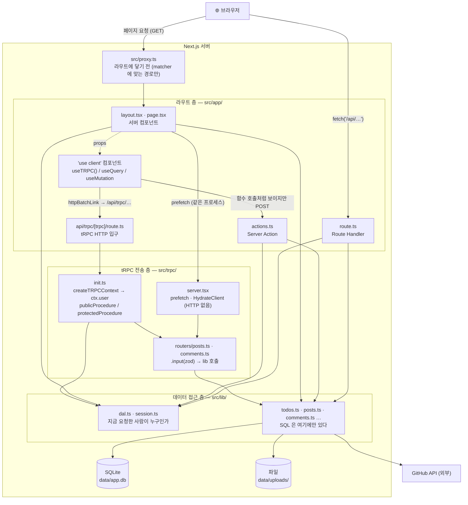

| 층 | 폴더 | 하는 일 | 하지 않는 일 |
| --- | --- | --- | --- |
| proxy | `src/proxy.ts` | 쿠키만 보고 리다이렉트, CORS 헤더 | DB 조회, 진짜 권한 검사 |
| 라우트 | `src/app/**` | 화면 그리기, 폼 받기, JSON 응답 | SQL 직접 쓰기 |
| **tRPC 전송** | `src/trpc/**` | 입력 검증, 로그인 검사, 프로시저 → lib 호출, 타입을 브라우저까지 전달 | SQL, 캐시 저장 |
| 데이터 접근 | `src/lib/**` | SQL, 파일, 외부 API, 세션 검증 | 화면 관련 코드 |
| 저장소 | `data/` | SQLite 파일, 업로드 이미지 | — |

### 0-2. 폴더 지도

```
src/
├── proxy.ts                 ← 요청이 라우트에 닿기 전에 실행
├── trpc/                    ← ★ 이 브랜치에서 추가
│   ├── init.ts              ← 컨텍스트, publicProcedure / protectedProcedure, 로그 미들웨어
│   ├── routers/
│   │   ├── _app.ts          ← appRouter 와 AppRouter "타입" (브라우저로 건너가는 유일한 것)
│   │   ├── posts.ts         ← list(커서), search, byId — 조회만
│   │   └── comments.ts      ← list, add, remove
│   ├── client.tsx           ← TRPCReactProvider, useTRPC (브라우저용)
│   ├── server.tsx           ← trpc 프록시, prefetch, HydrateClient (서버 컴포넌트용)
│   ├── query-client.ts      ← QueryClient 공장 (superjson, pending 도 dehydrate)
│   └── router.test.ts       ← createCaller 로 HTTP 없이 테스트
├── app/
│   ├── layout.tsx           ← TRPCReactProvider 로 앱 전체를 감싼다
│   ├── api/trpc/[trpc]/route.ts   ← ★ 모든 브라우저 tRPC 호출의 HTTP 입구
│   ├── posts/[id]/
│   │   ├── comments-section.tsx   ← 서버: 세션 읽기 + prefetch + HydrateClient
│   │   ├── comment-threads.tsx    ← ★ 클라이언트: useQuery 로 목록 그리기
│   │   ├── comment-form.tsx       ← useMutation (main 은 useActionState)
│   │   └── delete-comment-button.tsx  ← useMutation
│   ├── (demos)/
│   │   ├── layout.tsx             ← QueryProviders 없음 (루트로 이동)
│   │   ├── client-fetch/post-search-trpc.tsx  ← ★ 4번째 검색 (tRPC)
│   │   └── feed/post-feed.tsx     ← infiniteQueryOptions
│   └── (나머지는 main 과 같다)
├── components/              ← query-providers.tsx 는 삭제됨
├── lib/                     ← main 과 동일 (SQL, 세션, 공개 API 인프라)
└── stores/, hooks/, test/
```

### 0-3. 터미널 로그로 따라가기

| 접두어 | 뜻 | 어디서 찍히나 |
| --- | --- | --- |
| `[proxy]` | 라우트에 닿기 전 | `src/proxy.ts` |
| `[render]` | 서버 컴포넌트가 데이터 함수를 호출함 | page.tsx 와 서버 컴포넌트들 |
| `[cache]` | `"use cache"` 함수의 몸체가 실제로 실행됨 (= 캐시 MISS) | `posts.ts`, `comments.ts`, `github.ts` |
| `[session]` | 세션 쿠키 발급·삭제·검증 | `session.ts`, `dal.ts` |
| `[action]` | Server Action 실행 | `actions.ts` 들 |
| `[api]` | Route Handler 실행. tRPC HTTP 입구도 여기 | `src/lib/api/route.ts`, `api/trpc/[trpc]/route.ts` |
| `[trpc]` | 프로시저 시작·성공·실패, 입력값, 소요 시간 | `src/trpc/init.ts` 의 로그 미들웨어 |
| `[build]` | 빌드 시점에 실행되는 것 | `generateStaticParams` |

브라우저에서 온 tRPC 호출은 `[api] GET /api/trpc/comments.list → tRPC HTTP 입구` 뒤에 `[trpc] comments.list (query) 시작` 이 붙는다. 서버 컴포넌트의 prefetch 는 HTTP 를 안 거치므로 `[api]` 없이 `[trpc]` 만 찍힌다. 이 차이로 "누가 불렀는지" 를 알 수 있다.

### 0-4. 다이어그램 읽는 법

- **시퀀스 다이어그램**: 위에서 아래로 시간이 흐른다. 실선 화살표는 요청, 점선은 응답.
- **흐름도**: 마름모는 분기. 실선은 호출, 점선은 데이터 전달.
- 이 문서의 그림은 Mermaid 로 그려서 GitHub, VS Code 미리보기, 대부분의 마크다운 뷰어에서 그림으로 보인다.

---

## 1장. 서버가 켜질 때

### 🚶 흐름

`npm run dev` 를 치면 아직 아무 요청도 없지만 몇 가지가 미리 준비된다. 정확히는 **"처음 import 되는 순간"** 실행되는 코드들이다. 이 장은 main 과 같다.

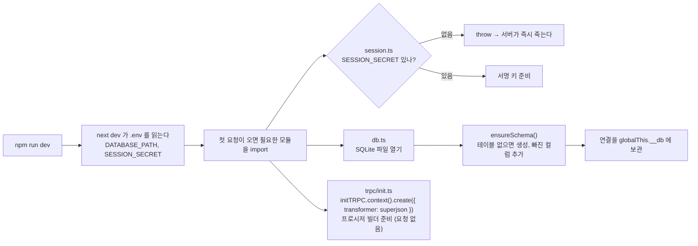

### 📄 파일

| 파일 | 역할 |
| --- | --- |
| `.env` | `DATABASE_PATH`(기본 `data/app.db`), `SESSION_SECRET` |
| `next.config.ts` | `cacheComponents: true`. 옛 주소 리다이렉트 |
| `src/lib/db.ts` | SQLite 연결 하나를 앱 전체가 공유. `server-only` |
| `src/lib/schema.ts` | `CREATE TABLE IF NOT EXISTS` + 수동 마이그레이션 |
| `src/lib/session.ts` | import 시점에 `SESSION_SECRET` 검사 |
| `src/trpc/init.ts` | tRPC 인스턴스. 요청이 오기 전에는 "빌더" 만 만들어 둔다. 컨텍스트는 요청마다 |

### 💡 개념

**모듈은 한 번만 실행된다.** DB 연결처럼 "앱에 하나만 있어야 하는 것" 을 모듈 최상위에 둔다. 개발 모드 HMR 을 위해 `globalThis` 에 보관한다.

**`server-only`.** 이 한 줄을 import 한 파일을 클라이언트 컴포넌트가 import 하면 빌드가 실패한다. `src/trpc/server.tsx` 에도 붙어 있다. 서버 프록시가 브라우저 번들에 들어가면 안 되기 때문이다. 반대로 `src/trpc/client.tsx` 는 `"use client"` 다.

**타입만 건너간다.** `client.tsx` 는 `import type { AppRouter }` 로 라우터의 **타입만** 가져온다. `import type` 은 컴파일 후 사라지므로 라우터 구현(DB, 세션)은 브라우저 번들에 들어가지 않는다.

---

## 2장. 첫 접속: 홈 (`GET /`)

### 🚶 흐름


1. **proxy 는 실행되지 않는다.** `config.matcher` 는 `/login`, `/signup`, `/posts/:id/edit`, `/api/v1/*` 만 잡는다.
2. **루트 레이아웃** `src/app/layout.tsx` 가 `<html>`, `<body>` 를 그리고, **`<TRPCReactProvider>` 로 헤더부터 children 까지 전부 감싼다.** main 에서 `(demos)/layout.tsx` 에 있던 TanStack Query Provider 가 이 안으로 들어와 루트로 올라왔다. 댓글(`/posts/[id]`)과 데모 페이지가 모두 쓰기 때문이다.
3. **사용자 메뉴** 는 main 과 같은 체인으로 로그인 여부를 확인한다.

   ```
   UserMenu
     → getCurrentUser()        src/lib/dal.ts      react cache(): 한 요청에 한 번만 실행
       → getSessionUserId()    src/lib/session.ts  cookies() 에서 "session" 쿠키 읽기
         → decrypt()           jose 로 JWT 서명 검증
       → findUserById()        src/lib/users.ts    SELECT id, name, email FROM users
   ```

4. **홈 페이지** `src/app/page.tsx` 는 순수 서버 컴포넌트라 정적 HTML 로 굳어 있다.
5. **브라우저에서 hydration.** `TRPCReactProvider` 가 브라우저용 `QueryClient` 하나와 `trpcClient`(httpBatchLink) 하나를 만든다. 이 둘은 페이지를 이동해도 유지된다.

### 📄 파일

| 파일 | 종류 | 역할 |
| --- | --- | --- |
| `src/app/layout.tsx` | 서버 | 껍데기 + `TRPCReactProvider` |
| `src/trpc/client.tsx` | 클라이언트 | `QueryClientProvider` > `TRPCProvider` > children + DevTools. `useTRPC` 훅 export |
| `src/trpc/query-client.ts` | 공용 | `QueryClient` 공장. `staleTime` 30초, superjson, pending 쿼리도 dehydrate |
| `src/components/user-menu.tsx` | 서버 | 세션을 읽는 유일한 헤더 부품 |
| `src/components/store-hydrator.tsx` | 클라이언트 | 마운트 후 `rehydrate()` |

### 💡 개념

**서버 컴포넌트와 클라이언트 컴포넌트.** 파일 맨 위에 `"use client"` 가 없으면 서버 컴포넌트다. tRPC 에서는 이 구분이 더 중요하다. 서버 컴포넌트는 `src/trpc/server.tsx` 의 `trpc` 를, 클라이언트 컴포넌트는 `src/trpc/client.tsx` 의 `useTRPC()` 를 쓴다. 모양은 같고(`trpc.comments.list.queryOptions(...)`) 실행 경로가 다르다. 이 구분이 잘 안 와닿으면 **부록 A** 를 먼저 읽고 돌아와도 된다.

**QueryClient 는 어디서 실행되느냐에 따라 다르게 만든다.**

| 실행 위치 | 만드는 법 | 이유 |
| --- | --- | --- |
| 서버 (SSR, `typeof window === "undefined"`) | 요청마다 새로 | 모듈 변수에 하나를 두면 사용자 A 의 캐시를 사용자 B 가 본다 |
| 브라우저 | 하나를 계속 재사용 | 페이지를 이동해도 캐시가 유지되어야 한다 |

`src/trpc/client.tsx` 의 `getQueryClient()` 와 `src/trpc/server.tsx` 의 `getQueryClient = cache(makeQueryClient)` 가 각각 이 규칙을 구현한다.

**Cache Components 와 정적 셸, hydration** 은 main 과 같다. 요청이 있어야 알 수 있는 값을 읽는 부분만 `<Suspense>` 안에 두고, 나머지는 빌드 때 미리 그린다.

### 🔍 터미널에서 보기

```
[session] getCurrentUser() → 비로그인 (세션 쿠키 없음). react cache(): 같은 요청 안에서는 이 로그가 한 번만 찍힌다
[render]  UserMenu ← 비로그인 (레이아웃 안이지만 쿠키를 읽으므로 Suspense 안에서 요청마다 실행)
```

---

## 3장. 할 일 목록: 읽고 바꾸기의 기본형 (`/todos`)

이 장은 main 과 완전히 같다. tRPC 를 얹은 브랜치에서도 **폼 제출로 데이터를 바꾸는 일은 Server Action 이 더 단순하다** 는 비교를 위해 그대로 남겨 두었다.

### 🚶 흐름 1: 목록 읽기

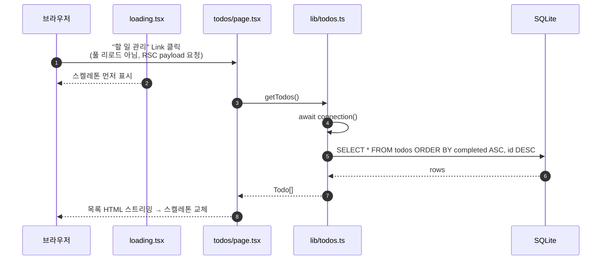

### 🚶 흐름 2: 체크박스 클릭 (쓰기)

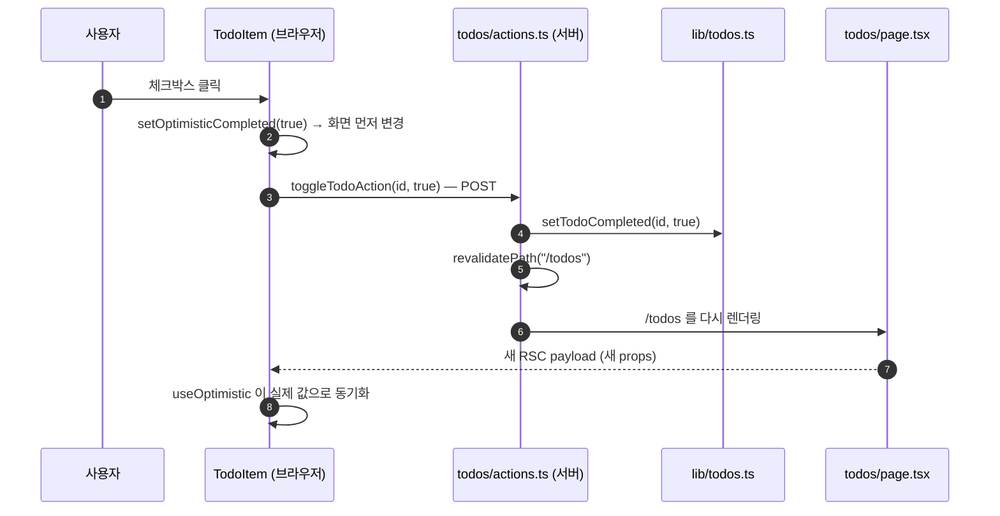

핵심 규칙 세 가지.

1. **Server Action 은 `"use server"` 파일의 함수다.** 브라우저에서는 함수 호출처럼 보이지만 POST 요청이다.
2. **바꾼 뒤에는 `revalidatePath("/todos")`.** 새 RSC payload 가 내려와 목록이 교체된다. **캐시가 한 층** 이다. 7장의 tRPC 댓글은 캐시가 두 층이라 이보다 할 일이 많다.
3. **서버에서 다시 검증한다.** `parseTitle`, `parseIds`.

### 🚶 흐름 3: 형제끼리 상태 공유 (zustand)

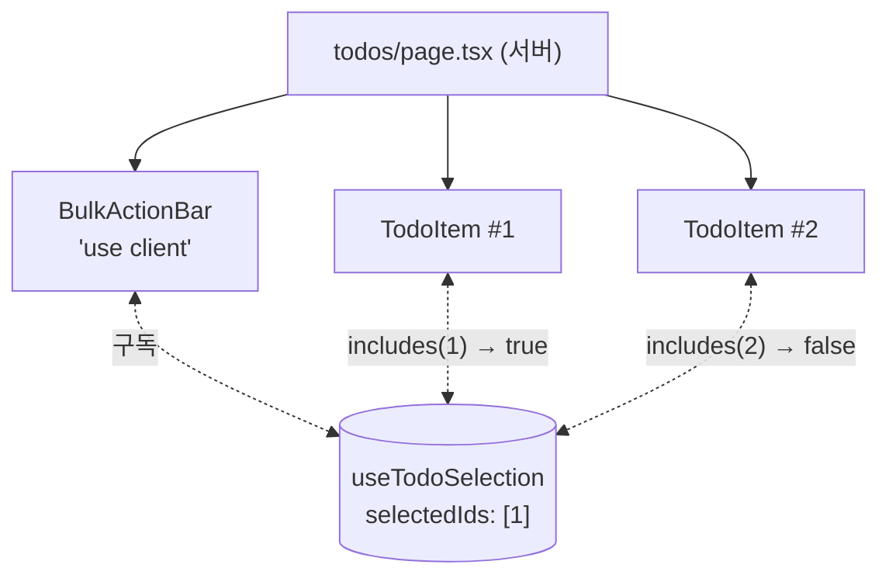

스토어에는 "어떤 id 를 골랐는가" 만 있다. 서버 데이터는 넣지 않는다.

### 📄 파일

`src/app/todos/*`, `src/lib/todos.ts`, `src/stores/todo-selection-store.ts`, `src/app/api/todos/route.ts` 모두 main 과 동일하다.

### 💡 개념

**`await connection()`**, **React 19 폼 훅 세 가지**(`useActionState`, `useTransition`, `useOptimistic`), **점진적 향상** 은 main 판 3장과 같다.

**Server Action vs tRPC mutation.** 같은 "데이터 바꾸기" 인데 두 방식이 이 앱에 공존한다.

| | Server Action (todos, 글) | tRPC mutation (댓글) |
| --- | --- | --- |
| 호출 | `<form action>` 또는 함수 호출 | `useMutation(...).mutate(input)` |
| 입력 검증 | 액션 안에서 직접 | `.input(zod)` 가 본문 전에 |
| 로그인 검사 | 액션마다 `getCurrentUser()` | `protectedProcedure` 미들웨어 한 곳 |
| 에러 전달 | `{ error }` 객체 반환 | `TRPCError` throw → `onError` |
| 화면 갱신 | `revalidatePath` 하나 | 서버 태그 + 브라우저 `invalidateQueries` 둘 |
| JS 없이 동작 | 폼이면 된다 | 안 된다 |
| 단위 테스트 | 어렵다 (FormData, 훅에 묶임) | `createCaller` 로 쉽다 |

---

## 4장. 글 목록: 캐시가 들어온다 (`/posts`)

이 장도 main 과 같다. 글 목록은 tRPC 를 거치지 않는다.

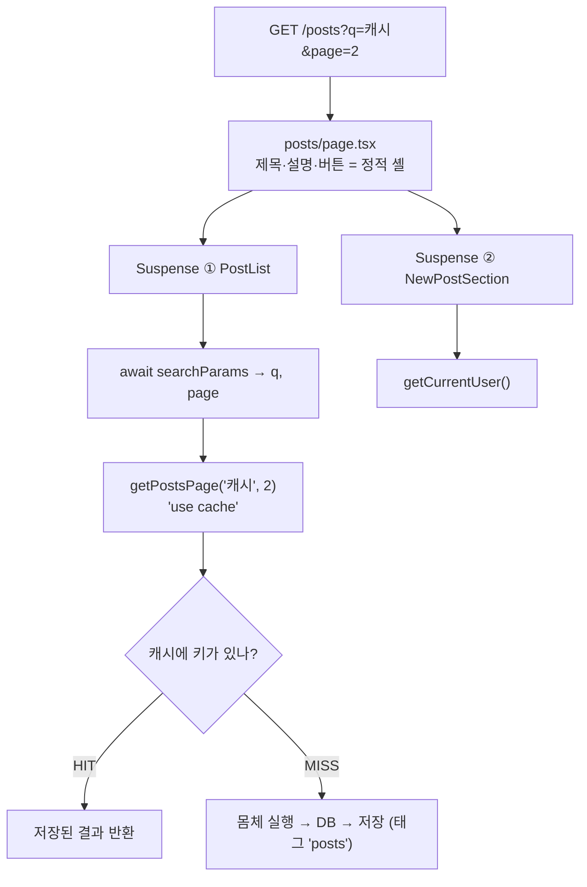

핵심만 다시 적으면:

- `PostList` 는 `searchParams` 를 꺼낸 **뒤** `getPostsPage(query, page)` 에 인자로 넘긴다. 캐시 함수 안에서는 요청 API 를 못 읽는다.
- 검색창은 디바운스 → `router.replace("/posts?q=…")` → 서버 재렌더. 검색은 서버가 한다.
- 무효화 네 가지: `updateTag`(즉시), `revalidateTag(tag, "max")`(백그라운드), `revalidateTag(tag, { expire: 0 })`(Route Handler 와 **tRPC 프로시저** 에서), `revalidatePath`.

| 함수 | 다음 요청이 겪는 일 | 이 앱에서 |
| --- | --- | --- |
| `updateTag(tag)` | 새 데이터가 만들어질 때까지 기다렸다가 받음 | 글 작성·수정·삭제 (Server Action) |
| `revalidateTag(tag, "max")` | 옛 데이터를 받고, 뒤에서 새로 만듦 | "백그라운드 갱신" 버튼 |
| `revalidateTag(tag, { expire: 0 })` | 옛 값을 주지 않고 바로 새로 만듦 | 공개 API, **tRPC 댓글 프로시저** |
| `revalidatePath(path)` | 그 경로를 다음에 볼 때 페이지 전체 재렌더 | `/todos` |

**캐시된 값은 모두가 공유한다.** 캐시 함수 안에서 현재 사용자를 읽으면 안 된다. 7장에서 이 규칙이 tRPC 와 만나는 모습을 본다.

### 🔍 터미널에서 보기

```
[render]  PostList → getPostsPage(query="", page=1) 호출
[cache]   MISS(실행 시각 10:00:01.234) getPostsPage(...) — 몸체 실행, DB 조회 2번
[render]  PostList ← 12건, cachedAt=…
```

---

## 5장. 글 상세: 동적 라우트와 스트리밍 (`/posts/3`)

라우트 구조는 main 과 같다. 다른 것은 네 Suspense 영역 중 **댓글** 의 내부 구현(7장)이다.

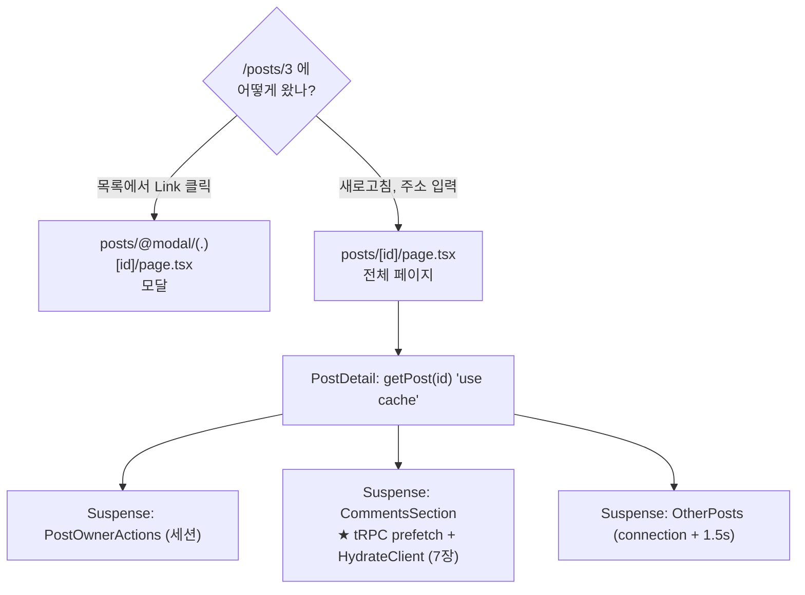

```
시간 →  0ms         ~50ms              ~100ms             ~1600ms
셸      ████████████████████████████████████████████████████████
본문    ░░░░░░░░░░░░████████████████████████████████████████████  getPost(3) 캐시
버튼    ░░░░░░░░░░░░░░░░░░░░░░░░░░████████████████████████████████  세션
댓글    ░░░░░░░░░░░░░░░░░░░░░░░░░░████████████████████████████████  세션 + tRPC prefetch (pending 상태로 스트리밍)
다른글  ░░░░░░░░░░░░░░░░░░░░░░░░░░░░░░░░░░░░░░░░░░░░░░░░░░░░░░████  1.5초 지연
```

| 상황 | 어느 파일 |
| --- | --- |
| 목록에서 상세로 이동, 응답 전 | `posts/[id]/loading.tsx` |
| `/posts/9999`, `/posts/abc` | `posts/[id]/not-found.tsx` |
| "에러 발생시키기" 버튼 | `posts/error.tsx` |
| `/p/3` | `p/[id]/page.tsx` — Suspense 밖에서 `permanentRedirect` → 진짜 308 |
| `/blog/3`, `/articles`, `/posts/feed` | `next.config.ts` 의 `redirects()` |

**동적 라우트, `generateStaticParams`, 태그 두 개, `next/dynamic`** 은 main 판 5장과 같다.

---

## 6장. 인증: 누구인지 확인하기

인증의 뼈대는 main 과 같다. 세션은 JWT 쿠키, 검증은 세 층. 이 브랜치에서는 **tRPC 컨텍스트** 가 같은 `getCurrentUser()` 를 한 번 더 감싸고, **`protectedProcedure`** 가 3층의 새 입구가 된다.

### 🚶 흐름 1: 회원 가입과 로그인

main 과 동일하다. `AuthForm` → `loginAction` → Zod → `findUserWithHashByEmail` → `verifyPassword`(scrypt + `timingSafeEqual`) → `createSession`(JWT, `httpOnly`, `sameSite: lax`, 7일) → `redirect("/posts")`. 실패는 이메일 없음과 비밀번호 틀림을 구분하지 않는다.

### 🚶 흐름 2: 로그인 뒤의 모든 요청

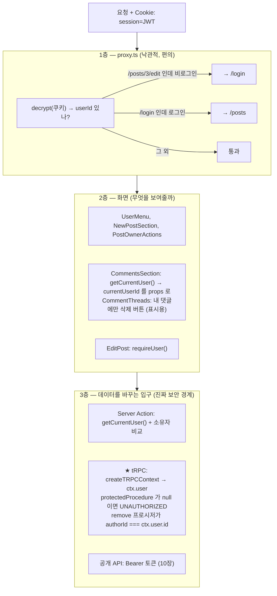

| 층 | 무엇을 보나 | 뚫리면 |
| --- | --- | --- |
| proxy | 쿠키 서명만 | 아무 일 없음 |
| 화면 | `getCurrentUser()`. tRPC 댓글은 `currentUserId` 를 **props 로 클라이언트에 넘긴다** | 버튼이 보일 뿐. 브라우저에서 `currentUserId` 를 조작해도 삭제는 서버가 막는다 |
| 액션 / 프로시저 / API | 세션 또는 토큰 + 소유자 비교 | **여기가 뚫리면 데이터가 바뀐다** |

### 🚶 흐름 3: tRPC 안에서 인증이 흐르는 길

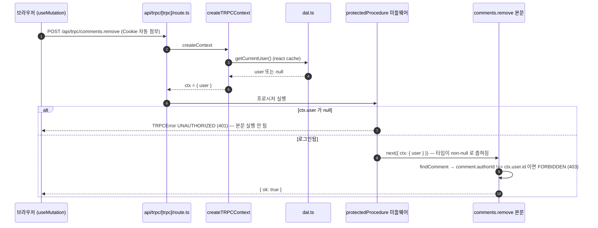

- **tRPC 는 세션 쿠키로 인증한다.** 화면용 전송 층이므로 브라우저가 자동으로 붙이는 쿠키를 그대로 쓴다. 공개 API(`/api/v1`)의 Bearer 토큰과는 다른 길이다.
- **작성자는 `ctx.user.id` 에서 가져온다.** 클라이언트가 보낸 `authorId` 같은 값을 믿지 않는다.
- **`createTRPCContext` 도 react `cache()`** 다. 서버 컴포넌트의 prefetch 와 같은 요청 안의 다른 호출이 컨텍스트를 여러 번 만들어도 쿠키 검증과 DB 조회는 한 번이다.

### 🚶 흐름 4: 인증이 녹아 있는 곳 전체 목록

| 어디 | 파일 | 무엇을 하나 | 실패 시 |
| --- | --- | --- | --- |
| 프록시 | `src/proxy.ts` | `/posts/:id/edit` 비로그인 → `/login` | 리다이렉트 |
| 헤더 | `src/components/user-menu.tsx` | 이름 표시, 로그아웃 폼 | 로그인/가입 링크 |
| 글 목록 | `src/app/posts/page.tsx` `NewPostSection` | 로그인 시 글쓰기 폼 | "로그인하세요" |
| 글 상세 | `src/app/posts/[id]/post-owner-actions.tsx` | 작성자면 수정·삭제 버튼 | 안내 문구 |
| 글 수정 페이지 | `src/app/posts/[id]/edit/page.tsx` | `requireUser()`, 작성자 비교 | redirect |
| 댓글 영역 (서버) | `src/app/posts/[id]/comments-section.tsx` | `getCurrentUser()` → `currentUserId` props | — |
| 댓글 영역 (클라이언트) | `src/app/posts/[id]/comment-threads.tsx` | `currentUserId === authorId` 면 삭제 버튼, 로그인 시 폼 | 표시만 다름 |
| 글 액션 | `src/app/posts/actions.ts` | 작성: 로그인. 수정·삭제: 작성자 | redirect 또는 에러 객체 |
| ★ tRPC 컨텍스트 | `src/trpc/init.ts` `createTRPCContext` | 쿠키 → `ctx.user` | `user: null` |
| ★ tRPC 미들웨어 | `src/trpc/init.ts` `protectedProcedure` | `ctx.user` 없으면 throw | `UNAUTHORIZED` 401 |
| ★ 댓글 프로시저 | `src/trpc/routers/comments.ts` | `add`: 로그인. `remove`: `authorId === ctx.user.id` | `FORBIDDEN` 403 |
| 공개 API | `src/lib/api/auth.ts` | Bearer 토큰 → `Principal` | 401 / 403 JSON |
| 할 일 | `src/app/todos/actions.ts` | **검사 없음** | 소유자 개념이 없는 공유 목록 |

### 📄 파일

| 파일 | 핵심 |
| --- | --- |
| `src/app/(auth)/*`, `src/lib/password.ts`, `src/lib/session.ts`, `src/lib/dal.ts`, `src/lib/users.ts` | main 과 동일 |
| `src/trpc/init.ts` | `createTRPCContext = cache(async () => ({ user: await getCurrentUser() }))`. `protectedProcedure` 는 `t.procedure.use(logger).use(auth)` |
| `src/trpc/routers/comments.ts` | `add`, `remove` 가 `protectedProcedure`. `remove` 안에서 소유자 비교 |

### 💡 개념

**비밀번호 해시, JWT 쿠키, react `cache()`, 계정 열거 방지** 는 main 판 6장과 같다.

**미들웨어와 타입 좁히기.** `protectedProcedure` 의 미들웨어는 `next({ ctx: { user: ctx.user } })` 로 컨텍스트를 덮어쓴다. TypeScript 가 이 덮어쓴 `ctx` 에서 `user` 가 `null` 이 아니라고 추론하므로, 프로시저 본문은 `ctx.user.id` 를 `!` 없이 쓴다. Server Action 에서는 액션마다 `if (!user) return { error }` 를 반복했던 것이 한 곳으로 모였고, 프로시저 정의에 `protectedProcedure` 라고 적는 것 자체가 문서가 된다.

**Cache Components 에서 세션 다루기.** `cookies()` 를 읽는 컴포넌트는 Suspense 안에, `"use cache"` 함수 안에서는 못 읽는다. tRPC 판 댓글은 이 규칙을 "서버 컴포넌트가 세션을 읽어 `currentUserId` 를 props 로 넘기고, 목록은 캐시된 프로시저 결과를 쓴다" 로 푼다 (7장).

### 🔍 터미널에서 보기

```
[api]     POST /api/trpc/comments.remove → tRPC HTTP 입구 (mutation)
[session] getCurrentUser() → userId=2 (게스트). react cache(): …
[trpc]    comments.remove (mutation) 시작 — 사용자: 게스트(#2) { id: 7 }
[trpc]      ↳ comments.remove 실패 FORBIDDEN: 본인이 쓴 댓글만 삭제할 수 있습니다. (1.8ms)
```

---

## 7장. 댓글: tRPC 로 읽고 쓰기

이 장이 브랜치의 핵심이다. main 은 서버 컴포넌트가 댓글을 직접 그리고 Server Action 이 바꿨다. 여기서는 **서버가 첫 데이터를 미리 채워 넘기고, 브라우저가 이어받아 그리고, 이후 갱신은 브라우저 캐시가 맡는다.**

### 🚶 흐름 1: 역할 분담

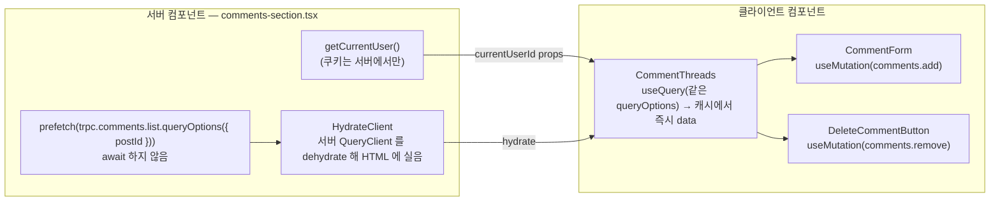

| 누가 | 무엇을 | 왜 |
| --- | --- | --- |
| 서버 컴포넌트 | 세션 읽기, 첫 데이터 prefetch, hydrate 경계 | `cookies()` 는 서버에서만. 첫 렌더에 "로딩 중" 이 안 보이게 |
| `CommentThreads` (클라이언트) | 캐시에서 데이터 읽어 그리기 | 이후 갱신에 반응하려면 목록이 TanStack Query 캐시를 구독해야 한다 |
| `CommentForm`, `DeleteCommentButton` | mutation + 브라우저 캐시 무효화 | 페이지 전체를 다시 렌더하지 않고 목록만 다시 가져온다 |

### 🚶 흐름 2: 첫 렌더 — prefetch 와 hydrate

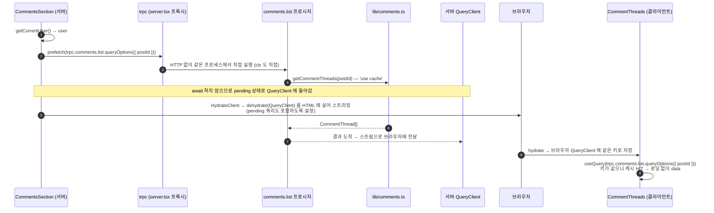

- **prefetch 를 `await` 하지 않는 이유**: 기다리면 이 서버 컴포넌트가 데이터 도착까지 멈춘다. 기다리지 않으면 쿼리는 pending 상태로 들어가고, `query-client.ts` 의 `shouldDehydrateQuery` 가 pending 도 넘기도록 설정되어 있어 브라우저가 "진행 중인 Promise" 를 이어받는다.
- **queryKey 가 같아야 한다.** 서버의 `prefetch(trpc.comments.list.queryOptions({ postId }))` 와 클라이언트의 `useQuery(trpc.comments.list.queryOptions({ postId }))` 가 같은 키 `[["comments","list"], { input: { postId }, type: "query" }]` 를 만든다.
- **서버 프록시는 HTTP 를 안 거친다.** `src/trpc/server.tsx` 의 `createTRPCOptionsProxy({ ctx, router })` 가 라우터를 같은 프로세스에서 직접 실행한다. 서버가 자기 자신의 `/api/trpc` 로 요청을 보내는 낭비가 없다.

### 🚶 흐름 3: 댓글 작성 — 캐시 두 층을 둘 다 지운다

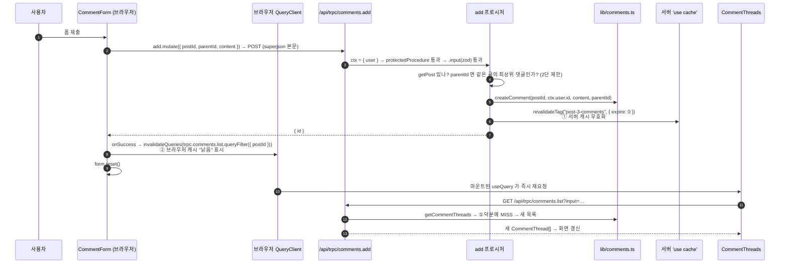

**왜 둘 다 지워야 하나.**

| 지운 것 | 안 지운 것 | 결과 |
| --- | --- | --- |
| 서버 `"use cache"` 만 | 브라우저 캐시 | `staleTime`(30초) 안이라 재요청을 안 한다 → 화면 그대로 |
| 브라우저 캐시만 | 서버 `"use cache"` | 재요청은 나가지만 서버가 옛 캐시를 돌려준다 → 화면 그대로 |
| 둘 다 | — | 재요청이 나가고 서버가 새 목록을 만든다 → 화면 갱신 |

프로시저(서버 층)와 `onSuccess`(브라우저 층)가 각자 자기 층을 맡는다. main 의 Server Action 은 서버 캐시를 지우고 페이지를 다시 렌더링해 **한 층** 이었다. 이것이 tRPC 판의 추가 부담이다.

**왜 `updateTag` 가 아니라 `revalidateTag(…, { expire: 0 })` 인가.** tRPC 프로시저는 `/api/trpc/[trpc]/route.ts` 라는 일반 Route Handler 안에서 실행된다. `updateTag()` 는 Server Action 전용이라 여기서 부르면 에러다 (README 5-7). `{ expire: 0 }` 은 "지금 당장 만료" 라서 같은 효과를 낸다.

### 🚶 흐름 4: 댓글 삭제

`DeleteCommentButton` 은 `useMutation(trpc.comments.remove.mutationOptions({ onSuccess: invalidateQueries, onError: toast }))` 다. 프로시저는 `findComment` → `authorId !== ctx.user.id` 면 `FORBIDDEN` → `deleteComment` → `revalidateTag`. `postId` 를 props 로 받는 이유는 어느 글의 목록을 무효화할지 `queryFilter` 에 알려 줘야 하기 때문이다. 최상위 댓글을 지우면 답글은 DB 의 `ON DELETE CASCADE` 로 함께 지워진다.

### 📄 파일

| 파일 | 종류 | 핵심 |
| --- | --- | --- |
| `src/app/posts/[id]/comments-section.tsx` | 서버 | `getCurrentUser()` → `prefetch(...)` (await 없음) → `<HydrateClient><CommentThreads currentUserId /></HydrateClient>` |
| `src/app/posts/[id]/comment-threads.tsx` | 클라이언트 | `useQuery(trpc.comments.list.queryOptions({ postId }))`. `data` 타입은 라우터 반환 타입 |
| `src/app/posts/[id]/comment-form.tsx` | 클라이언트 | `<form onSubmit>` + `useMutation`. `mutationOptions` 의 `onSuccess` 는 캐시 무효화, `mutate` 의 두 번째 인자 `onSuccess` 는 폼 비우기 |
| `src/app/posts/[id]/delete-comment-button.tsx` | 클라이언트 | `useMutation(remove)`. props 에 `postId` |
| `src/app/posts/[id]/reply-toggle.tsx` | 클라이언트 | main 과 동일. children 으로 받은 폼을 열고 닫기만 |
| `src/trpc/routers/comments.ts` | 서버 | `list`(public), `add`/`remove`(protected). 2단 제한, 소유자 검사, `revalidateTag` |
| `src/trpc/server.tsx` | 서버 전용 | `trpc` 프록시, `prefetch`, `HydrateClient`, `caller` |
| `src/lib/comments.ts` | 서버 전용 | main 과 동일. `getCommentThreads` 는 `"use cache"` |

### 💡 개념

**`queryOptions` / `mutationOptions` / `queryFilter`.** tRPC v11 의 TanStack Query 통합은 "훅을 대신 만들어 주는" 방식이 아니라 "옵션을 만들어 주는" 방식이다.

| 헬퍼 | 만들어 주는 것 | 넘기는 곳 |
| --- | --- | --- |
| `trpc.x.y.queryOptions(input)` | `queryKey` + `queryFn`(→ GET `/api/trpc/x.y`) | `useQuery`, `prefetch` |
| `trpc.x.y.mutationOptions(opts)` | `mutationKey` + `mutationFn`(→ POST) | `useMutation` |
| `trpc.x.y.queryFilter(input)` | 키 필터 | `invalidateQueries` |
| `trpc.x.y.infiniteQueryOptions(input, opts)` | 커서 전달까지 포함한 옵션 | `useInfiniteQuery` (9장) |

`useQuery`, `useMutation` 자체는 TanStack Query 의 것이다. 그래서 `isPending`, `isFetching`, `placeholderData` 같은 개념은 fetch 버전과 완전히 같다.

**타입이 어디서 오나.** `useQuery(...)` 의 `data` 위에 마우스를 올리면 `CommentThread[]` 다. 이 타입은 어디에도 선언되어 있지 않다. `routers/comments.ts` 의 `list` 가 `getCommentThreads` 를 돌려주므로 그 반환 타입이 `AppRouter` 타입을 거쳐 `useTRPC()` 까지 흐른다. 서버에서 필드를 바꾸면 이 컴포넌트가 컴파일 에러로 알려 준다.

**서버 컴포넌트를 클라이언트 컴포넌트의 children 으로.** `ReplyToggle` 은 `"use client"` 지만 안에 들어가는 `CommentForm` 도 `"use client"` 다. main 과 달리 폼이 서버에서 만들어지지 않아도 되므로 그냥 클라이언트끼리 중첩이다.

### 🔍 터미널에서 보기

```
[render]  CommentsSection(postId=3) ← 현재 사용자 게스트. 이어서 tRPC comments.list 를 prefetch (HTTP 없이 서버 안에서 직접 실행)
[trpc]    comments.list (query) 시작 — 사용자: 게스트(#2) { postId: 3 }
[cache]   MISS(...) getCommentThreads(postId=3) — 몸체 실행, DB 조회. 태그: post-3-comments
[trpc]      ↳ comments.list 성공 (2.1ms)

(댓글 작성)
[api]     POST /api/trpc/comments.add → tRPC HTTP 입구 (mutation)
[trpc]    comments.add (mutation) 시작 — 사용자: 게스트(#2) { postId: 3, parentId: null, content: '…' }
[api]       ↳ revalidateTag(…, { expire: 0 }) "post-3-comments" — expire:0 → 옛 값을 내주지 않고 다음 요청이 바로 새로 만듦
[trpc]      ↳ comments.add 성공 (3.4ms)
[api]     GET /api/trpc/comments.list?… → tRPC HTTP 입구 (query)     ← onSuccess 의 invalidateQueries 가 일으킨 재요청
[trpc]    comments.list (query) 시작 …
[cache]   MISS(...) getCommentThreads(postId=3) …                    ← 서버 캐시도 지워졌으므로 MISS
```

첫 줄의 prefetch 에는 `[api]` 가 없고(HTTP 없음), 재요청에는 `[api]` 가 있다(브라우저에서 옴). 이것이 두 경로의 차이다.

---

## 8장. 이미지 업로드

main 과 완전히 같다. 글 작성/수정은 이 브랜치에서도 Server Action 이라 파일이 붙은 `multipart` 폼을 그대로 받는다. tRPC 로 파일을 보내려면 base64 로 부풀리거나 별도 업로드 흐름이 필요해서, "폼 + 파일" 은 Server Action 이 맞다는 비교 포인트로 남겨 두었다.

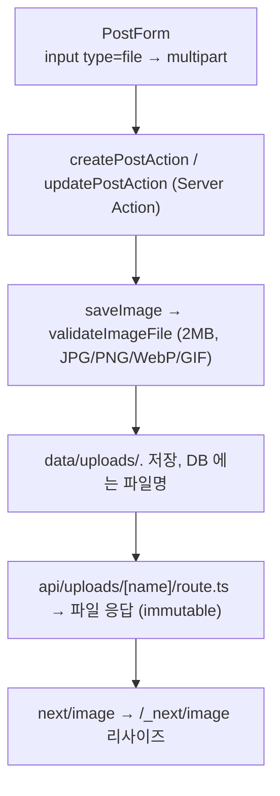

파일: `src/lib/uploads.ts`, `src/lib/uploads-validate.ts`, `src/app/api/uploads/[name]/route.ts`, `src/app/posts/post-form.tsx`.

---

## 9장. 브라우저가 직접 데이터를 가져올 때

`(demos)` 라우트 그룹의 세 페이지는 **브라우저** 가 데이터를 가져온다. 이 브랜치는 여기에 "tRPC 로 가져오기" 를 나란히 놓아 fetch 버전과 비교한다.

### 🚶 흐름 1: 데모 그룹의 공통 껍데기

```
src/app/(demos)/
├── layout.tsx      ← PostsNav 만. QueryProviders 는 없다 (루트의 TRPCReactProvider 가 대신)
├── template.tsx    ← 세그먼트가 바뀔 때마다 새로 마운트 → 진입 애니메이션 재생
├── client-fetch/   ← 검색 4종
├── feed/           ← 무한 스크롤 (tRPC)
└── releases/       ← 외부 API + use()
```

### 🚶 흐름 2: `/client-fetch` — 같은 일을 네 가지 방법으로

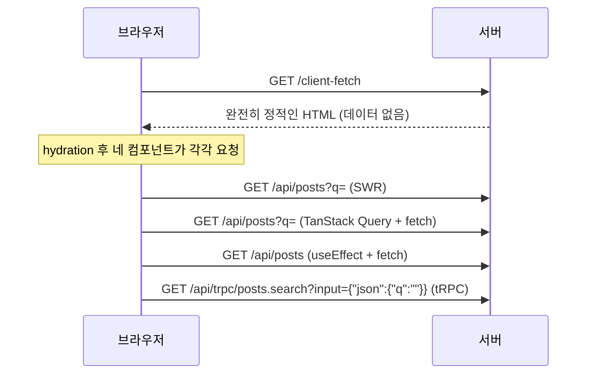

| 방법 | 파일 | fetch 함수 | URL | 응답 타입 |
| --- | --- | --- | --- | --- |
| SWR | `post-search.tsx` | `fetcher(url)` 직접 | 문자열 직접 | `type SearchResponse` 손으로 |
| TanStack Query | `post-search-query.tsx` | `queryFn` 직접 | 문자열 직접 | 손으로 |
| 직접 구현 | `post-count.tsx` | `useEffect` + `fetch` + `AbortController` | 직접 | 손으로 |
| ★ tRPC | `post-search-trpc.tsx` | **없음** (`queryOptions` 가 만든다) | **없음** | **없음** (라우터 반환 타입) |

네 번째는 `useQuery(trpc.posts.search.queryOptions({ q: query }, { placeholderData: keepPreviousData }))` 한 줄이다. `useQuery` 는 2번과 같은 TanStack 의 것이라 `isPending`, `isFetching` 이 똑같이 동작한다. 서버에서 `posts` 필드 이름을 바꾸면 4번만 컴파일 에러가 나고, 1~3번은 실행해야 깨진다.

### 🚶 흐름 3: `/feed` — 서버 첫 페이지 + tRPC 무한 스크롤

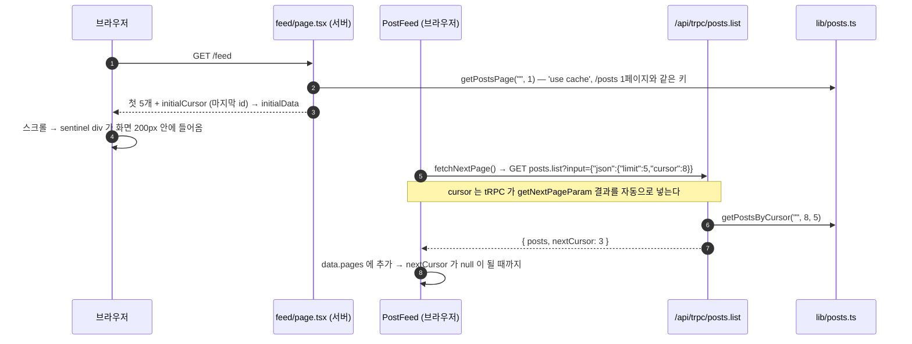

main 과 달라진 것은 세 가지다.

| main | feat/trpc |
| --- | --- |
| `fetchFeedPage(cursor, limit)` 가 `fetch("/api/posts?cursor=…")` | 없음. `trpc.posts.list.infiniteQueryOptions({ limit }, { initialCursor: null, getNextPageParam, initialData, staleTime })` |
| `type FeedPage = {...}` 손으로 선언 | `inferRouterOutputs<AppRouter>["posts"]["list"]["posts"][number]` 로 추출 |
| 다음 페이지 요청이 `/api/posts?cursor=` | `/api/trpc/posts.list` (E2E 도 이 URL 을 기다린다) |

- **라우터의 입력 필드 이름이 반드시 `cursor` 여야 한다.** `infiniteQueryOptions` 가 다음 페이지를 요청할 때 `getNextPageParam` 의 반환값을 이 필드에 자동으로 넣기 때문이다. `routers/posts.ts` 의 `list` 가 `cursor: z.number().int().positive().nullish()` 로 받는다.
- 서버 첫 페이지 `initialData`, `IntersectionObserver`, `use(io())` 는 main 과 같다.

### 🚶 흐름 4: `/releases` — 외부 API 를 서버에서 캐시하고 Promise 를 넘긴다

main 과 동일. `src/lib/github.ts` 의 `"use cache"` 된 `fetch` 결과를 `await` 하지 않고 클라이언트 컴포넌트에 넘겨 `use()` 로 읽는다. tRPC 를 거치지 않는다.

### 💡 개념: 세 가지 전송 방식 비교

| | 서버 컴포넌트에서 읽기 | 브라우저 fetch (REST) | 브라우저 tRPC |
| --- | --- | --- | --- |
| 첫 화면 | HTML 에 포함 | 빈 화면 → 로딩 | prefetch + hydrate 하면 HTML 에 포함 |
| 타입 | 서버 안이라 자동 | 손으로 선언, 실행해야 깨짐 | 라우터에서 자동, 컴파일에서 깨짐 |
| 외부 클라이언트 | — | 누구나 (curl, 다른 언어) | tRPC 클라이언트 필요 |
| 적합한 곳 | 대부분의 페이지 | 외부 개발자용 API | 같은 저장소의 브라우저 코드 |

---

## 10장. 공개 API: 외부 개발자용 문 (`/api/v1`)

이 장은 main 과 완전히 같다. 리프레시 토큰 회전, API 키, 레이트 리밋, CORS, OpenAPI 전부 REST 쪽에만 있다. 여기서는 **왜 tRPC 로 바꾸지 않았는가** 만 짚는다.

### 🚶 흐름 1: 요청 하나가 지나는 파이프라인

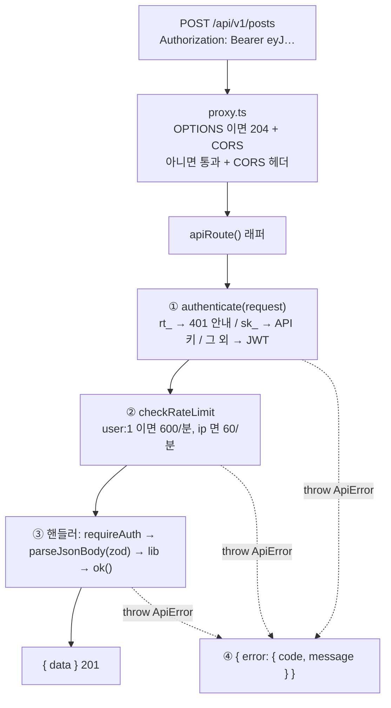

### 🚶 흐름 2: 두 전송 층의 역할 분담

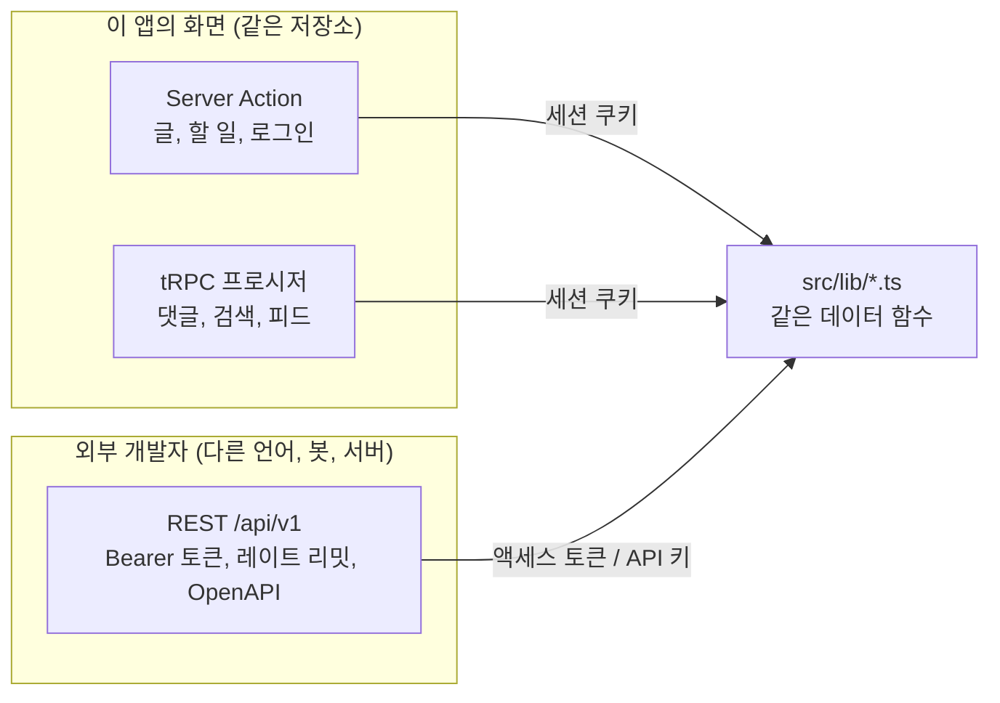

| | Server Action / tRPC | REST `/api/v1` |
| --- | --- | --- |
| 누가 부르나 | 이 앱의 브라우저 코드 | 외부 프로그램 |
| 인증 | 세션 쿠키 (브라우저 자동) | `Authorization: Bearer` (쿠키 안 봄) |
| 계약 | TypeScript 타입 (같은 저장소) | OpenAPI 명세 + 버전 경로 |
| CORS | 불필요 (같은 origin) | `*` 허용 (쿠키를 안 보니 안전) |
| 레이트 리밋 | 없음 | 있음 |

tRPC 는 "서버와 클라이언트가 같은 TypeScript 저장소" 일 때 빛난다. 외부 개발자는 tRPC 클라이언트가 없으므로 REST 가 맞다.

### 🚶 흐름 3: 세 가지 자격증명과 리프레시 토큰 회전

main 판 10장과 같다. 요약만:

| | 세션 쿠키 (화면, tRPC) | 액세스 토큰 | 리프레시 토큰 | API 키 |
| --- | --- | --- | --- | --- |
| 모양 | JWT in Cookie | JWT | `rt_` + 64자 hex | `sk_` + 64자 hex |
| 수명 | 7일 | 1시간 | 30일 (절대) | 무기한 |
| 서버 저장 | 없음 | 없음 | 해시 | 해시 |
| 즉시 무효화 | 불가 | 불가 | 가능 (회전, 재사용 감지, 가족 폐기) | 가능 |

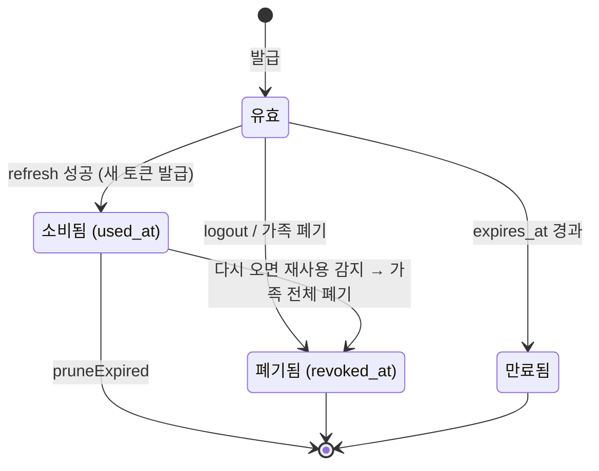

### 📄 파일

`src/proxy.ts`, `src/lib/api/*`, `src/lib/refresh-tokens.ts`, `src/lib/api-keys.ts`, `src/app/api/v1/**` 모두 main 과 동일.

---

## 11장. 테스트: 어디서 무엇을 확인하나

```
            ▲  느리지만 전체를 본다
            │
      ┌─────┴─────┐
      │   E2E     │  Playwright, 프로덕션 빌드 + 진짜 브라우저 (e2e/*.spec.ts)
      │           │  /feed 는 /api/trpc/posts.list 응답을 기다린다
      ├───────────┤
      │ Route     │  Vitest, 핸들러 함수를 직접 호출 (src/app/api/**/*.test.ts)
      │ Handler   │
      ├───────────┤
      │ ★ tRPC    │  Vitest, createCaller 로 HTTP 없이 프로시저 호출 (src/trpc/router.test.ts)
      │ 라우터    │  입력 검증 · 권한 · 2단 규칙 · revalidateTag 호출 여부
      ├───────────┤
      │ 컴포넌트  │  Vitest + Testing Library + jsdom
      ├───────────┤
      │ 단위      │  Vitest, node 환경 (src/lib/**/*.test.ts)
      └───────────┘
            │
            ▼  빠르고 좁다
```

| 무엇을 | 어떻게 | 예 |
| --- | --- | --- |
| 순수 함수, SQL 함수, 세션 | main 과 동일 (임시 SQLite, `vi.mock("next/headers")`) | `posts.test.ts`, `session.test.ts` |
| ★ tRPC 프로시저 | `createCallerFactory(appRouter)({ user })` 로 caller 를 만들어 `await caller.comments.add({...})`. `next/cache` 는 `vi.mock` 으로 no-op + `vi.fn()` | `src/trpc/router.test.ts` |
| 클라이언트 컴포넌트 | `vi.mock("./actions")` | `todo-item.test.tsx` |
| Route Handler | `apiRequest()` 로 요청 객체 → 직접 호출 | `api/v1/**/*.test.ts` |
| 스트리밍, hydrate, 무한 스크롤 | E2E | `e2e/posts-features.spec.ts` |

**프로시저는 그냥 함수다.** `(input, ctx)` 를 받는 함수이므로 브라우저도 `/api/trpc` 도 없이 부를 수 있다. ctx 를 `{ user: null }` 로 넣으면 로그아웃 상태, `{ user: guest }` 로 넣으면 게스트 로그인 상태다. Server Action 은 `useActionState` 와 `FormData` 에 묶여 있어 이런 단위 테스트가 어려웠고, 그래서 main 은 E2E 로만 검증했다. `router.test.ts` 가 증명하는 것:

- `.input(zod)` 검증이 본문보다 먼저 실행되고 실패는 `BAD_REQUEST`
- `protectedProcedure` 가 본문 전에 막는다 (`UNAUTHORIZED`)
- 2단 제한, 소유자 검사 (`FORBIDDEN`), 없는 글 (`NOT_FOUND`)
- 변경 후 `revalidateTag` 가 올바른 태그와 `{ expire: 0 }` 으로 호출됐다

---

## 12장. tRPC 층 자세히 보기

앞 장들에서 조금씩 만난 tRPC 를 한 번에 정리한다. main 과의 파일별 대응은 README "브랜치 feat/trpc 에서 달라진 점" 에 있다.

### 12-1. 부품 일곱 개

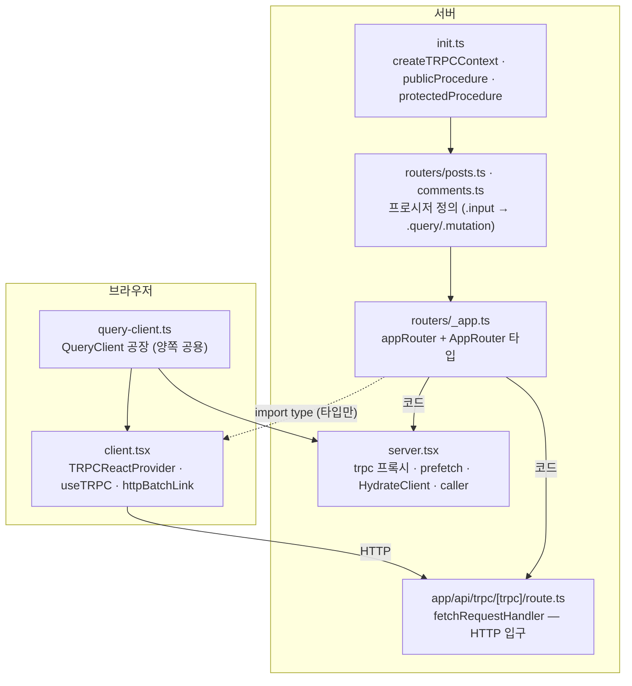

| 파일 | 만드는 것 | 누가 쓰나 |
| --- | --- | --- |
| `init.ts` | 컨텍스트, 라우터 생성 함수, 프로시저 빌더 두 종류, 로그 미들웨어, `createCallerFactory` | 라우터 파일, 테스트 |
| `routers/*.ts` | 프로시저 | `_app.ts` |
| `routers/_app.ts` | `appRouter`(코드), `AppRouter`(타입) | 서버는 코드를, 브라우저는 타입만 |
| `api/trpc/[trpc]/route.ts` | HTTP 입구. GET 과 POST 둘 다 같은 handler | 브라우저의 `httpBatchLink` |
| `server.tsx` | HTTP 없이 라우터를 부르는 프록시, prefetch, hydrate 경계 | 서버 컴포넌트 |
| `client.tsx` | Provider 와 `useTRPC` 훅 | 클라이언트 컴포넌트 |
| `query-client.ts` | 같은 설정의 `QueryClient` | 서버(요청마다), 브라우저(하나) |

### 12-2. 프로시저 정의 읽는 법

```ts
add: protectedProcedure                       // ① 누가 부를 수 있나 (public / protected)
  .input(commentSchema.extend({ postId: z.number().int().positive(), ... }))  // ② 입력 검증. 실패 → BAD_REQUEST
  .mutation(async ({ ctx, input }) => {       // ③ .query = 조회(GET, useQuery) / .mutation = 변경(POST, useMutation)
    // ctx.user 는 ①이 보장. input 은 ②를 통과한 값
    ...
    return { id };                            // ④ 반환값의 타입이 곧 클라이언트 data 의 타입
  }),
```

| 단계 | main 의 Server Action 에서는 | main 의 Route Handler 에서는 |
| --- | --- | --- |
| ① 로그인 | 액션마다 `getCurrentUser()` | `requireAuth(auth)` |
| ② 검증 | `schema.safeParse()` 직접 | `parseJsonBody(request, schema)` |
| ③ 종류 | 구분 없음 | `export const GET / POST` |
| ④ 타입 | 반환 타입을 클라이언트가 못 봄 | 손으로 다시 선언 |

### 12-3. 요청 하나가 지나는 길 (브라우저 → 서버)

```mermaid
sequenceDiagram
  autonumber
  participant C as 컴포넌트
  participant T as useTRPC()
  participant Q as TanStack Query
  participant LK as httpBatchLink
  participant R as /api/trpc/[trpc]
  participant F as fetchRequestHandler
  participant CX as createTRPCContext
  participant MW as 미들웨어 (logger → auth)
  participant PR as 프로시저 본문

  C->>T: trpc.posts.search.queryOptions({ q })
  T-->>C: { queryKey: [["posts","search"], { input, type }], queryFn }
  C->>Q: useQuery(옵션)
  Q->>LK: queryFn 실행
  LK->>R: GET /api/trpc/posts.search?input={"json":{"q":"…"}}<br/>(같은 틱의 호출은 콤마로 묶어 한 요청)
  R->>F: fetchRequestHandler({ endpoint: "/api/trpc", router, createContext })
  F->>CX: ctx = { user }
  F->>MW: path, type, input 으로 미들웨어 체인
  MW->>PR: .input 통과 후 본문
  PR-->>F: 반환값
  F-->>LK: superjson 으로 직렬화된 응답 (배치면 배열)
  LK-->>Q: 역직렬화 → 캐시 저장
  Q-->>C: data (타입은 라우터 반환 타입)
```

**URL 모양.**

| 종류 | 메서드 | 예 |
| --- | --- | --- |
| query | GET | `/api/trpc/posts.search?input={"json":{"q":"캐시"}}` |
| mutation | POST | `/api/trpc/comments.add` (본문에 input) |
| 배치 | GET/POST | `/api/trpc/posts.list,comments.list?batch=1&input={...}` |

`httpBatchLink` 는 같은 틱에 발생한 여러 호출을 요청 하나로 묶는다. main 의 fetch 방식은 호출마다 요청 하나였다.

### 12-4. 타입이 흐르는 길 (서버 → 브라우저)

```
routers/comments.ts        list: publicProcedure.input(z.object({ postId })).query(() => getCommentThreads(...))
        │                          ↑ 입력 타입                       ↑ 반환 타입 CommentThread[]
        ▼
routers/_app.ts            export type AppRouter = typeof appRouter
        │
        ▼  import type (컴파일 후 사라짐 — 구현은 브라우저로 안 감)
client.tsx                 createTRPCContext<AppRouter>() → useTRPC
        │
        ▼
comment-threads.tsx        const { data } = useQuery(trpc.comments.list.queryOptions({ postId }))
                                       ↑ CommentThread[]                          ↑ { postId: number } 만 허용
```

서버에서 필드를 지우면 `comment-threads.tsx` 가 컴파일 에러. 필드를 추가하면 자동완성에 바로 뜬다. `inferRouterOutputs<AppRouter>` 로 특정 프로시저의 반환 타입만 뽑을 수도 있다 (`post-feed.tsx` 의 `FeedItem`).

### 12-5. superjson 과 QueryClient 설정

| 설정 | 어디 | 왜 |
| --- | --- | --- |
| `transformer: superjson` | `init.ts` (서버), `client.tsx` 의 `httpBatchLink` (브라우저) | JSON 이 못 표현하는 Date, Map, undefined 를 보존. **양쪽이 같아야** 한다 |
| `staleTime: 30s` | `query-client.ts` | 서버가 prefetch 한 데이터를 브라우저가 받자마자 다시 요청하는 낭비를 막는다 |
| `shouldDehydrateQuery: … \|\| pending` | `query-client.ts` | 서버 컴포넌트가 `await` 하지 않은 prefetch 를 Promise 상태로 스트리밍 |
| `serializeData / deserializeData: superjson` | `query-client.ts` | dehydrate 와 hydrate 에서도 같은 변환 |

### 12-6. 직접 겪은 것들

| 상황 | 이유 | 대책 |
| --- | --- | --- |
| 프로시저에서 `updateTag` 호출 시 에러 | tRPC 는 Route Handler 컨텍스트 | `revalidateTag(tag, { expire: 0 })` |
| 댓글을 썼는데 화면이 안 바뀜 | 캐시가 두 층 | 서버 태그 + `invalidateQueries` 둘 다 |
| `useQuery` 가 첫 렌더에 로딩 표시 | 서버 prefetch 와 queryKey 가 다름 | 같은 `queryOptions(input)` 을 양쪽에서 |
| 무한 스크롤이 두 번째 페이지를 못 받음 | 입력 필드 이름이 `cursor` 가 아님 | 라우터 입력을 `cursor` 로 |
| 서버에서 사용자 간 데이터 섞임 | 모듈 변수에 QueryClient 하나 | 서버는 요청마다 `cache(makeQueryClient)` |
| Date 가 문자열로 옴 | 한쪽만 superjson | 서버·클라이언트·dehydrate 모두 superjson |

### 12-7. 언제 이 방식이 이기나

클라이언트 페칭이 많은 화면, 두 번째 클라이언트(모바일 앱, 관리자 도구)가 같은 TypeScript 저장소에 있을 때. 이 앱은 대부분 서버 컴포넌트가 데이터를 그리고 폼은 Server Action 이라, tRPC 가 꼭 필요하지는 않다. README Part 7-2 의 기준을 참고.

---

## 13장. 한눈에 보는 요약

### 13-1. 데이터가 바뀌면 무엇이 갱신되나

```mermaid
flowchart LR
  subgraph ENTRY["입구"]
    TA["todos/actions.ts"]
    PA["posts/actions.ts (글)"]
    TP["★ trpc/routers/comments.ts (댓글)"]
    API["api/v1/**/route.ts"]
  end
  subgraph INV["서버 무효화"]
    RP["revalidatePath('/todos')"]
    UT["updateTag(...)"]
    RT0["revalidateTag(..., expire: 0)"]
  end
  subgraph BINV["★ 브라우저 무효화"]
    IQ["queryClient.invalidateQueries(<br/>trpc.comments.list.queryFilter({ postId }))"]
  end
  subgraph CACHE["'use cache' 엔트리 (태그)"]
    C1["getPostsPage — posts"]
    C2["getPost(id) — posts, post-N"]
    C3["getCommentThreads(id) — post-N-comments"]
    C4["getNextReleases — next-releases"]
  end
  subgraph VIEW["화면"]
    V1["/todos"]
    V2["/posts, /feed 첫 페이지"]
    V3["/posts/N 본문, 모달"]
    V4["/posts/N 댓글 (useQuery)"]
    V5["/releases"]
  end
  TA --> RP --> V1
  API -->|"todos"| RP
  PA -->|"글"| UT --> C1 & C2
  PA -->|"릴리스"| UT --> C4
  TP -->|"프로시저 안"| RT0 --> C3
  TP -.->|"onSuccess"| IQ --> V4
  API -->|"글"| RT0 --> C1 & C2
  API -->|"댓글"| RT0 --> C3
  C1 --> V2
  C2 --> V3
  C3 --> V4
  C4 --> V5
```

댓글만 화살표가 두 갈래다. 서버 태그를 지우는 것(프로시저)과 브라우저 캐시를 지우는 것(`onSuccess`)이 따로 있다.

### 13-2. 렌더링 방식 지도

| 페이지 | 방식 | 근거 |
| --- | --- | --- |
| `/` | 정적 (SSG) | 요청 데이터 없음 |
| `/todos` | 정적 셸 + 요청 시 목록 (SSR) | `connection()`, `loading.tsx` |
| `/posts` | 정적 셸 + 캐시된 목록 (ISR) + 요청 시 세션 | `"use cache"` + `searchParams` + `cookies()` |
| `/posts/[id]` | 일부 id 는 빌드 시, 나머지 첫 요청 시 캐시 + 스트리밍. 댓글은 prefetch + hydrate | `generateStaticParams`, `getPost` 캐시, `HydrateClient` |
| `/client-fetch` | 완전 정적 + 브라우저 fetch/tRPC (CSR) | 서버 컴포넌트가 데이터를 안 읽음 |
| `/feed` | 첫 페이지 캐시 + 브라우저 tRPC | `getPostsPage` + `infiniteQueryOptions` |
| `/releases` | 외부 fetch 캐시 + `use()` | `"use cache"` + Promise props |
| `/api/trpc/*` | 요청마다 | 컨텍스트가 쿠키를 읽음 |
| `/api/v1`, `/api/v1/openapi.json` | 정적 | 요청을 안 읽음 |

### 13-3. 개념 → 파일 색인

| 개념 | 장 | 파일 |
| --- | --- | --- |
| 컨텍스트 `ctx.user` | 6, 12 | `src/trpc/init.ts` |
| `publicProcedure` / `protectedProcedure`, 미들웨어, 타입 좁히기 | 6, 12 | `src/trpc/init.ts` |
| 프로시저 정의 (`.input`, `.query`, `.mutation`) | 12 | `src/trpc/routers/posts.ts`, `comments.ts` |
| `AppRouter` 타입, `import type` | 1, 12 | `src/trpc/routers/_app.ts`, `client.tsx` |
| HTTP 입구, URL 모양, 배치 | 12 | `src/app/api/trpc/[trpc]/route.ts` |
| `TRPCReactProvider`, `useTRPC`, `httpBatchLink` | 2, 12 | `src/trpc/client.tsx` |
| 서버 프록시, `prefetch`, `HydrateClient` | 7, 12 | `src/trpc/server.tsx` |
| QueryClient 서버/브라우저 분리, superjson, pending dehydrate | 2, 12 | `src/trpc/query-client.ts` |
| `queryOptions` / `mutationOptions` / `queryFilter` | 7 | `comment-threads.tsx`, `comment-form.tsx` |
| `infiniteQueryOptions`, `inferRouterOutputs` | 9 | `(demos)/feed/post-feed.tsx` |
| 캐시 두 층 무효화 | 7, 13 | `routers/comments.ts`, `comment-form.tsx` |
| `updateTag` 를 못 쓰는 이유 | 7, 12 | `routers/comments.ts` |
| `createCaller` 테스트 | 11 | `src/trpc/router.test.ts` |
| Server Action vs tRPC mutation | 3 | `todos/actions.ts` vs `routers/comments.ts` |
| REST vs tRPC 역할 분담 | 10 | `api/v1/` vs `src/trpc/` |
| 서버/클라이언트 컴포넌트, Suspense, hydration | 2 | `layout.tsx` |
| `connection()`, Server Action, `revalidatePath`, React 19 훅, zustand | 3 | `todos/` |
| `"use cache"`, 태그, `updateTag` vs `revalidateTag` | 4 | `lib/posts.ts`, `posts/actions.ts` |
| 동적 라우트, 특수 파일, 스트리밍, 모달 | 5 | `posts/[id]/`, `posts/@modal/` |
| 비밀번호 해시, JWT 세션, DAL, 3겹 방어 | 6 | `password.ts`, `session.ts`, `dal.ts`, `proxy.ts` |
| 파일 업로드 | 8 | `uploads.ts` |
| Bearer, 리프레시 토큰, API 키, 레이트 리밋, CORS | 10 | `lib/api/`, `refresh-tokens.ts` |

### 13-4. 자주 헷갈리는 것

**Q. 댓글을 썼는데 목록이 안 바뀐다.**
7장. 서버 `"use cache"` 태그와 브라우저 TanStack 캐시를 둘 다 지웠는지 본다. 프로시저의 `revalidateTag` 와 `onSuccess` 의 `invalidateQueries`.

**Q. 프로시저에서 `updateTag` 를 부르면 왜 에러인가?**
tRPC 는 `/api/trpc/[trpc]/route.ts` 라는 Route Handler 안에서 실행된다. `updateTag` 는 Server Action 전용이다. `revalidateTag(tag, { expire: 0 })` 를 쓴다.

**Q. 서버 컴포넌트에서 `useTRPC()` 를 쓰면?**
훅이라 안 된다. 서버 컴포넌트는 `src/trpc/server.tsx` 의 `trpc` 프록시(prefetch용) 또는 `caller`(결과만 필요할 때)를 쓴다.

**Q. tRPC 요청에 `Authorization` 헤더가 필요한가?**
아니다. 세션 쿠키를 브라우저가 자동으로 붙이고, `createTRPCContext` 가 그것으로 `ctx.user` 를 만든다. Bearer 는 `/api/v1` 전용이다.

**Q. 첫 렌더에 댓글이 "로딩 중" 으로 보인다.**
서버 `prefetch` 의 queryKey 와 클라이언트 `useQuery` 의 queryKey 가 다르다. 같은 `queryOptions(입력)` 을 써야 한다.

**Q. 왜 글 작성은 tRPC 로 안 바꿨나?**
파일이 붙은 폼은 Server Action 이 단순하고, 비교 범위를 "조회 + 댓글" 로 좁히기 위해서다. 3장의 비교표 참고.

**Q. 같은 `/posts/3` 인데 어떨 땐 모달, 어떨 땐 페이지인 이유는?**
5장. Link 클릭만 인터셉팅 라우트가 가로챈다.

---

## 부록 A. 서버 컴포넌트와 클라이언트 컴포넌트, 제대로 이해하기

이름 때문에 오해가 생기기 쉬운 개념이다. "서버 컴포넌트는 서버에서, 클라이언트 컴포넌트는 브라우저에서 실행된다" 라고 외우면 절반은 틀린다. 질문을 바꿔야 한다. **"이 컴포넌트의 코드가 브라우저로 가는가?"** 이것 하나로 대부분이 설명된다.

### A-1. 한 문장씩

| | 서버 컴포넌트 | 클라이언트 컴포넌트 |
| --- | --- | --- |
| 표시 | 파일 맨 위에 아무것도 없음 (**기본값**) | 파일 맨 위에 `"use client"` |
| 어디서 실행되나 | **서버에서만**. 브라우저는 결과만 받는다 | **서버에서 한 번, 브라우저에서 또 한 번** |
| 브라우저로 가는 것 | 렌더링 결과 (HTML 조각과 RSC payload) | 결과 + **JS 코드 자체** |
| 비유 | 주방에서 완성해 내보내는 요리. 손님은 레시피를 모른다 | 테이블 위의 버튼과 리모컨. 손님이 직접 누른다 |
| 이 프로젝트에서 | `todos/page.tsx`: getTodos() 로 SQLite 를 읽어 목록을 그린다 | `todos/todo-item.tsx`: 체크박스 클릭에 반응한다 |

### A-2. 무엇이 브라우저로 가나

```mermaid
flowchart LR
  subgraph SRV["서버"]
    SC["서버 컴포넌트<br/>todos/page.tsx<br/>getTodos() 로 SQLite → JSX"]
    CCS["클라이언트 컴포넌트<br/>todo-item.tsx<br/>(서버에서도 한 번 그림 = SSR)"]
  end
  subgraph OUT["브라우저로 전송되는 것"]
    HTML["HTML<br/>첫 화면 (사진)"]
    RSC["RSC payload<br/>서버 컴포넌트의 렌더 결과 트리<br/>+ '이 자리에 어떤 클라이언트 컴포넌트를 어떤 props 로'"]
    JS["JS 번들<br/>클라이언트 컴포넌트 코드만"]
  end
  subgraph BR["브라우저"]
    H["hydration<br/>사진 위에 이벤트·상태 붙이기"]
    RUN["이후 클릭·입력·useEffect 는<br/>브라우저에서 실행"]
  end
  SC --> HTML
  SC --> RSC
  CCS --> HTML
  CCS -.->|"코드"| JS
  HTML & RSC & JS --> H --> RUN
```

- `todos/page.tsx` 의 `getTodos()` 와 그 안의 DB 코드는 브라우저에 **없다**. 개발자 도구 Sources 탭에서 검색해도 안 나온다.
- `todo-item.tsx` 의 `handleToggle` 은 브라우저에 **있다**. 그래야 클릭에 반응한다.
- 클라이언트 컴포넌트도 서버에서 한 번 HTML 로 그려진다. 그래서 첫 화면이 빈 화면이 아니다. 이것이 SSR 이다.

### A-3. 시간 순서로 보기

```
서버                                          브라우저
──────────────────────────────────────        ──────────────────────────────────────
① 서버 컴포넌트 실행 (DB 읽기, await)
② 클라이언트 컴포넌트도 HTML 로 한 번 그림
   (useState 초기값으로. useEffect 는 실행 안 함)
③ HTML + RSC payload 전송 ──────────────▶     ④ HTML 표시. 보이지만 아직 클릭은 안 됨
                                              ⑤ 클라이언트 컴포넌트 JS 다운로드
                                              ⑥ hydration: 같은 컴포넌트를 브라우저에서
                                                 다시 실행해 이벤트 핸들러를 붙임
                                              ⑦ useEffect 실행. 이제 클릭·입력이 동작
```

⑥ 에서 서버가 그린 HTML(②) 과 브라우저가 그린 결과가 **같아야** 한다. 다르면 "hydration mismatch" 에러다. 그래서 `localStorage` 처럼 브라우저에만 있는 값은 ②에서 읽으면 안 되고 ⑦(`useEffect`) 에서 읽는다. `components/store-hydrator.tsx` 가 정확히 그렇게 한다.

### A-4. 이름이 만드는 오해 세 가지

| 오해 | 실제 | 이 프로젝트에서 확인 |
| --- | --- | --- |
| "클라이언트 컴포넌트는 브라우저에서만 실행된다" | 서버에서도 한 번 실행된다 (SSR). 렌더 중에 `window` 를 읽으면 서버에서 터진다 | `posts/[id]/recently-viewed.tsx` 는 그래서 `next/dynamic` 의 `ssr: false` 로만 로드한다 |
| "서버 컴포넌트 = SSR" | 다른 개념이다. 서버 컴포넌트는 "코드가 브라우저로 안 감", SSR 은 "클라이언트 컴포넌트를 서버에서 HTML 로 미리 그림" | `todo-item.tsx` 는 클라이언트 컴포넌트이면서 SSR 된다 |
| "`"use client"` 는 그 파일만 클라이언트로 만든다" | **경계** 다. 그 파일이 import 하는 모듈도 전부 클라이언트 번들로 끌려간다 | `todo-item.tsx` 에서 `@/lib/db` 를 import 하면 `server-only` 가 빌드를 막는다 |

### A-5. 어느 쪽으로 만들까

```mermaid
flowchart TB
  Q1{"onClick, onChange 같은<br/>이벤트 핸들러가 필요한가?"}
  Q2{"useState, useEffect, useRef<br/>같은 훅이 필요한가?"}
  Q3{"window, localStorage,<br/>IntersectionObserver 같은<br/>브라우저 API 가 필요한가?"}
  Q4{"DB, 파일, 비밀 키,<br/>cookies() 도 함께 필요한가?"}
  C["'use client' 컴포넌트"]
  S["서버 컴포넌트 (기본값)"]
  SPLIT["둘로 나눈다:<br/>서버 컴포넌트가 데이터를 읽어 props 로 넘기고,<br/>클라이언트 컴포넌트가 상호작용을 맡는다"]
  Q1 -->|"예"| Q4
  Q1 -->|"아니오"| Q2
  Q2 -->|"예"| Q4
  Q2 -->|"아니오"| Q3
  Q3 -->|"예"| Q4
  Q3 -->|"아니오"| S
  Q4 -->|"예"| SPLIT
  Q4 -->|"아니오"| C
```

**기본값은 서버 컴포넌트다.** 필요한 것이 생겼을 때만 `"use client"` 를 붙인다. 붙이더라도 **가능한 한 트리의 아래쪽, 작은 조각** 에 붙인다. 페이지 전체에 붙이면 페이지의 모든 코드가 브라우저로 간다. `todos/page.tsx` 가 서버로 남고 `TodoItem`, `AddTodoForm` 만 클라이언트인 이유다.

### A-6. 할 수 있는 것, 없는 것

| | 서버 컴포넌트 | 클라이언트 컴포넌트 |
| --- | --- | --- |
| `async` / `await` 로 데이터 읽기 | ✅ `await getTodos()` | ❌ (`use()` 나 SWR, TanStack Query 로) |
| DB, 파일 시스템, 환경변수 비밀 | ✅ | ❌ |
| `cookies()`, `headers()` | ✅ (Suspense 안에서) | ❌ |
| `useState`, `useEffect`, `useRef` | ❌ | ✅ |
| `onClick`, `onChange`, `onSubmit` | ❌ | ✅ |
| `window`, `localStorage`, 브라우저 API | ❌ | ✅ (`useEffect` 안에서) |
| Context Provider 제공 | ❌ | ✅ |
| 다른 서버 컴포넌트 import | ✅ | ❌ (import 하면 그것도 클라이언트가 됨) |
| 다른 클라이언트 컴포넌트 import | ✅ | ✅ |
| 서버 컴포넌트를 children 으로 받기 | — | ✅ (A-7) |
| Server Action 호출 | `<form action={...}>` 으로 | 함수처럼 호출 |
| tRPC 호출 | `src/trpc/server.tsx` 의 `trpc` 프록시 / `caller` (HTTP 없음) | `useTRPC()` 훅 → `useQuery` / `useMutation` (HTTP) |

### A-7. 트리 규칙과 샌드위치 패턴

가장 헷갈리는 규칙이다. **"클라이언트 컴포넌트는 서버 컴포넌트를 import 할 수 없다. 하지만 children 으로 받을 수는 있다."**

```mermaid
flowchart TB
  subgraph OK1["✅ 서버 → 클라이언트 import"]
    A1["todos/page.tsx (서버)"] --> B1["TodoItem (클라이언트)"]
  end
  subgraph NO["❌ 클라이언트 → 서버 import"]
    A2["TodoItem (클라이언트)"] -.->|"import 하는 순간<br/>이것도 클라이언트가 됨"| B2["user-menu.tsx (서버)<br/>→ cookies() 못 씀, server-only 빌드 에러"]
  end
  subgraph OK2["✅ 샌드위치: 클라이언트가 서버를 children 으로"]
    A3["app/layout.tsx (서버)"] --> B3["TRPCReactProvider (클라이언트)"]
    B3 -->|"children"| C3["UserMenu, 각 page.tsx (서버)<br/>서버에서 이미 렌더된 결과가 끼워진다"]
  end
```

왜 import 는 안 되고 children 은 되나. import 는 "이 코드를 내 번들에 넣어라" 는 뜻이라 클라이언트 번들에 서버 코드가 들어간다. children 은 "서버가 **이미 렌더링한 결과** 를 이 자리에 끼워라" 는 뜻이라 코드는 안 가고 결과만 간다.

이 프로젝트의 샌드위치:

| 바깥 (서버) | 가운데 (클라이언트) | 안 (children) |
| --- | --- | --- |
| `app/layout.tsx` | `TRPCReactProvider` (QueryClient + tRPC Provider) | 헤더의 `UserMenu`, 모든 `page.tsx` (서버) |
| `posts/@modal/(.)[id]/page.tsx` | `RouteModal` (Dialog) | 글 본문, 이미지, 링크 (서버가 렌더) |
| `posts/[id]/comments-section.tsx` | `HydrateClient` 안의 `HydrationBoundary` | `CommentThreads` (클라이언트) — 여기서는 서버가 넘기는 것이 JSX 가 아니라 **prefetch 한 데이터** 다 |

### A-8. props 규칙: 넘길 수 있는 것

서버 컴포넌트가 클라이언트 컴포넌트에 props 를 넘기면 그 값은 네트워크를 건너간다. 그래서 **직렬화할 수 있는 값** 만 된다.

| 넘길 수 있다 | 넘길 수 없다 |
| --- | --- |
| 문자열, 숫자, boolean, null | 일반 함수 |
| 배열, 평범한 객체 | 클래스 인스턴스, `Map`, `Set` |
| `Date` | DB 연결(`db`) 같은 서버 자원 |
| **Server Action** (특별 취급) | 이벤트 핸들러 |
| JSX (서버가 렌더한 결과) | — |

이 프로젝트의 예:

- `todos/page.tsx` → `<TodoItem todo={todo} />`: 평범한 객체라 넘길 수 있다.
- `posts/[id]/edit/page.tsx` → `<PostForm action={updatePostAction.bind(null, post.id)} />`: Server Action 은 함수지만 넘길 수 있다. Next.js 가 "이 액션을 부르는 참조" 로 바꿔 보내기 때문이다.
- `todos/page.tsx` 에서 `onDelete={() => ...}` 같은 일반 함수를 넘기면 빌드 에러. 그래서 삭제 로직은 `TodoItem` 안에서 Server Action 을 직접 import 해 호출한다.

### A-9. 이 프로젝트에서 찾아보기

| 파일 | 종류 | 왜 |
| --- | --- | --- |
| `app/layout.tsx`, `app/page.tsx` | 서버 | 구조와 링크만. 상호작용 없음 |
| `todos/page.tsx` | 서버 | `await getTodos()` 로 DB 를 읽는다 |
| `todos/todo-item.tsx` | 클라이언트 | 체크박스 클릭, 수정 모드 `useState`, `useOptimistic` |
| `todos/add-todo-form.tsx` | 클라이언트 | `useActionState`, `useRef` 로 폼 초기화, 토스트 |
| `components/user-menu.tsx` | 서버 | `cookies()` 로 세션을 읽는다. 로그아웃은 `<form action>` 이라 onClick 이 필요 없다 |
| `posts/[id]/post-owner-actions.tsx` | 서버 | 세션만 읽고 버튼을 그린다. 실제 클릭은 자식 `DeletePostButton`(클라이언트) |
| `posts/[id]/other-posts.tsx` | 서버 | 1.5초 걸리는 `await`. 서버 컴포넌트라 스트리밍이 된다 |
| `posts/post-search-form.tsx` | 클라이언트 | 타이핑 이벤트, 디바운스 타이머, `useRouter` |
| `posts/error.tsx` | 클라이언트 | Error Boundary 는 클라이언트여야 한다 (React 규칙) |
| `components/modal.tsx` | 클라이언트 | `useRouter().back()`, Dialog 열림/닫힘 |
| `components/store-hydrator.tsx` | 클라이언트 | `useEffect` 로 localStorage 복원. 화면에는 아무것도 안 그림 |
| `posts/[id]/recently-viewed.tsx` | 클라이언트 + `ssr: false` | localStorage 를 렌더 중에 읽으므로 서버에서 아예 안 그린다 |
| `posts/[id]/comments-section.tsx` | 서버 | `cookies()` 로 세션을 읽고, 프로시저를 HTTP 없이 prefetch 한다 |
| `posts/[id]/comment-threads.tsx` | 클라이언트 | `useQuery` 로 TanStack 캐시를 **구독** 해야 댓글 추가 후 목록만 갱신할 수 있다 |
| `posts/[id]/comment-form.tsx` | 클라이언트 | `useMutation`, `onSubmit`, 폼 초기화 |

패턴이 보인다. **"읽고 그리는 것" 은 서버, "누르고 바꾸는 것" 은 클라이언트.** 그리고 서버 컴포넌트는 되도록 크게, 클라이언트 컴포넌트는 되도록 작게.

### A-10. 스스로 확인하기

1. `todos/page.tsx` 에 `onClick` 을 넣으면? → 에러. 서버 컴포넌트에는 이벤트 핸들러가 없다. 버튼을 클라이언트 컴포넌트로 분리한다.
2. `todo-item.tsx` 에서 `@/lib/db` 를 import 하면? → 빌드 에러. `server-only` 가 막는다. 데이터는 props 로 받거나 Server Action 에 부탁한다.
3. `user-menu.tsx` 에 `"use client"` 를 붙이면? → `cookies()` 를 못 쓴다. 세션은 서버에서만 읽을 수 있다.
4. 클라이언트 컴포넌트 렌더 중에 `new Date().toLocaleTimeString()` 을 쓰면? → 서버와 브라우저의 시각이 달라 hydration mismatch 가 날 수 있다. `useEffect` 에서 설정한다 (`post-count.tsx` 가 그렇게 한다).
5. `app/layout.tsx` 는 서버인데 안의 `TRPCReactProvider` 는 클라이언트다. 그 안에 끼워진 `UserMenu` 와 각 page.tsx 는? → 여전히 서버. children 으로 끼워졌기 때문이다. `UserMenu` 가 `cookies()` 를 계속 쓸 수 있는 이유다.

---

이 문서를 다 읽었다면 README 의 "브랜치 feat/trpc 에서 달라진 점" (main 과의 파일별 대응표) 과 `docs/NEXT_STEPS.md` 로 이어진다. main 워크트리의 같은 문서와 나란히 열어 7장과 9장만 비교해 보는 것도 좋다.
