# 코드 여행기 — 요청 하나를 따라가며 읽는 next-js-study-app

> README 가 "주제별 사전" 이라면 이 문서는 "여행기" 다.
> 브라우저에서 주소를 치는 순간부터 화면이 완성되기까지, 요청 하나가 어떤 파일을 어떤 순서로 지나가는지 따라간다.
> 처음 보는 개념은 그 자리에서 짧게 설명하고, 자세한 설명이 필요하면 README 의 해당 절을 가리킨다.

---

## 목차

| 장 | 제목 | 따라가는 요청 | 처음 만나는 개념 |
| --- | --- | --- | --- |
| 0 | 이 책을 읽는 법 | 전체 지도 | 층(layer), 로그 접두어 |
| 1 | 서버가 켜질 때 | `npm run dev` | 환경변수, 모듈 싱글턴, `server-only` |
| 2 | 첫 접속: 홈 | `GET /` | 서버/클라이언트 컴포넌트, 정적 셸, Suspense, hydration |
| 3 | 할 일 목록: 읽고 바꾸기의 기본형 | `GET /todos`, 체크박스 클릭 | `connection()`, Server Action, `revalidatePath`, React 19 훅, zustand |
| 4 | 글 목록: 캐시가 들어온다 | `GET /posts?q=&page=` | `"use cache"`, 캐시 키, 태그, `updateTag` vs `revalidateTag` |
| 5 | 글 상세: 동적 라우트와 스트리밍 | `GET /posts/3` | `[id]`, `generateStaticParams`, 스트리밍, 특수 파일, 모달 |
| 6 | 인증: 누구인지 확인하기 | 회원가입, 로그인, 그 뒤의 모든 요청 | 비밀번호 해시, JWT 쿠키, DAL, 3겹 방어 |
| 7 | 댓글: 캐시와 사용자별 정보 합치기 | 댓글 작성/삭제 | 2단 트리, CASCADE, 태그 분리 |
| 8 | 이미지 업로드 | 파일이 붙은 폼 제출 | multipart, 파일 응답 Route Handler, `next/image` |
| 9 | 브라우저가 직접 가져올 때 | `/client-fetch`, `/feed`, `/releases` | SWR, TanStack Query, 커서, `use()` |
| 10 | 공개 API: 외부 개발자용 문 | `GET/POST /api/v1/...` | Bearer, 액세스/리프레시 토큰, API 키, 레이트 리밋, CORS |
| 11 | 테스트: 어디서 무엇을 확인하나 | `npm test`, `npm run test:e2e` | 단위/컴포넌트/E2E, mock |
| 12 | 한눈에 보는 요약 | — | 무효화 지도, 개념 색인 |
| 부록 A | 서버 컴포넌트와 클라이언트 컴포넌트, 제대로 이해하기 | — | 경계, 직렬화, 샌드위치 패턴, 오해 세 가지 |

---

## 0장. 이 책을 읽는 법

### 0-1. 층으로 보는 전체 지도

이 앱의 코드는 아래 그림처럼 **층** 으로 나뉜다. 요청은 항상 위에서 아래로 내려가고, 응답은 다시 위로 올라온다.
어느 파일을 열든 "이 파일은 어느 층인가" 를 먼저 떠올리면 길을 잃지 않는다.

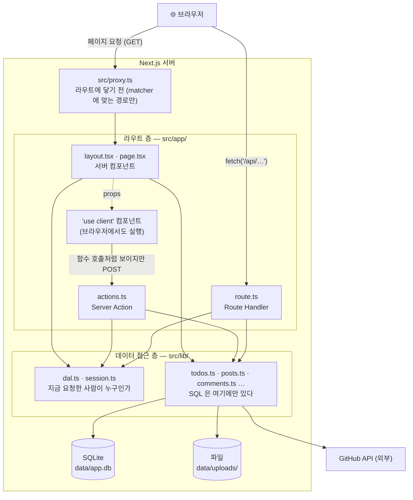
```mermaid
flowchart TB
  B["🌐 브라우저"]

  subgraph S["Next.js 서버"]
    direction TB
    P["src/proxy.ts<br/>라우트에 닿기 전 (matcher 에 맞는 경로만)"]

    subgraph R["라우트 층 — src/app/"]
      direction LR
      L["layout.tsx · page.tsx<br/>서버 컴포넌트"]
      C["'use client' 컴포넌트<br/>(브라우저에서도 실행)"]
      A["actions.ts<br/>Server Action"]
      H["route.ts<br/>Route Handler"]
    end

    subgraph D["데이터 접근 층 — src/lib/"]
      direction LR
      DAL["dal.ts · session.ts<br/>지금 요청한 사람이 누구인가"]
      LIB["todos.ts · posts.ts · comments.ts …<br/>SQL 은 여기에만 있다"]
    end

    DB[("SQLite<br/>data/app.db")]
    FS[("파일<br/>data/uploads/")]
  end

  GH["GitHub API (외부)"]

  B -->|"페이지 요청 (GET)"| P --> L
  L -.->|"props"| C
  C -->|"함수 호출처럼 보이지만 POST"| A
  B -->|"fetch('/api/…')"| H
  L & A & H --> DAL
  L & A & H --> LIB
  LIB --> DB
  LIB --> FS
  LIB --> GH
```

| 층 | 폴더 | 하는 일 | 하지 않는 일 |
| --- | --- | --- | --- |
| proxy | `src/proxy.ts` | 쿠키만 보고 리다이렉트, CORS 헤더 | DB 조회, 진짜 권한 검사 |
| 라우트 | `src/app/**` | 화면 그리기, 폼 받기, JSON 응답 | SQL 직접 쓰기 |
| 데이터 접근 | `src/lib/**` | SQL, 파일, 외부 API, 세션 검증 | 화면 관련 코드 |
| 저장소 | `data/` | SQLite 파일, 업로드 이미지 | — |

### 0-2. 폴더 지도

```
src/
├── proxy.ts                 ← 요청이 라우트에 닿기 전에 실행 (예전 이름: middleware)
├── app/                     ← URL = 폴더 경로
│   ├── layout.tsx           ← 모든 페이지의 껍데기 (<html>, 헤더)
│   ├── page.tsx             ← /
│   ├── todos/               ← /todos          (3장)
│   ├── posts/               ← /posts, /posts/[id], /posts/[id]/edit  (4·5·7장)
│   │   └── @modal/          ← 병렬 라우트 슬롯: 목록 위에 뜨는 모달 (5장)
│   ├── (auth)/              ← /login, /signup  (괄호 폴더는 URL 에 안 들어감) (6장)
│   ├── (demos)/             ← /feed, /client-fetch, /releases  (9장)
│   ├── p/[id]/              ← 짧은 주소 → 308 리다이렉트 (5장)
│   └── api/
│       ├── todos, posts, uploads/[name]   ← 내부용 Route Handler (3·8·9장)
│       └── v1/              ← 공개 API (10장)
├── components/              ← 여러 페이지가 함께 쓰는 조각 (ui/ 는 shadcn)
├── hooks/                   ← 커스텀 훅 (디바운스)
├── stores/                  ← zustand 스토어 (브라우저 UI 상태)
├── lib/                     ← 데이터 접근 층
│   ├── db.ts, schema.ts     ← SQLite 연결과 테이블 정의
│   ├── session.ts, dal.ts   ← 세션 쿠키, "현재 사용자"
│   ├── todos.ts, posts.ts, comments.ts, users.ts, uploads.ts, github.ts
│   ├── schemas/             ← Zod 검증 규칙 (화면과 API 가 같이 씀)
│   ├── api/                 ← 공개 API 공통 (봉투, 인증, 레이트 리밋, OpenAPI)
│   ├── api-keys.ts, refresh-tokens.ts
│   └── study-log.ts         ← 학습용 터미널 로그
└── test/                    ← 테스트 공통 설정
```

### 0-3. 터미널 로그로 따라가기

`npm run dev` 터미널에는 `src/lib/study-log.ts` 가 찍는 학습용 로그가 나온다. 이 책의 각 장 끝에 "터미널에서 보기" 로 그 장의 로그 순서를 적어 두었다.

| 접두어 | 뜻 | 어디서 찍히나 |
| --- | --- | --- |
| `[proxy]` | 라우트에 닿기 전 | `src/proxy.ts` |
| `[render]` | 서버 컴포넌트가 데이터 함수를 호출함 | page.tsx 와 서버 컴포넌트들 |
| `[cache]` | `"use cache"` 함수의 몸체가 실제로 실행됨 (= 캐시 MISS) | `posts.ts`, `comments.ts`, `github.ts` |
| `[session]` | 세션 쿠키 발급·삭제·검증 | `session.ts`, `dal.ts` |
| `[action]` | Server Action 실행, 무엇을 무효화했는지 | `actions.ts` 들 |
| `[api]` | Route Handler 실행, 인증 방식, 레이트 리밋 | `src/lib/api/route.ts`, `api/**/route.ts` |
| `[build]` | 빌드 시점(또는 dev 첫 요청)에 실행되는 것 | `generateStaticParams` |

### 0-4. 다이어그램 읽는 법

- **시퀀스 다이어그램**: 위에서 아래로 시간이 흐른다. 실선 화살표는 요청, 점선은 응답.
- **흐름도**: 마름모는 분기. 실선은 호출, 점선은 데이터 전달.
- 이 문서의 그림은 Mermaid 로 그려서 GitHub, VS Code 미리보기, 대부분의 마크다운 뷰어에서 그림으로 보인다.

---

## 1장. 서버가 켜질 때

### 🚶 흐름

`npm run dev` 를 치면 아직 아무 요청도 없지만 몇 가지가 미리 준비된다. 정확히는 **"처음 import 되는 순간"** 실행되는 코드들이다.

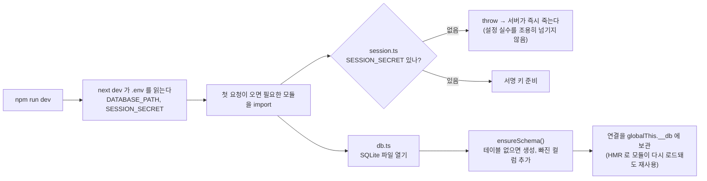
```mermaid
flowchart LR
  A["npm run dev"] --> B["next dev 가 .env 를 읽는다<br/>DATABASE_PATH, SESSION_SECRET"]
  B --> C["첫 요청이 오면 필요한 모듈을 import"]
  C --> D{"session.ts<br/>SESSION_SECRET 있나?"}
  D -->|없음| E["throw → 서버가 즉시 죽는다<br/>(설정 실수를 조용히 넘기지 않음)"]
  D -->|있음| F["서명 키 준비"]
  C --> G["db.ts<br/>SQLite 파일 열기"]
  G --> H["ensureSchema()<br/>테이블 없으면 생성, 빠진 컬럼 추가"]
  H --> I["연결을 globalThis.__db 에 보관<br/>(HMR 로 모듈이 다시 로드돼도 재사용)"]
```

### 📄 파일

| 파일 | 역할 |
| --- | --- |
| `.env` | `DATABASE_PATH`(기본 `data/app.db`), `SESSION_SECRET`(JWT 서명 키). `.env.example` 을 복사해 만든다 |
| `next.config.ts` | `cacheComponents: true` — 이 앱 전체의 렌더링 규칙을 정한다 (2장). 옛 주소 리다이렉트 목록도 여기 |
| `src/lib/db.ts` | SQLite 연결 하나를 만들어 앱 전체가 공유. `import "server-only"` 로 브라우저 번들에 섞이면 빌드 에러 |
| `src/lib/schema.ts` | `CREATE TABLE IF NOT EXISTS` 모음 + 나중에 추가된 컬럼을 `ALTER TABLE` 로 덧붙이는 수동 마이그레이션 |
| `src/lib/session.ts` | import 시점에 `SESSION_SECRET` 검사. 없으면 throw |
| `scripts/init-db.mts`, `scripts/seed-db.mts` | 앱과 무관하게 터미널에서 DB 를 만들고 샘플을 넣는다 (`npm run db:seed`) |

### 💡 개념

**모듈은 한 번만 실행된다.** `import { db } from "@/lib/db"` 를 열 군데서 해도 `openDatabase()` 는 한 번만 돈다. 자바스크립트 모듈은 처음 로드될 때 본문을 실행하고 결과를 캐시하기 때문이다. 그래서 DB 연결처럼 "앱에 하나만 있어야 하는 것" 을 모듈 최상위에 둔다.

**개발 모드의 함정과 `globalThis`.** 개발 서버는 파일을 저장할 때마다 모듈을 다시 로드한다(HMR). 그러면 위 규칙이 깨져 연결이 계속 새로 생긴다. 그래서 `db.ts` 와 `rate-limit.ts` 는 만든 객체를 `globalThis` 에 붙여 두고 다음 로드 때 재사용한다.

**`server-only`.** 이 한 줄을 import 한 파일을 클라이언트 컴포넌트가 import 하면 빌드가 실패한다. DB 연결이나 비밀 키가 실수로 브라우저 번들에 들어가는 것을 막는 안전장치다.

### 🔍 터미널에서 보기

첫 요청 전에는 로그가 없다. `SESSION_SECRET` 이 없으면 첫 요청 때 아래 에러가 난다.

```
Error: SESSION_SECRET 환경변수가 없습니다. .env 에 `openssl rand -base64 32` 결과를 넣으세요.
```

---

## 2장. 첫 접속: 홈 (`GET /`)

### 🚶 흐름

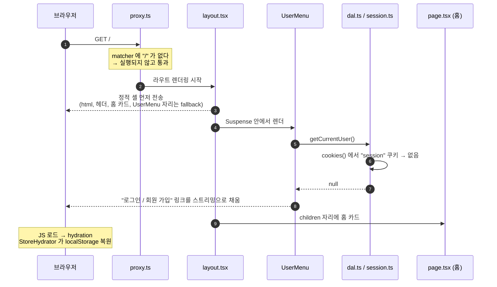
```mermaid
sequenceDiagram
  autonumber
  participant B as 브라우저
  participant P as proxy.ts
  participant L as layout.tsx
  participant U as UserMenu
  participant D as dal.ts / session.ts
  participant Pg as page.tsx (홈)

  B->>P: GET /
  Note over P: matcher 에 "/" 가 없다<br/>→ 실행되지 않고 통과
  P->>L: 라우트 렌더링 시작
  L-->>B: 정적 셸 먼저 전송<br/>(html, 헤더, 홈 카드, UserMenu 자리는 fallback)
  L->>U: Suspense 안에서 렌더
  U->>D: getCurrentUser()
  D->>D: cookies() 에서 "session" 쿠키 → 없음
  D-->>U: null
  U-->>B: "로그인 / 회원 가입" 링크를 스트리밍으로 채움
  L->>Pg: children 자리에 홈 카드
  Note over B: JS 로드 → hydration<br/>StoreHydrator 가 localStorage 복원
```

1. **proxy 는 실행되지 않는다.** `src/proxy.ts` 의 `config.matcher` 는 `/login`, `/signup`, `/posts/:id/edit`, `/api/v1/*` 만 잡는다. 홈과 `/todos`, `/posts` 는 프록시 없이 바로 라우트로 간다.
2. **루트 레이아웃** `src/app/layout.tsx` 가 `<html>`, `<body>`, 상단 헤더를 그린다. 헤더에 "할 일", "글" 링크가 있고, 오른쪽 사용자 메뉴만 `<Suspense>` 로 감싸져 있다.
3. **사용자 메뉴** `src/components/user-menu.tsx` 는 서버 컴포넌트다. 아래 체인으로 로그인 여부를 확인한다.

   ```
   UserMenu
     → getCurrentUser()        src/lib/dal.ts      react cache(): 한 요청에 한 번만 실행
       → getSessionUserId()    src/lib/session.ts  cookies() 에서 "session" 쿠키 읽기
         → decrypt()           jose 로 JWT 서명 검증. 위조·만료면 null
       → findUserById()        src/lib/users.ts    SELECT id, name, email FROM users
   ```

   첫 접속은 쿠키가 없으므로 `null` 이 돌아오고 "로그인 / 회원 가입" 링크가 그려진다.
4. **홈 페이지** `src/app/page.tsx` 는 요청 데이터를 전혀 읽지 않는 순수 서버 컴포넌트다. 빌드 때 HTML 로 굳어 있다. "할 일 관리" 버튼은 `<Link href="/todos">` 다.
5. **브라우저에서 hydration.** 클라이언트 컴포넌트인 최근 본 글 배지, `StoreHydrator`, `Toaster` 가 살아난다. `StoreHydrator` 의 `useEffect` 가 zustand persist 스토어를 localStorage 에서 복원한다. 처음이라 비어 있어 배지는 안 보인다.

### 📄 파일

| 파일 | 종류 | 역할 |
| --- | --- | --- |
| `src/app/layout.tsx` | 서버 | 모든 페이지의 껍데기. 페이지를 옮겨도 다시 그려지지 않는다 |
| `src/app/page.tsx` | 서버 | 홈 카드. 데이터 없음 → 정적 |
| `src/components/user-menu.tsx` | 서버 | 세션을 읽는 유일한 헤더 부품. 로그아웃은 `<form action={logoutAction}>` |
| `src/components/recently-viewed-badge.tsx` | 클라이언트 | zustand 스토어의 개수를 표시 |
| `src/components/store-hydrator.tsx` | 클라이언트 | 마운트 후 `rehydrate()` 호출. 화면에는 아무것도 안 그림 |
| `src/components/ui/sonner.tsx` | 클라이언트 | 토스트 알림 영역 |

### 💡 개념

**서버 컴포넌트와 클라이언트 컴포넌트.** 파일 맨 위에 `"use client"` 가 없으면 서버 컴포넌트다. 서버에서만 실행되므로 DB 를 직접 읽을 수 있고, 그 코드는 브라우저로 전송되지 않는다. `"use client"` 가 있으면 서버에서 한 번 HTML 로 그려진 뒤 브라우저에서도 실행된다. `onClick`, `useState`, `useEffect` 는 클라이언트 컴포넌트에서만 쓸 수 있다. 이 구분이 잘 안 와닿으면 **부록 A** 를 먼저 읽고 돌아와도 된다.

```
서버 컴포넌트 (기본)                  클라이언트 컴포넌트 ("use client")
├─ DB, 파일, 비밀 키 접근 가능         ├─ 이벤트 핸들러, 훅, 브라우저 API
├─ async 함수로 await 가능             ├─ 서버에서 HTML 로 먼저 그려짐 (SSR)
├─ 코드가 브라우저로 안 감              └─ 브라우저에서 hydration 후 상호작용
└─ 클라이언트 컴포넌트를 자식으로 둘 수 있음 (props 는 직렬화 가능한 값만)
```

**Cache Components 와 정적 셸.** `next.config.ts` 의 `cacheComponents: true` 는 이 앱의 렌더링 규칙을 정한다.

- 기본은 "캐시 안 함". 캐시할 곳만 `"use cache"` 를 붙인다 (4장).
- 요청이 있어야 알 수 있는 값(쿠키, `searchParams`, `params`, `connection()`)을 읽는 부분은 **반드시 `<Suspense>` 안** 에 있어야 한다.
- 그 밖의 부분은 빌드 때 미리 그려 둔다. 이것이 **정적 셸** 이다. 요청이 오면 셸을 먼저 보내고, Suspense 안쪽은 준비되는 대로 **스트리밍** 으로 채운다.

그래서 루트 레이아웃은 `UserMenu` 만 Suspense 로 감쌌다. 레이아웃 최상위에서 세션을 `await` 하면 모든 페이지가 세션 확인이 끝날 때까지 아무것도 못 보여 주게 된다.

**hydration.** 서버가 보낸 HTML 은 "사진" 이다. 브라우저가 JS 를 내려받아 그 사진 위에 이벤트 핸들러와 상태를 붙이는 과정이 hydration 이다. 이때 서버 HTML 과 브라우저 첫 렌더 결과가 다르면 에러가 난다. 그래서 localStorage 를 읽는 스토어는 hydration 이 끝난 **뒤** `useEffect` 에서 복원한다 (`StoreHydrator`).

### 🔍 터미널에서 보기

```
[session] getCurrentUser() → 비로그인 (세션 쿠키 없음). react cache(): 같은 요청 안에서는 이 로그가 한 번만 찍힌다
[render]  UserMenu ← 비로그인 (레이아웃 안이지만 쿠키를 읽으므로 Suspense 안에서 요청마다 실행)
```

---

## 3장. 할 일 목록: 읽고 바꾸기의 기본형 (`/todos`)

이 장이 앱 전체의 **원형** 이다. 서버 컴포넌트가 읽고, Server Action 이 바꾸고, `revalidatePath` 로 다시 그린다. 이후 장들은 여기에 캐시, 인증, 스트리밍을 하나씩 얹는다.

### 🚶 흐름 1: 목록 읽기

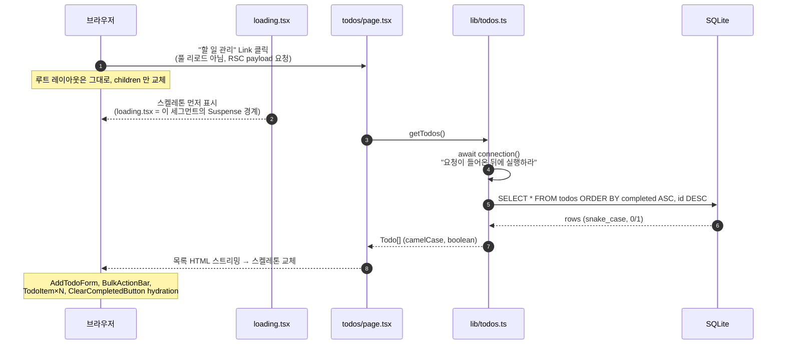
```mermaid
sequenceDiagram
  autonumber
  participant B as 브라우저
  participant Ld as loading.tsx
  participant Pg as todos/page.tsx
  participant T as lib/todos.ts
  participant DB as SQLite

  B->>Pg: "할 일 관리" Link 클릭<br/>(풀 리로드 아님, RSC payload 요청)
  Note over B: 루트 레이아웃은 그대로, children 만 교체
  Ld-->>B: 스켈레톤 먼저 표시<br/>(loading.tsx = 이 세그먼트의 Suspense 경계)
  Pg->>T: getTodos()
  T->>T: await connection()<br/>"요청이 들어온 뒤에 실행하라"
  T->>DB: SELECT * FROM todos ORDER BY completed ASC, id DESC
  DB-->>T: rows (snake_case, 0/1)
  T-->>Pg: Todo[] (camelCase, boolean)
  Pg-->>B: 목록 HTML 스트리밍 → 스켈레톤 교체
  Note over B: AddTodoForm, BulkActionBar,<br/>TodoItem×N, ClearCompletedButton hydration
```

`src/app/todos/page.tsx` 는 `async` 서버 컴포넌트다. `getTodos()` 를 `await` 하고, 남은 개수를 세고, 클라이언트 컴포넌트들에 props 를 넘긴다.

| 클라이언트 컴포넌트 | 받는 props | 하는 일 |
| --- | --- | --- |
| `AddTodoForm` | 없음 | 폼 제출 → `addTodoAction` |
| `BulkActionBar` | 전체 id 배열 | 선택된 항목 일괄 완료/삭제 |
| `TodoItem` | 할 일 하나 | 체크, 인라인 수정, 삭제 |
| `ClearCompletedButton` | 완료 개수 | 완료 항목 일괄 삭제. 0 이면 렌더 안 함 |

### 🚶 흐름 2: 체크박스 클릭 (쓰기)

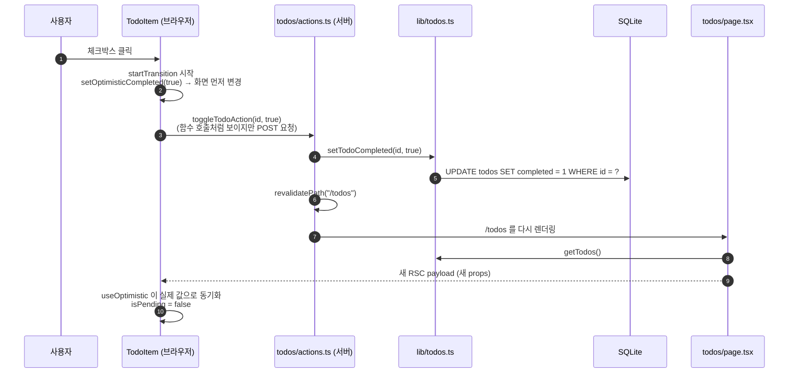
```mermaid
sequenceDiagram
  autonumber
  participant U as 사용자
  participant TI as TodoItem (브라우저)
  participant A as todos/actions.ts (서버)
  participant T as lib/todos.ts
  participant DB as SQLite
  participant Pg as todos/page.tsx

  U->>TI: 체크박스 클릭
  TI->>TI: startTransition 시작<br/>setOptimisticCompleted(true) → 화면 먼저 변경
  TI->>A: toggleTodoAction(id, true)<br/>(함수 호출처럼 보이지만 POST 요청)
  A->>T: setTodoCompleted(id, true)
  T->>DB: UPDATE todos SET completed = 1 WHERE id = ?
  A->>A: revalidatePath("/todos")
  A->>Pg: /todos 를 다시 렌더링
  Pg->>T: getTodos()
  Pg-->>TI: 새 RSC payload (새 props)
  TI->>TI: useOptimistic 이 실제 값으로 동기화<br/>isPending = false
```

핵심 규칙 세 가지.

1. **Server Action 은 파일 맨 위에 `"use server"` 를 쓴 함수다.** 클라이언트 컴포넌트가 import 해서 일반 함수처럼 부르지만, 실제로는 Next.js 가 POST 요청으로 바꿔 서버에서 실행한다. 함수 본문은 브라우저로 가지 않는다.
2. **바꾼 뒤에는 `revalidatePath("/todos")`.** "이 경로를 다음에 볼 때 다시 렌더링하라" 는 뜻이다. 액션이 끝나면 Next.js 가 현재 페이지의 새 RSC payload 를 응답에 실어 보내고, 브라우저는 새로고침 없이 목록을 교체한다.
3. **서버에서 다시 검증한다.** `addTodoAction` 은 `parseTitle` 로 길이를 확인하고, `bulkSetCompletedAction` 은 `parseIds` 로 배열을 확인한다. 브라우저에서 온 값은 무엇이든 조작될 수 있기 때문이다.

### 🚶 흐름 3: 형제끼리 상태 공유 (zustand)

`BulkActionBar` 와 `TodoItem` 들은 `page.tsx`(서버 컴포넌트)가 나란히 렌더링한 **형제** 다. 사이에 공통 클라이언트 부모가 없어서 `useState` 를 끌어올릴 곳이 없다.

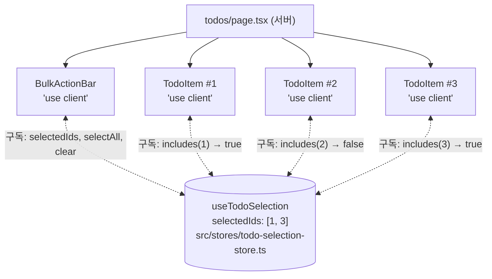
```mermaid
flowchart TB
  Pg["todos/page.tsx (서버)"]
  Pg --> BAR["BulkActionBar<br/>'use client'"]
  Pg --> T1["TodoItem #1<br/>'use client'"]
  Pg --> T2["TodoItem #2<br/>'use client'"]
  Pg --> T3["TodoItem #3<br/>'use client'"]
  ST[("useTodoSelection<br/>selectedIds: [1, 3]<br/>src/stores/todo-selection-store.ts")]
  BAR <-.->|"구독: selectedIds, selectAll, clear"| ST
  T1 <-.->|"구독: includes(1) → true"| ST
  T2 <-.->|"구독: includes(2) → false"| ST
  T3 <-.->|"구독: includes(3) → true"| ST
```

- 스토어에는 **"어떤 id 를 골랐는가"** 만 있다. 할 일 목록 자체(서버 데이터)는 넣지 않는다. 서버 상태와 브라우저 UI 상태의 경계를 지키는 것이 핵심이다.
- `TodoItem` 은 `s.selectedIds.includes(todo.id)` 처럼 **boolean 하나만** 구독한다. 다른 항목의 선택이 바뀌어도 이 컴포넌트는 리렌더되지 않는다.
- `BulkActionBar` 는 객체를 돌려주는 선택자라 `useShallow` 로 감싼다. 안 그러면 매번 새 객체가 만들어져 무한 리렌더가 난다.

### 📄 파일

| 파일 | 종류 | 핵심 |
| --- | --- | --- |
| `src/app/todos/page.tsx` | 서버 | `await getTodos()`. `"use cache"` 없음 → 매 요청 DB 조회 |
| `src/app/todos/loading.tsx` | 서버 | 이 세그먼트를 자동으로 `<Suspense>` 로 감싼다. `connection()` 을 쓰는 페이지에 필수 |
| `src/app/todos/actions.ts` | `"use server"` | 추가·토글·수정·삭제·일괄 처리. 전부 끝에 `revalidatePath("/todos")` |
| `src/app/todos/add-todo-form.tsx` | 클라이언트 | `useActionState` 로 폼 ↔ 액션 연결. 성공 시 `formRef.reset()` + 토스트 |
| `src/app/todos/todo-item.tsx` | 클라이언트 | `useOptimistic`, `useTransition`, `useState(editing)`, zustand 구독 |
| `src/app/todos/bulk-action-bar.tsx` | 클라이언트 | `useShallow` 선택자, 일괄 액션 |
| `src/lib/todos.ts` | 서버 전용 | SQL 전부. `getTodos` 만 `connection()` 을 부른다 |
| `src/stores/todo-selection-store.ts` | 모듈 싱글턴 | `create<State>()((set) => ({...}))` |
| `src/app/api/todos/route.ts` | Route Handler | `GET /api/todos` → JSON. "Route Handler 가 무엇인지" 보는 최소 예 |

### 💡 개념

**`await connection()` 이 왜 필요한가.** `npm run build` 때 Next.js 는 모든 페이지를 한 번 실행해 보고 미리 만들 수 있으면 HTML 로 굳힌다. "요청마다 새로 만들어야 한다" 는 판단은 쿠키나 `searchParams` 를 읽는지로 한다. 그런데 `db.prepare().all()` 은 동기 함수라 Next.js 눈에는 `JSON.parse` 같은 "언제 실행해도 같은 계산" 으로 보인다. `connection()` 이 없으면 빌드 시점의 목록이 HTML 에 박혀 DB 가 바뀌어도 화면이 안 바뀐다. `connection()` 은 "이 아래는 실제 요청이 온 뒤에 실행하라" 는 신호다. 실험: 이 줄을 지우고 빌드하면 `/todos` 가 `○ Static` 이 된다.

**React 19 폼 훅 세 가지.**

| 훅 | 돌려주는 것 | 이 앱에서 |
| --- | --- | --- |
| `useActionState(action, 초기값)` | `[state, formAction, pending]` | `<form action={formAction}>` 에 연결. 서버가 돌려준 에러를 `state` 로 받는다 |
| `useTransition()` | `[isPending, startTransition]` | 버튼 클릭에서 액션을 감싸 진행 중 표시 |
| `useOptimistic(실제값)` | `[낙관값, set낙관값]` | 서버 응답 전에 화면 먼저 바꾸고, 새 props 가 오면 자동 동기화 |

**점진적 향상.** `AddTodoForm` 은 `<form action={...}>` 이라 JS 가 꺼져 있어도 브라우저가 폼을 POST 로 제출하고 서버가 처리한다. JS 가 있으면 새로고침 없이 같은 일이 일어난다.

### 🔍 터미널에서 보기

```
[render]  TodosPage → getTodos() 호출
[render]  getTodos() — connection() 통과 → 요청 시점 실행 (SSR). 캐시 없이 매번 DB 조회
[render]  TodosPage ← 7건. "use cache" 가 아니라 revalidatePath 로 갱신되는 페이지

(체크박스 클릭)
[action]  toggleTodoAction(id=3, completed=true)
[action]    ↳ revalidatePath "/todos" — 경로 단위 → 다음에 그 경로를 방문할 때 페이지를 다시 렌더링
[render]  TodosPage → getTodos() 호출
```

---

## 4장. 글 목록: 캐시가 들어온다 (`/posts`)

3장의 `/todos` 는 매 요청 DB 를 읽었다. 글 목록은 **`"use cache"`** 로 결과를 보관해 두고 재사용한다. 대신 "언제 캐시를 버릴 것인가" 라는 새 문제가 생긴다.

### 🚶 흐름 1: 목록 요청

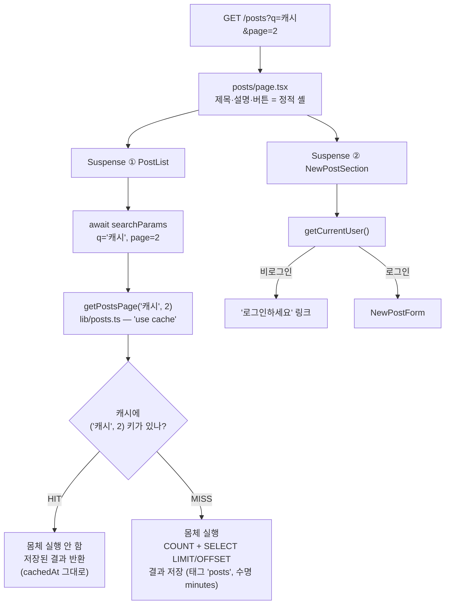
```mermaid
flowchart TB
  B["GET /posts?q=캐시&page=2"] --> Pg["posts/page.tsx<br/>제목·설명·버튼 = 정적 셸"]
  Pg --> S1["Suspense ① PostList"]
  Pg --> S2["Suspense ② NewPostSection"]
  S1 --> SP["await searchParams<br/>q='캐시', page=2"]
  SP --> GP["getPostsPage('캐시', 2)<br/>lib/posts.ts — 'use cache'"]
  GP --> K{"캐시에<br/>('캐시', 2) 키가 있나?"}
  K -->|"HIT"| R1["몸체 실행 안 함<br/>저장된 결과 반환<br/>(cachedAt 그대로)"]
  K -->|"MISS"| R2["몸체 실행<br/>COUNT + SELECT LIMIT/OFFSET<br/>결과 저장 (태그 'posts', 수명 minutes)"]
  S2 --> GU["getCurrentUser()"]
  GU -->|"비로그인"| NF1["'로그인하세요' 링크"]
  GU -->|"로그인"| NF2["NewPostForm"]
```

`src/app/posts/page.tsx` 는 세 부분으로 나뉜다.

| 부분 | 무엇을 읽나 | 어디에 있나 | 이유 |
| --- | --- | --- | --- |
| 제목, 설명, 캐시 버튼 | 아무것도 | Suspense 밖 | 정적 셸에 들어간다 |
| `PostList` | `searchParams` | Suspense ① | 요청 시점 값이라 셸에 못 들어간다 |
| `NewPostSection` | 세션 쿠키 | Suspense ② | 마찬가지 |

`PostList` 는 `searchParams` 에서 `q` 와 `page` 를 꺼낸 **뒤** `getPostsPage(query, page)` 에 **인자로** 넘긴다. `"use cache"` 함수 안에서는 `searchParams` 나 `cookies()` 를 읽을 수 없기 때문이다.

### 🚶 흐름 2: 검색창에 타이핑

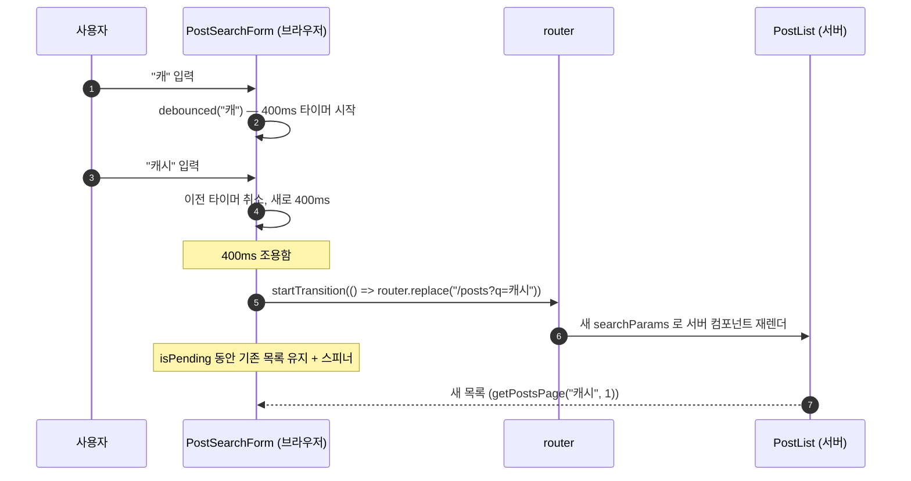
```mermaid
sequenceDiagram
  autonumber
  participant U as 사용자
  participant F as PostSearchForm (브라우저)
  participant R as router
  participant PL as PostList (서버)

  U->>F: "캐" 입력
  F->>F: debounced("캐") — 400ms 타이머 시작
  U->>F: "캐시" 입력
  F->>F: 이전 타이머 취소, 새로 400ms
  Note over F: 400ms 조용함
  F->>R: startTransition(() => router.replace("/posts?q=캐시"))
  R->>PL: 새 searchParams 로 서버 컴포넌트 재렌더
  Note over F: isPending 동안 기존 목록 유지 + 스피너
  PL-->>F: 새 목록 (getPostsPage("캐시", 1))
```

- 검색은 **서버** 가 한다. 브라우저는 URL 만 바꾼다. 그래서 새로고침하거나 링크를 공유해도 같은 결과가 나온다.
- `router.replace` 라서 키 입력마다 히스토리가 쌓이지 않는다.
- `useTransition` 으로 감싸서 이동 중에 Suspense fallback 으로 깜빡이지 않는다.
- `<form method="get">` 이라 JS 가 없어도 동작한다.

### 🚶 흐름 3: 캐시 무효화 두 가지

글이 바뀌면 캐시를 버려야 한다. 방법이 두 가지이고, 화면의 버튼 두 개로 차이를 볼 수 있다.

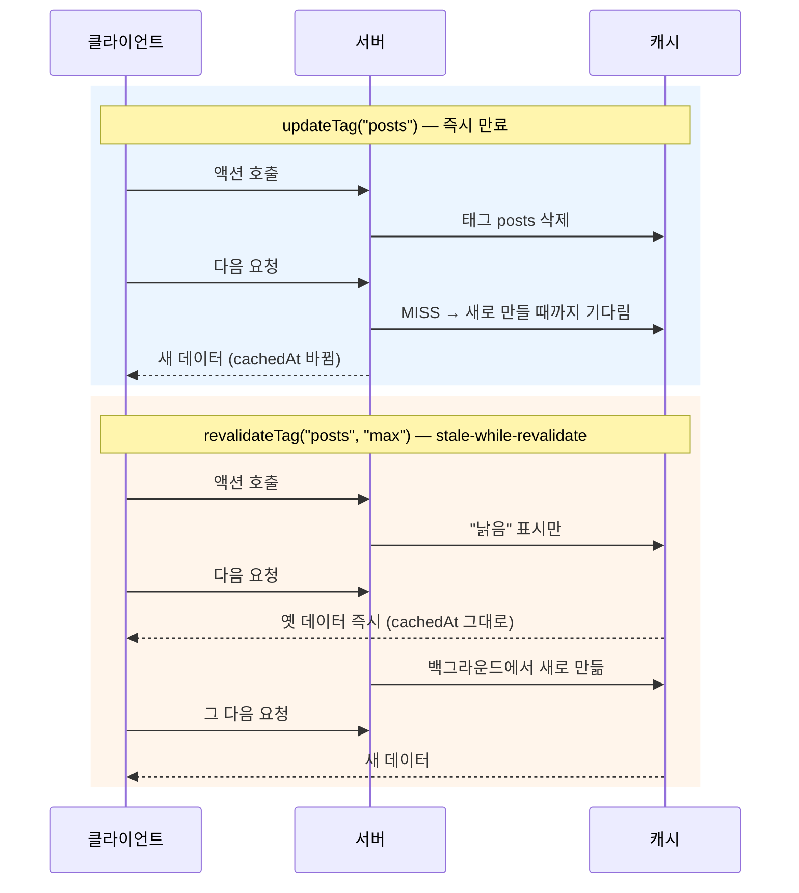
```mermaid
sequenceDiagram
  participant C as 클라이언트
  participant S as 서버
  participant K as 캐시

  rect rgb(235, 245, 255)
    Note over C,K: updateTag("posts") — 즉시 만료
    C->>S: 액션 호출
    S->>K: 태그 posts 삭제
    C->>S: 다음 요청
    S->>K: MISS → 새로 만들 때까지 기다림
    S-->>C: 새 데이터 (cachedAt 바뀜)
  end

  rect rgb(255, 245, 235)
    Note over C,K: revalidateTag("posts", "max") — stale-while-revalidate
    C->>S: 액션 호출
    S->>K: "낡음" 표시만
    C->>S: 다음 요청
    K-->>C: 옛 데이터 즉시 (cachedAt 그대로)
    S->>K: 백그라운드에서 새로 만듦
    C->>S: 그 다음 요청
    K-->>C: 새 데이터
  end
```

| 함수 | 다음 요청이 겪는 일 | 언제 쓰나 | 이 앱에서 |
| --- | --- | --- | --- |
| `updateTag(tag)` | 새 데이터가 만들어질 때까지 기다렸다가 받음 (read-your-own-writes) | "내가 방금 쓴 글이 바로 보여야" 할 때 | 글 작성·수정·삭제, 댓글 |
| `revalidateTag(tag, "max")` | 옛 데이터를 받고, 뒤에서 새로 만듦. 그 다음 요청부터 새 값 | 약간 늦어도 되고 응답 속도가 중요할 때 | "백그라운드 갱신" 버튼 |
| `revalidateTag(tag, { expire: 0 })` | 옛 값을 주지 않고 바로 새로 만듦 | Route Handler 에서 (`updateTag` 를 못 쓰므로) | 공개 API (10장) |
| `revalidatePath(path)` | 그 경로를 다음에 볼 때 페이지 전체 재렌더 | `"use cache"` 를 안 쓴 페이지 | `/todos` |

### 📄 파일

| 파일 | 핵심 |
| --- | --- |
| `src/lib/posts.ts` | `getPostsPage(query, page)` — `"use cache"`, `cacheLife("minutes")`, `cacheTag("posts")`. 인자가 캐시 키가 되어 "검색어 × 페이지" 조합마다 별도 엔트리 |
| `src/app/posts/page.tsx` | `PostList` 와 `NewPostSection` 을 각각 Suspense 로 |
| `src/app/posts/post-search-form.tsx` | 디바운스 → `router.replace`. 비제어 입력(`defaultValue`) |
| `src/hooks/use-debounced-callback.ts` | 타이머 취소/재설정, 언마운트 시 취소, 최신 콜백을 ref 로 보관 |
| `src/app/posts/cache-controls.tsx` | `updateTag` 버튼과 `revalidateTag` 버튼 |
| `src/app/posts/actions.ts` | `refreshPostsNowAction`, `refreshPostsInBackgroundAction` (데이터는 안 바꾸고 캐시만) |
| `src/app/posts/layout.tsx` | `/posts` 와 `/posts/[id]` 공통. `modal` 슬롯을 받는다 (5장) |

### 💡 개념

**`"use cache"` 함수의 규칙.**

```
export async function getPostsPage(query, page) {
  "use cache";                 // 1. 함수 첫 줄
  cacheLife("minutes");        // 2. 얼마나 오래 (프리셋: seconds, minutes, hours, days, max)
  cacheTag("posts");           // 3. 나중에 무효화할 때 부를 이름
  ...                          // 4. 인자(query, page)가 캐시 키. 안에서 cookies()/searchParams 못 읽음
}
```

**ISR.** 미리 만들어 두되(Static) 일정 시간이 지나거나 태그로 지우면 다시 만드는(Regeneration) 방식. Cache Components 에서는 "`"use cache"` + `cacheLife` + 태그 무효화" 가 곧 ISR 이다. README "렌더링 방식 개념" 참고.

**캐시된 값은 모두가 공유한다.** 그래서 캐시 함수 안에서 "현재 사용자" 를 읽으면 안 된다. A 가 만든 캐시를 B 가 받게 된다. 사용자별 정보는 캐시 밖(Suspense 안의 서버 컴포넌트)에서 읽어서 합친다. 7장 댓글에서 이 패턴을 본다.

### 🔍 터미널에서 보기

```
[render]  PostList → getPostsPage(query="", page=1) 호출 (Suspense 안, searchParams 읽은 뒤)
[cache]   MISS(실행 시각 10:00:01.234) getPostsPage(query="", page=1) — 몸체 실행, DB 조회 2번 (COUNT + SELECT)
[render]  PostList ← 12건, cachedAt=2026-09-15T01:00:01.234Z

(새로고침 — HIT)
[render]  PostList → getPostsPage(query="", page=1) 호출
[ Cache ] 10:00:01.234 [cache] MISS(...)     ← 개발 모드가 예전 로그를 "재생" 한 것. 시각이 과거면 HIT
[render]  PostList ← 12건, cachedAt=2026-09-15T01:00:01.234Z   ← 시각이 그대로
```

HIT 과 MISS 를 구분하는 법: `[ Cache ]` 접두어가 아니라 **로그 안의 시각** 을 본다. `[render]` 보다 과거면 HIT, 같으면 MISS.

---

## 5장. 글 상세: 동적 라우트와 스트리밍 (`/posts/3`)

### 🚶 흐름 1: 어느 파일이 뜨는가

같은 URL `/posts/3` 인데 **어떻게 도착했느냐** 에 따라 다른 파일이 렌더된다.

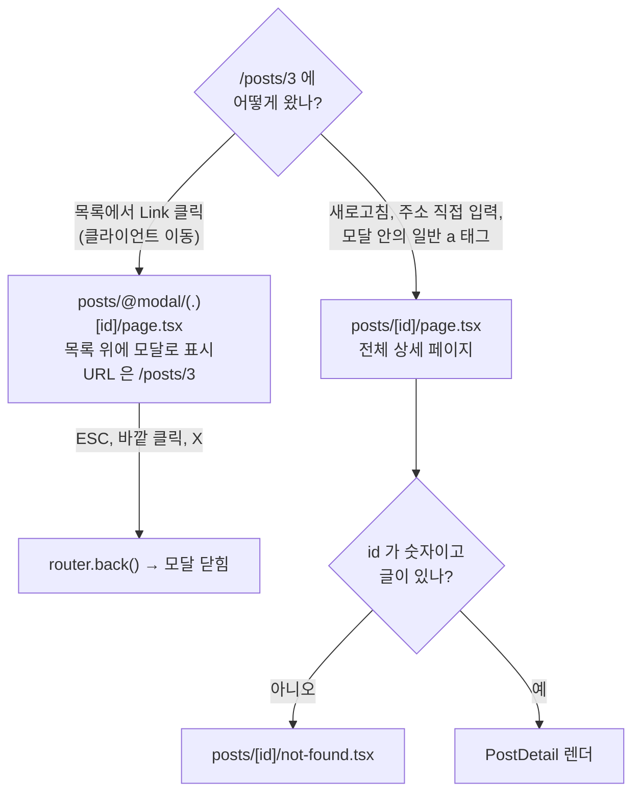
```mermaid
flowchart TB
  A{"/posts/3 에<br/>어떻게 왔나?"}
  A -->|"목록에서 Link 클릭<br/>(클라이언트 이동)"| M["posts/@modal/(.)[id]/page.tsx<br/>목록 위에 모달로 표시<br/>URL 은 /posts/3"]
  A -->|"새로고침, 주소 직접 입력,<br/>모달 안의 일반 a 태그"| F["posts/[id]/page.tsx<br/>전체 상세 페이지"]
  M -->|"ESC, 바깥 클릭, X"| BK["router.back() → 모달 닫힘"]
  F --> NF{"id 가 숫자이고<br/>글이 있나?"}
  NF -->|"아니오"| N["posts/[id]/not-found.tsx"]
  NF -->|"예"| D["PostDetail 렌더"]
```

- `@modal` 폴더는 **병렬 라우트 슬롯** 이다. `posts/layout.tsx` 가 `children` 과 `modal` 을 둘 다 받아 나란히 그린다.
- `(.)[id]` 는 **인터셉팅 라우트** 다. `(.)` 는 "같은 레벨" 을 뜻하고, 클라이언트 이동으로 `/posts/[id]` 에 가면 원래 페이지 대신 이 파일이 슬롯에 들어간다.
- `@modal/default.tsx` 가 `null` 을 돌려주므로 평소에는 모달이 없다. 이 파일이 없으면 404 가 난다.
- 모달 닫기는 `router.back()` 이다. 모달을 연 것이 곧 URL 이동이었으니 뒤로 가면 닫힌다. 브라우저 뒤로/앞으로 버튼과도 맞물린다.

### 🚶 흐름 2: 전체 페이지의 스트리밍 순서

`src/app/posts/[id]/page.tsx` 는 Suspense 를 **네 겹** 쓴다. 각 영역이 독립적으로 도착한다.

```
시간 →  0ms         ~50ms              ~100ms             ~1600ms
        │           │                  │                  │
셸      ████████████████████████████████████████████████████████  (레이아웃, 네비, 스켈레톤)
본문    ░░░░░░░░░░░░████████████████████████████████████████████  PostDetail: getPost(3) — 캐시 HIT 이면 거의 즉시
버튼    ░░░░░░░░░░░░░░░░░░░░░░░░░░████████████████████████████████  PostOwnerActions: 세션 읽기 (요청마다)
댓글    ░░░░░░░░░░░░░░░░░░░░░░░░░░████████████████████████████████  CommentsSection: 캐시 + 세션
다른글  ░░░░░░░░░░░░░░░░░░░░░░░░░░░░░░░░░░░░░░░░░░░░░░░░░░░░░░████  OtherPosts: connection() + 1.5초 지연
        ░ = fallback(스켈레톤) 표시 중     █ = 실제 내용 도착
```

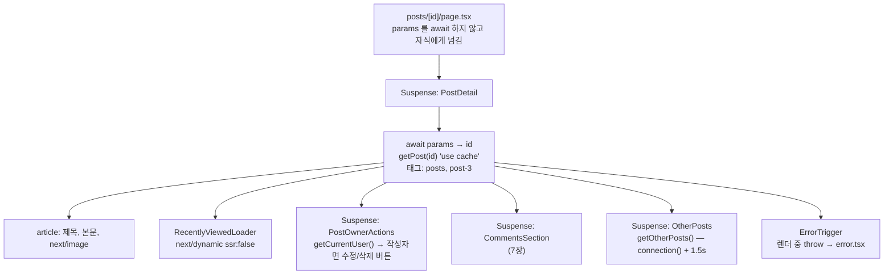
```mermaid
flowchart TB
  Pg["posts/[id]/page.tsx<br/>params 를 await 하지 않고 자식에게 넘김"]
  Pg --> S0["Suspense: PostDetail"]
  S0 --> PD["await params → id<br/>getPost(id) 'use cache'<br/>태그: posts, post-3"]
  PD --> ART["article: 제목, 본문, next/image"]
  PD --> RV["RecentlyViewedLoader<br/>next/dynamic ssr:false"]
  PD --> S1["Suspense: PostOwnerActions<br/>getCurrentUser() → 작성자면 수정/삭제 버튼"]
  PD --> S2["Suspense: CommentsSection<br/>(7장)"]
  PD --> S3["Suspense: OtherPosts<br/>getOtherPosts() — connection() + 1.5s"]
  PD --> ET["ErrorTrigger<br/>렌더 중 throw → error.tsx"]
```

왜 이렇게 나누나. 글 본문은 캐시라 빠르고 모두에게 같다. 수정/삭제 버튼은 "내 글인가" 를 알아야 하므로 요청마다 세션을 읽는다. 둘을 한 컴포넌트에 두면 빠른 본문이 느린 세션 확인을 기다리게 된다. Suspense 로 나누면 각자 준비되는 대로 나간다.

### 🚶 흐름 3: 특수 파일이 끼어드는 순간

| 상황 | 무슨 일이 | 어느 파일 |
| --- | --- | --- |
| 목록에서 상세로 이동, 아직 서버 응답 전 | 스켈레톤 표시 | `posts/[id]/loading.tsx` — 페이지를 자동으로 Suspense 로 감쌈 |
| `/posts/9999` 또는 `/posts/abc` | `notFound()` 호출 | `posts/[id]/not-found.tsx` |
| "에러 발생시키기" 버튼 | 렌더 중 `throw` | `posts/error.tsx` — 가장 가까운 Error Boundary. `retry()` 로 복구 |
| `/p/3` | `permanentRedirect` | `p/[id]/page.tsx` — Suspense **밖** 에서 호출해야 진짜 HTTP 308 |
| `/blog/3`, `/articles`, `/posts/feed` | 경로 패턴 리다이렉트 | `next.config.ts` 의 `redirects()` — 라우트보다 먼저 검사 |

렌더링 순서: `layout` > `template` > `error` > `loading` > `not-found` > `page`.

### 📄 파일

| 파일 | 핵심 |
| --- | --- |
| `src/app/posts/[id]/page.tsx` | `generateStaticParams` 로 최신 2개는 빌드 시 미리 렌더. `params` 는 Promise, Suspense 안에서 `await` |
| `src/app/posts/[id]/edit/page.tsx` | `requireUser()` → 남의 글이면 상세로 `redirect`. `updatePostAction.bind(null, id)` |
| `src/app/posts/[id]/post-owner-actions.tsx` | 서버 컴포넌트. 세션 읽고 작성자만 버튼 |
| `src/app/posts/[id]/other-posts.tsx` | 스트리밍 데모. 1.5초 지연 |
| `src/app/posts/[id]/recently-viewed-loader.tsx` | `dynamic(() => import(...), { ssr: false })`. 서버 HTML 에 없고 별도 청크 |
| `src/app/posts/[id]/recently-viewed.tsx` | zustand persist 스토어에 기록·표시. `hydrated` 가 true 인 뒤에만 |
| `src/app/posts/@modal/(.)[id]/page.tsx` | 인터셉팅 라우트. `RouteModal` 안에 내용 |
| `src/components/modal.tsx` | `Dialog` + `router.back()` |
| `src/lib/posts.ts` | `getPost(id)` — `"use cache"`, `cacheLife("hours")`, 태그 `posts` 와 `post-${id}` 둘 다 |

### 💡 개념

**동적 라우트 `[id]`.** 폴더 이름을 대괄호로 감싸면 그 자리에 무엇이 와도 매칭된다. 값은 `params` 로 온다. Next.js 16 에서 `params` 는 **Promise** 라 `await` 해야 한다.

**`generateStaticParams`.** "빌드 때 미리 만들 id 목록" 을 돌려준다. 여기 없는 id 는 첫 요청 때 만들어지고, `getPost` 가 `"use cache"` 라 결과가 캐시된다. Cache Components 에서는 최소 1개를 돌려줘야 해서 DB 가 비었으면 `[{ id: "0" }]` 자리표시자를 준다.

**태그를 두 개 다는 이유.** `getPost(3)` 은 `posts` 와 `post-3` 두 태그를 단다. 글 하나만 바뀌면 `post-3` 만 지우고, 목록에도 영향이 있으면(제목 변경) `posts` 도 지운다.

**`next/dynamic` 과 `ssr: false`.** localStorage 를 쓰는 컴포넌트는 서버에서 렌더할 수 없다. `ssr: false` 로 로드하면 서버 HTML 에는 빈 자리만 있고, 브라우저가 hydration 뒤에 별도 JS 청크를 받아 그린다. 이 옵션은 클라이언트 컴포넌트 안에서만 쓸 수 있어서 얇은 로더 파일을 거친다.

### 🔍 터미널에서 보기

```
[render]  generateMetadata(/posts/3) → getPost 호출. 아래 PostDetail 도 같은 인자로 부르지만 캐시 키가 같아 몸체는 한 번만 실행된다
[render]  PostDetail → getPost(3) 호출 (params 를 읽으므로 Suspense 안)
[cache]   MISS(...) getPost(3) — 몸체 실행, DB 조회. 태그: posts, post-3
[render]  PostDetail ← "Cache Components 란?". 이어서 PostOwnerActions / CommentsSection / OtherPosts 가 각자 Suspense 안에서 스트리밍
[session] getCurrentUser() → ...
[render]  CommentsSection(postId=3) → ...
[render]  getOtherPosts(excludeId=3) — connection() 통과 → 요청 시점 실행 (캐시 없음). 1.5초 지연 시작
[render]  OtherPosts(excludeId=3) ← 5건. 1.5초 뒤 도착 → 이 부분만 스트리밍으로 교체됨
```

목록에서 Link 로 들어왔다면 `PostDetail` 대신 `ModalContent(인터셉팅 라우트)` 가 찍힌다.

---

## 6장. 인증: 누구인지 확인하기

지금까지는 비로그인 상태로 다녔다. 이 장에서 로그인이 일어나고, 그 뒤 **모든 요청** 에 인증이 어떻게 스며드는지 본다.

### 🚶 흐름 1: 회원 가입과 로그인

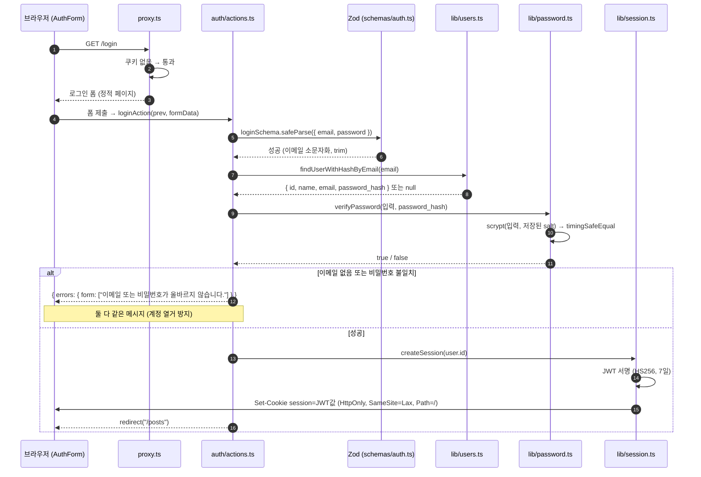
```mermaid
sequenceDiagram
  autonumber
  participant B as 브라우저 (AuthForm)
  participant P as proxy.ts
  participant A as auth/actions.ts
  participant Z as Zod (schemas/auth.ts)
  participant U as lib/users.ts
  participant PW as lib/password.ts
  participant S as lib/session.ts

  B->>P: GET /login
  P->>P: 쿠키 없음 → 통과
  P-->>B: 로그인 폼 (정적 페이지)
  B->>A: 폼 제출 → loginAction(prev, formData)
  A->>Z: loginSchema.safeParse({ email, password })
  Z-->>A: 성공 (이메일 소문자화, trim)
  A->>U: findUserWithHashByEmail(email)
  U-->>A: { id, name, email, password_hash } 또는 null
  A->>PW: verifyPassword(입력, password_hash)
  PW->>PW: scrypt(입력, 저장된 salt) → timingSafeEqual
  PW-->>A: true / false
  alt 이메일 없음 또는 비밀번호 불일치
    A-->>B: { errors: { form: ["이메일 또는 비밀번호가 올바르지 않습니다."] } }
    Note over A,B: 둘 다 같은 메시지 (계정 열거 방지)
  else 성공
    A->>S: createSession(user.id)
    S->>S: JWT 서명 (HS256, 7일)
    S->>B: Set-Cookie session=JWT값 (HttpOnly, SameSite=Lax, Path=/)
    A-->>B: redirect("/posts")
  end
```

회원 가입은 여기에 "중복 이메일 확인" 과 "`hashPassword` 로 해시 저장" 이 추가된다. 로그아웃은 `deleteSession()` 으로 쿠키를 지우고 `/` 로 보낸다.

### 🚶 흐름 2: 로그인 뒤의 모든 요청

세션 쿠키가 생기면 이후 요청마다 브라우저가 자동으로 붙인다. 서버는 그 쿠키를 **세 층에서 각각** 본다.

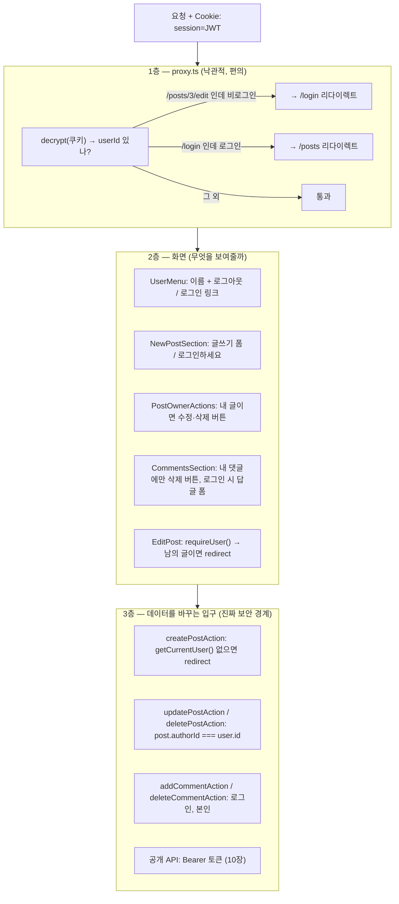
```mermaid
flowchart TB
  REQ["요청 + Cookie: session=JWT"]

  subgraph L1["1층 — proxy.ts (낙관적, 편의)"]
    P1["decrypt(쿠키) → userId 있나?"]
    P1 -->|"/posts/3/edit 인데 비로그인"| R1["→ /login 리다이렉트"]
    P1 -->|"/login 인데 로그인"| R2["→ /posts 리다이렉트"]
    P1 -->|"그 외"| PASS["통과"]
  end

  subgraph L2["2층 — 화면 (무엇을 보여줄까)"]
    U1["UserMenu: 이름 + 로그아웃 / 로그인 링크"]
    U2["NewPostSection: 글쓰기 폼 / 로그인하세요"]
    U3["PostOwnerActions: 내 글이면 수정·삭제 버튼"]
    U4["CommentsSection: 내 댓글에만 삭제 버튼, 로그인 시 답글 폼"]
    U5["EditPost: requireUser() → 남의 글이면 redirect"]
  end

  subgraph L3["3층 — 데이터를 바꾸는 입구 (진짜 보안 경계)"]
    A1["createPostAction: getCurrentUser() 없으면 redirect"]
    A2["updatePostAction / deletePostAction: post.authorId === user.id"]
    A3["addCommentAction / deleteCommentAction: 로그인, 본인"]
    A4["공개 API: Bearer 토큰 (10장)"]
  end

  REQ --> L1 --> L2 --> L3
```

| 층 | 무엇을 보나 | DB 조회 | 뚫리면 |
| --- | --- | --- | --- |
| proxy | 쿠키 서명만 | 없음 | 아무 일 없음. 화면과 액션이 다시 검사한다 |
| 화면 | `getCurrentUser()` | 있음 (요청당 1회) | 버튼이 보일 뿐. 액션이 다시 검사한다 |
| 액션/API | `getCurrentUser()` + 소유자 비교 | 있음 | **여기가 뚫리면 데이터가 바뀐다.** 그래서 모든 입구가 각자 검사 |

**왜 세 번이나 검사하나.** Server Action 은 브라우저에서 직접 POST 로 호출할 수 있다. 화면에서 버튼을 숨겨도 `fetch` 로 액션을 부르면 실행된다. 그래서 "데이터에 가장 가까운 곳" 에서 다시 확인해야 한다. proxy 와 화면의 검사는 사용자 경험을 위한 것이고, 액션의 검사가 보안이다.

### 🚶 흐름 3: 인증이 녹아 있는 곳 전체 목록

| 어디 | 파일 | 무엇을 하나 | 실패 시 |
| --- | --- | --- | --- |
| 프록시 | `src/proxy.ts` | `/posts/:id/edit` 비로그인 → `/login?next=...`. 로그인 상태로 `/login`, `/signup` → `/posts` | 리다이렉트 |
| 헤더 | `src/components/user-menu.tsx` | 이름 표시, 로그아웃 폼 | 로그인/가입 링크 |
| 글 목록 | `src/app/posts/page.tsx` `NewPostSection` | 로그인 시 글쓰기 폼 | "로그인하세요" |
| 글 상세 | `src/app/posts/[id]/post-owner-actions.tsx` | 작성자면 수정·삭제 버튼 | 안내 문구 |
| 글 수정 페이지 | `src/app/posts/[id]/edit/page.tsx` | `requireUser()`, 작성자 비교 | `/login` 또는 상세로 redirect |
| 댓글 영역 | `src/app/posts/[id]/comments-section.tsx` | 내 댓글에 삭제 버튼, 로그인 시 폼 | "로그인하세요" |
| 글 액션 | `src/app/posts/actions.ts` | 작성: 로그인. 수정·삭제: 작성자 | `redirect("/login")` 또는 에러 객체 |
| 댓글 액션 | 같은 파일 | 작성: 로그인. 삭제: 작성자 | 에러 객체 |
| 공개 API | `src/lib/api/auth.ts` | Bearer 토큰 → `Principal` | 401 / 403 JSON |
| 할 일 | `src/app/todos/actions.ts` | **검사 없음** | 할 일은 모두가 공유하는 목록이라 소유자 개념이 없다 |

### 📄 파일

| 파일 | 핵심 |
| --- | --- |
| `src/app/(auth)/auth-form.tsx` | 로그인/가입 공용 폼. `mode` 에 따라 액션이 다름. `useActionState` 로 필드별 에러 표시 |
| `src/app/(auth)/actions.ts` | `signupAction`, `loginAction`, `logoutAction`. 검증 → 조회 → 해시 → 세션 → redirect |
| `src/lib/schemas/auth.ts` | Zod: 이름 2~30자, 이메일 형식+소문자, 비밀번호 8~72자 |
| `src/lib/password.ts` | `scrypt` + 사용자별 랜덤 salt. `"salt:hash"` 로 저장. `timingSafeEqual` 로 비교 |
| `src/lib/session.ts` | `jose` 로 JWT 서명/검증. 쿠키 이름 `session`, 7일, `httpOnly`, `sameSite: lax` |
| `src/lib/dal.ts` | `getCurrentUser()` (react `cache`), `requireUser()` (없으면 `/login`) |
| `src/lib/users.ts` | `findUserById` 는 해시 없이, `findUserWithHashByEmail` 은 해시 포함 (밖으로 내보내면 안 됨) |

### 💡 개념

**비밀번호는 저장하지 않는다.** 저장하는 것은 `scrypt(비밀번호, salt)` 결과다. scrypt 는 일부러 느린 해시라 무차별 대입이 비싸고, salt 가 사용자마다 달라 같은 비밀번호도 다른 해시가 된다. 검증은 "입력을 같은 salt 로 해시해서 저장값과 비교" 다.

**세션은 서명된 JWT 쿠키다 (stateless).** 서버 DB 에 세션 테이블이 없다. 쿠키 안에 `{ userId, iat, exp }` 를 넣고 `SESSION_SECRET` 으로 서명한다. 브라우저가 내용을 바꾸면 서명이 안 맞아 검증에 실패한다.

```
JWT = base64(헤더) . base64({ userId: 1, iat, exp }) . HMAC-SHA256(앞 두 부분, SESSION_SECRET)
                      ↑ 누구나 읽을 수 있다 (비밀 넣지 말 것)    ↑ 서버만 만들 수 있다
```

쿠키 옵션의 뜻:

| 옵션 | 막는 것 |
| --- | --- |
| `httpOnly` | `document.cookie` 로 못 읽는다 → XSS 로 탈취 방지 |
| `sameSite: lax` | 다른 사이트에서 보내는 POST 에는 안 붙는다 → CSRF 완화 |
| `secure` (프로덕션) | https 에서만 전송 |

**react `cache()`.** `getCurrentUser` 는 한 요청 안에서 `UserMenu`, `NewPostSection`, `PostOwnerActions`, `CommentsSection` 이 각각 부른다. `cache()` 로 감싸 두면 첫 호출만 실제로 실행되고 나머지는 같은 결과를 받는다. 로그가 한 번만 찍히는 이유다.

**Cache Components 에서 세션 다루기.** 두 규칙이 충돌한다.

1. `cookies()` 를 읽는 컴포넌트는 Suspense 안에 있어야 한다 (정적 셸에 못 들어감).
2. `"use cache"` 함수 안에서는 `cookies()` 를 읽을 수 없다 (모두가 공유하는 값이므로).

해법: **데이터는 캐시하고, 사용자는 밖에서 읽고, 화면에서 합친다.** 7장 댓글이 정확히 이 모양이다.

**계정 열거 방지.** 로그인 실패 시 "이메일 없음" 과 "비밀번호 틀림" 을 구분해 알려 주면 가입된 이메일 목록을 만드는 데 쓰인다. 그래서 같은 메시지를 준다. `timingSafeEqual` 도 같은 맥락이다. 비교 시간이 일정해서 "몇 글자까지 맞았는지" 가 응답 시간으로 새지 않는다.

### 🔍 터미널에서 보기

```
[proxy]   GET /login → 쿠키만 확인: 비로그인 (DB 조회 없음, 보안 경계 아님)
[proxy]     ↳ 통과 → 라우트 렌더링으로
[action]  loginAction 시작
[action]    ↳ 성공: userId=1 → 세션 발급 → redirect(/posts)
[session] createSession(userId=1) → JWT 서명 → httpOnly 쿠키 "session" 설정 (7일)

(다음 요청부터)
[session] getCurrentUser() → userId=1 (데모). react cache(): 같은 요청 안에서는 이 로그가 한 번만 찍힌다
[render]  UserMenu ← 데모
[render]  NewPostSection ← 로그인 데모 (쿠키를 읽으므로 정적 셸 밖, Suspense 안)
```

---

## 7장. 댓글: 캐시와 사용자별 정보 합치기

### 🚶 흐름 1: 댓글 영역 렌더

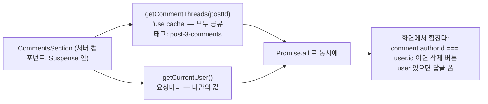
```mermaid
flowchart LR
  CS["CommentsSection (서버 컴포넌트, Suspense 안)"]
  CS --> A["getCommentThreads(postId)<br/>'use cache' — 모두 공유<br/>태그: post-3-comments"]
  CS --> B["getCurrentUser()<br/>요청마다 — 나만의 값"]
  A --> M["Promise.all 로 동시에"]
  B --> M
  M --> V["화면에서 합친다:<br/>comment.authorId === user.id 이면 삭제 버튼<br/>user 있으면 답글 폼"]
```

- 댓글 목록은 캐시된다. 누가 보든 같은 목록이니까.
- "내 댓글인가" 는 캐시 안에서 판단할 수 없다. 사용자마다 다르니까.
- 그래서 두 값을 따로 가져와 **렌더링 시점에** 합친다. 6장의 규칙을 실제로 적용한 예다.

### 🚶 흐름 2: 댓글 작성

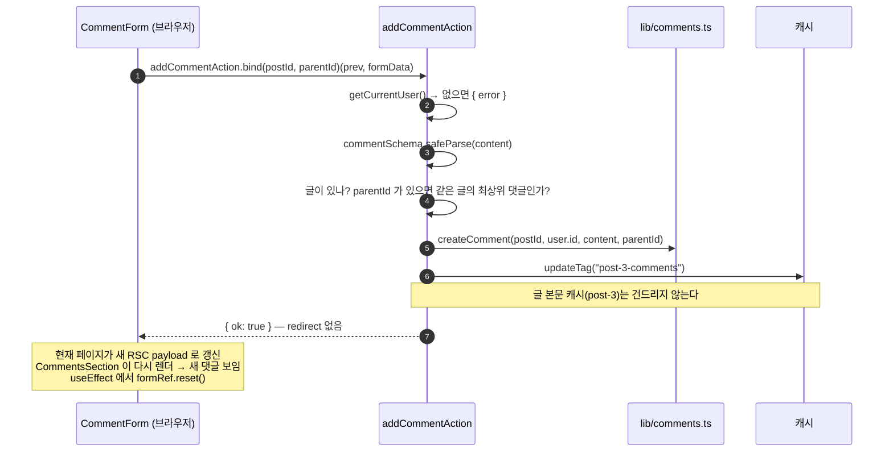
```mermaid
sequenceDiagram
  autonumber
  participant B as CommentForm (브라우저)
  participant A as addCommentAction
  participant C as lib/comments.ts
  participant K as 캐시

  B->>A: addCommentAction.bind(postId, parentId)(prev, formData)
  A->>A: getCurrentUser() → 없으면 { error }
  A->>A: commentSchema.safeParse(content)
  A->>A: 글이 있나? parentId 가 있으면 같은 글의 최상위 댓글인가?
  A->>C: createComment(postId, user.id, content, parentId)
  A->>K: updateTag("post-3-comments")
  Note over A,K: 글 본문 캐시(post-3)는 건드리지 않는다
  A-->>B: { ok: true } — redirect 없음
  Note over B: 현재 페이지가 새 RSC payload 로 갱신<br/>CommentsSection 이 다시 렌더 → 새 댓글 보임<br/>useEffect 에서 formRef.reset()
```

- `bind` 로 `postId` 와 `parentId` 를 미리 묶어 두면 폼은 `(prev, formData)` 만 넘기면 된다.
- 2단 제한: 부모가 (1) 존재하고 (2) 같은 글이고 (3) 그 자신이 최상위여야 한다. 답글의 답글은 막힌다.
- 삭제는 본인만. 최상위 댓글을 지우면 답글도 함께 지워진다 (스키마의 `ON DELETE CASCADE`).

### 📄 파일

| 파일 | 핵심 |
| --- | --- |
| `src/lib/comments.ts` | `getCommentThreads` — 한 번의 JOIN 쿼리로 평탄한 목록을 받아 `Map` 으로 트리 조립. `commentsTag(postId)` |
| `src/app/posts/[id]/comments-section.tsx` | `Promise.all([캐시, 세션])` → 합치기 |
| `src/app/posts/[id]/comment-form.tsx` | `useActionState(addCommentAction.bind(null, postId, parentId))` |
| `src/app/posts/[id]/reply-toggle.tsx` | 서버가 만든 `CommentForm` 을 children 으로 받아 열고 닫기만 |
| `src/lib/schema.ts` | `comments.parent_id REFERENCES comments(id) ON DELETE CASCADE` |

### 💡 개념

**태그를 잘게 나누는 이유.** 댓글이 달릴 때 글 본문 캐시까지 지우면 낭비다. `post-3-comments` 만 지우면 `getPost(3)` 은 그대로 HIT 이다.

**서버 컴포넌트를 클라이언트 컴포넌트의 children 으로.** `ReplyToggle` 은 `"use client"` 지만 안에 들어가는 `CommentForm` 은 서버에서 만들어진다. 클라이언트 컴포넌트는 서버 컴포넌트를 **import** 할 수는 없지만 **children 으로 받을** 수는 있다.

---

## 8장. 이미지 업로드

### 🚶 흐름

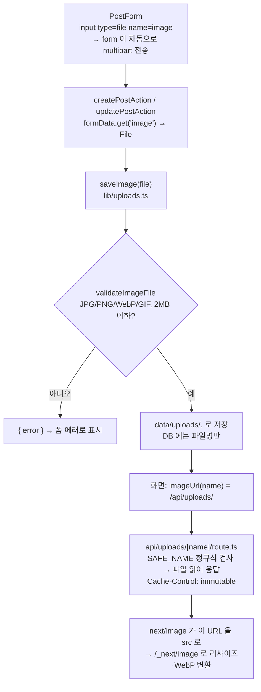
```mermaid
flowchart TB
  F["PostForm<br/>input type=file name=image<br/>→ form 이 자동으로 multipart 전송"]
  F --> A["createPostAction / updatePostAction<br/>formData.get('image') → File"]
  A --> V["saveImage(file)<br/>lib/uploads.ts"]
  V --> V1{"validateImageFile<br/>JPG/PNG/WebP/GIF, 2MB 이하?"}
  V1 -->|"아니오"| E["{ error } → 폼 에러로 표시"]
  V1 -->|"예"| W["data/uploads/<UUID>.<ext> 로 저장<br/>DB 에는 파일명만"]
  W --> R["화면: imageUrl(name) = /api/uploads/<name>"]
  R --> H["api/uploads/[name]/route.ts<br/>SAFE_NAME 정규식 검사 → 파일 읽어 응답<br/>Cache-Control: immutable"]
  H --> I["next/image 가 이 URL 을 src 로<br/>→ /_next/image 로 리사이즈·WebP 변환"]
```

| 결정 | 이유 |
| --- | --- |
| `public/` 이 아니라 `data/uploads/` | `public` 은 빌드 시점 자산용. 런타임에 추가한 파일은 배포 환경에서 서빙이 안 될 수 있다 |
| 파일명은 서버가 만든 UUID | 사용자 입력 이름을 쓰면 `../` 경로 탈출이 생긴다. 읽을 때도 정규식으로 다시 검사 |
| `Cache-Control: immutable` | 내용이 바뀌면 이름도 바뀌므로 브라우저가 영원히 캐시해도 안전 |
| 수정 시 `imagePath` 유지 | 새 파일이면 교체, "삭제" 체크면 제거, 둘 다 아니면 기존 값. 빠뜨리면 수정할 때마다 이미지가 사라진다 |
| 삭제 시 `deleteImage` | DB 행만 지우면 파일이 계속 남는다 |

### 📄 파일

`src/lib/uploads.ts`, `src/lib/uploads-validate.ts`(순수 함수, 단위 테스트 대상), `src/app/api/uploads/[name]/route.ts`, `src/app/posts/post-form.tsx`, `src/app/posts/[id]/page.tsx` 의 `<Image fill sizes=... priority>`.

---

## 9장. 브라우저가 직접 데이터를 가져올 때

지금까지는 **서버** 가 데이터를 읽어 HTML 로 보냈다. `(demos)` 라우트 그룹의 세 페이지는 **브라우저** 가 `fetch` 로 가져온다. 언제 어느 쪽을 쓰는지 비교하기 위한 데모다.

### 🚶 흐름 1: 데모 그룹의 공통 껍데기

```
src/app/(demos)/
├── layout.tsx      ← QueryProviders(TanStack Query) + PostsNav. 페이지를 옮겨도 유지
├── template.tsx    ← 세그먼트가 바뀔 때마다 새로 마운트 → 진입 애니메이션 재생
├── client-fetch/   ← /client-fetch
├── feed/           ← /feed
└── releases/       ← /releases
```

`(demos)` 처럼 괄호 폴더는 URL 에 안 들어간다. 이 페이지들이 `/posts/*` 아래에 있지 않은 이유는 5장의 인터셉팅 라우트 `(.)[id]` 가 `/posts/feed` 도 `[id]="feed"` 로 잡아 버리기 때문이다.

### 🚶 흐름 2: `/client-fetch` — 같은 일을 세 가지 방법으로

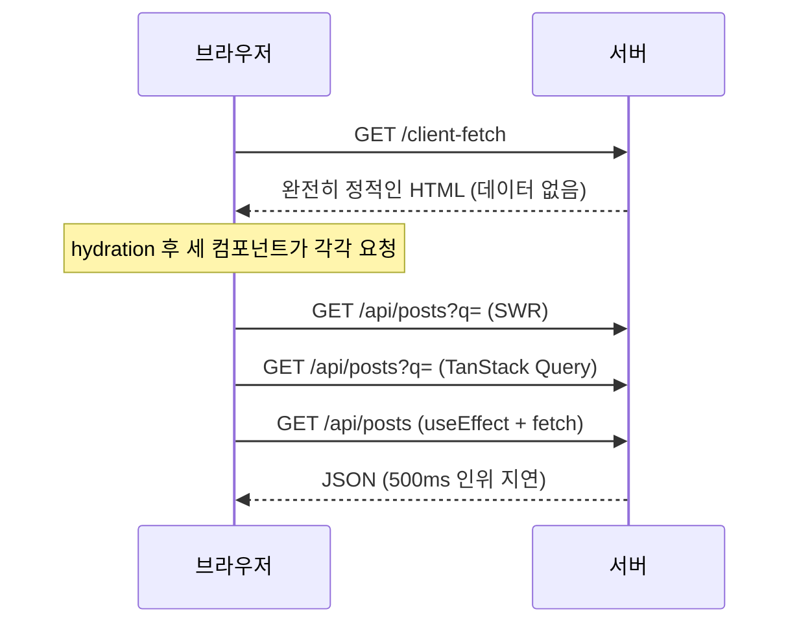
```mermaid
sequenceDiagram
  participant B as 브라우저
  participant S as 서버
  B->>S: GET /client-fetch
  S-->>B: 완전히 정적인 HTML (데이터 없음)
  Note over B: hydration 후 세 컴포넌트가 각각 요청
  B->>S: GET /api/posts?q=  (SWR)
  B->>S: GET /api/posts?q=  (TanStack Query)
  B->>S: GET /api/posts     (useEffect + fetch)
  S-->>B: JSON (500ms 인위 지연)
```

| 방법 | 파일 | 캐시 키 | 로딩 상태 | 이전 결과 유지 |
| --- | --- | --- | --- | --- |
| SWR | `post-search.tsx` | URL 문자열 | `isLoading`, `isValidating` | `keepPreviousData: true` |
| TanStack Query | `post-search-query.tsx` | `["posts", "search", query]` 배열 | `isPending`, `isFetching` | `placeholderData: keepPreviousData` |
| 직접 구현 | `post-count.tsx` | 없음 | `useState` 로 직접 | 직접. `AbortController` 로 언마운트 시 취소 |

### 🚶 흐름 3: `/feed` — 서버 첫 페이지 + 브라우저 무한 스크롤

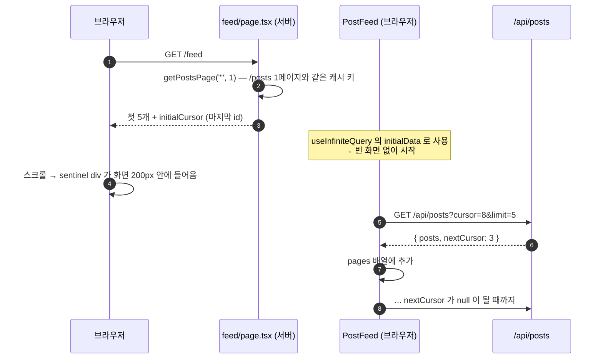
```mermaid
sequenceDiagram
  autonumber
  participant B as 브라우저
  participant Pg as feed/page.tsx (서버)
  participant PF as PostFeed (브라우저)
  participant API as /api/posts

  B->>Pg: GET /feed
  Pg->>Pg: getPostsPage("", 1) — /posts 1페이지와 같은 캐시 키
  Pg-->>B: 첫 5개 + initialCursor (마지막 id)
  Note over PF: useInfiniteQuery 의 initialData 로 사용<br/>→ 빈 화면 없이 시작
  B->>B: 스크롤 → sentinel div 가 화면 200px 안에 들어옴
  PF->>API: GET /api/posts?cursor=8&limit=5
  API-->>PF: { posts, nextCursor: 3 }
  PF->>PF: pages 배열에 추가
  PF->>API: ... nextCursor 가 null 이 될 때까지
```

- **커서 페이지네이션**: "마지막으로 본 id 보다 작은 것 N개". 스크롤 중에 새 글이 추가돼도 밀리거나 중복되지 않는다. `/posts` 의 번호 페이지(offset)와 비교해 보자.
- `limit + 1` 개를 조회해서 다음 페이지가 있는지 판단한다.
- `use(io())`: TanStack Query 는 내부에서 `Date.now()` 를 쓰는데 빌드 프리렌더 중에는 그런 값이 정적 셸에 굳는 것을 막는다. `use(io())` 는 프리렌더 중에는 suspend 하고(부모 Suspense 의 fallback 인 `StaticList` 가 셸에 들어감), 실제 요청과 브라우저에서는 즉시 통과한다.

### 🚶 흐름 4: `/releases` — 외부 API 를 서버에서 캐시하고 Promise 를 넘긴다

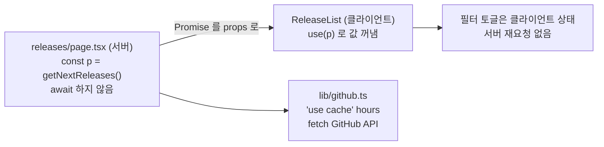
```mermaid
flowchart LR
  Pg["releases/page.tsx (서버)<br/>const p = getNextReleases()<br/>await 하지 않음"]
  Pg -->|"Promise 를 props 로"| RL["ReleaseList (클라이언트)<br/>use(p) 로 값 꺼냄"]
  Pg --> G["lib/github.ts<br/>'use cache' hours<br/>fetch GitHub API"]
  RL --> F["필터 토글은 클라이언트 상태<br/>서버 재요청 없음"]
```

외부 `fetch` 도 DB 조회와 똑같이 `"use cache"` 로 감싼다. 실패하면 throw 하고, 던져진 에러는 캐시되지 않으므로 다음 요청에서 다시 시도된다. 화면에서는 가장 가까운 `error.tsx` 가 잡는다.

### 💡 개념: 서버 페칭 vs 클라이언트 페칭

| | 서버 컴포넌트에서 읽기 | 브라우저에서 fetch |
| --- | --- | --- |
| 첫 화면 | 데이터가 HTML 에 포함 → 빠름, SEO 됨 | 빈 화면 → 로딩 → 데이터 |
| DB 접근 | 직접 | 불가. Route Handler 를 거쳐야 |
| 상호작용 후 갱신 | Server Action + 무효화 | 라이브러리가 자동 재요청 |
| 적합한 곳 | 목록, 상세, 대부분의 페이지 | 타이핑마다 바뀌는 검색, 무한 스크롤, 탭 전환 시 갱신 |

---

## 10장. 공개 API: 외부 개발자용 문 (`/api/v1`)

화면과 같은 데이터를 **브라우저가 아닌 프로그램** 이 쓰게 열어 준다. 쿠키 대신 토큰, HTML 대신 JSON, 그리고 레이트 리밋과 CORS 가 추가된다.

### 🚶 흐름 1: 요청 하나가 지나는 파이프라인

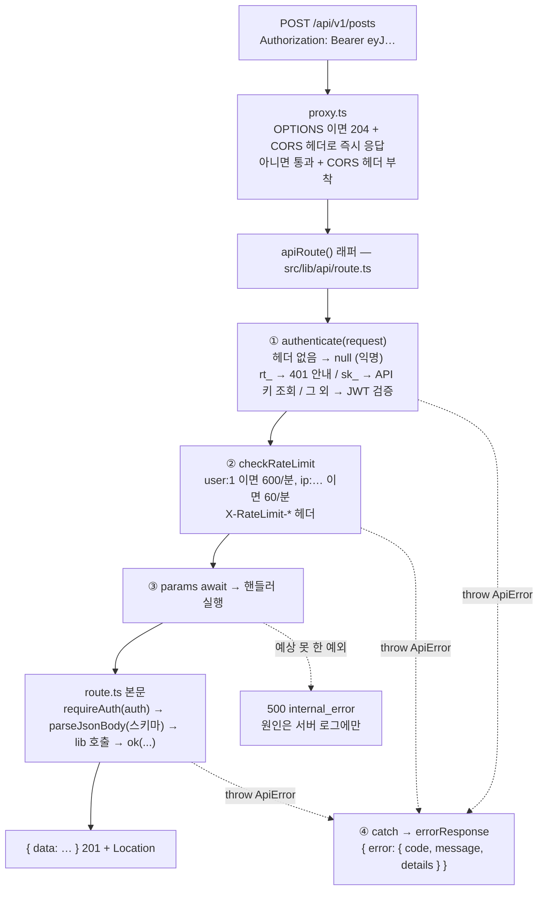
```mermaid
flowchart TB
  REQ["POST /api/v1/posts<br/>Authorization: Bearer eyJ…"]
  REQ --> P["proxy.ts<br/>OPTIONS 이면 204 + CORS 헤더로 즉시 응답<br/>아니면 통과 + CORS 헤더 부착"]
  P --> W["apiRoute() 래퍼 — src/lib/api/route.ts"]
  W --> A1["① authenticate(request)<br/>헤더 없음 → null (익명)<br/>rt_ → 401 안내 / sk_ → API 키 조회 / 그 외 → JWT 검증"]
  A1 --> A2["② checkRateLimit<br/>user:1 이면 600/분, ip:… 이면 60/분<br/>X-RateLimit-* 헤더"]
  A2 --> A3["③ params await → 핸들러 실행"]
  A3 --> H["route.ts 본문<br/>requireAuth(auth) → parseJsonBody(스키마) → lib 호출 → ok(...)"]
  H --> RES["{ data: … } 201 + Location"]
  A1 & A2 & H -.->|"throw ApiError"| ERR["④ catch → errorResponse<br/>{ error: { code, message, details } }"]
  A3 -.->|"예상 못 한 예외"| ERR2["500 internal_error<br/>원인은 서버 로그에만"]
```

`apiRoute` 덕분에 각 `route.ts` 에는 그 엔드포인트만의 로직만 남는다.

```ts
export const POST = apiRoute(async ({ request, auth }) => {
  const { user } = requireAuth(auth);                          // 401
  const { title, content } = await parseJsonBody(request, postCreateSchema); // 415 / 400 / 422
  const post = createPost(title, content, user.id, null);
  revalidateTag("posts", { expire: 0 });                       // 화면 캐시도 무효화
  return ok(serializePost(post, request.nextUrl.origin), 201, { Location: ... });
});
```

### 🚶 흐름 2: 응답 봉투와 에러 코드

```
성공(단건)  { "data": { ... } }
성공(목록)  { "data": [ ... ], "pagination": { "total", "limit", "offset", "hasMore" } }
실패        { "error": { "code": "not_found", "message": "...", "details": { ... } } }
```

| code | HTTP | 언제 |
| --- | --- | --- |
| `bad_request` | 400 | JSON 깨짐, id 가 정수 아님 |
| `unauthorized` | 401 | 토큰 없음·만료·위조 |
| `refresh_token_reused` | 401 | 소비된 리프레시 토큰 재사용 → 클라이언트는 저장한 토큰을 모두 버려야 |
| `forbidden` | 403 | 남의 글 수정, API 키로 키 관리 시도 |
| `not_found` | 404 | 없는 글, 남의 API 키 |
| `conflict` | 409 | 중복 이메일 가입 |
| `unsupported_media_type` | 415 | `Content-Type` 이 JSON 아님 |
| `validation_failed` | 422 | Zod 실패. `details` 에 필드별 메시지 |
| `rate_limited` | 429 | `Retry-After` 헤더 포함 |
| `internal_error` | 500 | 예상 못 한 예외 |

### 🚶 흐름 3: 세 가지 자격증명

```mermaid
flowchart LR
  subgraph ISSUE["발급"]
    T["POST /auth/token<br/>이메일 + 비밀번호"]
    T --> AT["액세스 토큰<br/>JWT, 1시간<br/>서버에 저장 안 함"]
    T --> RT["리프레시 토큰<br/>rt_…, 30일<br/>DB 에 SHA-256 해시"]
    AT --> K["POST /auth/keys<br/>(액세스 토큰으로만)"]
    K --> AK["API 키<br/>sk_…, 무기한<br/>DB 에 SHA-256 해시, 폐기 가능"]
  end
  subgraph USE["사용"]
    AT -->|"Authorization: Bearer"| API["/api/v1/*"]
    AK -->|"Authorization: Bearer"| API
    RT -->|"본문으로만"| RF["POST /auth/refresh<br/>→ 새 액세스 + 새 리프레시"]
    RT -->|"본문으로만"| LO["POST /auth/logout<br/>→ 가족 전체 폐기"]
  end
```

| | 세션 쿠키 (화면) | 액세스 토큰 | 리프레시 토큰 | API 키 |
| --- | --- | --- | --- | --- |
| 모양 | JWT in Cookie | JWT | `rt_` + 64자 hex | `sk_` + 64자 hex |
| 어디에 | `Cookie` 헤더 (브라우저 자동) | `Authorization: Bearer` | 요청 본문 | `Authorization: Bearer` |
| 수명 | 7일 | 1시간 | 30일 (절대) | 무기한 |
| 서버 저장 | 없음 | 없음 | 해시 | 해시 |
| 즉시 무효화 | 불가 (만료 대기) | 불가 | 가능 (행 삭제·폐기) | 가능 (`revoked_at`) |
| 서명 키 | `SESSION_SECRET` | `SESSION_SECRET` 에서 HMAC 으로 **파생한 별도 키** | — | — |
| 쓰는 곳 | 브라우저 화면 | API 클라이언트 | 액세스 토큰 갱신 | 봇, 서버-투-서버 |

**왜 API 는 쿠키를 안 받나.** 쿠키는 브라우저가 자동으로 붙이므로 남의 사이트가 우리 사용자의 브라우저를 시켜 요청을 보낼 수 있다(CSRF). `Authorization` 헤더는 자동으로 안 붙는다. 그래서 `/api/v1` 은 쿠키를 아예 보지 않고, 덕분에 CORS 를 `*` 로 열어도 안전하다.

**왜 서명 키를 분리하나.** 같은 키로 서명하면 API 액세스 토큰을 세션 쿠키에 붙여 넣어도 검증을 통과한다(토큰 혼동). `createHmac("sha256", SESSION_SECRET).update("api-access-token-v1")` 로 파생 키를 만들어 두 토큰이 서로 통용되지 않게 한다.

### 🚶 흐름 4: 리프레시 토큰 회전과 재사용 감지

```mermaid
sequenceDiagram
  autonumber
  participant C as 정상 클라이언트
  participant X as 공격자 (rt_A 탈취)
  participant S as /auth/refresh
  participant DB as refresh_tokens

  Note over C,DB: 로그인 → 가족 F 생성, rt_A 발급
  C->>S: refresh { rt_A }
  S->>DB: rt_A 찾기 → used_at 없음, 만료 안 됨
  S->>DB: rt_A.used_at = now (소비), rt_B 삽입 (같은 가족 F, 같은 expires_at)
  S-->>C: { accessToken, refreshToken: rt_B }
  X->>S: refresh { rt_A }  ← 이미 소비된 토큰
  S->>DB: rt_A.used_at 있음 → 재사용!
  S->>DB: UPDATE … SET revoked_at = now WHERE family_id = F
  S-->>X: 401 refresh_token_reused
  C->>S: refresh { rt_B }
  S->>DB: rt_B.revoked_at 있음
  S-->>C: 401 unauthorized → 다시 로그인
  Note over C: 정상 사용자도 로그아웃되지만<br/>공격자도 함께 차단된다
```

```mermaid
stateDiagram-v2
  state "유효" as valid
  state "소비됨 (used_at)" as used
  state "폐기됨 (revoked_at)" as revoked
  state "만료됨" as expired
  [*] --> valid: 발급 (로그인 또는 회전)
  valid --> used: refresh 성공 (새 토큰 발급)
  valid --> revoked: logout / 가족 폐기
  valid --> expired: expires_at 경과
  used --> revoked: 다시 오면 재사용 감지 → 가족 전체 폐기
  used --> [*]: pruneExpired (만료 후 정리)
  revoked --> [*]
  expired --> [*]
```

`rotateRefreshToken` 의 검사 순서가 중요하다: 없음 → 폐기됨 → **소비됨(재사용)** → 만료. 만료 검사보다 재사용 검사를 먼저 하는 이유는, 만료된 토큰이라도 "두 번 쓰였다" 는 사실 자체가 탈취 신호이기 때문이다. 전체가 `BEGIN IMMEDIATE … COMMIT` 트랜잭션이라 같은 토큰으로 동시에 두 요청이 와도 하나만 성공한다.

### 🚶 흐름 5: 권한 규칙과 캐시 무효화

| 엔드포인트 | 읽기 | 쓰기 | 수정·삭제 | 화면 캐시 무효화 |
| --- | --- | --- | --- | --- |
| `/posts` | 누구나 | 로그인 | 작성자만 (403) | `revalidateTag("posts", { expire: 0 })` |
| `/posts/:id/comments`, `/comments/:id` | 누구나 | 로그인 | 작성자만 | `revalidateTag(commentsTag, { expire: 0 })` |
| `/todos` | 누구나 | 로그인 | 로그인 (소유자 없음) | `revalidatePath("/todos")` |
| `/auth/keys` | 액세스 토큰만 | 액세스 토큰만 | 본인 키만 (남의 것은 404) | — |

Route Handler 에서는 `updateTag` 를 호출할 수 없다(Server Action 전용). 대신 `revalidateTag(tag, { expire: 0 })` 를 써서 "옛 값을 내주지 않고 다음 요청이 바로 새로 만들게" 한다.

**API 키로 API 키를 만들 수 없는 이유.** 키 하나가 유출됐을 때 공격자가 스스로 키를 계속 찍어낼 수 있으면 폐기가 의미를 잃는다. `requireAccessToken` 은 `via === "access_token"` 을 요구한다.

### 📄 파일

| 파일 | 핵심 |
| --- | --- |
| `src/proxy.ts` | `/api/v1` CORS. `OPTIONS` 는 라우트까지 안 가고 204 |
| `src/lib/api/route.ts` | `apiRoute()` — 인증 → 레이트 리밋 → 핸들러 → 에러 JSON. `unstable_rethrow` 로 Next 내부 에러는 삼키지 않음 |
| `src/lib/api/auth.ts` | `authenticate`, `requireAuth`, `requireAccessToken`, `issueAccessToken`, `tokenResponse` |
| `src/lib/api/http.ts` | `ApiError`, `ok`/`okList`/`noContent`/`errorResponse`, `parseJsonBody`/`parseQuery`/`parseIdParam`. 모든 응답에 `Cache-Control: no-store` |
| `src/lib/api/rate-limit.ts` | 고정 윈도 60초. 메모리 `Map` (`globalThis`). 실제 서비스는 Redis |
| `src/lib/api/serialize.ts` | DB 행을 그대로 내보내지 않는 한 겹. `password_hash` 가 새지 않는다. `imagePath` → 절대 URL |
| `src/lib/schemas/api.ts` | 화면 스키마 재사용 + `limit`(최대 50)/`offset` 등 API 전용 규칙 |
| `src/lib/refresh-tokens.ts` | 발급·회전·폐기. 가족, 트랜잭션, `pruneExpired` |
| `src/lib/api-keys.ts` | 발급(원문은 응답에 한 번만)·조회·`touch`·폐기 |
| `src/lib/api/openapi.ts`, `src/app/api/v1/openapi.json/route.ts` | OpenAPI 3.1 명세. Swagger UI, Postman 에 그대로 |
| `src/app/api/v1/route.ts` | 디스커버리. 요청을 안 읽으므로 빌드 시 정적 |

### 🔍 터미널에서 보기

```
[proxy]   POST /api/v1/posts → 통과 (CORS 헤더만 부착, 인증은 Route Handler 가 함)
[api]     POST /api/v1/posts → 인증: access_token (userId=1)
[api]       ↳ 레이트 리밋 user:1: 이번 창 3/600 사용, 초기화 01:05:00Z
[api]       ↳ revalidateTag(…, { expire: 0 }) "posts" — expire:0 → 옛 값을 내주지 않고 다음 요청이 바로 새로 만듦
[api]       ↳ 201 응답 (4.2ms)
```

터미널로 직접 따라 하는 curl 순서는 README Part 5-1 에 있다.

---

## 11장. 테스트: 어디서 무엇을 확인하나

```
            ▲  느리지만 전체를 본다
            │
      ┌─────┴─────┐
      │   E2E     │  Playwright, 프로덕션 빌드 + 진짜 브라우저 (e2e/*.spec.ts, 6 파일)
      │           │  렌더링·캐시·스트리밍·라우팅·인증·zustand·공개 API 전체 흐름
      ├───────────┤
      │ Route     │  Vitest, 서버 없이 핸들러 함수를 직접 호출 (src/app/api/**/*.test.ts)
      │ Handler   │  apiRequest() 헬퍼로 NextRequest 를 만든다
      ├───────────┤
      │ 컴포넌트  │  Vitest + Testing Library + jsdom (src/app/**/*.test.tsx)
      │           │  Server Action 은 vi.mock 으로 통째로 대체
      ├───────────┤
      │ 단위      │  Vitest, node 환경 (src/lib/**/*.test.ts)
      │           │  순수 함수, SQL 함수(임시 DB), 세션(cookies() mock)
      └───────────┘
            │
            ▼  빠르고 좁다
```

| 무엇을 | 어떻게 | 예 |
| --- | --- | --- |
| 순수 함수 | 그냥 호출 | `pushRecent`, `validateImageFile`, `checkRateLimit(…, now)` — 시계를 인자로 받아 조작 없이 테스트 |
| SQL 함수 | `src/test/setup.ts` 가 테스트 파일마다 **임시 SQLite** 경로를 `DATABASE_PATH` 에 넣는다. 개발 DB 는 건드리지 않음 | `posts.test.ts`, `comments.test.ts`, `refresh-tokens.test.ts` |
| Next 런타임에 묶인 코드 | `vi.mock("next/headers")` 로 `cookies()` 를 메모리 Map 으로 대체 | `session.test.ts` |
| 클라이언트 컴포넌트 | `vi.mock("./actions")` 로 액션을 가짜로. 클릭 → 어떤 인자로 호출됐나 확인 | `todo-item.test.tsx` |
| Route Handler | `apiRequest("/api/v1/posts", { method: "POST", body, token })` 로 요청 객체를 만들어 `POST(request)` 직접 호출 | `posts.test.ts`, `auth.test.ts`, `todos.test.ts` |
| async 서버 컴포넌트, 스트리밍, 캐시 | 단위 테스트 도구가 지원하지 않음 → E2E | `e2e/rendering.spec.ts` |

설정에서 알아 둘 것:

- `vitest.config.mts`: `"server-only"` 를 빈 모듈로 alias. 기본 환경은 jsdom, `jose` 를 쓰는 파일은 맨 위 `// @vitest-environment node`.
- `playwright.config.ts`: 포트 3100, `data/e2e.db` 를 `--reset` 시드 → `next build` → `next start`. 같은 DB 를 쓰므로 `workers: 1`.

---

## 12장. 한눈에 보는 요약

### 12-1. 데이터가 바뀌면 무엇이 갱신되나

```mermaid
flowchart LR
  subgraph ENTRY["입구"]
    TA["todos/actions.ts"]
    PA["posts/actions.ts"]
    API["api/v1/**/route.ts"]
  end
  subgraph INV["무효화"]
    RP["revalidatePath('/todos')"]
    UT["updateTag(...)"]
    RT0["revalidateTag(..., expire: 0)"]
  end
  subgraph CACHE["'use cache' 엔트리 (태그)"]
    C1["getPostsPage — posts"]
    C2["getPost(id) — posts, post-N"]
    C3["getCommentThreads(id) — post-N-comments"]
    C4["getNextReleases — next-releases"]
  end
  subgraph VIEW["화면"]
    V1["/todos"]
    V2["/posts, /feed 첫 페이지"]
    V3["/posts/N 본문, 모달"]
    V4["/posts/N 댓글"]
    V5["/releases"]
  end
  TA --> RP --> V1
  API -->|"todos"| RP
  PA -->|"글"| UT --> C1 & C2
  PA -->|"댓글"| UT --> C3
  PA -->|"릴리스"| UT --> C4
  API -->|"글"| RT0 --> C1 & C2
  API -->|"댓글"| RT0 --> C3
  C1 --> V2
  C2 --> V3
  C3 --> V4
  C4 --> V5
```

### 12-2. 렌더링 방식 지도

| 페이지 | 방식 | 근거 |
| --- | --- | --- |
| `/` | 정적 (SSG) | 요청 데이터 없음 |
| `/todos` | 정적 셸 + 요청 시 목록 (SSR) | `connection()`, `loading.tsx` |
| `/posts` | 정적 셸 + 캐시된 목록 (ISR) + 요청 시 세션 | `"use cache"` + `searchParams` + `cookies()` |
| `/posts/[id]` | 일부 id 는 빌드 시, 나머지 첫 요청 시 캐시 (ISR) + 스트리밍 | `generateStaticParams`, `getPost` 캐시, 4개 Suspense |
| `/client-fetch` | 완전 정적 + 브라우저 fetch (CSR) | 서버 컴포넌트가 데이터를 안 읽음 |
| `/feed` | 첫 페이지 캐시 + 브라우저 fetch | `getPostsPage` + `useInfiniteQuery` |
| `/releases` | 외부 fetch 캐시 + `use()` | `"use cache"` + Promise props |
| `/login`, `/signup` | 정적 | 세션은 proxy 가 봄 |
| `/api/v1`, `/api/v1/openapi.json` | 정적 | 요청을 안 읽음 |
| 나머지 `/api/**` | 요청마다 | 헤더·쿼리를 읽음 |

### 12-3. 개념 → 파일 색인

| 개념 | 처음 나오는 장 | 파일 |
| --- | --- | --- |
| 서버/클라이언트 컴포넌트 | 2 | `layout.tsx` vs `store-hydrator.tsx` |
| Cache Components, 정적 셸, Suspense | 2 | `next.config.ts`, `layout.tsx` |
| hydration, localStorage 복원 | 2 | `store-hydrator.tsx`, `recently-viewed-store.ts` |
| `connection()` | 3 | `lib/todos.ts` |
| Server Action, `revalidatePath` | 3 | `todos/actions.ts` |
| `useActionState`, `useTransition`, `useOptimistic` | 3 | `add-todo-form.tsx`, `todo-item.tsx` |
| zustand 기본 | 3 | `todo-selection-store.ts`, `bulk-action-bar.tsx` |
| Route Handler | 3, 8, 10 | `api/todos/route.ts`, `api/uploads/[name]/route.ts`, `api/v1/**` |
| `"use cache"`, `cacheLife`, `cacheTag` | 4 | `lib/posts.ts` |
| `updateTag` vs `revalidateTag` | 4 | `posts/actions.ts`, `cache-controls.tsx` |
| `searchParams`, 디바운스 | 4 | `posts/page.tsx`, `post-search-form.tsx`, `use-debounced-callback.ts` |
| 동적 라우트, `generateStaticParams` | 5 | `posts/[id]/page.tsx` |
| `loading`, `error`, `not-found` | 5 | `posts/[id]/`, `posts/error.tsx` |
| 스트리밍 | 5 | `other-posts.tsx` |
| 병렬 + 인터셉팅 라우트 | 5 | `posts/@modal/`, `components/modal.tsx` |
| `next/dynamic` | 5 | `recently-viewed-loader.tsx` |
| 리다이렉트 3종 | 5 | `next.config.ts`, `p/[id]/page.tsx`, `dal.ts` |
| 비밀번호 해시 | 6 | `lib/password.ts` |
| JWT 세션 쿠키 | 6 | `lib/session.ts` |
| DAL, `requireUser` | 6 | `lib/dal.ts` |
| proxy 리다이렉트 | 6 | `proxy.ts` |
| 소유자 검사 | 6 | `posts/actions.ts`, `edit/page.tsx` |
| Zod 스키마 공유 | 6, 10 | `lib/schemas/*` |
| 캐시 + 사용자별 정보 합치기 | 7 | `comments-section.tsx` |
| CASCADE, 트리 조립 | 7 | `lib/schema.ts`, `lib/comments.ts` |
| `bind` 로 인자 고정 | 7 | `comment-form.tsx`, `edit/page.tsx` |
| 파일 업로드, `next/image` | 8 | `lib/uploads.ts`, `posts/[id]/page.tsx` |
| 라우트 그룹, `template.tsx` | 9 | `(demos)/layout.tsx`, `(demos)/template.tsx` |
| SWR, TanStack Query | 9 | `client-fetch/*.tsx`, `query-providers.tsx` |
| 커서 페이지네이션, IntersectionObserver | 9 | `feed/post-feed.tsx`, `getPostsByCursor` |
| `use(promise)`, `use(io())` | 9 | `release-list.tsx`, `post-feed.tsx` |
| 외부 fetch 캐시 | 9 | `lib/github.ts` |
| CORS | 10 | `proxy.ts` |
| Bearer 인증, 토큰 혼동 방지 | 10 | `lib/api/auth.ts` |
| 리프레시 토큰 회전·재사용 감지 | 10 | `lib/refresh-tokens.ts` |
| API 키 해시 저장 | 10 | `lib/api-keys.ts` |
| 레이트 리밋 | 10 | `lib/api/rate-limit.ts` |
| 응답 봉투, 에러 코드 | 10 | `lib/api/http.ts` |
| `revalidateTag(expire: 0)` | 10 | `api/v1/posts/route.ts` |
| OpenAPI | 10 | `lib/api/openapi.ts` |
| 테스트 4층 | 11 | `src/test/`, `e2e/` |

### 12-4. 자주 헷갈리는 것

**Q. `/todos` 는 왜 `"use cache"` 를 안 쓰나?**
할 일은 자주 바뀌고 항상 최신이어야 한다. `revalidatePath` 로 페이지 전체를 다시 그리는 가장 단순한 방식을 보여 주기 위해서다. 글 목록은 반대로 "캐시하고 필요할 때만 지우기" 를 보여 준다.

**Q. Server Action 과 Route Handler 는 언제 뭘 쓰나?**
화면의 폼과 버튼은 Server Action. 브라우저 `fetch` 나 외부 프로그램이 부르는 것은 Route Handler. Server Action 은 Next.js 가 만든 규약이라 외부에서 부르기 어렵고, Route Handler 는 표준 HTTP 라 누구나 부를 수 있다.

**Q. 같은 `/posts/3` 인데 어떨 땐 모달, 어떨 땐 페이지인 이유는?**
5장. Link 클릭(클라이언트 이동)만 인터셉팅 라우트가 가로챈다. 새로고침이나 주소 입력은 서버가 원래 페이지를 준다.

**Q. 로그인했는데 `/api/v1` 이 401 인 이유는?**
10장. 공개 API 는 쿠키를 보지 않는다. `POST /api/v1/auth/token` 으로 액세스 토큰을 받아 `Authorization: Bearer` 로 보내야 한다.

**Q. 개발 모드에서 `[ Cache ]` 로그가 매번 찍히는데 캐시가 안 되는 건가?**
4장. 그 줄은 예전 실행의 "재생" 이다. 로그 안의 시각이 직전 `[render]` 보다 과거면 HIT 이다.

**Q. 왜 `getCurrentUser()` 를 `"use cache"` 함수 안에서 못 부르나?**
캐시된 결과는 모두가 공유한다. A 의 사용자 정보가 B 에게 갈 수 있다. 6장, 7장.

**Q. 액션에서 `redirect()` 뒤의 코드가 실행되나?**
안 된다. `redirect()` 와 `notFound()` 는 예외를 던지는 방식이다. `try/catch` 로 감싸면 삼켜지므로 조심한다 (`apiRoute` 의 `unstable_rethrow` 가 그 대책).

---

## 부록 A. 서버 컴포넌트와 클라이언트 컴포넌트, 제대로 이해하기

이름 때문에 오해가 생기기 쉬운 개념이다. "서버 컴포넌트는 서버에서, 클라이언트 컴포넌트는 브라우저에서 실행된다" 라고 외우면 절반은 틀린다. 질문을 바꿔야 한다. **"이 컴포넌트의 코드가 브라우저로 가는가?"** 이것 하나로 대부분이 설명된다.

### A-1. 한 문장씩

| | 서버 컴포넌트 | 클라이언트 컴포넌트 |
| --- | --- | --- |
| 표시 | 파일 맨 위에 아무것도 없음 (**기본값**) | 파일 맨 위에 `"use client"` |
| 어디서 실행되나 | **서버에서만**. 브라우저는 결과만 받는다 | **서버에서 한 번, 브라우저에서 또 한 번** |
| 브라우저로 가는 것 | 렌더링 결과 (HTML 조각과 RSC payload) | 결과 + **JS 코드 자체** |
| 비유 | 주방에서 완성해 내보내는 요리. 손님은 레시피를 모른다 | 테이블 위의 버튼과 리모컨. 손님이 직접 누른다 |
| 이 프로젝트에서 | `todos/page.tsx`: getTodos() 로 SQLite 를 읽어 목록을 그린다 | `todos/todo-item.tsx`: 체크박스 클릭에 반응한다 |

### A-2. 무엇이 브라우저로 가나

```mermaid
flowchart LR
  subgraph SRV["서버"]
    SC["서버 컴포넌트<br/>todos/page.tsx<br/>getTodos() 로 SQLite → JSX"]
    CCS["클라이언트 컴포넌트<br/>todo-item.tsx<br/>(서버에서도 한 번 그림 = SSR)"]
  end
  subgraph OUT["브라우저로 전송되는 것"]
    HTML["HTML<br/>첫 화면 (사진)"]
    RSC["RSC payload<br/>서버 컴포넌트의 렌더 결과 트리<br/>+ '이 자리에 어떤 클라이언트 컴포넌트를 어떤 props 로'"]
    JS["JS 번들<br/>클라이언트 컴포넌트 코드만"]
  end
  subgraph BR["브라우저"]
    H["hydration<br/>사진 위에 이벤트·상태 붙이기"]
    RUN["이후 클릭·입력·useEffect 는<br/>브라우저에서 실행"]
  end
  SC --> HTML
  SC --> RSC
  CCS --> HTML
  CCS -.->|"코드"| JS
  HTML & RSC & JS --> H --> RUN
```

- `todos/page.tsx` 의 `getTodos()` 와 그 안의 DB 코드는 브라우저에 **없다**. 개발자 도구 Sources 탭에서 검색해도 안 나온다.
- `todo-item.tsx` 의 `handleToggle` 은 브라우저에 **있다**. 그래야 클릭에 반응한다.
- 클라이언트 컴포넌트도 서버에서 한 번 HTML 로 그려진다. 그래서 첫 화면이 빈 화면이 아니다. 이것이 SSR 이다.

### A-3. 시간 순서로 보기

```
서버                                          브라우저
──────────────────────────────────────        ──────────────────────────────────────
① 서버 컴포넌트 실행 (DB 읽기, await)
② 클라이언트 컴포넌트도 HTML 로 한 번 그림
   (useState 초기값으로. useEffect 는 실행 안 함)
③ HTML + RSC payload 전송 ──────────────▶     ④ HTML 표시. 보이지만 아직 클릭은 안 됨
                                              ⑤ 클라이언트 컴포넌트 JS 다운로드
                                              ⑥ hydration: 같은 컴포넌트를 브라우저에서
                                                 다시 실행해 이벤트 핸들러를 붙임
                                              ⑦ useEffect 실행. 이제 클릭·입력이 동작
```

⑥ 에서 서버가 그린 HTML(②) 과 브라우저가 그린 결과가 **같아야** 한다. 다르면 "hydration mismatch" 에러다. 그래서 `localStorage` 처럼 브라우저에만 있는 값은 ②에서 읽으면 안 되고 ⑦(`useEffect`) 에서 읽는다. `components/store-hydrator.tsx` 가 정확히 그렇게 한다.

### A-4. 이름이 만드는 오해 세 가지

| 오해 | 실제 | 이 프로젝트에서 확인 |
| --- | --- | --- |
| "클라이언트 컴포넌트는 브라우저에서만 실행된다" | 서버에서도 한 번 실행된다 (SSR). 렌더 중에 `window` 를 읽으면 서버에서 터진다 | `posts/[id]/recently-viewed.tsx` 는 그래서 `next/dynamic` 의 `ssr: false` 로만 로드한다 |
| "서버 컴포넌트 = SSR" | 다른 개념이다. 서버 컴포넌트는 "코드가 브라우저로 안 감", SSR 은 "클라이언트 컴포넌트를 서버에서 HTML 로 미리 그림" | `todo-item.tsx` 는 클라이언트 컴포넌트이면서 SSR 된다 |
| "`"use client"` 는 그 파일만 클라이언트로 만든다" | **경계** 다. 그 파일이 import 하는 모듈도 전부 클라이언트 번들로 끌려간다 | `todo-item.tsx` 에서 `@/lib/db` 를 import 하면 `server-only` 가 빌드를 막는다 |

### A-5. 어느 쪽으로 만들까

```mermaid
flowchart TB
  Q1{"onClick, onChange 같은<br/>이벤트 핸들러가 필요한가?"}
  Q2{"useState, useEffect, useRef<br/>같은 훅이 필요한가?"}
  Q3{"window, localStorage,<br/>IntersectionObserver 같은<br/>브라우저 API 가 필요한가?"}
  Q4{"DB, 파일, 비밀 키,<br/>cookies() 도 함께 필요한가?"}
  C["'use client' 컴포넌트"]
  S["서버 컴포넌트 (기본값)"]
  SPLIT["둘로 나눈다:<br/>서버 컴포넌트가 데이터를 읽어 props 로 넘기고,<br/>클라이언트 컴포넌트가 상호작용을 맡는다"]
  Q1 -->|"예"| Q4
  Q1 -->|"아니오"| Q2
  Q2 -->|"예"| Q4
  Q2 -->|"아니오"| Q3
  Q3 -->|"예"| Q4
  Q3 -->|"아니오"| S
  Q4 -->|"예"| SPLIT
  Q4 -->|"아니오"| C
```

**기본값은 서버 컴포넌트다.** 필요한 것이 생겼을 때만 `"use client"` 를 붙인다. 붙이더라도 **가능한 한 트리의 아래쪽, 작은 조각** 에 붙인다. 페이지 전체에 붙이면 페이지의 모든 코드가 브라우저로 간다. `todos/page.tsx` 가 서버로 남고 `TodoItem`, `AddTodoForm` 만 클라이언트인 이유다.

### A-6. 할 수 있는 것, 없는 것

| | 서버 컴포넌트 | 클라이언트 컴포넌트 |
| --- | --- | --- |
| `async` / `await` 로 데이터 읽기 | ✅ `await getTodos()` | ❌ (`use()` 나 SWR, TanStack Query 로) |
| DB, 파일 시스템, 환경변수 비밀 | ✅ | ❌ |
| `cookies()`, `headers()` | ✅ (Suspense 안에서) | ❌ |
| `useState`, `useEffect`, `useRef` | ❌ | ✅ |
| `onClick`, `onChange`, `onSubmit` | ❌ | ✅ |
| `window`, `localStorage`, 브라우저 API | ❌ | ✅ (`useEffect` 안에서) |
| Context Provider 제공 | ❌ | ✅ |
| 다른 서버 컴포넌트 import | ✅ | ❌ (import 하면 그것도 클라이언트가 됨) |
| 다른 클라이언트 컴포넌트 import | ✅ | ✅ |
| 서버 컴포넌트를 children 으로 받기 | — | ✅ (A-7) |
| Server Action 호출 | `<form action={...}>` 으로 | 함수처럼 호출 |

### A-7. 트리 규칙과 샌드위치 패턴

가장 헷갈리는 규칙이다. **"클라이언트 컴포넌트는 서버 컴포넌트를 import 할 수 없다. 하지만 children 으로 받을 수는 있다."**

```mermaid
flowchart TB
  subgraph OK1["✅ 서버 → 클라이언트 import"]
    A1["todos/page.tsx (서버)"] --> B1["TodoItem (클라이언트)"]
  end
  subgraph NO["❌ 클라이언트 → 서버 import"]
    A2["TodoItem (클라이언트)"] -.->|"import 하는 순간<br/>이것도 클라이언트가 됨"| B2["user-menu.tsx (서버)<br/>→ cookies() 못 씀, server-only 빌드 에러"]
  end
  subgraph OK2["✅ 샌드위치: 클라이언트가 서버를 children 으로"]
    A3["(demos)/layout.tsx (서버)"] --> B3["QueryProviders (클라이언트)"]
    B3 -->|"children"| C3["데모 page.tsx (서버)<br/>서버에서 이미 렌더된 결과가 끼워진다"]
  end
```

왜 import 는 안 되고 children 은 되나. import 는 "이 코드를 내 번들에 넣어라" 는 뜻이라 클라이언트 번들에 서버 코드가 들어간다. children 은 "서버가 **이미 렌더링한 결과** 를 이 자리에 끼워라" 는 뜻이라 코드는 안 가고 결과만 간다.

이 프로젝트의 샌드위치:

| 바깥 (서버) | 가운데 (클라이언트) | 안 (children) |
| --- | --- | --- |
| `(demos)/layout.tsx` | `QueryProviders` (TanStack Provider) | 각 데모 `page.tsx` (서버) |
| `posts/@modal/(.)[id]/page.tsx` | `RouteModal` (Dialog) | 글 본문, 이미지, 링크 (서버가 렌더) |
| `posts/[id]/comments-section.tsx` | `ReplyToggle` (열고 닫기) | `CommentForm` (이것도 클라이언트지만, 부모가 만든 것을 그대로 통과시키는 같은 원리) |

### A-8. props 규칙: 넘길 수 있는 것

서버 컴포넌트가 클라이언트 컴포넌트에 props 를 넘기면 그 값은 네트워크를 건너간다. 그래서 **직렬화할 수 있는 값** 만 된다.

| 넘길 수 있다 | 넘길 수 없다 |
| --- | --- |
| 문자열, 숫자, boolean, null | 일반 함수 |
| 배열, 평범한 객체 | 클래스 인스턴스, `Map`, `Set` |
| `Date` | DB 연결(`db`) 같은 서버 자원 |
| **Server Action** (특별 취급) | 이벤트 핸들러 |
| JSX (서버가 렌더한 결과) | — |

이 프로젝트의 예:

- `todos/page.tsx` → `<TodoItem todo={todo} />`: 평범한 객체라 넘길 수 있다.
- `posts/[id]/edit/page.tsx` → `<PostForm action={updatePostAction.bind(null, post.id)} />`: Server Action 은 함수지만 넘길 수 있다. Next.js 가 "이 액션을 부르는 참조" 로 바꿔 보내기 때문이다.
- `todos/page.tsx` 에서 `onDelete={() => ...}` 같은 일반 함수를 넘기면 빌드 에러. 그래서 삭제 로직은 `TodoItem` 안에서 Server Action 을 직접 import 해 호출한다.

### A-9. 이 프로젝트에서 찾아보기

| 파일 | 종류 | 왜 |
| --- | --- | --- |
| `app/layout.tsx`, `app/page.tsx` | 서버 | 구조와 링크만. 상호작용 없음 |
| `todos/page.tsx` | 서버 | `await getTodos()` 로 DB 를 읽는다 |
| `todos/todo-item.tsx` | 클라이언트 | 체크박스 클릭, 수정 모드 `useState`, `useOptimistic` |
| `todos/add-todo-form.tsx` | 클라이언트 | `useActionState`, `useRef` 로 폼 초기화, 토스트 |
| `components/user-menu.tsx` | 서버 | `cookies()` 로 세션을 읽는다. 로그아웃은 `<form action>` 이라 onClick 이 필요 없다 |
| `posts/[id]/post-owner-actions.tsx` | 서버 | 세션만 읽고 버튼을 그린다. 실제 클릭은 자식 `DeletePostButton`(클라이언트) |
| `posts/[id]/other-posts.tsx` | 서버 | 1.5초 걸리는 `await`. 서버 컴포넌트라 스트리밍이 된다 |
| `posts/post-search-form.tsx` | 클라이언트 | 타이핑 이벤트, 디바운스 타이머, `useRouter` |
| `posts/error.tsx` | 클라이언트 | Error Boundary 는 클라이언트여야 한다 (React 규칙) |
| `components/modal.tsx` | 클라이언트 | `useRouter().back()`, Dialog 열림/닫힘 |
| `components/store-hydrator.tsx` | 클라이언트 | `useEffect` 로 localStorage 복원. 화면에는 아무것도 안 그림 |
| `posts/[id]/recently-viewed.tsx` | 클라이언트 + `ssr: false` | localStorage 를 렌더 중에 읽으므로 서버에서 아예 안 그린다 |

패턴이 보인다. **"읽고 그리는 것" 은 서버, "누르고 바꾸는 것" 은 클라이언트.** 그리고 서버 컴포넌트는 되도록 크게, 클라이언트 컴포넌트는 되도록 작게.

### A-10. 스스로 확인하기

1. `todos/page.tsx` 에 `onClick` 을 넣으면? → 에러. 서버 컴포넌트에는 이벤트 핸들러가 없다. 버튼을 클라이언트 컴포넌트로 분리한다.
2. `todo-item.tsx` 에서 `@/lib/db` 를 import 하면? → 빌드 에러. `server-only` 가 막는다. 데이터는 props 로 받거나 Server Action 에 부탁한다.
3. `user-menu.tsx` 에 `"use client"` 를 붙이면? → `cookies()` 를 못 쓴다. 세션은 서버에서만 읽을 수 있다.
4. 클라이언트 컴포넌트 렌더 중에 `new Date().toLocaleTimeString()` 을 쓰면? → 서버와 브라우저의 시각이 달라 hydration mismatch 가 날 수 있다. `useEffect` 에서 설정한다 (`post-count.tsx` 가 그렇게 한다).
5. `(demos)/layout.tsx` 는 서버인데 안의 `QueryProviders` 는 클라이언트다. 그 안에 끼워진 데모 page.tsx 는? → 여전히 서버. children 으로 끼워졌기 때문이다.

---

이 문서를 다 읽었다면 README 의 Part 7 (Prisma, tRPC 를 쓰는 이유) 과 `docs/NEXT_STEPS.md` (다음에 볼 주제) 로 이어진다.
