# 코드 여행기 (feat/trpc) — 요청 하나를 따라가며 읽는 next-js-study-app

> README 가 "주제별 사전" 이라면 이 문서는 "여행기" 다.
> 브라우저에서 주소를 치는 순간부터 화면이 완성되기까지, 요청 하나가 어떤 파일을 어떤 순서로 지나가는지 따라간다.
> 처음 보는 개념은 그 자리에서 짧게 설명하고, 자세한 설명이 필요하면 README 의 해당 절을 가리킨다.
>
> **이 브랜치(feat/trpc)는 main 위에 tRPC v11 을 얹어 "브라우저 ↔ 서버 호출" 세 곳을 바꾼 것이다.** 댓글 목록·작성·삭제, `/client-fetch` 의 네 번째 검색, `/feed` 의 다음 페이지 요청이 그것이다.
> 데이터 접근 층(`src/lib/`)과 글 작성/수정/삭제 Server Action, 공개 API 는 main 그대로다.
> 그래서 이 책의 대부분은 main 판과 같고, 7장(댓글)과 9장(데모)이 크게 다르며, tRPC 자체는 12장에 모아 두었다.

---

## 목차

| 장 | 제목 | 따라가는 요청 | 처음 만나는 개념 |
| --- | --- | --- | --- |
| 0 | 이 책을 읽는 법 | 전체 지도 | 층(layer), 로그 접두어, **전송 층** |
| 1 | 서버가 켜질 때 | `npm run dev` | 환경변수, 모듈 싱글턴, `server-only` |
| 2 | 첫 접속: 홈 | `GET /` | 서버/클라이언트 컴포넌트, 정적 셸, Suspense, hydration, **TRPCReactProvider** |
| 3 | 할 일 목록: 읽고 바꾸기의 기본형 | `GET /todos`, 체크박스 클릭 | `connection()`, Server Action, `revalidatePath`, React 19 훅, zustand |
| 4 | 글 목록: 캐시가 들어온다 | `GET /posts?q=&page=` | `"use cache"`, 캐시 키, 태그, `updateTag` vs `revalidateTag` |
| 5 | 글 상세: 동적 라우트와 스트리밍 | `GET /posts/3` | `[id]`, `generateStaticParams`, 스트리밍, 특수 파일, 모달 |
| 6 | 인증: 누구인지 확인하기 | 회원가입, 로그인, 그 뒤의 모든 요청 | 비밀번호 해시, JWT 쿠키, DAL, 3겹 방어, **`ctx.user`, `protectedProcedure`** |
| 7 | 댓글: tRPC 로 읽고 쓰기 | 댓글 작성/삭제 | **prefetch + hydrate, `useQuery`, `useMutation`, 캐시 두 층** |
| 8 | 이미지 업로드 | 파일이 붙은 폼 제출 | multipart, 파일 응답 Route Handler, `next/image` |
| 9 | 브라우저가 직접 가져올 때 | `/client-fetch`, `/feed`, `/releases` | SWR, TanStack Query, **tRPC `queryOptions`, `infiniteQueryOptions`**, `use()` |
| 10 | 공개 API: 외부 개발자용 문 | `GET/POST /api/v1/...` | Bearer, 액세스/리프레시 토큰, API 키, 레이트 리밋, CORS, **REST 와 tRPC 의 역할 분담** |
| 11 | 테스트: 어디서 무엇을 확인하나 | `npm test`, `npm run test:e2e` | 단위/컴포넌트/E2E, mock, **`createCaller`** |
| 12 | tRPC 층 자세히 보기 | 라우터에서 훅까지 | 컨텍스트, 프로시저, 라우터, `AppRouter` 타입, 링크, 서버 프록시 |
| 13 | 한눈에 보는 요약 | — | 무효화 지도, 개념 색인 |
| 부록 A | 서버 컴포넌트와 클라이언트 컴포넌트, 제대로 이해하기 | — | 경계, 직렬화, 샌드위치 패턴, 오해 세 가지 |
| 부록 B | Server Action, 제대로 이해하기 | — | stub 과 POST, 부르는 방법 세 가지, 무효화, 공개 엔드포인트로서의 보안 |
| 부록 C | 페이지가 뜨기까지: prefetch, 클라이언트 이동, RSC payload, 스트리밍, hydration | — | 하드/소프트 내비게이션, 정적 셸, PPR, 클라이언트 캐시 |
| 부록 D | 용어 사전 | — | 이 책에 나온 말 전부, 한 줄 정의와 위치 |
| 부록 E | 렌더링 방식과 캐시 4층 | — | CSR·SSR·SSG·ISR·PPR, RSC 와의 관계, 요청 메모이제이션·데이터 캐시·풀 라우트 캐시·라우터 캐시, 옛 API 대응 |

---

## 0장. 이 책을 읽는 법

### 0-1. 층으로 보는 전체 지도

이 앱의 코드는 아래 그림처럼 **층** 으로 나뉜다. main 과 다른 점은 라우트 층과 데이터 접근 층 사이에 **tRPC 전송 층** 이 하나 더 있다는 것이다. 브라우저의 클라이언트 컴포넌트는 `useTRPC()` 로 프로시저를 부르고, 서버 컴포넌트는 HTTP 없이 같은 프로시저를 직접 부른다.

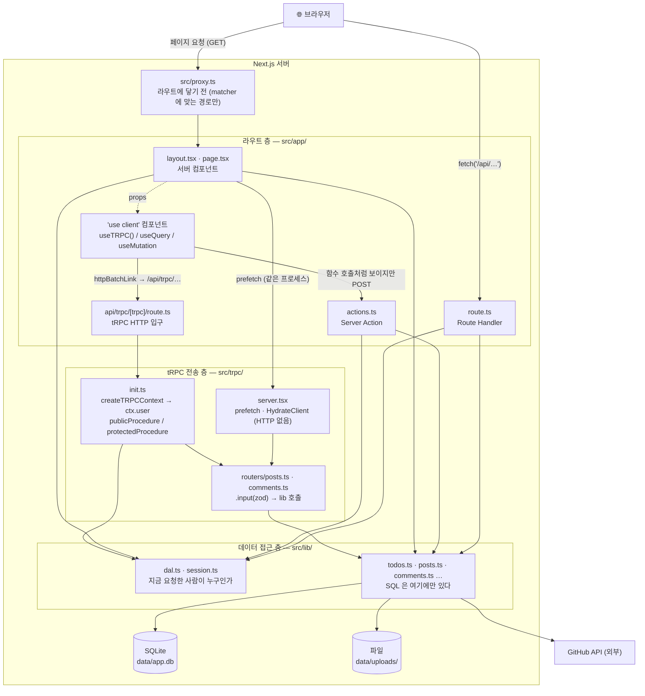
```mermaid
flowchart TB
  B["🌐 브라우저"]

  subgraph S["Next.js 서버"]
    direction TB
    P["src/proxy.ts<br/>라우트에 닿기 전 (matcher 에 맞는 경로만)"]

    subgraph R["라우트 층 — src/app/"]
      direction LR
      L["layout.tsx · page.tsx<br/>서버 컴포넌트"]
      C["'use client' 컴포넌트<br/>useTRPC() / useQuery / useMutation"]
      A["actions.ts<br/>Server Action"]
      H["route.ts<br/>Route Handler"]
      TR["api/trpc/[trpc]/route.ts<br/>tRPC HTTP 입구"]
    end

    subgraph T["tRPC 전송 층 — src/trpc/"]
      direction LR
      CTX["init.ts<br/>createTRPCContext → ctx.user<br/>publicProcedure / protectedProcedure"]
      RT["routers/posts.ts · comments.ts<br/>.input(zod) → lib 호출"]
      SV["server.tsx<br/>prefetch · HydrateClient (HTTP 없음)"]
    end

    subgraph D["데이터 접근 층 — src/lib/"]
      direction LR
      DAL["dal.ts · session.ts<br/>지금 요청한 사람이 누구인가"]
      LIB["todos.ts · posts.ts · comments.ts …<br/>SQL 은 여기에만 있다"]
    end

    DB[("SQLite<br/>data/app.db")]
    FS[("파일<br/>data/uploads/")]
  end

  GH["GitHub API (외부)"]

  B -->|"페이지 요청 (GET)"| P --> L
  L -.->|"props"| C
  C -->|"함수 호출처럼 보이지만 POST"| A
  B -->|"fetch('/api/…')"| H
  C -->|"httpBatchLink → /api/trpc/…"| TR --> CTX --> RT
  L -->|"prefetch (같은 프로세스)"| SV --> RT
  CTX --> DAL
  RT --> LIB
  L & A & H --> DAL
  L & A & H --> LIB
  LIB --> DB
  LIB --> FS
  LIB --> GH
```

| 층 | 폴더 | 하는 일 | 하지 않는 일 |
| --- | --- | --- | --- |
| proxy | `src/proxy.ts` | 쿠키만 보고 리다이렉트, CORS 헤더 | DB 조회, 진짜 권한 검사 |
| 라우트 | `src/app/**` | 화면 그리기, 폼 받기, JSON 응답 | SQL 직접 쓰기 |
| **tRPC 전송** | `src/trpc/**` | 입력 검증, 로그인 검사, 프로시저 → lib 호출, 타입을 브라우저까지 전달 | SQL, 캐시 저장 |
| 데이터 접근 | `src/lib/**` | SQL, 파일, 외부 API, 세션 검증 | 화면 관련 코드 |
| 저장소 | `data/` | SQLite 파일, 업로드 이미지 | — |

### 0-2. 폴더 지도

```
src/
├── proxy.ts                 ← 요청이 라우트에 닿기 전에 실행
├── trpc/                    ← ★ 이 브랜치에서 추가
│   ├── init.ts              ← 컨텍스트, publicProcedure / protectedProcedure, 로그 미들웨어
│   ├── routers/
│   │   ├── _app.ts          ← appRouter 와 AppRouter "타입" (브라우저로 건너가는 유일한 것)
│   │   ├── posts.ts         ← list(커서), search, byId — 조회만
│   │   └── comments.ts      ← list, add, remove
│   ├── client.tsx           ← TRPCReactProvider, useTRPC (브라우저용)
│   ├── server.tsx           ← trpc 프록시, prefetch, HydrateClient (서버 컴포넌트용)
│   ├── query-client.ts      ← QueryClient 공장 (superjson, pending 도 dehydrate)
│   └── router.test.ts       ← createCaller 로 HTTP 없이 테스트
├── app/
│   ├── layout.tsx           ← TRPCReactProvider 로 앱 전체를 감싼다
│   ├── api/trpc/[trpc]/route.ts   ← ★ 모든 브라우저 tRPC 호출의 HTTP 입구
│   ├── posts/[id]/
│   │   ├── comments-section.tsx   ← 서버: 세션 읽기 + prefetch + HydrateClient
│   │   ├── comment-threads.tsx    ← ★ 클라이언트: useQuery 로 목록 그리기
│   │   ├── comment-form.tsx       ← useMutation (main 은 useActionState)
│   │   └── delete-comment-button.tsx  ← useMutation
│   ├── (demos)/
│   │   ├── layout.tsx             ← QueryProviders 없음 (루트로 이동)
│   │   ├── client-fetch/post-search-trpc.tsx  ← ★ 4번째 검색 (tRPC)
│   │   └── feed/post-feed.tsx     ← infiniteQueryOptions
│   └── (나머지는 main 과 같다)
├── components/              ← query-providers.tsx 는 삭제됨
├── lib/                     ← main 과 동일 (SQL, 세션, 공개 API 인프라)
└── stores/, hooks/, test/
```

### 0-3. 터미널 로그로 따라가기

| 접두어 | 뜻 | 어디서 찍히나 |
| --- | --- | --- |
| `[proxy]` | 라우트에 닿기 전 | `src/proxy.ts` |
| `[render]` | 서버 컴포넌트가 데이터 함수를 호출함 | page.tsx 와 서버 컴포넌트들 |
| `[cache]` | `"use cache"` 함수의 몸체가 실제로 실행됨 (= 캐시 MISS) | `posts.ts`, `comments.ts`, `github.ts` |
| `[session]` | 세션 쿠키 발급·삭제·검증 | `session.ts`, `dal.ts` |
| `[action]` | Server Action 실행 | `actions.ts` 들 |
| `[api]` | Route Handler 실행. tRPC HTTP 입구도 여기 | `src/lib/api/route.ts`, `api/trpc/[trpc]/route.ts` |
| `[trpc]` | 프로시저 시작·성공·실패, 입력값, 소요 시간 | `src/trpc/init.ts` 의 로그 미들웨어 |
| `[build]` | 빌드 시점에 실행되는 것 | `generateStaticParams` |

브라우저에서 온 tRPC 호출은 `[api] GET /api/trpc/comments.list → tRPC HTTP 입구` 뒤에 `[trpc] comments.list (query) 시작` 이 붙는다. 서버 컴포넌트의 prefetch 는 HTTP 를 안 거치므로 `[api]` 없이 `[trpc]` 만 찍힌다. 이 차이로 "누가 불렀는지" 를 알 수 있다.

### 0-4. 다이어그램 읽는 법

- **시퀀스 다이어그램**: 위에서 아래로 시간이 흐른다. 실선 화살표는 요청, 점선은 응답.
- **흐름도**: 마름모는 분기. 실선은 호출, 점선은 데이터 전달.
- 이 문서의 그림은 Mermaid 로 그려서 GitHub, VS Code 미리보기, 대부분의 마크다운 뷰어에서 그림으로 보인다.

---

## 1장. 서버가 켜질 때

### 🚶 흐름

`npm run dev` 를 치면 아직 아무 요청도 없지만 몇 가지가 미리 준비된다. 정확히는 **"처음 import 되는 순간"** 실행되는 코드들이다. 이 장은 main 과 같다.

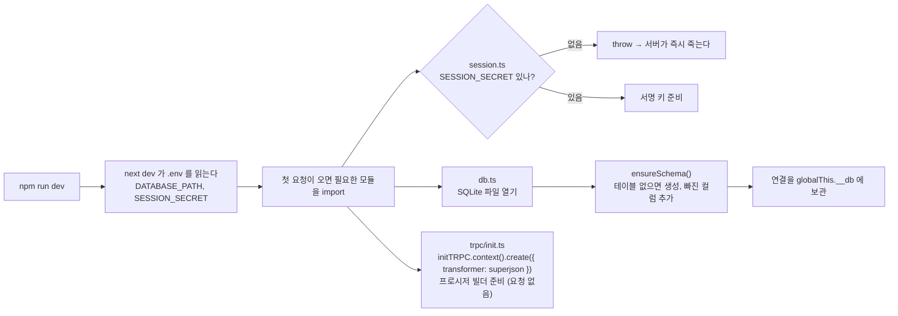
```mermaid
flowchart LR
  A["npm run dev"] --> B["next dev 가 .env 를 읽는다<br/>DATABASE_PATH, SESSION_SECRET"]
  B --> C["첫 요청이 오면 필요한 모듈을 import"]
  C --> D{"session.ts<br/>SESSION_SECRET 있나?"}
  D -->|없음| E["throw → 서버가 즉시 죽는다"]
  D -->|있음| F["서명 키 준비"]
  C --> G["db.ts<br/>SQLite 파일 열기"]
  G --> H["ensureSchema()<br/>테이블 없으면 생성, 빠진 컬럼 추가"]
  H --> I["연결을 globalThis.__db 에 보관"]
  C --> J["trpc/init.ts<br/>initTRPC.context().create({ transformer: superjson })<br/>프로시저 빌더 준비 (요청 없음)"]
```

### 📄 파일

| 파일 | 역할 |
| --- | --- |
| `.env` | `DATABASE_PATH`(기본 `data/app.db`), `SESSION_SECRET` |
| `next.config.ts` | `cacheComponents: true`. 옛 주소 리다이렉트 |
| `src/lib/db.ts` | SQLite 연결 하나를 앱 전체가 공유. `server-only` |
| `src/lib/schema.ts` | `CREATE TABLE IF NOT EXISTS` + 수동 마이그레이션 |
| `src/lib/session.ts` | import 시점에 `SESSION_SECRET` 검사 |
| `src/trpc/init.ts` | tRPC 인스턴스. 요청이 오기 전에는 "빌더" 만 만들어 둔다. 컨텍스트는 요청마다 |

### 💡 개념

**모듈은 한 번만 실행된다.** DB 연결처럼 "앱에 하나만 있어야 하는 것" 을 모듈 최상위에 둔다. 개발 모드 HMR 을 위해 `globalThis` 에 보관한다.

**`server-only`.** 이 한 줄을 import 한 파일을 클라이언트 컴포넌트가 import 하면 빌드가 실패한다. `src/trpc/server.tsx` 에도 붙어 있다. 서버 프록시가 브라우저 번들에 들어가면 안 되기 때문이다. 반대로 `src/trpc/client.tsx` 는 `"use client"` 다.

**타입만 건너간다.** `client.tsx` 는 `import type { AppRouter }` 로 라우터의 **타입만** 가져온다. `import type` 은 컴파일 후 사라지므로 라우터 구현(DB, 세션)은 브라우저 번들에 들어가지 않는다.

---

## 2장. 첫 접속: 홈 (`GET /`)

### 🚶 흐름

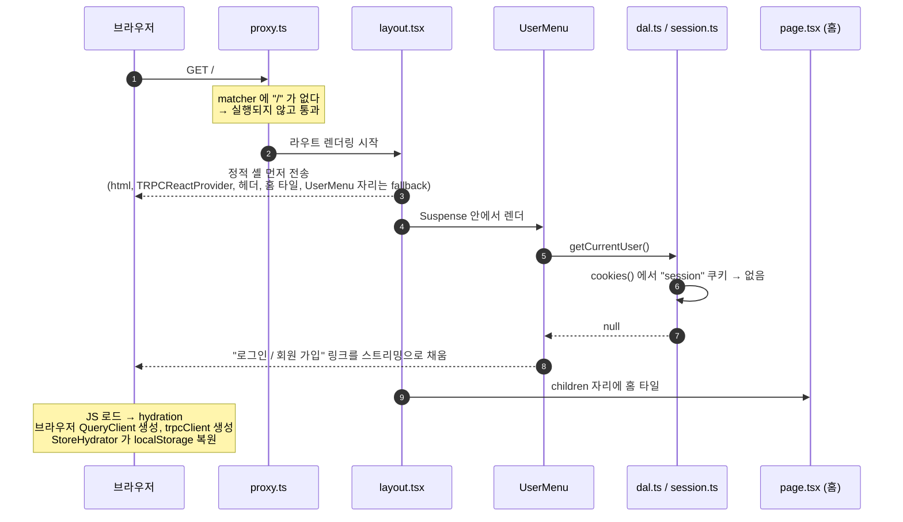
```mermaid
sequenceDiagram
  autonumber
  participant B as 브라우저
  participant P as proxy.ts
  participant L as layout.tsx
  participant U as UserMenu
  participant D as dal.ts / session.ts
  participant Pg as page.tsx (홈)

  B->>P: GET /
  Note over P: matcher 에 "/" 가 없다<br/>→ 실행되지 않고 통과
  P->>L: 라우트 렌더링 시작
  L-->>B: 정적 셸 먼저 전송<br/>(html, TRPCReactProvider, 헤더, 홈 타일, UserMenu 자리는 fallback)
  L->>U: Suspense 안에서 렌더
  U->>D: getCurrentUser()
  D->>D: cookies() 에서 "session" 쿠키 → 없음
  D-->>U: null
  U-->>B: "로그인 / 회원 가입" 링크를 스트리밍으로 채움
  L->>Pg: children 자리에 홈 타일
  Note over B: JS 로드 → hydration<br/>브라우저 QueryClient 생성, trpcClient 생성<br/>StoreHydrator 가 localStorage 복원
```

1. **proxy 는 실행되지 않는다.** `config.matcher` 는 `/login`, `/signup`, `/posts/:id/edit`, `/api/v1/*` 만 잡는다.
2. **루트 레이아웃** `src/app/layout.tsx` 가 `<html>`, `<body>` 를 그리고, **`<ThemeProvider>` 와 `<TRPCReactProvider>` 로 헤더(`src/components/site-header.tsx`)부터 children 까지 전부 감싼다.** 헤더에는 "할 일", "글" 링크와 테마 토글이 있고, 세션을 읽는 사용자 메뉴만 `<Suspense>` 로 감싸져 있다. main 에서 `(demos)/layout.tsx` 에 있던 TanStack Query Provider 가 이 안으로 들어와 루트로 올라왔다. 댓글(`/posts/[id]`)과 데모 페이지가 모두 쓰기 때문이다.
3. **사용자 메뉴** 는 main 과 같은 체인으로 로그인 여부를 확인한다.

   ```
   UserMenu
     → getCurrentUser()        src/lib/dal.ts      react cache(): 한 요청에 한 번만 실행
       → getSessionUserId()    src/lib/session.ts  cookies() 에서 "session" 쿠키 읽기
         → decrypt()           jose 로 JWT 서명 검증
       → findUserById()        src/lib/users.ts    SELECT id, name, email FROM users
   ```

4. **홈 페이지** `src/app/page.tsx` 는 순수 서버 컴포넌트라 정적 HTML 로 굳어 있다.
5. **브라우저에서 hydration.** `TRPCReactProvider` 가 브라우저용 `QueryClient` 하나와 `trpcClient`(httpBatchLink) 하나를 만든다. 이 둘은 페이지를 이동해도 유지된다. 첫 방문부터 Link 이동, prefetch, 스트리밍까지 로딩의 전체 여정은 **부록 C** 에, 이 책의 용어는 **부록 D** 에 모아 두었다.

### 📄 파일

| 파일 | 종류 | 역할 |
| --- | --- | --- |
| `src/app/layout.tsx` | 서버 | 껍데기 + `ThemeProvider` + `TRPCReactProvider` |
| `src/components/site-header.tsx` | 서버 | 헤더. 브랜드, 섹션 네비, 테마 토글, `UserMenu`(Suspense) |
| `src/components/nav-link.tsx` | 클라이언트 | `usePathname` 으로 현재 섹션에 `aria-current` 와 밑줄 |
| `src/components/theme-provider.tsx`, `theme-toggle.tsx` | 클라이언트 | `next-themes`. `<html class="dark">` 를 붙였다 떼고, 해/달 버튼으로 전환 |
| `src/trpc/client.tsx` | 클라이언트 | `QueryClientProvider` > `TRPCProvider` > children + DevTools. `useTRPC` 훅 export |
| `src/trpc/query-client.ts` | 공용 | `QueryClient` 공장. `staleTime` 30초, superjson, pending 쿼리도 dehydrate |
| `src/components/user-menu.tsx` | 서버 | 세션을 읽는 유일한 헤더 부품 |
| `src/components/store-hydrator.tsx` | 클라이언트 | 마운트 후 `rehydrate()` |

### 💡 개념

**서버 컴포넌트와 클라이언트 컴포넌트.** 파일 맨 위에 `"use client"` 가 없으면 서버 컴포넌트다. tRPC 에서는 이 구분이 더 중요하다. 서버 컴포넌트는 `src/trpc/server.tsx` 의 `trpc` 를, 클라이언트 컴포넌트는 `src/trpc/client.tsx` 의 `useTRPC()` 를 쓴다. 모양은 같고(`trpc.comments.list.queryOptions(...)`) 실행 경로가 다르다. 이 구분이 잘 안 와닿으면 **부록 A** 를 먼저 읽고 돌아와도 된다.

**QueryClient 는 어디서 실행되느냐에 따라 다르게 만든다.**

| 실행 위치 | 만드는 법 | 이유 |
| --- | --- | --- |
| 서버 (SSR, `typeof window === "undefined"`) | 요청마다 새로 | 모듈 변수에 하나를 두면 사용자 A 의 캐시를 사용자 B 가 본다 |
| 브라우저 | 하나를 계속 재사용 | 페이지를 이동해도 캐시가 유지되어야 한다 |

`src/trpc/client.tsx` 의 `getQueryClient()` 와 `src/trpc/server.tsx` 의 `getQueryClient = cache(makeQueryClient)` 가 각각 이 규칙을 구현한다.

**Cache Components 와 정적 셸, hydration** 은 main 과 같다. 요청이 있어야 알 수 있는 값을 읽는 부분만 `<Suspense>` 안에 두고, 나머지는 빌드 때 미리 그린다.

### 🔍 터미널에서 보기

```
[session] getCurrentUser() → 비로그인 (세션 쿠키 없음). react cache(): 같은 요청 안에서는 이 로그가 한 번만 찍힌다
[render]  UserMenu ← 비로그인 (레이아웃 안이지만 쿠키를 읽으므로 Suspense 안에서 요청마다 실행)
```

---

## 3장. 할 일 목록: 읽고 바꾸기의 기본형 (`/todos`)

이 장은 main 과 완전히 같다. tRPC 를 얹은 브랜치에서도 **폼 제출로 데이터를 바꾸는 일은 Server Action 이 더 단순하다** 는 비교를 위해 그대로 남겨 두었다.

### 🚶 흐름 1: 목록 읽기

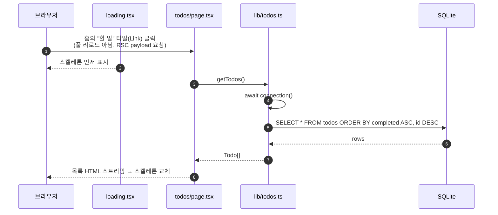
```mermaid
sequenceDiagram
  autonumber
  participant B as 브라우저
  participant Ld as loading.tsx
  participant Pg as todos/page.tsx
  participant T as lib/todos.ts
  participant DB as SQLite

  B->>Pg: 홈의 "할 일" 타일(Link) 클릭<br/>(풀 리로드 아님, RSC payload 요청)
  Ld-->>B: 스켈레톤 먼저 표시
  Pg->>T: getTodos()
  T->>T: await connection()
  T->>DB: SELECT * FROM todos ORDER BY completed ASC, id DESC
  DB-->>T: rows
  T-->>Pg: Todo[]
  Pg-->>B: 목록 HTML 스트리밍 → 스켈레톤 교체
```

### 🚶 흐름 2: 체크박스 클릭 (쓰기)

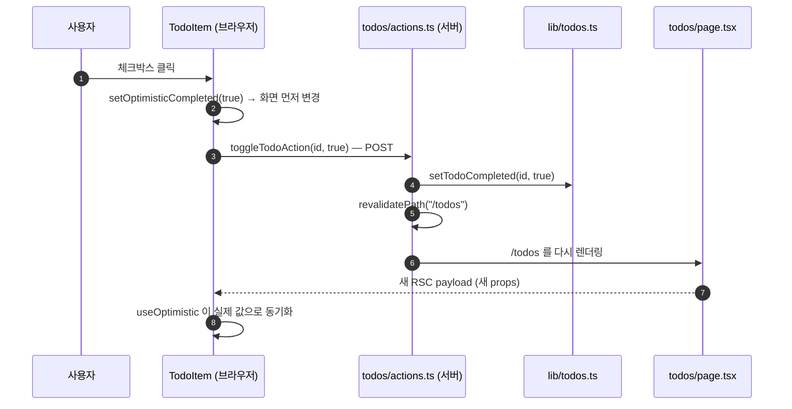
```mermaid
sequenceDiagram
  autonumber
  participant U as 사용자
  participant TI as TodoItem (브라우저)
  participant A as todos/actions.ts (서버)
  participant T as lib/todos.ts
  participant Pg as todos/page.tsx

  U->>TI: 체크박스 클릭
  TI->>TI: setOptimisticCompleted(true) → 화면 먼저 변경
  TI->>A: toggleTodoAction(id, true) — POST
  A->>T: setTodoCompleted(id, true)
  A->>A: revalidatePath("/todos")
  A->>Pg: /todos 를 다시 렌더링
  Pg-->>TI: 새 RSC payload (새 props)
  TI->>TI: useOptimistic 이 실제 값으로 동기화
```

핵심 규칙 세 가지.

1. **Server Action 은 `"use server"` 파일의 함수다.** 브라우저에서는 함수 호출처럼 보이지만 POST 요청이다. 안에서 실제로 무슨 일이 일어나는지는 **부록 B** 에 있다.
2. **바꾼 뒤에는 `revalidatePath("/todos")`.** 새 RSC payload 가 내려와 목록이 교체된다. **캐시가 한 층** 이다. 7장의 tRPC 댓글은 캐시가 두 층이라 이보다 할 일이 많다.
3. **서버에서 다시 검증한다.** `parseTitle`, `parseIds`.

### 🚶 흐름 3: 형제끼리 상태 공유 (zustand)

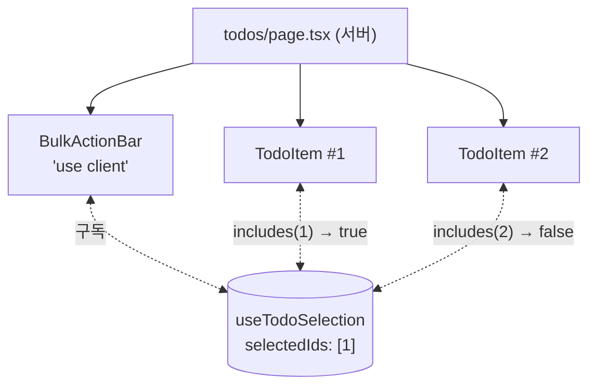
```mermaid
flowchart TB
  Pg["todos/page.tsx (서버)"]
  Pg --> BAR["BulkActionBar<br/>'use client'"]
  Pg --> T1["TodoItem #1"]
  Pg --> T2["TodoItem #2"]
  ST[("useTodoSelection<br/>selectedIds: [1]")]
  BAR <-.->|"구독"| ST
  T1 <-.->|"includes(1) → true"| ST
  T2 <-.->|"includes(2) → false"| ST
```

스토어에는 "어떤 id 를 골랐는가" 만 있다. 서버 데이터는 넣지 않는다.

### 📄 파일

`src/app/todos/*`, `src/lib/todos.ts`, `src/stores/todo-selection-store.ts`, `src/app/api/todos/route.ts` 모두 main 과 동일하다.

### 💡 개념

**`await connection()`**, **React 19 폼 훅 세 가지**(`useActionState`, `useTransition`, `useOptimistic`), **점진적 향상** 은 main 판 3장과 같다.

**Server Action vs tRPC mutation.** 같은 "데이터 바꾸기" 인데 두 방식이 이 앱에 공존한다.

| | Server Action (todos, 글) | tRPC mutation (댓글) |
| --- | --- | --- |
| 호출 | `<form action>` 또는 함수 호출 | `useMutation(...).mutate(input)` |
| 입력 검증 | 액션 안에서 직접 | `.input(zod)` 가 본문 전에 |
| 로그인 검사 | 액션마다 `getCurrentUser()` | `protectedProcedure` 미들웨어 한 곳 |
| 에러 전달 | `{ error }` 객체 반환 | `TRPCError` throw → `onError` |
| 화면 갱신 | `revalidatePath` 하나 | 서버 태그 + 브라우저 `invalidateQueries` 둘 |
| JS 없이 동작 | 폼이면 된다 | 안 된다 |
| 단위 테스트 | 어렵다 (FormData, 훅에 묶임) | `createCaller` 로 쉽다 |

---

## 4장. 글 목록: 캐시가 들어온다 (`/posts`)

이 장도 main 과 같다. 글 목록은 tRPC 를 거치지 않는다.

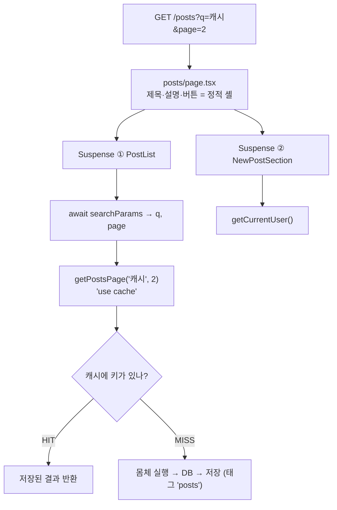
```mermaid
flowchart TB
  B["GET /posts?q=캐시&page=2"] --> Pg["posts/page.tsx<br/>제목·설명·버튼 = 정적 셸"]
  Pg --> S1["Suspense ① PostList"]
  Pg --> S2["Suspense ② NewPostSection"]
  S1 --> SP["await searchParams → q, page"]
  SP --> GP["getPostsPage('캐시', 2)<br/>'use cache'"]
  GP --> K{"캐시에 키가 있나?"}
  K -->|"HIT"| R1["저장된 결과 반환"]
  K -->|"MISS"| R2["몸체 실행 → DB → 저장 (태그 'posts')"]
  S2 --> GU["getCurrentUser()"]
```

핵심만 다시 적으면:

- `PostList` 는 `searchParams` 를 꺼낸 **뒤** `getPostsPage(query, page)` 에 인자로 넘긴다. 캐시 함수 안에서는 요청 API 를 못 읽는다.
- 검색창은 디바운스 → `router.replace("/posts?q=…")` → 서버 재렌더. 검색은 서버가 한다.
- 무효화 네 가지: `updateTag`(즉시), `revalidateTag(tag, "max")`(백그라운드), `revalidateTag(tag, { expire: 0 })`(Route Handler 와 **tRPC 프로시저** 에서), `revalidatePath`.

| 함수 | 다음 요청이 겪는 일 | 이 앱에서 |
| --- | --- | --- |
| `updateTag(tag)` | 새 데이터가 만들어질 때까지 기다렸다가 받음 | 글 작성·수정·삭제 (Server Action) |
| `revalidateTag(tag, "max")` | 옛 데이터를 받고, 뒤에서 새로 만듦 | "백그라운드 갱신" 버튼 |
| `revalidateTag(tag, { expire: 0 })` | 옛 값을 주지 않고 바로 새로 만듦 | 공개 API, **tRPC 댓글 프로시저** |
| `revalidatePath(path)` | 그 경로를 다음에 볼 때 페이지 전체 재렌더 | `/todos` |

**캐시된 값은 모두가 공유한다.** 캐시 함수 안에서 현재 사용자를 읽으면 안 된다. 7장에서 이 규칙이 tRPC 와 만나는 모습을 본다.

### 🔍 터미널에서 보기

```
[render]  PostList → getPostsPage(query="", page=1) 호출
[cache]   MISS(실행 시각 10:00:01.234) getPostsPage(...) — 몸체 실행, DB 조회 2번
[render]  PostList ← 12건, cachedAt=…
```

---

## 5장. 글 상세: 동적 라우트와 스트리밍 (`/posts/3`)

라우트 구조는 main 과 같다. 다른 것은 네 Suspense 영역 중 **댓글** 의 내부 구현(7장)이다.

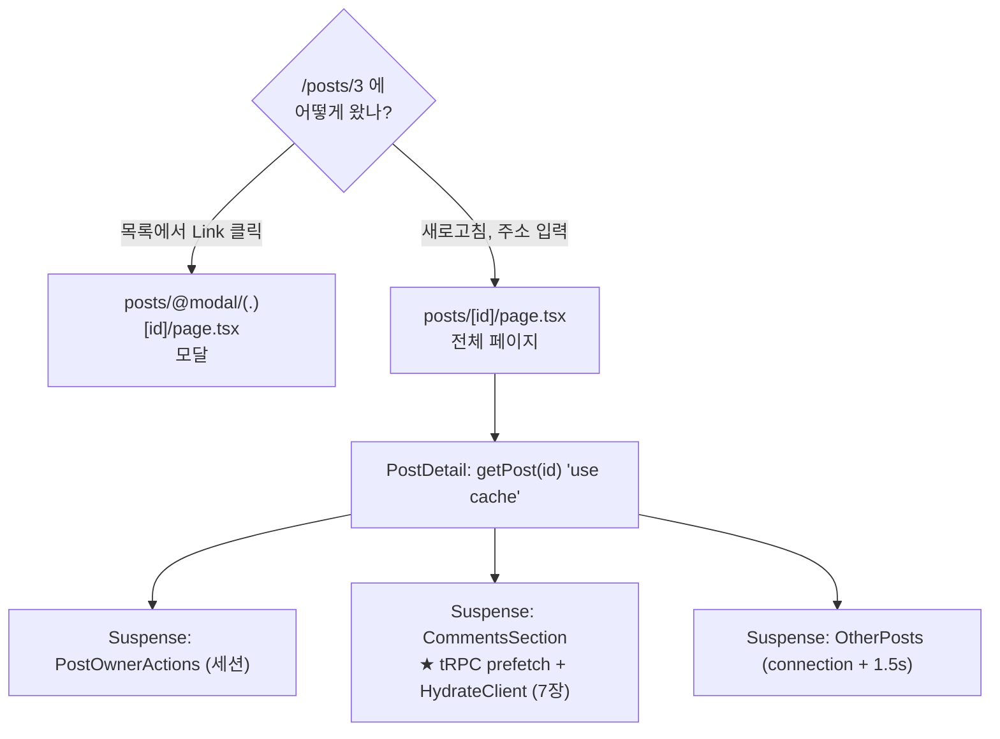
```mermaid
flowchart TB
  A{"/posts/3 에<br/>어떻게 왔나?"}
  A -->|"목록에서 Link 클릭"| M["posts/@modal/(.)[id]/page.tsx<br/>모달"]
  A -->|"새로고침, 주소 입력"| F["posts/[id]/page.tsx<br/>전체 페이지"]
  F --> PD["PostDetail: getPost(id) 'use cache'"]
  PD --> S1["Suspense: PostOwnerActions (세션)"]
  PD --> S2["Suspense: CommentsSection<br/>★ tRPC prefetch + HydrateClient (7장)"]
  PD --> S3["Suspense: OtherPosts (connection + 1.5s)"]
```

```
시간 →  0ms         ~50ms              ~100ms             ~1600ms
셸      ████████████████████████████████████████████████████████
본문    ░░░░░░░░░░░░████████████████████████████████████████████  getPost(3) 캐시
버튼    ░░░░░░░░░░░░░░░░░░░░░░░░░░████████████████████████████████  세션
댓글    ░░░░░░░░░░░░░░░░░░░░░░░░░░████████████████████████████████  세션 + tRPC prefetch (pending 상태로 스트리밍)
다른글  ░░░░░░░░░░░░░░░░░░░░░░░░░░░░░░░░░░░░░░░░░░░░░░░░░░░░░░████  1.5초 지연
```

| 상황 | 어느 파일 |
| --- | --- |
| 목록에서 상세로 이동, 응답 전 | `posts/[id]/loading.tsx` |
| `/posts/9999`, `/posts/abc` | `posts/[id]/not-found.tsx` |
| "에러 발생시키기" 버튼 | `posts/error.tsx` |
| `/p/3` | `p/[id]/page.tsx` — Suspense 밖에서 `permanentRedirect` → 진짜 308 |
| `/blog/3`, `/articles`, `/posts/feed` | `next.config.ts` 의 `redirects()` |

**동적 라우트, `generateStaticParams`, 태그 두 개, `next/dynamic`** 은 main 판 5장과 같다.

---

## 6장. 인증: 누구인지 확인하기

인증의 뼈대는 main 과 같다. 세션은 JWT 쿠키, 검증은 세 층. 이 브랜치에서는 **tRPC 컨텍스트** 가 같은 `getCurrentUser()` 를 한 번 더 감싸고, **`protectedProcedure`** 가 3층의 새 입구가 된다.

### 🚶 흐름 1: 회원 가입과 로그인

main 과 동일하다. `AuthForm` → `loginAction` → Zod → `findUserWithHashByEmail` → `verifyPassword`(scrypt + `timingSafeEqual`) → `createSession`(JWT, `httpOnly`, `sameSite: lax`, 7일) → `redirect("/posts")`. 실패는 이메일 없음과 비밀번호 틀림을 구분하지 않는다.

### 🚶 흐름 2: 로그인 뒤의 모든 요청

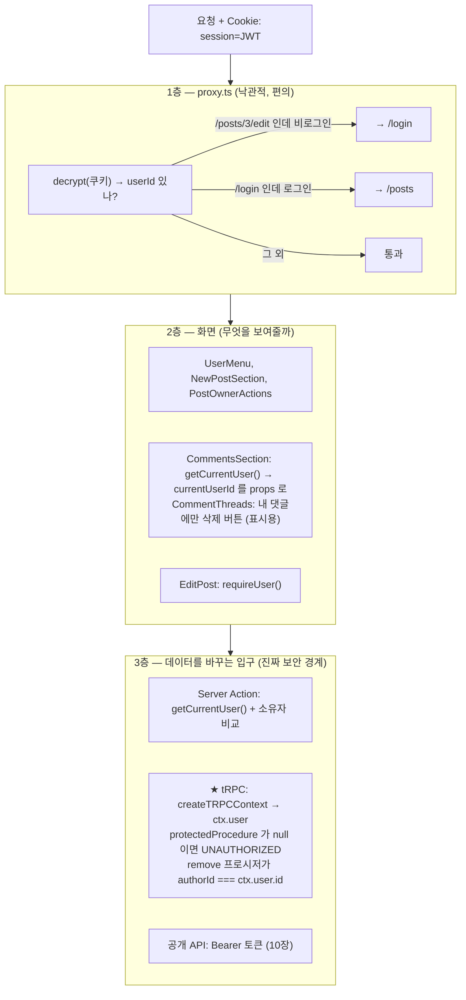
```mermaid
flowchart TB
  REQ["요청 + Cookie: session=JWT"]

  subgraph L1["1층 — proxy.ts (낙관적, 편의)"]
    P1["decrypt(쿠키) → userId 있나?"]
    P1 -->|"/posts/3/edit 인데 비로그인"| R1["→ /login"]
    P1 -->|"/login 인데 로그인"| R2["→ /posts"]
    P1 -->|"그 외"| PASS["통과"]
  end

  subgraph L2["2층 — 화면 (무엇을 보여줄까)"]
    U1["UserMenu, NewPostSection, PostOwnerActions"]
    U4["CommentsSection: getCurrentUser() → currentUserId 를 props 로<br/>CommentThreads: 내 댓글에만 삭제 버튼 (표시용)"]
    U5["EditPost: requireUser()"]
  end

  subgraph L3["3층 — 데이터를 바꾸는 입구 (진짜 보안 경계)"]
    A1["Server Action: getCurrentUser() + 소유자 비교"]
    A2["★ tRPC: createTRPCContext → ctx.user<br/>protectedProcedure 가 null 이면 UNAUTHORIZED<br/>remove 프로시저가 authorId === ctx.user.id"]
    A4["공개 API: Bearer 토큰 (10장)"]
  end

  REQ --> L1 --> L2 --> L3
```

| 층 | 무엇을 보나 | 뚫리면 |
| --- | --- | --- |
| proxy | 쿠키 서명만 | 아무 일 없음 |
| 화면 | `getCurrentUser()`. tRPC 댓글은 `currentUserId` 를 **props 로 클라이언트에 넘긴다** | 버튼이 보일 뿐. 브라우저에서 `currentUserId` 를 조작해도 삭제는 서버가 막는다 |
| 액션 / 프로시저 / API | 세션 또는 토큰 + 소유자 비교 | **여기가 뚫리면 데이터가 바뀐다** |

### 🚶 흐름 3: tRPC 안에서 인증이 흐르는 길

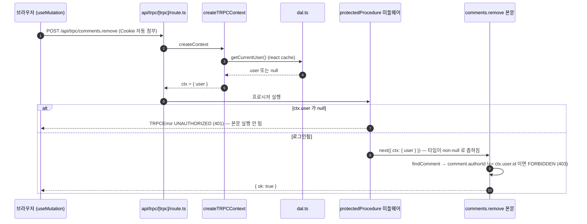
```mermaid
sequenceDiagram
  autonumber
  participant B as 브라우저 (useMutation)
  participant R as api/trpc/[trpc]/route.ts
  participant CX as createTRPCContext
  participant D as dal.ts
  participant MW as protectedProcedure 미들웨어
  participant PR as comments.remove 본문

  B->>R: POST /api/trpc/comments.remove (Cookie 자동 첨부)
  R->>CX: createContext
  CX->>D: getCurrentUser() (react cache)
  D-->>CX: user 또는 null
  CX-->>R: ctx = { user }
  R->>MW: 프로시저 실행
  alt ctx.user 가 null
    MW-->>B: TRPCError UNAUTHORIZED (401) — 본문 실행 안 됨
  else 로그인됨
    MW->>PR: next({ ctx: { user } }) — 타입이 non-null 로 좁혀짐
    PR->>PR: findComment → comment.authorId !== ctx.user.id 이면 FORBIDDEN (403)
    PR-->>B: { ok: true }
  end
```

- **tRPC 는 세션 쿠키로 인증한다.** 화면용 전송 층이므로 브라우저가 자동으로 붙이는 쿠키를 그대로 쓴다. 공개 API(`/api/v1`)의 Bearer 토큰과는 다른 길이다.
- **작성자는 `ctx.user.id` 에서 가져온다.** 클라이언트가 보낸 `authorId` 같은 값을 믿지 않는다.
- **`createTRPCContext` 도 react `cache()`** 다. 서버 컴포넌트의 prefetch 와 같은 요청 안의 다른 호출이 컨텍스트를 여러 번 만들어도 쿠키 검증과 DB 조회는 한 번이다.

### 🚶 흐름 4: 인증이 녹아 있는 곳 전체 목록

| 어디 | 파일 | 무엇을 하나 | 실패 시 |
| --- | --- | --- | --- |
| 프록시 | `src/proxy.ts` | `/posts/:id/edit` 비로그인 → `/login` | 리다이렉트 |
| 헤더 | `src/components/user-menu.tsx` | 이름 표시, 로그아웃 폼 | 로그인/가입 링크 |
| 글 목록 | `src/app/posts/page.tsx` `NewPostSection` | 로그인 시 글쓰기 폼 | "로그인하세요" |
| 글 상세 | `src/app/posts/[id]/post-owner-actions.tsx` | 작성자면 수정·삭제 버튼 | 안내 문구 |
| 글 수정 페이지 | `src/app/posts/[id]/edit/page.tsx` | `requireUser()`, 작성자 비교 | redirect |
| 댓글 영역 (서버) | `src/app/posts/[id]/comments-section.tsx` | `getCurrentUser()` → `currentUserId` props | — |
| 댓글 영역 (클라이언트) | `src/app/posts/[id]/comment-threads.tsx` | `currentUserId === authorId` 면 삭제 버튼, 로그인 시 폼 | 표시만 다름 |
| 글 액션 | `src/app/posts/actions.ts` | 작성: 로그인. 수정·삭제: 작성자 | redirect 또는 에러 객체 |
| ★ tRPC 컨텍스트 | `src/trpc/init.ts` `createTRPCContext` | 쿠키 → `ctx.user` | `user: null` |
| ★ tRPC 미들웨어 | `src/trpc/init.ts` `protectedProcedure` | `ctx.user` 없으면 throw | `UNAUTHORIZED` 401 |
| ★ 댓글 프로시저 | `src/trpc/routers/comments.ts` | `add`: 로그인. `remove`: `authorId === ctx.user.id` | `FORBIDDEN` 403 |
| 공개 API | `src/lib/api/auth.ts` | Bearer 토큰 → `Principal` | 401 / 403 JSON |
| 할 일 | `src/app/todos/actions.ts` | **검사 없음** | 소유자 개념이 없는 공유 목록 |

### 📄 파일

| 파일 | 핵심 |
| --- | --- |
| `src/app/(auth)/*`, `src/lib/password.ts`, `src/lib/session.ts`, `src/lib/dal.ts`, `src/lib/users.ts` | main 과 동일 |
| `src/trpc/init.ts` | `createTRPCContext = cache(async () => ({ user: await getCurrentUser() }))`. `protectedProcedure` 는 `t.procedure.use(logger).use(auth)` |
| `src/trpc/routers/comments.ts` | `add`, `remove` 가 `protectedProcedure`. `remove` 안에서 소유자 비교 |

### 💡 개념

**비밀번호 해시, JWT 쿠키, react `cache()`, 계정 열거 방지** 는 main 판 6장과 같다.

**미들웨어와 타입 좁히기.** `protectedProcedure` 의 미들웨어는 `next({ ctx: { user: ctx.user } })` 로 컨텍스트를 덮어쓴다. TypeScript 가 이 덮어쓴 `ctx` 에서 `user` 가 `null` 이 아니라고 추론하므로, 프로시저 본문은 `ctx.user.id` 를 `!` 없이 쓴다. Server Action 에서는 액션마다 `if (!user) return { error }` 를 반복했던 것이 한 곳으로 모였고, 프로시저 정의에 `protectedProcedure` 라고 적는 것 자체가 문서가 된다.

**Cache Components 에서 세션 다루기.** `cookies()` 를 읽는 컴포넌트는 Suspense 안에, `"use cache"` 함수 안에서는 못 읽는다. tRPC 판 댓글은 이 규칙을 "서버 컴포넌트가 세션을 읽어 `currentUserId` 를 props 로 넘기고, 목록은 캐시된 프로시저 결과를 쓴다" 로 푼다 (7장).

### 🔍 터미널에서 보기

```
[api]     POST /api/trpc/comments.remove → tRPC HTTP 입구 (mutation)
[session] getCurrentUser() → userId=2 (게스트). react cache(): …
[trpc]    comments.remove (mutation) 시작 — 사용자: 게스트(#2) { id: 7 }
[trpc]      ↳ comments.remove 실패 FORBIDDEN: 본인이 쓴 댓글만 삭제할 수 있습니다. (1.8ms)
```

---

## 7장. 댓글: tRPC 로 읽고 쓰기

이 장이 브랜치의 핵심이다. main 은 서버 컴포넌트가 댓글을 직접 그리고 Server Action 이 바꿨다. 여기서는 **서버가 첫 데이터를 미리 채워 넘기고, 브라우저가 이어받아 그리고, 이후 갱신은 브라우저 캐시가 맡는다.**

### 🚶 흐름 1: 역할 분담

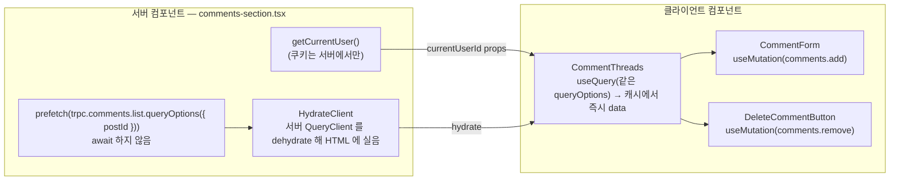
```mermaid
flowchart LR
  subgraph SRV["서버 컴포넌트 — comments-section.tsx"]
    S1["getCurrentUser()<br/>(쿠키는 서버에서만)"]
    S2["prefetch(trpc.comments.list.queryOptions({ postId }))<br/>await 하지 않음"]
    S3["HydrateClient<br/>서버 QueryClient 를 dehydrate 해 HTML 에 실음"]
  end
  subgraph CLI["클라이언트 컴포넌트"]
    C1["CommentThreads<br/>useQuery(같은 queryOptions) → 캐시에서 즉시 data"]
    C2["CommentForm<br/>useMutation(comments.add)"]
    C3["DeleteCommentButton<br/>useMutation(comments.remove)"]
  end
  S1 -->|"currentUserId props"| C1
  S2 --> S3 -->|"hydrate"| C1
  C1 --> C2
  C1 --> C3
```

| 누가 | 무엇을 | 왜 |
| --- | --- | --- |
| 서버 컴포넌트 | 세션 읽기, 첫 데이터 prefetch, hydrate 경계 | `cookies()` 는 서버에서만. 첫 렌더에 "로딩 중" 이 안 보이게 |
| `CommentThreads` (클라이언트) | 캐시에서 데이터 읽어 그리기 | 이후 갱신에 반응하려면 목록이 TanStack Query 캐시를 구독해야 한다 |
| `CommentForm`, `DeleteCommentButton` | mutation + 브라우저 캐시 무효화 | 페이지 전체를 다시 렌더하지 않고 목록만 다시 가져온다 |

### 🚶 흐름 2: 첫 렌더 — prefetch 와 hydrate

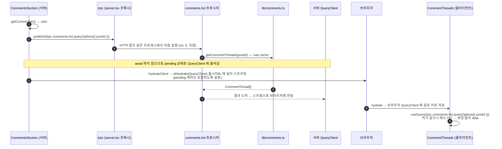
```mermaid
sequenceDiagram
  autonumber
  participant CS as CommentsSection (서버)
  participant SP as trpc (server.tsx 프록시)
  participant PR as comments.list 프로시저
  participant L as lib/comments.ts
  participant QC as 서버 QueryClient
  participant B as 브라우저
  participant CT as CommentThreads (클라이언트)

  CS->>CS: getCurrentUser() → user
  CS->>SP: prefetch(trpc.comments.list.queryOptions({ postId }))
  SP->>PR: HTTP 없이 같은 프로세스에서 직접 실행 (ctx 도 직접)
  PR->>L: getCommentThreads(postId) — 'use cache'
  Note over CS,QC: await 하지 않으므로 pending 상태로 QueryClient 에 들어감
  CS->>B: HydrateClient → dehydrate(QueryClient) 를 HTML 에 실어 스트리밍<br/>(pending 쿼리도 포함하도록 설정)
  L-->>PR: CommentThread[]
  PR-->>QC: 결과 도착 → 스트림으로 브라우저에 전달
  B->>CT: hydrate → 브라우저 QueryClient 에 같은 키로 저장
  CT->>CT: useQuery(trpc.comments.list.queryOptions({ postId }))<br/>키가 같으니 캐시 HIT → 로딩 없이 data
```

- **prefetch 를 `await` 하지 않는 이유**: 기다리면 이 서버 컴포넌트가 데이터 도착까지 멈춘다. 기다리지 않으면 쿼리는 pending 상태로 들어가고, `query-client.ts` 의 `shouldDehydrateQuery` 가 pending 도 넘기도록 설정되어 있어 브라우저가 "진행 중인 Promise" 를 이어받는다.
- **queryKey 가 같아야 한다.** 서버의 `prefetch(trpc.comments.list.queryOptions({ postId }))` 와 클라이언트의 `useQuery(trpc.comments.list.queryOptions({ postId }))` 가 같은 키 `[["comments","list"], { input: { postId }, type: "query" }]` 를 만든다.
- **서버 프록시는 HTTP 를 안 거친다.** `src/trpc/server.tsx` 의 `createTRPCOptionsProxy({ ctx, router })` 가 라우터를 같은 프로세스에서 직접 실행한다. 서버가 자기 자신의 `/api/trpc` 로 요청을 보내는 낭비가 없다.

### 🚶 흐름 3: 댓글 작성 — 캐시 두 층을 둘 다 지운다

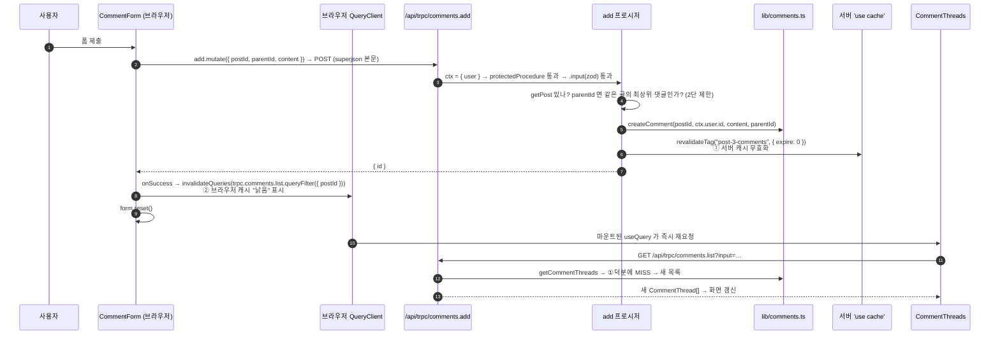
```mermaid
sequenceDiagram
  autonumber
  participant U as 사용자
  participant CF as CommentForm (브라우저)
  participant BQ as 브라우저 QueryClient
  participant R as /api/trpc/comments.add
  participant PR as add 프로시저
  participant L as lib/comments.ts
  participant SK as 서버 'use cache'
  participant CT as CommentThreads

  U->>CF: 폼 제출
  CF->>R: add.mutate({ postId, parentId, content }) → POST (superjson 본문)
  R->>PR: ctx = { user } → protectedProcedure 통과 → .input(zod) 통과
  PR->>PR: getPost 있나? parentId 면 같은 글의 최상위 댓글인가? (2단 제한)
  PR->>L: createComment(postId, ctx.user.id, content, parentId)
  PR->>SK: revalidateTag("post-3-comments", { expire: 0 })<br/>① 서버 캐시 무효화
  PR-->>CF: { id }
  CF->>BQ: onSuccess → invalidateQueries(trpc.comments.list.queryFilter({ postId }))<br/>② 브라우저 캐시 "낡음" 표시
  CF->>CF: form.reset()
  BQ->>CT: 마운트된 useQuery 가 즉시 재요청
  CT->>R: GET /api/trpc/comments.list?input=…
  R->>L: getCommentThreads → ① 덕분에 MISS → 새 목록
  R-->>CT: 새 CommentThread[] → 화면 갱신
```

**왜 둘 다 지워야 하나.**

| 지운 것 | 안 지운 것 | 결과 |
| --- | --- | --- |
| 서버 `"use cache"` 만 | 브라우저 캐시 | `staleTime`(30초) 안이라 재요청을 안 한다 → 화면 그대로 |
| 브라우저 캐시만 | 서버 `"use cache"` | 재요청은 나가지만 서버가 옛 캐시를 돌려준다 → 화면 그대로 |
| 둘 다 | — | 재요청이 나가고 서버가 새 목록을 만든다 → 화면 갱신 |

프로시저(서버 층)와 `onSuccess`(브라우저 층)가 각자 자기 층을 맡는다. main 의 Server Action 은 서버 캐시를 지우고 페이지를 다시 렌더링해 **한 층** 이었다. 이것이 tRPC 판의 추가 부담이다.

**왜 `updateTag` 가 아니라 `revalidateTag(…, { expire: 0 })` 인가.** tRPC 프로시저는 `/api/trpc/[trpc]/route.ts` 라는 일반 Route Handler 안에서 실행된다. `updateTag()` 는 Server Action 전용이라 여기서 부르면 에러다 (README 5-7). `{ expire: 0 }` 은 "지금 당장 만료" 라서 같은 효과를 낸다.

### 🚶 흐름 4: 댓글 삭제

`DeleteCommentButton` 은 `useMutation(trpc.comments.remove.mutationOptions({ onSuccess: invalidateQueries, onError: toast }))` 다. 프로시저는 `findComment` → `authorId !== ctx.user.id` 면 `FORBIDDEN` → `deleteComment` → `revalidateTag`. `postId` 를 props 로 받는 이유는 어느 글의 목록을 무효화할지 `queryFilter` 에 알려 줘야 하기 때문이다. 최상위 댓글을 지우면 답글은 DB 의 `ON DELETE CASCADE` 로 함께 지워진다.

### 📄 파일

| 파일 | 종류 | 핵심 |
| --- | --- | --- |
| `src/app/posts/[id]/comments-section.tsx` | 서버 | `getCurrentUser()` → `prefetch(...)` (await 없음) → `<HydrateClient><CommentThreads currentUserId /></HydrateClient>` |
| `src/app/posts/[id]/comment-threads.tsx` | 클라이언트 | `useQuery(trpc.comments.list.queryOptions({ postId }))`. `data` 타입은 라우터 반환 타입 |
| `src/app/posts/[id]/comment-form.tsx` | 클라이언트 | `<form onSubmit>` + `useMutation`. `mutationOptions` 의 `onSuccess` 는 캐시 무효화, `mutate` 의 두 번째 인자 `onSuccess` 는 폼 비우기 |
| `src/app/posts/[id]/delete-comment-button.tsx` | 클라이언트 | `useMutation(remove)`. props 에 `postId` |
| `src/app/posts/[id]/reply-toggle.tsx` | 클라이언트 | main 과 동일. children 으로 받은 폼을 열고 닫기만 |
| `src/trpc/routers/comments.ts` | 서버 | `list`(public), `add`/`remove`(protected). 2단 제한, 소유자 검사, `revalidateTag` |
| `src/trpc/server.tsx` | 서버 전용 | `trpc` 프록시, `prefetch`, `HydrateClient`, `caller` |
| `src/lib/comments.ts` | 서버 전용 | main 과 동일. `getCommentThreads` 는 `"use cache"` |

### 💡 개념

**`queryOptions` / `mutationOptions` / `queryFilter`.** tRPC v11 의 TanStack Query 통합은 "훅을 대신 만들어 주는" 방식이 아니라 "옵션을 만들어 주는" 방식이다.

| 헬퍼 | 만들어 주는 것 | 넘기는 곳 |
| --- | --- | --- |
| `trpc.x.y.queryOptions(input)` | `queryKey` + `queryFn`(→ GET `/api/trpc/x.y`) | `useQuery`, `prefetch` |
| `trpc.x.y.mutationOptions(opts)` | `mutationKey` + `mutationFn`(→ POST) | `useMutation` |
| `trpc.x.y.queryFilter(input)` | 키 필터 | `invalidateQueries` |
| `trpc.x.y.infiniteQueryOptions(input, opts)` | 커서 전달까지 포함한 옵션 | `useInfiniteQuery` (9장) |

`useQuery`, `useMutation` 자체는 TanStack Query 의 것이다. 그래서 `isPending`, `isFetching`, `placeholderData` 같은 개념은 fetch 버전과 완전히 같다.

**타입이 어디서 오나.** `useQuery(...)` 의 `data` 위에 마우스를 올리면 `CommentThread[]` 다. 이 타입은 어디에도 선언되어 있지 않다. `routers/comments.ts` 의 `list` 가 `getCommentThreads` 를 돌려주므로 그 반환 타입이 `AppRouter` 타입을 거쳐 `useTRPC()` 까지 흐른다. 서버에서 필드를 바꾸면 이 컴포넌트가 컴파일 에러로 알려 준다.

**서버 컴포넌트를 클라이언트 컴포넌트의 children 으로.** `ReplyToggle` 은 `"use client"` 지만 안에 들어가는 `CommentForm` 도 `"use client"` 다. main 과 달리 폼이 서버에서 만들어지지 않아도 되므로 그냥 클라이언트끼리 중첩이다.

### 🔍 터미널에서 보기

```
[render]  CommentsSection(postId=3) ← 현재 사용자 게스트. 이어서 tRPC comments.list 를 prefetch (HTTP 없이 서버 안에서 직접 실행)
[trpc]    comments.list (query) 시작 — 사용자: 게스트(#2) { postId: 3 }
[cache]   MISS(...) getCommentThreads(postId=3) — 몸체 실행, DB 조회. 태그: post-3-comments
[trpc]      ↳ comments.list 성공 (2.1ms)

(댓글 작성)
[api]     POST /api/trpc/comments.add → tRPC HTTP 입구 (mutation)
[trpc]    comments.add (mutation) 시작 — 사용자: 게스트(#2) { postId: 3, parentId: null, content: '…' }
[api]       ↳ revalidateTag(…, { expire: 0 }) "post-3-comments" — expire:0 → 옛 값을 내주지 않고 다음 요청이 바로 새로 만듦
[trpc]      ↳ comments.add 성공 (3.4ms)
[api]     GET /api/trpc/comments.list?… → tRPC HTTP 입구 (query)     ← onSuccess 의 invalidateQueries 가 일으킨 재요청
[trpc]    comments.list (query) 시작 …
[cache]   MISS(...) getCommentThreads(postId=3) …                    ← 서버 캐시도 지워졌으므로 MISS
```

첫 줄의 prefetch 에는 `[api]` 가 없고(HTTP 없음), 재요청에는 `[api]` 가 있다(브라우저에서 옴). 이것이 두 경로의 차이다.

---

## 8장. 이미지 업로드

main 과 완전히 같다. 글 작성/수정은 이 브랜치에서도 Server Action 이라 파일이 붙은 `multipart` 폼을 그대로 받는다. tRPC 로 파일을 보내려면 base64 로 부풀리거나 별도 업로드 흐름이 필요해서, "폼 + 파일" 은 Server Action 이 맞다는 비교 포인트로 남겨 두었다.

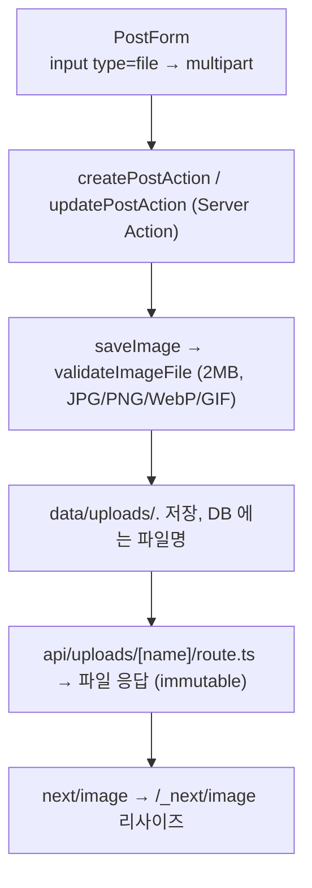
```mermaid
flowchart TB
  F["PostForm<br/>input type=file → multipart"]
  F --> A["createPostAction / updatePostAction (Server Action)"]
  A --> V["saveImage → validateImageFile (2MB, JPG/PNG/WebP/GIF)"]
  V --> W["data/uploads/<UUID>.<ext> 저장, DB 에는 파일명"]
  W --> H["api/uploads/[name]/route.ts → 파일 응답 (immutable)"]
  H --> I["next/image → /_next/image 리사이즈"]
```

파일: `src/lib/uploads.ts`, `src/lib/uploads-validate.ts`, `src/app/api/uploads/[name]/route.ts`, `src/app/posts/post-form.tsx`.

---

## 9장. 브라우저가 직접 데이터를 가져올 때

`(demos)` 라우트 그룹의 세 페이지는 **브라우저** 가 데이터를 가져온다. 이 브랜치는 여기에 "tRPC 로 가져오기" 를 나란히 놓아 fetch 버전과 비교한다.

### 🚶 흐름 1: 데모 그룹의 공통 껍데기

```
src/app/(demos)/
├── layout.tsx      ← PostsNav 만. QueryProviders 는 없다 (루트의 TRPCReactProvider 가 대신)
├── template.tsx    ← 세그먼트가 바뀔 때마다 새로 마운트 → 진입 애니메이션 재생
├── client-fetch/   ← 검색 4종
├── feed/           ← 무한 스크롤 (tRPC)
└── releases/       ← 외부 API + use()
```

### 🚶 흐름 2: `/client-fetch` — 같은 일을 네 가지 방법으로

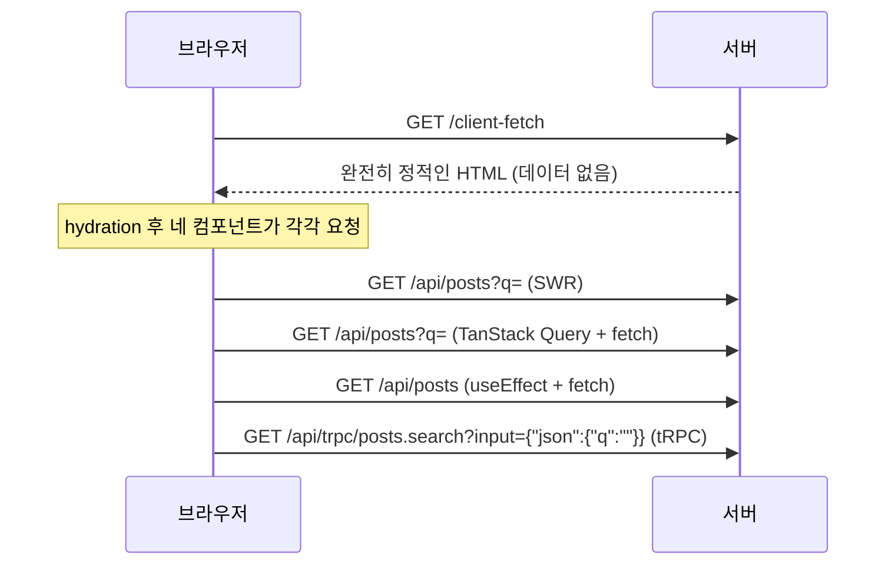
```mermaid
sequenceDiagram
  participant B as 브라우저
  participant S as 서버
  B->>S: GET /client-fetch
  S-->>B: 완전히 정적인 HTML (데이터 없음)
  Note over B: hydration 후 네 컴포넌트가 각각 요청
  B->>S: GET /api/posts?q=  (SWR)
  B->>S: GET /api/posts?q=  (TanStack Query + fetch)
  B->>S: GET /api/posts     (useEffect + fetch)
  B->>S: GET /api/trpc/posts.search?input={"json":{"q":""}}  (tRPC)
```

| 방법 | 파일 | fetch 함수 | URL | 응답 타입 |
| --- | --- | --- | --- | --- |
| SWR | `post-search.tsx` | `fetcher(url)` 직접 | 문자열 직접 | `type SearchResponse` 손으로 |
| TanStack Query | `post-search-query.tsx` | `queryFn` 직접 | 문자열 직접 | 손으로 |
| 직접 구현 | `post-count.tsx` | `useEffect` + `fetch` + `AbortController` | 직접 | 손으로 |
| ★ tRPC | `post-search-trpc.tsx` | **없음** (`queryOptions` 가 만든다) | **없음** | **없음** (라우터 반환 타입) |

네 번째는 `useQuery(trpc.posts.search.queryOptions({ q: query }, { placeholderData: keepPreviousData }))` 한 줄이다. `useQuery` 는 2번과 같은 TanStack 의 것이라 `isPending`, `isFetching` 이 똑같이 동작한다. 서버에서 `posts` 필드 이름을 바꾸면 4번만 컴파일 에러가 나고, 1~3번은 실행해야 깨진다.

### 🚶 흐름 3: `/feed` — 서버 첫 페이지 + tRPC 무한 스크롤

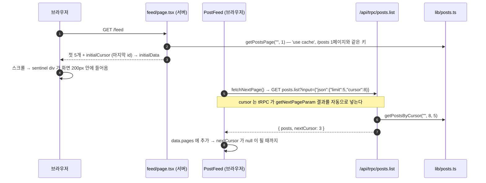
```mermaid
sequenceDiagram
  autonumber
  participant B as 브라우저
  participant Pg as feed/page.tsx (서버)
  participant PF as PostFeed (브라우저)
  participant R as /api/trpc/posts.list
  participant L as lib/posts.ts

  B->>Pg: GET /feed
  Pg->>L: getPostsPage("", 1) — 'use cache', /posts 1페이지와 같은 키
  Pg-->>B: 첫 5개 + initialCursor (마지막 id) → initialData
  B->>B: 스크롤 → sentinel div 가 화면 200px 안에 들어옴
  PF->>R: fetchNextPage() → GET posts.list?input={"json":{"limit":5,"cursor":8}}
  Note over PF,R: cursor 는 tRPC 가 getNextPageParam 결과를 자동으로 넣는다
  R->>L: getPostsByCursor("", 8, 5)
  R-->>PF: { posts, nextCursor: 3 }
  PF->>PF: data.pages 에 추가 → nextCursor 가 null 이 될 때까지
```

main 과 달라진 것은 세 가지다.

| main | feat/trpc |
| --- | --- |
| `fetchFeedPage(cursor, limit)` 가 `fetch("/api/posts?cursor=…")` | 없음. `trpc.posts.list.infiniteQueryOptions({ limit }, { initialCursor: null, getNextPageParam, initialData, staleTime })` |
| `type FeedPage = {...}` 손으로 선언 | `inferRouterOutputs<AppRouter>["posts"]["list"]["posts"][number]` 로 추출 |
| 다음 페이지 요청이 `/api/posts?cursor=` | `/api/trpc/posts.list` (E2E 도 이 URL 을 기다린다) |

- **라우터의 입력 필드 이름이 반드시 `cursor` 여야 한다.** `infiniteQueryOptions` 가 다음 페이지를 요청할 때 `getNextPageParam` 의 반환값을 이 필드에 자동으로 넣기 때문이다. `routers/posts.ts` 의 `list` 가 `cursor: z.number().int().positive().nullish()` 로 받는다.
- 서버 첫 페이지 `initialData`, `IntersectionObserver`, `use(io())` 는 main 과 같다.

### 🚶 흐름 4: `/releases` — 외부 API 를 서버에서 캐시하고 Promise 를 넘긴다

main 과 동일. `src/lib/github.ts` 의 `"use cache"` 된 `fetch` 결과를 `await` 하지 않고 클라이언트 컴포넌트에 넘겨 `use()` 로 읽는다. tRPC 를 거치지 않는다.

### 💡 개념: 세 가지 전송 방식 비교

| | 서버 컴포넌트에서 읽기 | 브라우저 fetch (REST) | 브라우저 tRPC |
| --- | --- | --- | --- |
| 첫 화면 | HTML 에 포함 | 빈 화면 → 로딩 | prefetch + hydrate 하면 HTML 에 포함 |
| 타입 | 서버 안이라 자동 | 손으로 선언, 실행해야 깨짐 | 라우터에서 자동, 컴파일에서 깨짐 |
| 외부 클라이언트 | — | 누구나 (curl, 다른 언어) | tRPC 클라이언트 필요 |
| 적합한 곳 | 대부분의 페이지 | 외부 개발자용 API | 같은 저장소의 브라우저 코드 |

---

## 10장. 공개 API: 외부 개발자용 문 (`/api/v1`)

이 장은 main 과 완전히 같다. 리프레시 토큰 회전, API 키, 레이트 리밋, CORS, OpenAPI 전부 REST 쪽에만 있다. 여기서는 **왜 tRPC 로 바꾸지 않았는가** 만 짚는다.

### 🚶 흐름 1: 요청 하나가 지나는 파이프라인

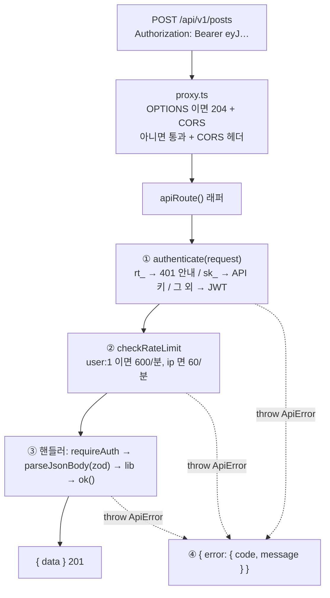
```mermaid
flowchart TB
  REQ["POST /api/v1/posts<br/>Authorization: Bearer eyJ…"]
  REQ --> P["proxy.ts<br/>OPTIONS 이면 204 + CORS<br/>아니면 통과 + CORS 헤더"]
  P --> W["apiRoute() 래퍼"]
  W --> A1["① authenticate(request)<br/>rt_ → 401 안내 / sk_ → API 키 / 그 외 → JWT"]
  A1 --> A2["② checkRateLimit<br/>user:1 이면 600/분, ip 면 60/분"]
  A2 --> A3["③ 핸들러: requireAuth → parseJsonBody(zod) → lib → ok()"]
  A3 --> RES["{ data } 201"]
  A1 & A2 & A3 -.->|"throw ApiError"| ERR["④ { error: { code, message } }"]
```

### 🚶 흐름 1-1. CORS 헤더 읽는 법

파이프라인 맨 앞의 "CORS 헤더 부착" 이 무슨 뜻인지 풀어 본다. **CORS(Cross-Origin Resource Sharing)** 는 브라우저가 "다른 출처" 로 보내는 요청을 막는 규칙이고, CORS 헤더는 서버가 "이 요청은 허용한다" 고 답하는 응답 헤더다.

**왜 막는가.** 브라우저에는 **같은 출처 정책** 이 있다. 출처(origin)는 프로토콜, 도메인, 포트의 묶음이다. `https://example.com` 페이지의 JS 가 `http://localhost:3000/api/v1/posts` 로 `fetch` 를 보내면 출처가 다르다. 브라우저는 요청을 보내더라도 **응답을 JS 에게 넘기지 않고** 콘솔에 CORS 에러를 띄운다. 남의 사이트가 우리 API 를 몰래 읽어 가는 것을 막는 기본값이다. 이 검사는 **브라우저만** 한다. `curl` 이나 서버끼리의 호출에는 CORS 가 없다.

**서버가 허락하는 방법.** 응답에 헤더를 실어 "이 출처, 이 메서드, 이 헤더는 괜찮다" 고 알려 준다. `src/proxy.ts` 의 `CORS_HEADERS` 가 그것이다.

| 헤더 | 이 앱의 값 | 뜻 |
| --- | --- | --- |
| `Access-Control-Allow-Origin` | `*` | 어느 출처의 브라우저든 응답을 읽어도 된다 |
| `Access-Control-Allow-Methods` | `GET, POST, PATCH, DELETE, OPTIONS` | 허용하는 HTTP 메서드 |
| `Access-Control-Allow-Headers` | `Content-Type, Authorization` | 요청에 붙여도 되는 헤더 |
| `Access-Control-Expose-Headers` | `X-RateLimit-Limit, X-RateLimit-Remaining, X-RateLimit-Reset, Retry-After` | 브라우저 JS 가 읽을 수 있는 응답 헤더. 기본은 몇 개만 읽힌다 |
| `Access-Control-Max-Age` | `86400` | 아래 프리플라이트 결과를 하루 동안 기억해 매번 묻지 않게 |

**프리플라이트.** `Authorization` 헤더를 붙이거나 `PATCH`, `DELETE` 를 쓰는 요청은 "단순 요청" 이 아니라서, 브라우저가 본 요청 전에 `OPTIONS` 요청을 먼저 보내 "이렇게 보내도 되나요?" 하고 묻는다. `proxy.ts` 는 `/api/v1` 로 온 `OPTIONS` 를 라우트까지 보내지 않고 그 자리에서 204 와 CORS 헤더로 답한다. 실제 요청은 통과시키되 응답에 헤더만 얹는다.

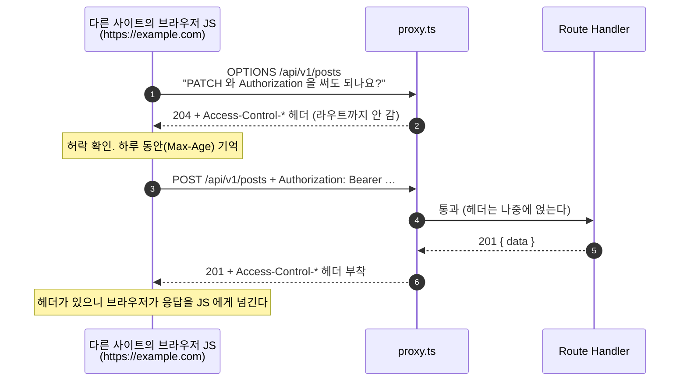
```mermaid
sequenceDiagram
  autonumber
  participant J as 다른 사이트의 브라우저 JS<br/>(https://example.com)
  participant P as proxy.ts
  participant H as Route Handler

  J->>P: OPTIONS /api/v1/posts<br/>"PATCH 와 Authorization 을 써도 되나요?"
  P-->>J: 204 + Access-Control-* 헤더 (라우트까지 안 감)
  Note over J: 허락 확인. 하루 동안(Max-Age) 기억
  J->>P: POST /api/v1/posts + Authorization: Bearer …
  P->>H: 통과 (헤더는 나중에 얹는다)
  H-->>P: 201 { data }
  P-->>J: 201 + Access-Control-* 헤더 부착
  Note over J: 헤더가 있으니 브라우저가 응답을 JS 에게 넘긴다
```

**왜 `*` 로 열어도 안전한가.** 이 API 는 쿠키를 전혀 보지 않고 `Authorization: Bearer` 헤더만 본다. 브라우저는 쿠키는 자동으로 붙이지만 `Authorization` 헤더는 붙이지 않는다. 남의 사이트가 우리 사용자의 브라우저를 시켜 요청을 보내도 토큰이 없어 401 이 된다. 반대로 **쿠키 인증을 함께 받는 API 라면 `*` 는 절대 안 되고**, 허용 도메인을 하나씩 나열하고 `Access-Control-Allow-Credentials: true` 를 켜야 한다. "화면은 쿠키, 공개 API 는 토큰" 으로 인증을 나눈 이유 중 하나다.

**직접 보는 법.**

```bash
curl -i -X OPTIONS http://localhost:3000/api/v1/posts   # 204 와 Access-Control-* 헤더
curl -i http://localhost:3000/api/v1/posts               # 200, 같은 헤더가 응답에 붙어 있음
```

```
[proxy]   OPTIONS /api/v1/posts → 프리플라이트. 라우트까지 가지 않고 204 + CORS 헤더로 즉시 응답
[proxy]   POST /api/v1/posts → 통과 (CORS 헤더만 부착, 인증은 Route Handler 가 함)
```

`curl` 은 CORS 검사를 하지 않으므로 헤더가 없어도 응답을 받는다. 헤더의 효과는 다른 출처의 **브라우저 페이지** 에서 `fetch` 해 봐야 보인다.

### 🚶 흐름 2: 두 전송 층의 역할 분담

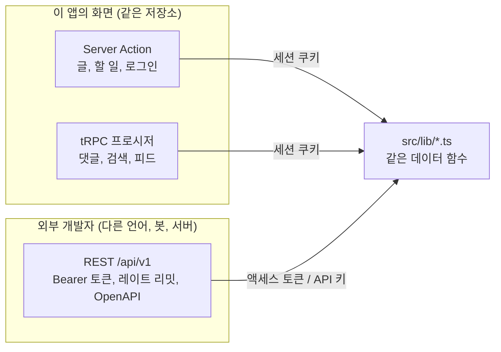
```mermaid
flowchart LR
  subgraph WEB["이 앱의 화면 (같은 저장소)"]
    SA["Server Action<br/>글, 할 일, 로그인"]
    TP["tRPC 프로시저<br/>댓글, 검색, 피드"]
  end
  subgraph EXT["외부 개발자 (다른 언어, 봇, 서버)"]
    REST["REST /api/v1<br/>Bearer 토큰, 레이트 리밋, OpenAPI"]
  end
  SA & TP -->|"세션 쿠키"| LIB["src/lib/*.ts<br/>같은 데이터 함수"]
  REST -->|"액세스 토큰 / API 키"| LIB
```

| | Server Action / tRPC | REST `/api/v1` |
| --- | --- | --- |
| 누가 부르나 | 이 앱의 브라우저 코드 | 외부 프로그램 |
| 인증 | 세션 쿠키 (브라우저 자동) | `Authorization: Bearer` (쿠키 안 봄) |
| 계약 | TypeScript 타입 (같은 저장소) | OpenAPI 명세 + 버전 경로 |
| CORS | 불필요 (같은 origin) | `*` 허용 (쿠키를 안 보니 안전) |
| 레이트 리밋 | 없음 | 있음 |

tRPC 는 "서버와 클라이언트가 같은 TypeScript 저장소" 일 때 빛난다. 외부 개발자는 tRPC 클라이언트가 없으므로 REST 가 맞다.

### 🚶 흐름 3: 세 가지 자격증명과 리프레시 토큰 회전

main 판 10장과 같다. 요약만:

| | 세션 쿠키 (화면, tRPC) | 액세스 토큰 | 리프레시 토큰 | API 키 |
| --- | --- | --- | --- | --- |
| 모양 | JWT in Cookie | JWT | `rt_` + 64자 hex | `sk_` + 64자 hex |
| 수명 | 7일 | 1시간 | 30일 (절대) | 무기한 |
| 서버 저장 | 없음 | 없음 | 해시 | 해시 |
| 즉시 무효화 | 불가 | 불가 | 가능 (회전, 재사용 감지, 가족 폐기) | 가능 |

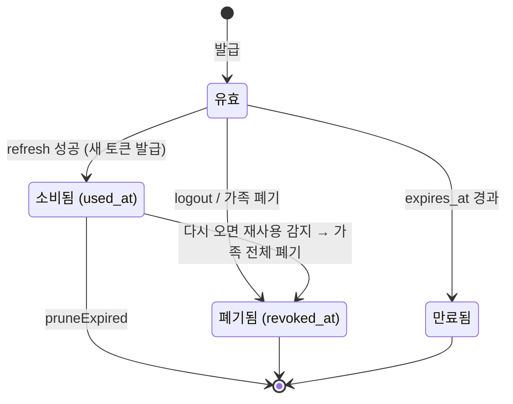
```mermaid
stateDiagram-v2
  state "유효" as valid
  state "소비됨 (used_at)" as used
  state "폐기됨 (revoked_at)" as revoked
  state "만료됨" as expired
  [*] --> valid: 발급
  valid --> used: refresh 성공 (새 토큰 발급)
  valid --> revoked: logout / 가족 폐기
  valid --> expired: expires_at 경과
  used --> revoked: 다시 오면 재사용 감지 → 가족 전체 폐기
  used --> [*]: pruneExpired
  revoked --> [*]
  expired --> [*]
```

### 📄 파일

`src/proxy.ts`, `src/lib/api/*`, `src/lib/refresh-tokens.ts`, `src/lib/api-keys.ts`, `src/app/api/v1/**` 모두 main 과 동일.

---

## 11장. 테스트: 어디서 무엇을 확인하나

```
            ▲  느리지만 전체를 본다
            │
      ┌─────┴─────┐
      │   E2E     │  Playwright, 프로덕션 빌드 + 진짜 브라우저 (e2e/*.spec.ts)
      │           │  /feed 는 /api/trpc/posts.list 응답을 기다린다
      ├───────────┤
      │ Route     │  Vitest, 핸들러 함수를 직접 호출 (src/app/api/**/*.test.ts)
      │ Handler   │
      ├───────────┤
      │ ★ tRPC    │  Vitest, createCaller 로 HTTP 없이 프로시저 호출 (src/trpc/router.test.ts)
      │ 라우터    │  입력 검증 · 권한 · 2단 규칙 · revalidateTag 호출 여부
      ├───────────┤
      │ 컴포넌트  │  Vitest + Testing Library + jsdom
      ├───────────┤
      │ 단위      │  Vitest, node 환경 (src/lib/**/*.test.ts)
      └───────────┘
            │
            ▼  빠르고 좁다
```

| 무엇을 | 어떻게 | 예 |
| --- | --- | --- |
| 순수 함수, SQL 함수, 세션 | main 과 동일 (임시 SQLite, `vi.mock("next/headers")`) | `posts.test.ts`, `session.test.ts` |
| ★ tRPC 프로시저 | `createCallerFactory(appRouter)({ user })` 로 caller 를 만들어 `await caller.comments.add({...})`. `next/cache` 는 `vi.mock` 으로 no-op + `vi.fn()` | `src/trpc/router.test.ts` |
| 클라이언트 컴포넌트 | `vi.mock("./actions")` | `todo-item.test.tsx` |
| Route Handler | `apiRequest()` 로 요청 객체 → 직접 호출 | `api/v1/**/*.test.ts` |
| 스트리밍, hydrate, 무한 스크롤 | E2E | `e2e/posts-features.spec.ts` |

**프로시저는 그냥 함수다.** `(input, ctx)` 를 받는 함수이므로 브라우저도 `/api/trpc` 도 없이 부를 수 있다. ctx 를 `{ user: null }` 로 넣으면 로그아웃 상태, `{ user: guest }` 로 넣으면 게스트 로그인 상태다. Server Action 은 `useActionState` 와 `FormData` 에 묶여 있어 이런 단위 테스트가 어려웠고, 그래서 main 은 E2E 로만 검증했다. `router.test.ts` 가 증명하는 것:

- `.input(zod)` 검증이 본문보다 먼저 실행되고 실패는 `BAD_REQUEST`
- `protectedProcedure` 가 본문 전에 막는다 (`UNAUTHORIZED`)
- 2단 제한, 소유자 검사 (`FORBIDDEN`), 없는 글 (`NOT_FOUND`)
- 변경 후 `revalidateTag` 가 올바른 태그와 `{ expire: 0 }` 으로 호출됐다

---

## 12장. tRPC 층 자세히 보기

앞 장들에서 조금씩 만난 tRPC 를 한 번에 정리한다. main 과의 파일별 대응은 README "브랜치 feat/trpc 에서 달라진 점" 에 있다.

### 12-1. 부품 일곱 개

```mermaid
flowchart TB
  subgraph SRVSIDE["서버"]
    INIT["init.ts<br/>createTRPCContext · publicProcedure · protectedProcedure"]
    ROUT["routers/posts.ts · comments.ts<br/>프로시저 정의 (.input → .query/.mutation)"]
    APP["routers/_app.ts<br/>appRouter + AppRouter 타입"]
    ROUTE["app/api/trpc/[trpc]/route.ts<br/>fetchRequestHandler — HTTP 입구"]
    SRV["server.tsx<br/>trpc 프록시 · prefetch · HydrateClient · caller"]
  end
  subgraph CLISIDE["브라우저"]
    CLI["client.tsx<br/>TRPCReactProvider · useTRPC · httpBatchLink"]
    QC["query-client.ts<br/>QueryClient 공장 (양쪽 공용)"]
  end
  INIT --> ROUT --> APP
  APP -->|"코드"| ROUTE
  APP -->|"코드"| SRV
  APP -.->|"import type (타입만)"| CLI
  QC --> SRV
  QC --> CLI
  CLI -->|"HTTP"| ROUTE
```

| 파일 | 만드는 것 | 누가 쓰나 |
| --- | --- | --- |
| `init.ts` | 컨텍스트, 라우터 생성 함수, 프로시저 빌더 두 종류, 로그 미들웨어, `createCallerFactory` | 라우터 파일, 테스트 |
| `routers/*.ts` | 프로시저 | `_app.ts` |
| `routers/_app.ts` | `appRouter`(코드), `AppRouter`(타입) | 서버는 코드를, 브라우저는 타입만 |
| `api/trpc/[trpc]/route.ts` | HTTP 입구. GET 과 POST 둘 다 같은 handler | 브라우저의 `httpBatchLink` |
| `server.tsx` | HTTP 없이 라우터를 부르는 프록시, prefetch, hydrate 경계 | 서버 컴포넌트 |
| `client.tsx` | Provider 와 `useTRPC` 훅 | 클라이언트 컴포넌트 |
| `query-client.ts` | 같은 설정의 `QueryClient` | 서버(요청마다), 브라우저(하나) |

### 12-2. 프로시저 정의 읽는 법

```ts
add: protectedProcedure                       // ① 누가 부를 수 있나 (public / protected)
  .input(commentSchema.extend({ postId: z.number().int().positive(), ... }))  // ② 입력 검증. 실패 → BAD_REQUEST
  .mutation(async ({ ctx, input }) => {       // ③ .query = 조회(GET, useQuery) / .mutation = 변경(POST, useMutation)
    // ctx.user 는 ①이 보장. input 은 ②를 통과한 값
    ...
    return { id };                            // ④ 반환값의 타입이 곧 클라이언트 data 의 타입
  }),
```

| 단계 | main 의 Server Action 에서는 | main 의 Route Handler 에서는 |
| --- | --- | --- |
| ① 로그인 | 액션마다 `getCurrentUser()` | `requireAuth(auth)` |
| ② 검증 | `schema.safeParse()` 직접 | `parseJsonBody(request, schema)` |
| ③ 종류 | 구분 없음 | `export const GET / POST` |
| ④ 타입 | 반환 타입을 클라이언트가 못 봄 | 손으로 다시 선언 |

### 12-3. 요청 하나가 지나는 길 (브라우저 → 서버)

```mermaid
sequenceDiagram
  autonumber
  participant C as 컴포넌트
  participant T as useTRPC()
  participant Q as TanStack Query
  participant LK as httpBatchLink
  participant R as /api/trpc/[trpc]
  participant F as fetchRequestHandler
  participant CX as createTRPCContext
  participant MW as 미들웨어 (logger → auth)
  participant PR as 프로시저 본문

  C->>T: trpc.posts.search.queryOptions({ q })
  T-->>C: { queryKey: [["posts","search"], { input, type }], queryFn }
  C->>Q: useQuery(옵션)
  Q->>LK: queryFn 실행
  LK->>R: GET /api/trpc/posts.search?input={"json":{"q":"…"}}<br/>(같은 틱의 호출은 콤마로 묶어 한 요청)
  R->>F: fetchRequestHandler({ endpoint: "/api/trpc", router, createContext })
  F->>CX: ctx = { user }
  F->>MW: path, type, input 으로 미들웨어 체인
  MW->>PR: .input 통과 후 본문
  PR-->>F: 반환값
  F-->>LK: superjson 으로 직렬화된 응답 (배치면 배열)
  LK-->>Q: 역직렬화 → 캐시 저장
  Q-->>C: data (타입은 라우터 반환 타입)
```

**URL 모양.**

| 종류 | 메서드 | 예 |
| --- | --- | --- |
| query | GET | `/api/trpc/posts.search?input={"json":{"q":"캐시"}}` |
| mutation | POST | `/api/trpc/comments.add` (본문에 input) |
| 배치 | GET/POST | `/api/trpc/posts.list,comments.list?batch=1&input={...}` |

`httpBatchLink` 는 같은 틱에 발생한 여러 호출을 요청 하나로 묶는다. main 의 fetch 방식은 호출마다 요청 하나였다.

### 12-4. 타입이 흐르는 길 (서버 → 브라우저)

```
routers/comments.ts        list: publicProcedure.input(z.object({ postId })).query(() => getCommentThreads(...))
        │                          ↑ 입력 타입                       ↑ 반환 타입 CommentThread[]
        ▼
routers/_app.ts            export type AppRouter = typeof appRouter
        │
        ▼  import type (컴파일 후 사라짐 — 구현은 브라우저로 안 감)
client.tsx                 createTRPCContext<AppRouter>() → useTRPC
        │
        ▼
comment-threads.tsx        const { data } = useQuery(trpc.comments.list.queryOptions({ postId }))
                                       ↑ CommentThread[]                          ↑ { postId: number } 만 허용
```

서버에서 필드를 지우면 `comment-threads.tsx` 가 컴파일 에러. 필드를 추가하면 자동완성에 바로 뜬다. `inferRouterOutputs<AppRouter>` 로 특정 프로시저의 반환 타입만 뽑을 수도 있다 (`post-feed.tsx` 의 `FeedItem`).

### 12-5. superjson 과 QueryClient 설정

| 설정 | 어디 | 왜 |
| --- | --- | --- |
| `transformer: superjson` | `init.ts` (서버), `client.tsx` 의 `httpBatchLink` (브라우저) | JSON 이 못 표현하는 Date, Map, undefined 를 보존. **양쪽이 같아야** 한다 |
| `staleTime: 30s` | `query-client.ts` | 서버가 prefetch 한 데이터를 브라우저가 받자마자 다시 요청하는 낭비를 막는다 |
| `shouldDehydrateQuery: … \|\| pending` | `query-client.ts` | 서버 컴포넌트가 `await` 하지 않은 prefetch 를 Promise 상태로 스트리밍 |
| `serializeData / deserializeData: superjson` | `query-client.ts` | dehydrate 와 hydrate 에서도 같은 변환 |

### 12-6. 직접 겪은 것들

| 상황 | 이유 | 대책 |
| --- | --- | --- |
| 프로시저에서 `updateTag` 호출 시 에러 | tRPC 는 Route Handler 컨텍스트 | `revalidateTag(tag, { expire: 0 })` |
| 댓글을 썼는데 화면이 안 바뀜 | 캐시가 두 층 | 서버 태그 + `invalidateQueries` 둘 다 |
| `useQuery` 가 첫 렌더에 로딩 표시 | 서버 prefetch 와 queryKey 가 다름 | 같은 `queryOptions(input)` 을 양쪽에서 |
| 무한 스크롤이 두 번째 페이지를 못 받음 | 입력 필드 이름이 `cursor` 가 아님 | 라우터 입력을 `cursor` 로 |
| 서버에서 사용자 간 데이터 섞임 | 모듈 변수에 QueryClient 하나 | 서버는 요청마다 `cache(makeQueryClient)` |
| Date 가 문자열로 옴 | 한쪽만 superjson | 서버·클라이언트·dehydrate 모두 superjson |

### 12-7. 언제 이 방식이 이기나

클라이언트 페칭이 많은 화면, 두 번째 클라이언트(모바일 앱, 관리자 도구)가 같은 TypeScript 저장소에 있을 때. 이 앱은 대부분 서버 컴포넌트가 데이터를 그리고 폼은 Server Action 이라, tRPC 가 꼭 필요하지는 않다. README Part 7-2 의 기준을 참고.

---

## 13장. 한눈에 보는 요약

### 13-1. 데이터가 바뀌면 무엇이 갱신되나

```mermaid
flowchart LR
  subgraph ENTRY["입구"]
    TA["todos/actions.ts"]
    PA["posts/actions.ts (글)"]
    TP["★ trpc/routers/comments.ts (댓글)"]
    API["api/v1/**/route.ts"]
  end
  subgraph INV["서버 무효화"]
    RP["revalidatePath('/todos')"]
    UT["updateTag(...)"]
    RT0["revalidateTag(..., expire: 0)"]
  end
  subgraph BINV["★ 브라우저 무효화"]
    IQ["queryClient.invalidateQueries(<br/>trpc.comments.list.queryFilter({ postId }))"]
  end
  subgraph CACHE["'use cache' 엔트리 (태그)"]
    C1["getPostsPage — posts"]
    C2["getPost(id) — posts, post-N"]
    C3["getCommentThreads(id) — post-N-comments"]
    C4["getNextReleases — next-releases"]
  end
  subgraph VIEW["화면"]
    V1["/todos"]
    V2["/posts, /feed 첫 페이지"]
    V3["/posts/N 본문, 모달"]
    V4["/posts/N 댓글 (useQuery)"]
    V5["/releases"]
  end
  TA --> RP --> V1
  API -->|"todos"| RP
  PA -->|"글"| UT --> C1 & C2
  PA -->|"릴리스"| UT --> C4
  TP -->|"프로시저 안"| RT0 --> C3
  TP -.->|"onSuccess"| IQ --> V4
  API -->|"글"| RT0 --> C1 & C2
  API -->|"댓글"| RT0 --> C3
  C1 --> V2
  C2 --> V3
  C3 --> V4
  C4 --> V5
```

댓글만 화살표가 두 갈래다. 서버 태그를 지우는 것(프로시저)과 브라우저 캐시를 지우는 것(`onSuccess`)이 따로 있다.

### 13-2. 렌더링 방식 지도

네 방식(CSR·SSR·SSG·ISR)의 뜻, RSC 와의 관계, 캐시 4층(요청 메모이제이션·데이터 캐시·풀 라우트 캐시·라우터 캐시)은 **부록 E** 에 있다.

| 페이지 | 방식 | 근거 |
| --- | --- | --- |
| `/` | 정적 (SSG) | 요청 데이터 없음 |
| `/todos` | 정적 셸 + 요청 시 목록 (SSR) | `connection()`, `loading.tsx` |
| `/posts` | 정적 셸 + 캐시된 목록 (ISR) + 요청 시 세션 | `"use cache"` + `searchParams` + `cookies()` |
| `/posts/[id]` | 일부 id 는 빌드 시, 나머지 첫 요청 시 캐시 + 스트리밍. 댓글은 prefetch + hydrate | `generateStaticParams`, `getPost` 캐시, `HydrateClient` |
| `/client-fetch` | 완전 정적 + 브라우저 fetch/tRPC (CSR) | 서버 컴포넌트가 데이터를 안 읽음 |
| `/feed` | 첫 페이지 캐시 + 브라우저 tRPC | `getPostsPage` + `infiniteQueryOptions` |
| `/releases` | 외부 fetch 캐시 + `use()` | `"use cache"` + Promise props |
| `/api/trpc/*` | 요청마다 | 컨텍스트가 쿠키를 읽음 |
| `/api/v1`, `/api/v1/openapi.json` | 정적 | 요청을 안 읽음 |

### 13-3. 개념 → 파일 색인

| 개념 | 장 | 파일 |
| --- | --- | --- |
| 컨텍스트 `ctx.user` | 6, 12 | `src/trpc/init.ts` |
| `publicProcedure` / `protectedProcedure`, 미들웨어, 타입 좁히기 | 6, 12 | `src/trpc/init.ts` |
| 프로시저 정의 (`.input`, `.query`, `.mutation`) | 12 | `src/trpc/routers/posts.ts`, `comments.ts` |
| `AppRouter` 타입, `import type` | 1, 12 | `src/trpc/routers/_app.ts`, `client.tsx` |
| HTTP 입구, URL 모양, 배치 | 12 | `src/app/api/trpc/[trpc]/route.ts` |
| `TRPCReactProvider`, `useTRPC`, `httpBatchLink` | 2, 12 | `src/trpc/client.tsx` |
| 서버 프록시, `prefetch`, `HydrateClient` | 7, 12 | `src/trpc/server.tsx` |
| QueryClient 서버/브라우저 분리, superjson, pending dehydrate | 2, 12 | `src/trpc/query-client.ts` |
| `queryOptions` / `mutationOptions` / `queryFilter` | 7 | `comment-threads.tsx`, `comment-form.tsx` |
| `infiniteQueryOptions`, `inferRouterOutputs` | 9 | `(demos)/feed/post-feed.tsx` |
| 캐시 두 층 무효화 | 7, 13 | `routers/comments.ts`, `comment-form.tsx` |
| `updateTag` 를 못 쓰는 이유 | 7, 12 | `routers/comments.ts` |
| `createCaller` 테스트 | 11 | `src/trpc/router.test.ts` |
| Server Action vs tRPC mutation | 3 | `todos/actions.ts` vs `routers/comments.ts` |
| REST vs tRPC 역할 분담 | 10 | `api/v1/` vs `src/trpc/` |
| 서버/클라이언트 컴포넌트, Suspense, hydration | 2 | `layout.tsx` |
| `connection()`, Server Action, `revalidatePath`, React 19 훅, zustand | 3 | `todos/` |
| `"use cache"`, 태그, `updateTag` vs `revalidateTag` | 4 | `lib/posts.ts`, `posts/actions.ts` |
| 동적 라우트, 특수 파일, 스트리밍, 모달 | 5 | `posts/[id]/`, `posts/@modal/` |
| 비밀번호 해시, JWT 세션, DAL, 3겹 방어 | 6 | `password.ts`, `session.ts`, `dal.ts`, `proxy.ts` |
| 파일 업로드 | 8 | `uploads.ts` |
| Bearer, 리프레시 토큰, API 키, 레이트 리밋, CORS | 10 | `lib/api/`, `refresh-tokens.ts` |

### 13-4. 자주 헷갈리는 것

**Q. 댓글을 썼는데 목록이 안 바뀐다.**
7장. 서버 `"use cache"` 태그와 브라우저 TanStack 캐시를 둘 다 지웠는지 본다. 프로시저의 `revalidateTag` 와 `onSuccess` 의 `invalidateQueries`.

**Q. 프로시저에서 `updateTag` 를 부르면 왜 에러인가?**
tRPC 는 `/api/trpc/[trpc]/route.ts` 라는 Route Handler 안에서 실행된다. `updateTag` 는 Server Action 전용이다. `revalidateTag(tag, { expire: 0 })` 를 쓴다.

**Q. 서버 컴포넌트에서 `useTRPC()` 를 쓰면?**
훅이라 안 된다. 서버 컴포넌트는 `src/trpc/server.tsx` 의 `trpc` 프록시(prefetch용) 또는 `caller`(결과만 필요할 때)를 쓴다.

**Q. tRPC 요청에 `Authorization` 헤더가 필요한가?**
아니다. 세션 쿠키를 브라우저가 자동으로 붙이고, `createTRPCContext` 가 그것으로 `ctx.user` 를 만든다. Bearer 는 `/api/v1` 전용이다.

**Q. 첫 렌더에 댓글이 "로딩 중" 으로 보인다.**
서버 `prefetch` 의 queryKey 와 클라이언트 `useQuery` 의 queryKey 가 다르다. 같은 `queryOptions(입력)` 을 써야 한다.

**Q. 왜 글 작성은 tRPC 로 안 바꿨나?**
파일이 붙은 폼은 Server Action 이 단순하고, 비교 범위를 "조회 + 댓글" 로 좁히기 위해서다. 3장의 비교표 참고.

**Q. 같은 `/posts/3` 인데 어떨 땐 모달, 어떨 땐 페이지인 이유는?**
5장. Link 클릭만 인터셉팅 라우트가 가로챈다.

---

## 부록 A. 서버 컴포넌트와 클라이언트 컴포넌트, 제대로 이해하기

이름 때문에 오해가 생기기 쉬운 개념이다. "서버 컴포넌트는 서버에서, 클라이언트 컴포넌트는 브라우저에서 실행된다" 라고 외우면 절반은 틀린다. 질문을 바꿔야 한다. **"이 컴포넌트의 코드가 브라우저로 가는가?"** 이것 하나로 대부분이 설명된다.

### A-1. 한 문장씩

| | 서버 컴포넌트 | 클라이언트 컴포넌트 |
| --- | --- | --- |
| 표시 | 파일 맨 위에 아무것도 없음 (**기본값**) | 파일 맨 위에 `"use client"` |
| 어디서 실행되나 | **서버에서만**. 브라우저는 결과만 받는다 | **서버에서 한 번, 브라우저에서 또 한 번** |
| 브라우저로 가는 것 | 렌더링 결과 (HTML 조각과 RSC payload) | 결과 + **JS 코드 자체** |
| 비유 | 주방에서 완성해 내보내는 요리. 손님은 레시피를 모른다 | 테이블 위의 버튼과 리모컨. 손님이 직접 누른다 |
| 이 프로젝트에서 | `todos/page.tsx`: getTodos() 로 SQLite 를 읽어 목록을 그린다 | `todos/todo-item.tsx`: 체크박스 클릭에 반응한다 |

### A-2. 무엇이 브라우저로 가나

```mermaid
flowchart LR
  subgraph SRV["서버"]
    SC["서버 컴포넌트<br/>todos/page.tsx<br/>getTodos() 로 SQLite → JSX"]
    CCS["클라이언트 컴포넌트<br/>todo-item.tsx<br/>(서버에서도 한 번 그림 = SSR)"]
  end
  subgraph OUT["브라우저로 전송되는 것"]
    HTML["HTML<br/>첫 화면 (사진)"]
    RSC["RSC payload<br/>서버 컴포넌트의 렌더 결과 트리<br/>+ '이 자리에 어떤 클라이언트 컴포넌트를 어떤 props 로'"]
    JS["JS 번들<br/>클라이언트 컴포넌트 코드만"]
  end
  subgraph BR["브라우저"]
    H["hydration<br/>사진 위에 이벤트·상태 붙이기"]
    RUN["이후 클릭·입력·useEffect 는<br/>브라우저에서 실행"]
  end
  SC --> HTML
  SC --> RSC
  CCS --> HTML
  CCS -.->|"코드"| JS
  HTML & RSC & JS --> H --> RUN
```

- `todos/page.tsx` 의 `getTodos()` 와 그 안의 DB 코드는 브라우저에 **없다**. 개발자 도구 Sources 탭에서 검색해도 안 나온다.
- `todo-item.tsx` 의 `handleToggle` 은 브라우저에 **있다**. 그래야 클릭에 반응한다.
- 클라이언트 컴포넌트도 서버에서 한 번 HTML 로 그려진다. 그래서 첫 화면이 빈 화면이 아니다. 이것이 SSR 이다.

### A-3. 시간 순서로 보기

```
서버                                          브라우저
──────────────────────────────────────        ──────────────────────────────────────
① 서버 컴포넌트 실행 (DB 읽기, await)
② 클라이언트 컴포넌트도 HTML 로 한 번 그림
   (useState 초기값으로. useEffect 는 실행 안 함)
③ HTML + RSC payload 전송 ──────────────▶     ④ HTML 표시. 보이지만 아직 클릭은 안 됨
                                              ⑤ 클라이언트 컴포넌트 JS 다운로드
                                              ⑥ hydration: 같은 컴포넌트를 브라우저에서
                                                 다시 실행해 이벤트 핸들러를 붙임
                                              ⑦ useEffect 실행. 이제 클릭·입력이 동작
```

⑥ 에서 서버가 그린 HTML(②) 과 브라우저가 그린 결과가 **같아야** 한다. 다르면 "hydration mismatch" 에러다. 그래서 `localStorage` 처럼 브라우저에만 있는 값은 ②에서 읽으면 안 되고 ⑦(`useEffect`) 에서 읽는다. `components/store-hydrator.tsx` 가 정확히 그렇게 한다.

### A-4. 이름이 만드는 오해 세 가지

| 오해 | 실제 | 이 프로젝트에서 확인 |
| --- | --- | --- |
| "클라이언트 컴포넌트는 브라우저에서만 실행된다" | 서버에서도 한 번 실행된다 (SSR). 렌더 중에 `window` 를 읽으면 서버에서 터진다 | `posts/[id]/recently-viewed.tsx` 는 그래서 `next/dynamic` 의 `ssr: false` 로만 로드한다 |
| "서버 컴포넌트 = SSR" | 다른 개념이다. 서버 컴포넌트는 "코드가 브라우저로 안 감", SSR 은 "클라이언트 컴포넌트를 서버에서 HTML 로 미리 그림" | `todo-item.tsx` 는 클라이언트 컴포넌트이면서 SSR 된다 |
| "`"use client"` 는 그 파일만 클라이언트로 만든다" | **경계** 다. 그 파일이 import 하는 모듈도 전부 클라이언트 번들로 끌려간다 | `todo-item.tsx` 에서 `@/lib/db` 를 import 하면 `server-only` 가 빌드를 막는다 |

### A-5. 어느 쪽으로 만들까

```mermaid
flowchart TB
  Q1{"onClick, onChange 같은<br/>이벤트 핸들러가 필요한가?"}
  Q2{"useState, useEffect, useRef<br/>같은 훅이 필요한가?"}
  Q3{"window, localStorage,<br/>IntersectionObserver 같은<br/>브라우저 API 가 필요한가?"}
  Q4{"DB, 파일, 비밀 키,<br/>cookies() 도 함께 필요한가?"}
  C["'use client' 컴포넌트"]
  S["서버 컴포넌트 (기본값)"]
  SPLIT["둘로 나눈다:<br/>서버 컴포넌트가 데이터를 읽어 props 로 넘기고,<br/>클라이언트 컴포넌트가 상호작용을 맡는다"]
  Q1 -->|"예"| Q4
  Q1 -->|"아니오"| Q2
  Q2 -->|"예"| Q4
  Q2 -->|"아니오"| Q3
  Q3 -->|"예"| Q4
  Q3 -->|"아니오"| S
  Q4 -->|"예"| SPLIT
  Q4 -->|"아니오"| C
```

**기본값은 서버 컴포넌트다.** 필요한 것이 생겼을 때만 `"use client"` 를 붙인다. 붙이더라도 **가능한 한 트리의 아래쪽, 작은 조각** 에 붙인다. 페이지 전체에 붙이면 페이지의 모든 코드가 브라우저로 간다. `todos/page.tsx` 가 서버로 남고 `TodoItem`, `AddTodoForm` 만 클라이언트인 이유다.

### A-6. 할 수 있는 것, 없는 것

| | 서버 컴포넌트 | 클라이언트 컴포넌트 |
| --- | --- | --- |
| `async` / `await` 로 데이터 읽기 | ✅ `await getTodos()` | ❌ (`use()` 나 SWR, TanStack Query 로) |
| DB, 파일 시스템, 환경변수 비밀 | ✅ | ❌ |
| `cookies()`, `headers()` | ✅ (Suspense 안에서) | ❌ |
| `useState`, `useEffect`, `useRef` | ❌ | ✅ |
| `onClick`, `onChange`, `onSubmit` | ❌ | ✅ |
| `window`, `localStorage`, 브라우저 API | ❌ | ✅ (`useEffect` 안에서) |
| Context Provider 제공 | ❌ | ✅ |
| 다른 서버 컴포넌트 import | ✅ | ❌ (import 하면 그것도 클라이언트가 됨) |
| 다른 클라이언트 컴포넌트 import | ✅ | ✅ |
| 서버 컴포넌트를 children 으로 받기 | — | ✅ (A-7) |
| Server Action 호출 | `<form action={...}>` 으로 | 함수처럼 호출 |
| tRPC 호출 | `src/trpc/server.tsx` 의 `trpc` 프록시 / `caller` (HTTP 없음) | `useTRPC()` 훅 → `useQuery` / `useMutation` (HTTP) |

### A-7. 트리 규칙과 샌드위치 패턴

가장 헷갈리는 규칙이다. **"클라이언트 컴포넌트는 서버 컴포넌트를 import 할 수 없다. 하지만 children 으로 받을 수는 있다."**

```mermaid
flowchart TB
  subgraph OK1["✅ 서버 → 클라이언트 import"]
    A1["todos/page.tsx (서버)"] --> B1["TodoItem (클라이언트)"]
  end
  subgraph NO["❌ 클라이언트 → 서버 import"]
    A2["TodoItem (클라이언트)"] -.->|"import 하는 순간<br/>이것도 클라이언트가 됨"| B2["user-menu.tsx (서버)<br/>→ cookies() 못 씀, server-only 빌드 에러"]
  end
  subgraph OK2["✅ 샌드위치: 클라이언트가 서버를 children 으로"]
    A3["app/layout.tsx (서버)"] --> B3["TRPCReactProvider (클라이언트)"]
    B3 -->|"children"| C3["UserMenu, 각 page.tsx (서버)<br/>서버에서 이미 렌더된 결과가 끼워진다"]
  end
```

왜 import 는 안 되고 children 은 되나. import 는 "이 코드를 내 번들에 넣어라" 는 뜻이라 클라이언트 번들에 서버 코드가 들어간다. children 은 "서버가 **이미 렌더링한 결과** 를 이 자리에 끼워라" 는 뜻이라 코드는 안 가고 결과만 간다.

이 프로젝트의 샌드위치:

| 바깥 (서버) | 가운데 (클라이언트) | 안 (children) |
| --- | --- | --- |
| `app/layout.tsx` | `TRPCReactProvider` (QueryClient + tRPC Provider) | 헤더의 `UserMenu`, 모든 `page.tsx` (서버) |
| `posts/@modal/(.)[id]/page.tsx` | `RouteModal` (Dialog) | 글 본문, 이미지, 링크 (서버가 렌더) |
| `app/layout.tsx` | `ThemeProvider` (next-themes Context) | `TRPCReactProvider` 이하 전부. 두 Provider 가 겹쳐도 안의 헤더와 페이지는 서버 |
| `posts/[id]/comments-section.tsx` | `HydrateClient` 안의 `HydrationBoundary` | `CommentThreads` (클라이언트) — 여기서는 서버가 넘기는 것이 JSX 가 아니라 **prefetch 한 데이터** 다 |

### A-8. props 규칙: 넘길 수 있는 것

서버 컴포넌트가 클라이언트 컴포넌트에 props 를 넘기면 그 값은 네트워크를 건너간다. 그래서 **직렬화할 수 있는 값** 만 된다.

| 넘길 수 있다 | 넘길 수 없다 |
| --- | --- |
| 문자열, 숫자, boolean, null | 일반 함수 |
| 배열, 평범한 객체 | 클래스 인스턴스, `Map`, `Set` |
| `Date` | DB 연결(`db`) 같은 서버 자원 |
| **Server Action** (특별 취급) | 이벤트 핸들러 |
| JSX (서버가 렌더한 결과) | — |

이 프로젝트의 예:

- `todos/page.tsx` → `<TodoItem todo={todo} />`: 평범한 객체라 넘길 수 있다.
- `posts/[id]/edit/page.tsx` → `<PostForm action={updatePostAction.bind(null, post.id)} />`: Server Action 은 함수지만 넘길 수 있다. Next.js 가 "이 액션을 부르는 참조" 로 바꿔 보내기 때문이다.
- `todos/page.tsx` 에서 `onDelete={() => ...}` 같은 일반 함수를 넘기면 빌드 에러. 그래서 삭제 로직은 `TodoItem` 안에서 Server Action 을 직접 import 해 호출한다.

### A-9. 이 프로젝트에서 찾아보기

| 파일 | 종류 | 왜 |
| --- | --- | --- |
| `app/layout.tsx`, `app/page.tsx` | 서버 | 구조와 링크만. 상호작용 없음 |
| `todos/page.tsx` | 서버 | `await getTodos()` 로 DB 를 읽는다 |
| `todos/todo-item.tsx` | 클라이언트 | 체크박스 클릭, 수정 모드 `useState`, `useOptimistic` |
| `todos/add-todo-form.tsx` | 클라이언트 | `useActionState`, `useRef` 로 폼 초기화, 토스트 |
| `components/user-menu.tsx` | 서버 | `cookies()` 로 세션을 읽는다. 로그아웃은 `<form action>` 이라 onClick 이 필요 없다 |
| `posts/[id]/post-owner-actions.tsx` | 서버 | 세션만 읽고 버튼을 그린다. 실제 클릭은 자식 `DeletePostButton`(클라이언트) |
| `posts/[id]/other-posts.tsx` | 서버 | 1.5초 걸리는 `await`. 서버 컴포넌트라 스트리밍이 된다 |
| `posts/post-search-form.tsx` | 클라이언트 | 타이핑 이벤트, 디바운스 타이머, `useRouter` |
| `posts/error.tsx` | 클라이언트 | Error Boundary 는 클라이언트여야 한다 (React 규칙) |
| `components/modal.tsx` | 클라이언트 | `useRouter().back()`, Dialog 열림/닫힘 |
| `components/store-hydrator.tsx` | 클라이언트 | `useEffect` 로 localStorage 복원. 화면에는 아무것도 안 그림 |
| `posts/[id]/recently-viewed.tsx` | 클라이언트 + `ssr: false` | localStorage 를 렌더 중에 읽으므로 서버에서 아예 안 그린다 |
| `components/site-header.tsx` | 서버 | 구조만. 클릭이 필요한 자식(테마 토글, NavLink)은 클라이언트로 분리 |
| `components/nav-link.tsx` | 클라이언트 | `usePathname` 은 브라우저 URL 을 읽는 훅 |
| `components/theme-toggle.tsx` | 클라이언트 | `onClick`, `useTheme`. 아이콘은 CSS `dark:` 로 바꿔 hydration 불일치를 피한다 |
| `components/theme-provider.tsx` | 클라이언트 | Context Provider 는 클라이언트여야 한다. children(헤더, 페이지)은 서버 그대로 |
| `posts/[id]/comments-section.tsx` | 서버 | `cookies()` 로 세션을 읽고, 프로시저를 HTTP 없이 prefetch 한다 |
| `posts/[id]/comment-threads.tsx` | 클라이언트 | `useQuery` 로 TanStack 캐시를 **구독** 해야 댓글 추가 후 목록만 갱신할 수 있다 |
| `posts/[id]/comment-form.tsx` | 클라이언트 | `useMutation`, `onSubmit`, 폼 초기화 |

패턴이 보인다. **"읽고 그리는 것" 은 서버, "누르고 바꾸는 것" 은 클라이언트.** 그리고 서버 컴포넌트는 되도록 크게, 클라이언트 컴포넌트는 되도록 작게.

### A-10. 스스로 확인하기

1. `todos/page.tsx` 에 `onClick` 을 넣으면? → 에러. 서버 컴포넌트에는 이벤트 핸들러가 없다. 버튼을 클라이언트 컴포넌트로 분리한다.
2. `todo-item.tsx` 에서 `@/lib/db` 를 import 하면? → 빌드 에러. `server-only` 가 막는다. 데이터는 props 로 받거나 Server Action 에 부탁한다.
3. `user-menu.tsx` 에 `"use client"` 를 붙이면? → `cookies()` 를 못 쓴다. 세션은 서버에서만 읽을 수 있다.
4. 클라이언트 컴포넌트 렌더 중에 `new Date().toLocaleTimeString()` 을 쓰면? → 서버와 브라우저의 시각이 달라 hydration mismatch 가 날 수 있다. `useEffect` 에서 설정한다 (`post-count.tsx` 가 그렇게 한다).
5. `app/layout.tsx` 는 서버인데 안의 `TRPCReactProvider` 는 클라이언트다. 그 안에 끼워진 `UserMenu` 와 각 page.tsx 는? → 여전히 서버. children 으로 끼워졌기 때문이다. `UserMenu` 가 `cookies()` 를 계속 쓸 수 있는 이유다.

---

## 부록 B. Server Action, 제대로 이해하기

부록 A 가 "코드가 어디로 가는가" 였다면, 여기서는 "브라우저가 서버의 함수를 어떻게 부르는가" 다. Server Action 은 이 앱에서 데이터를 **바꾸는** 거의 모든 일을 맡는다.

### B-1. 한 문장

**Server Action 은 `"use server"` 로 표시한 서버 함수인데, 브라우저에서 일반 함수처럼 부를 수 있는 것이다.** 부르면 Next.js 가 그 호출을 POST 요청으로 바꿔 서버에서 실행하고, 결과를 돌려준다. 함수 본문은 브라우저에 없다.

비유하면 식당 테이블의 호출 벨이다. 손님(브라우저)은 "할 일 추가해 주세요" 버튼만 누른다. 실제 조리(DB 변경)는 주방(서버)에서 일어나고, 손님은 레시피(SQL, 세션 검증)를 볼 수 없다.

| | 일반 함수 | Server Action |
| --- | --- | --- |
| 표시 | 없음 | 파일 맨 위 `"use server"` (이 프로젝트는 파일 단위) |
| 어디서 실행 | 부른 곳에서 | **항상 서버에서** |
| 브라우저가 가진 것 | 함수 본문 | 본문 대신 "이 액션을 호출하라" 는 작은 stub |
| 인자와 반환값 | 아무거나 | **직렬화 가능한 값만** (네트워크를 건너므로) |
| 이 프로젝트에서 | `parseTitle()` (export 안 함) | `addTodoAction()`, `loginAction()`, `createPostAction()` |

### B-2. 빌드 시와 실행 시에 무슨 일이 일어나나

```mermaid
flowchart LR
  subgraph BUILD["빌드 시"]
    F["todos/actions.ts<br/>'use server'<br/>export async function addTodoAction(...)"]
    F -->|"서버 번들"| SV["함수 본문 + 고유 액션 ID"]
    F -->|"클라이언트 번들"| ST["stub 함수<br/>'ID 를 POST 로 보내라' 만 있음<br/>본문 없음"]
  end
  subgraph RUN["실행 시 (브라우저)"]
    CALL["addTodoAction(prev, formData) 호출"] --> POST["POST 현재 URL<br/>헤더 Next-Action: ID<br/>본문: 직렬화한 인자"]
  end
  ST -.-> CALL
```

```mermaid
sequenceDiagram
  autonumber
  participant U as 사용자
  participant C as AddTodoForm (브라우저)
  participant N as Next.js 서버
  participant A as addTodoAction (서버)
  participant DB as SQLite

  U->>C: 폼 제출
  C->>N: POST /todos<br/>Next-Action: 〈액션 ID〉<br/>본문: [이전 상태, FormData]
  N->>A: ID 로 함수를 찾아 인자를 복원해 실행
  A->>A: parseTitle 로 검증 (브라우저 값은 믿지 않는다)
  A->>DB: createTodo(title) → INSERT INTO todos … RETURNING *
  A->>N: revalidatePath("/todos")
  A-->>N: return null (에러 없음)
  N->>N: /todos 를 다시 렌더 → 새 RSC payload
  N-->>C: 응답 = 반환값 + 새 RSC payload (text/x-component)
  C->>C: state 갱신, 목록 교체. 새로고침 없음
```

개발자 도구 Network 탭에서 확인할 수 있다. 요청은 현재 페이지 URL 로 가는 POST 이고, 헤더에 `Next-Action` 이 있으며, 응답 본문은 JSON 이 아니라 RSC payload 다. 터미널에는 `[action] addTodoAction 시작` 이 찍힌다.

### B-3. 부르는 방법 세 가지

이 프로젝트에서 액션을 부르는 방식은 세 가지이고, 각각 어울리는 자리가 다르다.

| 방법 | 어디서 | 인자 | 얻는 것 | 이 프로젝트의 예 |
| --- | --- | --- | --- | --- |
| ① `<form action={액션}>` | 서버 컴포넌트에서도 가능 | `FormData` 자동 | JS 없이도 동작 (점진적 향상) | `user-menu.tsx` 의 로그아웃 |
| ② `useActionState(액션, 초기값)` | 클라이언트 컴포넌트 | `(이전 상태, FormData)` | `[state, formAction, pending]` — 서버가 돌려준 에러와 진행 중 표시 | `add-todo-form.tsx`, `auth-form.tsx`, `post-form.tsx`, `comment-form.tsx` |
| ③ 핸들러에서 직접 호출 + `useTransition` | 클라이언트 컴포넌트 | 자유 (`id`, `boolean` 등) | `isPending` 으로 진행 중 표시, 반환값을 바로 받음 | `todo-item.tsx` 의 토글·삭제, `clear-completed-button.tsx`, `delete-post-button.tsx` |

```mermaid
flowchart TB
  Q1{"폼인가?"}
  Q2{"서버가 돌려준 에러를<br/>입력란 옆에 보여 줘야 하나?"}
  Q3{"JS 없이도 동작해야 하나?"}
  A1["① form action<br/>(서버 컴포넌트에서도 OK)"]
  A2["② useActionState"]
  A3["③ startTransition(async () => await 액션(...))"]
  Q1 -->|"아니오 (버튼, 체크박스)"| A3
  Q1 -->|"예"| Q2
  Q2 -->|"예"| A2
  Q2 -->|"아니오"| Q3
  Q3 -->|"예"| A1
  Q3 -->|"아니오"| A2
```

**`bind` 로 인자를 미리 고정하기.** ②의 시그니처는 `(이전 상태, FormData)` 로 정해져 있다. `id` 같은 값을 더 넘기고 싶으면 `updatePostAction.bind(null, post.id)` 처럼 첫 인자를 서버에서 미리 묶는다. `edit/page.tsx` 와 `comment-form.tsx` 가 이렇게 한다. 묶인 값은 브라우저가 바꿀 수 없다.

### B-4. 반환값, 에러, 리다이렉트

| 하고 싶은 것 | 방법 | 예 |
| --- | --- | --- |
| "성공" 알리기 | `return null` 또는 `{ ok: true }` | `addTodoAction`, `addCommentAction` |
| 폼 에러 보여 주기 | `return { error: "..." }` 또는 `{ errors: { 필드: [...] } }` | `parseTitle` 실패, Zod 실패 |
| 값 돌려주기 | 직렬화 가능한 값 `return` | `clearCompletedAction` 이 삭제 개수 반환 → 토스트 |
| 다른 페이지로 | `redirect("/posts")` | 로그인 성공, 글 작성 성공 |
| 예상 못 한 실패 | `throw` | 가장 가까운 `error.tsx` 가 잡는다 |

주의 두 가지.

- **`redirect()` 는 예외를 던지는 방식이다.** 그 아래 줄은 실행되지 않는다. `try/catch` 로 감싸면 리다이렉트가 삼켜지므로 조심한다.
- **반환값은 네트워크를 건넌다.** 클래스 인스턴스, `Map`, 함수는 못 돌려준다. 이 프로젝트의 액션이 전부 평범한 객체나 `null` 을 돌려주는 이유다.

### B-5. 액션 뒤에 화면이 바뀌는 원리

액션이 데이터를 바꾼 것만으로는 화면이 안 바뀐다. **"무엇을 다시 그릴지"** 를 액션이 알려 줘야 한다.

```mermaid
flowchart LR
  A["액션 본문<br/>DB 변경"] --> I{"무효화 호출"}
  I -->|"revalidatePath('/todos')"| P["이 경로를 다시 렌더"]
  I -->|"updateTag('posts')"| T["이 태그의 'use cache' 를 지움"]
  I -->|"아무것도 안 함"| X["화면 그대로<br/>(DB 만 바뀜)"]
  P & T --> R["응답에 새 RSC payload 가 실려 감"]
  R --> V["브라우저가 새로고침 없이 교체"]
```

| 액션 | 무효화 | 왜 |
| --- | --- | --- |
| `todos/actions.ts` 전부 | `revalidatePath("/todos")` | 할 일 페이지는 캐시가 없어 경로 단위로 다시 그린다 |
| `createPostAction`, `updatePostAction`, `deletePostAction` | `updateTag("posts")`, `updateTag("post-N")` | 글 목록과 상세가 `"use cache"` 라 태그로 지운다 |
| `addCommentAction`, `deleteCommentAction` | `updateTag("post-N-comments")` | 댓글 캐시만. 글 본문 캐시는 건드리지 않는다 |
| `refreshPostsInBackgroundAction` | `revalidateTag("posts", "max")` | 데이터는 그대로, 백그라운드 갱신 비교용 |

`updateTag` 는 **Server Action 안에서만** 부를 수 있다. Route Handler 에서는 `revalidateTag(tag, { expire: 0 })` 를 쓴다 (10장).

### B-6. 보안: Server Action 은 공개 HTTP 엔드포인트다

가장 중요한 부분이다. 액션은 "브라우저가 부를 수 있는 함수" 이므로 **누구나 `curl` 로 POST 할 수 있다.** 화면에서 버튼을 숨기는 것은 아무 보호도 아니다.

```mermaid
flowchart TB
  REQ["POST + Next-Action: 〈deletePostAction 의 ID〉<br/>본문: [3]<br/>(버튼이 안 보여도, 로그인 안 했어도 보낼 수 있다)"]
  REQ --> S1{"① 세션 재검사<br/>getCurrentUser()"}
  S1 -->|"없음"| E1["{ error: '로그인이 필요합니다.' }"]
  S1 -->|"있음"| S2{"② 대상 확인<br/>getPost(3) 있나?"}
  S2 -->|"없음"| E2["{ error: '이미 삭제된 글입니다.' }"]
  S2 -->|"있음"| S3{"③ 소유자 비교<br/>post.authorId === user.id"}
  S3 -->|"다름"| E3["{ error: '본인이 작성한 글만…' }"]
  S3 -->|"같음"| OK["deletePost(3) → updateTag → redirect"]
```

이 프로젝트의 액션이 지키는 규칙 네 가지.

1. **입력을 다시 검증한다.** `parseTitle`, `parseIds`, Zod `safeParse`. 브라우저에서 온 값은 무엇이든 조작될 수 있다.
2. **세션을 액션 안에서 다시 읽는다.** 화면에서 이미 확인했더라도 `getCurrentUser()` 를 또 부른다. `react cache()` 덕분에 같은 요청에서는 비용이 없다.
3. **소유자를 데이터로 확인한다.** `post.authorId === user.id`. 클라이언트가 보낸 "내 글이에요" 는 믿지 않는다.
4. **헬퍼 함수는 export 하지 않는다.** `"use server"` 파일에서 export 된 함수는 **전부** 엔드포인트가 된다. `parseTitle`, `parseIds`, `imageFrom` 이 export 되지 않은 이유다.

### B-7. Server Action 과 다른 방법 비교

| | Server Action | tRPC 프로시저 | Route Handler (`route.ts`) |
| --- | --- | --- | --- |
| 부르는 쪽 | 이 앱의 화면 (폼, 버튼) | 이 앱의 화면 (`useMutation`, `useQuery`) | 브라우저 `fetch`, 외부 프로그램 |
| URL | 없음 (현재 페이지로 POST, 액션 ID 로 구분) | `/api/trpc/comments.add` | `/api/v1/...` |
| 메서드 | 항상 POST | query 는 GET, mutation 은 POST | 자유 |
| 인자와 응답 | 함수 인자와 반환값 (직렬화) | 함수 인자와 반환값 + **타입이 브라우저까지** | `Request` / `Response` |
| 입력 검증 | 액션 안에서 직접 | `.input(zod)` 가 본문 전에 | `parseJsonBody` |
| 로그인 검사 | 액션마다 `getCurrentUser()` | `protectedProcedure` 한 곳 | `requireAuth` |
| 화면 갱신 | `revalidatePath` / `updateTag` → 새 RSC payload | 서버 태그 + 브라우저 `invalidateQueries` (두 층) | 없음 |
| 캐시 무효화 | `updateTag` 가능 | `revalidateTag(…, { expire: 0 })` (Route Handler 컨텍스트) | 같음 |
| JS 없이 | 폼이면 동작 | 안 됨 | — |
| 단위 테스트 | 어렵다 (FormData, 훅에 묶임) | `createCaller` 로 쉽다 | 핸들러 직접 호출 |
| 이 프로젝트에서 | 할 일, 글, 로그인 | 댓글, 검색, 피드 | `/api/v1` (공개) |

**언제 뭘 쓰나.** 폼 하나로 끝나는 변경(할 일, 글, 로그인, 파일 업로드)은 Server Action 이 가장 단순하다. 변경 뒤 "목록만" 다시 가져오고 싶거나, 같은 저장소의 브라우저 코드가 타입까지 공유해야 한다면 tRPC. 외부 프로그램이 부른다면 Route Handler.

### B-8. 이 프로젝트에서 찾아보기

| 파일 | 액션 | 부르는 곳 | 방법 |
| --- | --- | --- | --- |
| `todos/actions.ts` | `addTodoAction` | `add-todo-form.tsx` | ② |
| | `toggleTodoAction`, `renameTodoAction`, `deleteTodoAction` | `todo-item.tsx` | ③ (rename 은 `<form action={handleRename}>` 안에서 ③) |
| | `clearCompletedAction` | `clear-completed-button.tsx` | ③, 반환값을 토스트에 |
| | `bulkSetCompletedAction`, `bulkDeleteAction` | `bulk-action-bar.tsx` | ③, zustand 가 고른 id 배열을 인자로 |
| `(auth)/actions.ts` | `signupAction`, `loginAction` | `auth-form.tsx` | ②, Zod 필드별 에러 |
| | `logoutAction` | `user-menu.tsx` (서버 컴포넌트) | ① |
| `posts/actions.ts` | `createPostAction` | `new-post-form.tsx` → `post-form.tsx` | ②, multipart 로 파일까지 |
| | `updatePostAction` | `edit/page.tsx` 가 `bind(null, id)` 해서 `post-form.tsx` 에 | ② + `bind` |
| | `deletePostAction` | `delete-post-button.tsx` | ③ |
| | `addCommentAction`, `deleteCommentAction` | 파일에는 남아 있지만 화면은 부르지 않는다. 댓글은 tRPC 의 `comments.add` / `comments.remove` 프로시저가 맡는다 (7장) | — (main 과 비교하려고 보존) |
| | `refreshPostsNowAction`, `refreshPostsInBackgroundAction`, `refreshReleasesAction` | `cache-controls.tsx`, `refresh-button.tsx` | ③, 데이터는 안 바꾸고 캐시만 |

패턴이 보인다. **액션 파일은 "화면 단위" 로 하나씩** (`todos/`, `posts/`, `(auth)/`), 액션은 항상 **검증 → 세션 → 데이터 변경 → 무효화 → 반환 또는 redirect** 순서다.

### B-9. 자주 하는 실수와 스스로 확인하기

1. 컴포넌트 파일 맨 위에 `"use server"` 를 붙이면? → 그 파일의 export 는 전부 `async` 함수여야 한다. 컴포넌트를 export 하면 에러. 액션은 별도 `actions.ts` 에 둔다.
2. 액션 안에서 `cookies().set(...)` 이 되나? → 된다. `createSession` 이 그렇게 한다. 서버 컴포넌트 **렌더 중** 에는 못 하고, 액션과 Route Handler 에서만 된다.
3. 액션이 `{ error }` 를 돌려줬는데 화면이 안 바뀐다? → ③ 방식이면 반환값을 직접 받아 토스트를 띄워야 한다. ② 방식이면 `state` 에 들어온다.
4. 액션에서 `throw new Error("검증 실패")` 를 하면? → `error.tsx` 가 뜬다. 사용자 입력 오류는 `return { error }` 로, 예상 못 한 실패만 `throw`.
5. 버튼을 안 보이게 했으니 남이 삭제 못 하겠지? → 아니다. B-6. 액션 안에서 다시 검사해야 한다.
6. 클라이언트 컴포넌트가 액션을 `import` 하면 서버 코드가 브라우저로 가나? → 안 간다. 부록 A 의 import 규칙에서 `"use server"` 파일만은 예외다. 본문 대신 stub 이 들어간다.
7. `redirect()` 뒤에 `return` 을 써야 하나? → 필요 없다. `redirect()` 가 예외를 던져 함수가 거기서 끝난다.

---

## 부록 C. 페이지가 뜨기까지: prefetch, 클라이언트 이동, RSC payload, 스트리밍, hydration

이 책 곳곳에 "RSC payload 요청", "정적 셸", "스트리밍", "hydration", "풀 리로드가 아님" 같은 말이 나온다. 여기서 그 말들을 **한 번의 여정** 으로 이어 붙인다. README 의 "왕초보를 위한 개념 잡기" 와 겹치는 부분이 있지만, 이 문서만 읽어도 되도록 다시 적는다.

### C-1. 페이지 로드는 두 종류다

| | 첫 방문 (하드 내비게이션) | Link 이동 (소프트 내비게이션, 클라이언트 이동) |
| --- | --- | --- |
| 어떻게 시작되나 | 주소창 입력, 새로고침, 일반 `<a>` 클릭, 외부 링크 | `<Link>` 클릭, `router.push/replace/back` |
| 브라우저가 받는 것 | **HTML + RSC payload + JS** | **RSC payload 만** (바뀐 세그먼트 분량) |
| 화면 | 흰 화면 → 서버 HTML 표시 → hydration | 현재 화면 유지, 바뀐 부분만 교체 |
| 레이아웃 | 새로 그린다 | **유지** (루트 레이아웃, 헤더, Provider 가 살아 있다) |
| 브라우저 상태 (zustand, 입력 중인 값, 스크롤) | 초기화 | 유지 (스크롤은 위로) |
| 이 프로젝트에서 보기 | `/posts/3` 을 주소창에 입력 → 전체 상세 페이지 | 목록에서 글 제목 클릭 → 모달 (5장) |

같은 URL 이라도 어느 쪽으로 도착했느냐에 따라 다른 파일이 렌더되는 것(5장의 인터셉팅 라우트)이 이 구분의 극단적인 예다.

```mermaid
flowchart LR
  subgraph HARD["첫 방문 (하드)"]
    H1["주소 입력"] --> H2["서버: 정적 셸 HTML 즉시<br/>+ Suspense 안쪽 스트리밍"] --> H3["브라우저: HTML 표시<br/>→ JS 로드 → hydration"]
  end
  subgraph SOFT["Link 이동 (소프트)"]
    S1["Link 클릭<br/>(뷰포트에 들어왔을 때 이미 prefetch 됐을 수 있음)"] --> S2["서버: 바뀐 세그먼트의<br/>RSC payload 만"] --> S3["브라우저: 레이아웃 유지,<br/>children 자리만 교체, hydration 없음<br/>(클라이언트 컴포넌트는 브라우저에서 바로 렌더)"]
  end
```

### C-2. 첫 방문에 브라우저가 받는 세 가지

| 받는 것 | 무엇인가 | 무엇에 쓰나 |
| --- | --- | --- |
| **HTML** | 서버가 완성한 첫 화면. "사진" | 즉시 보여 주기. 아직 클릭은 안 됨 |
| **RSC payload** | 서버 컴포넌트를 실행한 **결과 트리** 를 직렬화한 것. 안에는 ① 서버 컴포넌트가 그린 결과, ② "이 자리에 어떤 클라이언트 컴포넌트를 넣어라" 는 자리표시와 그 JS 파일 참조, ③ 서버가 클라이언트 컴포넌트에 넘긴 props 가 들어 있다 | React 가 서버 트리와 클라이언트 트리를 맞추고, 이후 갱신(액션 뒤, 이동 뒤)에도 이것을 받아 DOM 을 바꾼다 |
| **JS 번들** | 클라이언트 컴포넌트의 코드만 (부록 A) | hydration 과 이후 상호작용 |

**RSC** 는 React Server Components 의 약자다. "RSC payload" 는 그 렌더 결과를 담은 데이터 형식이고, 브라우저 개발자 도구 Network 탭에서 응답 `Content-Type: text/x-component` 로 구분할 수 있다. 첫 방문에는 HTML 안에 스크립트로 묻혀 오고, Link 이동 때는 URL 에 `?_rsc=…` 가 붙은 별도 요청으로 온다.

이 책에서 "새 RSC payload 가 내려온다" 고 쓴 곳은 전부 이 뜻이다. Server Action 이 끝난 뒤(부록 B), Link 이동 뒤(3장), 캐시 무효화 뒤(4장) 서버는 HTML 이 아니라 이 트리를 보내고, 브라우저는 새로고침 없이 바뀐 부분만 교체한다.

### C-3. 스트리밍과 정적 셸: 서버가 한 번에 다 보내지 않는다

전통적인 서버 렌더링은 페이지 전체가 완성될 때까지 아무것도 보내지 않았다. 느린 쿼리 하나가 전체를 막았다. **스트리밍** 은 준비된 조각부터 순서대로 보내는 방식이고, 그 조각의 경계가 **`<Suspense>`** 다.

```
시간 →   0ms                      100ms                              1600ms
서버     ┃ 정적 셸 전송            ┃ 세션·목록 조각 전송               ┃ 1.5초 조각 전송
         ┃ (레이아웃, 네비,        ┃ (Suspense 경계 ① ② 의 내용)      ┃ (경계 ③)
         ┃  Suspense fallback 들)  ┃                                   ┃
브라우저 ┃ 화면 골격 + 스켈레톤     ┃ 스켈레톤 ① ② → 실제 내용 교체     ┃ 스켈레톤 ③ → 교체
                                  연결은 계속 열려 있고, 조각이 올 때마다 그 자리만 바뀐다
```

| 용어 | 뜻 | 이 프로젝트에서 |
| --- | --- | --- |
| **정적 셸 (static shell)** | 어떤 요청 데이터에도 의존하지 않아 **빌드 때 미리 만들어 둔** 부분. 레이아웃, 네비, 제목, 그리고 Suspense 의 fallback 들 | 홈 타일, `/posts` 의 제목과 버튼, `/todos` 의 `loading.tsx` 스켈레톤 |
| **Suspense 경계** | "이 안은 늦어도 된다" 는 표시. 각 경계는 독립적인 스트리밍 지점이라 서로 기다리지 않는다 | 글 상세의 네 경계 (5장 타임라인) |
| **`loading.tsx`** | 그 세그먼트의 page 전체를 자동으로 Suspense 로 감싸는 특수 파일 | `todos/loading.tsx`, `posts/[id]/loading.tsx` |
| **Partial Prerendering (PPR)** | 한 경로 안에서 정적 셸은 즉시, 동적 부분은 스트리밍으로 섞어 보내는 방식. Cache Components 의 기본 동작이며 빌드 표에 `◐` 로 표시된다 | 이 앱의 거의 모든 페이지 |
| **프리렌더 (prerender)** | 빌드 때(또는 무효화 뒤 백그라운드에서) 미리 렌더링해 두는 것. 결과는 HTML 과 RSC payload | 정적 셸이 프리렌더의 산물 |

정적 셸에 **들어갈 수 없는** 것이 곧 "요청이 있어야 아는 값" 이다. `cookies()`, `params`, `searchParams`, `connection()` 아래 코드. 그래서 이것들은 반드시 Suspense 안에 있어야 한다는 규칙(2장)이 나온다.

### C-4. hydration: 사진에 생명 붙이기

부록 A-3 에 시간 순서가 있다. 요점만 다시 적으면:

- 서버 HTML 은 보이지만 눌리지 않는다. JS 가 도착해 **같은 컴포넌트를 브라우저에서 다시 실행** 하고 이벤트 핸들러를 붙이는 것이 hydration 이다.
- 서버 결과와 브라우저 결과가 **같아야** 한다. `localStorage`, 현재 시각, `Math.random()` 처럼 양쪽이 다를 값은 렌더 중이 아니라 `useEffect` 에서 쓴다 (`StoreHydrator`, `post-count.tsx`).
- Suspense 경계 단위로 hydration 도 나뉜다. 먼저 도착한 조각부터 상호작용이 가능해진다.
- **Link 이동 때는 hydration 이 없다.** 이미 살아 있는 앱 안에서 트리만 바꾸기 때문이다. 클라이언트 컴포넌트는 서버 HTML 없이 브라우저에서 바로 렌더된다.

**같은 단어, 세 가지 뜻.** 이 브랜치에는 "hydrate" 가 세 곳에 나온다. 헷갈리지 않게 구분해 두자.

| 어디 | 무엇을 | 뜻 |
| --- | --- | --- |
| React hydration | 서버 HTML | 이벤트와 상태를 붙여 살아 있게 만든다 (위) |
| TanStack Query `dehydrate` / `HydrationBoundary` (`src/trpc/server.tsx` 의 `HydrateClient`) | 서버 QueryClient 의 **캐시 데이터** | 서버가 prefetch 한 쿼리 결과를 직렬화해 HTML 에 실어 보내고, 브라우저 QueryClient 에 같은 키로 넣는다 (7장) |
| zustand persist `rehydrate()` (`StoreHydrator`) | localStorage 의 스토어 값 | 저장해 둔 값을 불러온다 |

셋 다 "서버(또는 저장소)에 있던 것을 브라우저에서 이어받는다" 는 뜻이지만 대상이 다르다. React 는 DOM, TanStack 은 데이터 캐시, zustand 는 브라우저 저장소.

### C-5. prefetch: 클릭하기 전에 미리 받아 두기

**prefetch** 는 사용자가 아직 클릭하지 않은 경로를 **미리 받아 두는** 것이다. `<Link>` 가 화면(뷰포트)에 들어오면 Next.js 가 그 경로를 백그라운드에서 요청해 브라우저 메모리에 담아 둔다. 클릭하면 이미 있는 것을 꺼내 쓰므로 이동이 즉시 일어난다.

```mermaid
sequenceDiagram
  autonumber
  participant U as 사용자
  participant L as Link href="/todos" (홈의 "할 일" 타일)
  participant R as Next.js 라우터 (브라우저)
  participant S as 서버

  Note over L: 화면에 보이는 순간 (뷰포트 진입)
  L->>R: prefetch 예약
  R->>S: GET /todos?_rsc=… (백그라운드)
  S-->>R: /todos 의 정적 셸 RSC payload<br/>(레이아웃 + loading.tsx 스켈레톤까지)
  R->>R: 클라이언트 캐시에 보관
  U->>L: 클릭
  R->>R: 캐시에서 꺼내 즉시 스켈레톤 표시 (서버 왕복 없음)
  R->>S: Suspense 안쪽(목록)만 요청
  S-->>R: 스트리밍으로 목록 도착 → 스켈레톤 교체
```

| 규칙 | 내용 |
| --- | --- |
| 무엇을 미리 받나 | 그 경로의 **정적 셸** 분량. 요청이 있어야 아는 부분(세션, `connection()` 아래)은 클릭 뒤에 스트리밍된다. `loading.tsx` 가 있으면 그 스켈레톤까지 미리 와서 클릭 즉시 보인다 |
| 언제 | `<Link>` 가 뷰포트에 들어올 때. 마우스를 올리거나 터치하면 우선순위가 올라간다. 화면 밖으로 나가면 버린다 |
| 어디에 | 브라우저 메모리의 **클라이언트 캐시** (세그먼트 단위). 형제 경로로 옮길 때 공통 레이아웃은 재사용한다 |
| 얼마나 | 정적 세그먼트는 기본 5분, 동적 세그먼트는 기본적으로 재사용하지 않는다 (`staleTimes` 설정) |
| 안 하는 경우 | 일반 `<a>` 태그, `<Link prefetch={false}>`, 그리고 **개발 모드** (`next dev` 에서는 자동 prefetch 가 꺼져 있다) |
| 이 프로젝트에서 | 홈의 실험실 타일 6개, 헤더의 "할 일"·"글", 목록의 각 글 제목이 전부 `<Link>` 라 prefetch 대상. 모달 안의 "전체 페이지로 보기" 는 일부러 `<a>` 라 prefetch 도, 클라이언트 이동도 하지 않는다 |

**개발 모드에서 관찰이 안 되는 이유.** `next dev` 는 prefetch 를 하지 않아서 클릭할 때마다 요청이 나간다. prefetch 를 눈으로 보려면 `npm run build && npm run start` 로 프로덕션 서버를 띄우고 Network 탭에서 `_rsc` 요청이 클릭 **전에** 나가는지 본다.

**"prefetch" 라는 말의 두 가지 뜻.** 이 브랜치에는 prefetch 가 두 종류 있다. 대상이 다르다.

| | 라우트 prefetch (위) | 데이터 prefetch (7장) |
| --- | --- | --- |
| 누가 | `<Link>` 가 뷰포트에 들어올 때 Next.js 라우터 | 서버 컴포넌트가 `prefetch(trpc.comments.list.queryOptions(...))` 를 호출할 때 |
| 무엇을 | 다음 **경로** 의 정적 셸 RSC payload | 이 페이지가 쓸 **쿼리 결과** (댓글 목록) |
| 어디에 | 브라우저의 라우터 클라이언트 캐시 | 서버 QueryClient → `HydrateClient` 로 브라우저 QueryClient |
| 언제 쓰이나 | 클릭해서 이동할 때 | 같은 페이지의 `useQuery` 가 첫 렌더에 로딩 없이 데이터를 갖게 |
| 안 하면 | 클릭 뒤 서버 왕복을 기다림 | `useQuery` 가 마운트 뒤 요청 → 잠깐 "로딩 중" |

둘 다 "필요해지기 전에 미리 받아 둔다" 는 뜻이지만, 하나는 페이지 이동을 위한 것이고 하나는 컴포넌트 데이터를 위한 것이다.

### C-6. 클라이언트 이동에서 무엇이 남고 무엇이 바뀌나

```mermaid
flowchart TB
  subgraph KEEP["유지되는 것 (다시 그리지 않음)"]
    K1["루트 레이아웃: html, 헤더, Toaster"]
    K2["TRPCReactProvider: 브라우저 QueryClient 와 그 캐시, trpcClient"]
    K3["zustand 스토어 값 (모듈 싱글턴)"]
    K4["공통 조상 레이아웃 (posts/layout.tsx 안에서 /posts ↔ /posts/3)"]
  end
  subgraph SWAP["교체되는 것"]
    W1["바뀐 세그먼트의 page.tsx 와 그 아래"]
    W2["template.tsx 는 세그먼트가 바뀔 때마다 새로 마운트 ((demos)/template.tsx)"]
    W3["새 page 의 클라이언트 컴포넌트는 브라우저에서 처음부터 렌더"]
  end
  subgraph RERUN["요청마다 다시 실행되는 것"]
    R1["Suspense 안의 서버 컴포넌트 (세션, connection() 아래)"]
    R2["'use cache' 는 캐시 HIT 이면 몸체 실행 없이 결과 재사용"]
  end
```

- **`router.push` vs `router.replace`**: push 는 히스토리에 쌓이고 replace 는 현재 항목을 바꾼다. 검색창(4장)이 replace 를 쓰는 이유는 키 입력마다 뒤로 가기 항목이 쌓이지 않게 하려는 것이다.
- **`router.back()`**: 모달을 닫는 데 쓴다 (5장). 모달을 연 것이 곧 URL 이동이었으므로 뒤로 가면 닫힌다.
- **`useTransition` 으로 감싼 이동**: 새 화면이 준비될 때까지 현재 화면을 유지하고 `isPending` 만 켠다. 검색창이 Suspense fallback 으로 깜빡이지 않는 이유다.
- **뒤로 가기**: 클라이언트 캐시에 남아 있으면 서버 요청 없이 즉시 복원된다.

### C-7. 전체 여정을 한 그림으로

```mermaid
flowchart TB
  A["① 첫 방문: GET /"] --> B["② 정적 셸 HTML 즉시 표시<br/>(빌드 때 프리렌더)"]
  B --> C["③ Suspense 안쪽 스트리밍<br/>(UserMenu 등)"]
  B --> D["④ JS 로드 → hydration<br/>클라이언트 컴포넌트가 살아남"]
  D --> E["⑤ 뷰포트의 Link 들을 prefetch<br/>(프로덕션만)"]
  E --> F["⑥ Link 클릭 = 클라이언트 이동<br/>레이아웃 유지, 셸은 캐시에서 즉시"]
  F --> G["⑦ Suspense 안쪽만 서버에서 스트리밍<br/>RSC payload 로 도착"]
  G --> H["⑧ 폼 제출 = Server Action<br/>revalidate → 응답에 새 RSC payload"]
  H --> G
  F --> E
```

| 단계 | 이 책의 어디 | 터미널·Network 에서 보이는 것 |
| --- | --- | --- |
| ② ③ | 2장 | `[render] UserMenu ←`, 응답이 조각으로 도착 |
| ④ | 부록 A-3 | Sources 탭에 클라이언트 컴포넌트 청크 |
| ⑤ | 이 부록 C-5 | 프로덕션에서 `?_rsc=` 요청이 클릭 전에 |
| ⑥ ⑦ | 3장, 5장 | `[render] TodosPage →`, 응답 `text/x-component` |
| ⑧ | 3장, 부록 B | `[action] …`, `Next-Action` 헤더가 붙은 POST |

### C-8. 스스로 확인하기

1. 주소창에 `/todos` 를 치고 새로고침하면 헤더가 다시 그려지나? → 그렇다. 하드 내비게이션이라 전부 새로 받는다. 홈에서 "할 일" 타일을 클릭하면 헤더는 그대로다.
2. 개발 서버에서 Link 위에 마우스를 올려도 요청이 안 나간다. 고장인가? → 아니다. `next dev` 는 자동 prefetch 를 하지 않는다. 프로덕션 빌드에서 확인한다.
3. 목록에서 글을 클릭했더니 스켈레톤이 먼저 보였다. 무엇이 미리 와 있었나? → `posts/[id]/loading.tsx` 까지의 정적 셸. 본문은 클릭 뒤 스트리밍.
4. Link 이동 뒤에도 zustand 로 고른 할 일이 그대로 선택되어 있나? → 그렇다. 클라이언트 이동은 브라우저 상태를 유지한다. 새로고침하면 사라진다.
5. Server Action 응답이 JSON 이 아니라 이상한 형식이다. → RSC payload 다. 반환값과 새 트리가 함께 실려 있다.

---

## 부록 D. 용어 사전: 이 책에 나온 말들

한 줄 정의와 "이 책의 어디" 만 적었다. README 의 용어 사전과 겹치지만, 이 문서만 읽어도 막히지 않도록 다시 모았다.

### 기본 구조

| 용어 | 뜻 | 어디 |
| --- | --- | --- |
| App Router | `src/app/` 폴더 구조가 곧 URL 이 되는 Next.js 의 라우팅 방식 | 0장 |
| 세그먼트 (segment) | URL 을 `/` 로 나눈 한 칸. 폴더 하나가 세그먼트 하나 (`/posts/3` 은 `posts`, `3` 두 세그먼트) | 3장, 5장 |
| 동적 세그먼트 `[id]` | 어떤 값이 와도 매칭되는 폴더. 값은 `params`(Promise) 로 온다 | 5장 |
| 라우트 그룹 `(auth)` | URL 에 안 들어가는 폴더. 레이아웃을 묶거나 Provider 범위를 정할 때 | 6장, 9장 |
| 병렬 라우트 `@modal` | 한 레이아웃이 두 자리(children, modal)를 동시에 그리는 슬롯 | 5장 |
| 인터셉팅 라우트 `(.)[id]` | 클라이언트 이동일 때만 원래 페이지 대신 가로채 다른 파일을 그림 | 5장 |
| `layout.tsx` / `template.tsx` | 둘 다 페이지를 감싸지만 layout 은 이동해도 유지, template 은 세그먼트가 바뀔 때마다 새로 마운트 | 2장, 9장 |
| `loading.tsx` / `error.tsx` / `not-found.tsx` | 세그먼트의 Suspense fallback / Error Boundary / `notFound()` 결과 | 5장 |
| Route Handler `route.ts` | HTTP 요청을 직접 받아 `Response` 를 돌려주는 파일. REST API 를 만드는 곳 | 3장, 10장 |
| proxy (`src/proxy.ts`) | 라우트에 닿기 전에 실행되는 함수. 예전 이름 middleware | 6장, 10장 |
| `next.config.ts` | `cacheComponents`, 리다이렉트 등 앱 전체 설정 | 1장, 5장 |

### 서버와 브라우저

| 용어 | 뜻 | 어디 |
| --- | --- | --- |
| 서버 컴포넌트 | 서버에서만 실행되고 결과만 브라우저로 가는 컴포넌트 (기본값) | 부록 A |
| 클라이언트 컴포넌트 `"use client"` | 코드가 브라우저로 가서 거기서도 실행되는 컴포넌트. 훅과 이벤트가 가능 | 부록 A |
| Server Action `"use server"` | 브라우저에서 함수처럼 부르는 서버 함수. 실제로는 POST | 부록 B |
| RSC / RSC payload | React Server Components / 서버 컴포넌트 렌더 결과를 직렬화한 데이터 | 부록 C-2 |
| 직렬화 (serialize) | 값을 네트워크로 보낼 수 있는 형태(문자열)로 바꾸는 것. 함수나 클래스는 안 된다 | 부록 A-8, B-4 |
| `server-only` | 이 파일을 클라이언트 번들에 넣으면 빌드를 실패시키는 표시 | 1장 |
| 번들 / 청크 | 브라우저로 보낼 JS 묶음 / 경로별로 쪼갠 조각. `next/dynamic` 은 별도 청크를 만든다 | 5장, 부록 A |
| hydration | 서버 HTML 위에 브라우저 JS 가 이벤트와 상태를 붙이는 과정 | 부록 A-3, C-4 |
| hydration mismatch | 서버가 그린 HTML 과 브라우저 첫 렌더가 달라서 나는 에러 | 부록 A-3 |
| SSR | 요청마다 서버가 HTML 을 만드는 것. 클라이언트 컴포넌트도 서버에서 한 번 그려진다 | 3장, 부록 A |
| SSG | 빌드 때 HTML 을 만들어 두는 것 | 2장 (홈) |
| CSR | 빈 HTML 을 주고 브라우저가 데이터를 받아 그리는 것 | 9장 |
| ISR | 미리 만들어 두되 수명이 지나거나 태그로 지우면 다시 만드는 것. `"use cache"` + `cacheLife` | 4장 |
| PPR (Partial Prerendering) | 한 페이지 안에서 정적 셸은 즉시, 동적 부분은 스트리밍. 빌드 표의 `◐` | 부록 C-3 |
| 정적 셸 | 요청 데이터 없이 빌드 때 만들 수 있는 부분. 레이아웃, 제목, Suspense fallback | 2장, 부록 C-3 |
| 프리렌더 | 빌드 때 또는 백그라운드에서 미리 렌더링하는 것 | 부록 C-3 |
| 스트리밍 | 준비된 조각부터 순서대로 보내는 응답 방식. 경계는 Suspense | 5장, 부록 C-3 |
| Suspense 경계 | "이 안은 늦어도 된다" 는 표시. fallback 을 먼저 보여 준다 | 2장, 5장 |
| prefetch (라우트) | Link 가 보이면 그 경로의 정적 셸을 미리 받아 두는 것. 프로덕션만 | 부록 C-5 |
| 클라이언트 이동 (소프트 내비게이션) | Link 로 옮길 때 레이아웃과 상태를 유지하고 바뀐 세그먼트만 교체 | 부록 C-1, C-6 |
| 클라이언트 캐시 | prefetch 한 RSC payload 를 세그먼트 단위로 담아 두는 브라우저 메모리 | 부록 C-5 |
| `connection()` | "이 아래는 실제 요청이 온 뒤에 실행하라". 없으면 빌드 때 굳는다 | 3장 |
| 요청 시점 API | `cookies()`, `headers()`, `params`, `searchParams`. 정적 셸에 못 들어가므로 Suspense 안 | 2장, 4장 |
| `params` / `searchParams` | 경로의 `[id]` 값 / URL 의 `?q=` 값. Next.js 16 에서 둘 다 Promise | 4장, 5장 |

### 캐시

| 용어 | 뜻 | 어디 |
| --- | --- | --- |
| Cache Components | "기본은 캐시 안 함, `"use cache"` 붙인 곳만 캐시" 하는 Next.js 16 모델 | 2장, 4장 |
| `"use cache"` | 함수 결과를 인자 조합(캐시 키)별로 보관. 안에서 요청 시점 API 를 못 읽는다 | 4장 |
| `cacheLife("minutes")` | 캐시 수명 프리셋 (seconds, minutes, hours, days, max) | 4장 |
| `cacheTag("posts")` | 나중에 지울 때 부를 이름. 여러 개 가능 | 4장, 5장 |
| 캐시 HIT / MISS | 저장된 결과를 그대로 씀 / 몸체를 실행해 새로 만듦. 로그 시각으로 구분 | 4장 |
| `updateTag` | 즉시 만료. 다음 요청이 새 값을 기다렸다 받음 (Server Action 전용) | 4장, 부록 B-5 |
| `revalidateTag(tag, "max")` | stale-while-revalidate. 옛 값을 주고 뒤에서 새로 만듦 | 4장 |
| `revalidateTag(tag, { expire: 0 })` | Route Handler 에서 `updateTag` 대신. 옛 값을 안 주고 바로 새로 만듦 | 10장 |
| `revalidatePath("/todos")` | 경로 단위 재렌더. 캐시 함수가 없는 페이지용 | 3장 |
| stale-while-revalidate | "낡은 값을 일단 주고 뒤에서 갱신" 전략 | 4장 |
| read-your-own-writes | 내가 방금 쓴 것이 바로 보이는 것. `updateTag` 가 보장 | 4장 |
| react `cache()` | 한 요청 안에서 같은 함수 호출을 한 번만 실행 (`getCurrentUser`) | 6장 |
| `generateStaticParams` | 빌드 때 미리 만들 동적 세그먼트 값 목록 | 5장 |
| 요청 메모이제이션 (Request Memoization) | 한 요청(렌더) 동안 같은 함수 호출을 한 번만 실행. React `cache()`, `fetch` GET 자동 | 부록 E-3 |
| 데이터 캐시 (Data Cache) | 옛 이름. 지금은 `"use cache"` 함수 결과 저장소 (`cacheLife`, `cacheTag`) | 부록 E-3 |
| 풀 라우트 캐시 (Full Route Cache) | 옛 이름. 지금은 프리렌더된 정적 셸과 ISR 로 만든 페이지 | 부록 E-3 |
| 라우터 캐시 (Router Cache) | 옛 이름. 지금은 Client Cache. 브라우저가 보관하는 세그먼트 RSC payload | 부록 C-5, E-3 |
| 정적 렌더링 / 동적 렌더링 | 빌드 때 프리렌더 가능 / 요청이 있어야 렌더. Next 16 은 컴포넌트 단위로 판단 | 부록 E-1 |
| `router.refresh()` | 라우터 캐시를 버리고 현재 경로를 서버에서 다시 받음 (이 앱은 안 씀) | 부록 E-4 |

### 데이터와 폼

| 용어 | 뜻 | 어디 |
| --- | --- | --- |
| 데이터 접근 층 (DAL) | `src/lib/` 의 함수들. SQL 은 여기에만, 세션 확인도 여기(`dal.ts`) | 0장, 6장 |
| `useActionState` | 폼 ↔ 액션 연결. `[state, formAction, pending]` | 3장, 부록 B-3 |
| `useTransition` | 액션이나 이동을 감싸 `isPending` 을 얻고 화면 깜빡임을 막음 | 3장, 4장 |
| `useOptimistic` | 서버 응답 전에 화면을 먼저 바꾸는 낙관적 업데이트 | 3장 |
| 낙관적 업데이트 | "성공할 것" 으로 보고 먼저 그린 뒤 실제 값으로 동기화 | 3장 |
| `FormData` | `<form>` 제출 값. `formData.get("title")` | 3장, 부록 B |
| `bind(null, id)` | 액션의 첫 인자를 서버에서 미리 고정 | 7장, 부록 B-3 |
| 점진적 향상 | JS 없이도 폼이 동작하고, JS 가 있으면 더 좋아지는 설계 | 3장, 부록 B-3 |
| Zod / `safeParse` / `flattenError` | 스키마로 입력 검증 / 실패해도 throw 안 함 / 필드별 에러 배열 | 6장, 10장 |
| 디바운스 | 입력이 멈춘 뒤 일정 시간 지나면 한 번만 실행 | 4장 |
| 커서 / offset 페이지네이션 | "마지막 id 보다 작은 N개" / "M번째부터 N개". 무한 스크롤은 커서 | 9장 |
| `use(promise)` | 클라이언트 컴포넌트에서 Promise 를 풀어 읽기. 준비 전이면 suspend | 9장 |
| `use(io())` | 프리렌더 중에는 suspend, 요청 때는 즉시 통과. TanStack Query 의 `Date.now()` 대책 | 9장 |
| SWR / TanStack Query | 브라우저 데이터 페칭 라이브러리. 키, 캐시, 재요청, 로딩 상태를 관리 | 9장 |
| `staleTime` | TanStack Query 에서 "신선" 하다고 보는 시간. 그 안에서는 재요청 안 함 | 9장 |
| `next/dynamic` + `ssr: false` | 브라우저 전용 컴포넌트를 별도 청크로, 서버 HTML 없이 로드 | 5장 |
| zustand / `persist` / `useShallow` | 형제 공유 상태 / localStorage 저장 / 객체 선택자의 무한 리렌더 방지 | 3장, 5장 |
| `skipHydration` + `rehydrate()` | persist 자동 복원을 끄고 마운트 뒤 복원해 hydration 불일치 방지 | 2장 |
| `next-themes` / `suppressHydrationWarning` | 라이트·다크 테마를 `<html class>` 로 전환하는 라이브러리 / 서버 HTML 과 그 속성 하나가 달라도 경고하지 않게 하는 표시 | 2장 |

### 인증과 보안

| 용어 | 뜻 | 어디 |
| --- | --- | --- |
| 인증 / 인가 | 누구인가 확인 / 무엇을 해도 되는가 확인 | 6장 |
| scrypt + salt | 느린 단방향 해시 + 사용자별 난수. 비밀번호 저장 방식 | 6장 |
| JWT | 서명된 JSON 토큰. 내용은 누구나 읽지만 위조는 못 함 | 6장, 10장 |
| stateless 세션 | 서버에 세션 테이블 없이 서명된 쿠키로만 판단 | 6장 |
| `httpOnly` / `sameSite` / `secure` | JS 로 못 읽음 / 타 사이트 요청에 안 붙음 / https 만 | 6장 |
| XSS / CSRF | 스크립트 주입으로 탈취 / 타 사이트가 사용자 브라우저를 시켜 요청 | 6장, 10장 |
| 계정 열거 | "이메일 없음" 과 "비밀번호 틀림" 을 구분해 알려 주면 생기는 정보 노출 | 6장 |
| `timingSafeEqual` | 비교 시간이 일정한 비교. 응답 시간으로 정보가 새지 않게 | 6장, 10장 |
| 3겹 방어 | proxy(편의) → 화면(표시) → 액션·API(진짜 검사) | 6장 |
| Bearer 토큰 | `Authorization: Bearer <토큰>` 헤더 인증. 쿠키와 달리 자동으로 안 붙음 | 10장 |
| 액세스 / 리프레시 토큰 / API 키 | 짧은 JWT / 회전하는 장기 토큰 / 폐기 가능한 무기한 키 | 10장 |
| 토큰 회전 / 재사용 감지 / 가족 | 한 번 쓰면 새 토큰 / 소비된 토큰이 다시 오면 탈취로 봄 / 로그인 한 번 = 가족 하나 | 10장 |
| 토큰 혼동 | 용도가 다른 토큰이 서로 통용되는 문제. 서명 키를 파생해 분리 | 10장 |
| CORS / 프리플라이트 | 다른 도메인의 브라우저 요청 허용 규칙 / 본 요청 전의 `OPTIONS` 확인 | 10장 |
| 같은 출처 정책 (Same-Origin Policy) | 브라우저가 다른 출처(프로토콜·도메인·포트)의 응답을 JS 에게 넘기지 않는 기본 규칙. CORS 헤더로 푼다 | 10장 흐름 1-1 |
| `Access-Control-Allow-*` 헤더 | 서버가 "이 출처·메서드·헤더는 허용" 이라고 답하는 CORS 응답 헤더. `proxy.ts` 가 붙인다 | 10장 흐름 1-1 |
| 레이트 리밋 / 고정 윈도 | 시간당 요청 상한 / "N초 창 안에 M회" 방식 | 10장 |
| 응답 봉투 | `{ data }` / `{ error: { code, message } }` 로 통일한 응답 모양 | 10장 |
| 멱등 | 두 번 실행해도 결과가 같음 (로그아웃은 항상 204) | 10장 |
| OpenAPI | 기계가 읽는 API 명세. Swagger UI, 클라이언트 생성에 씀 | 10장 |

### 테스트

| 용어 | 뜻 | 어디 |
| --- | --- | --- |
| 단위 / 컴포넌트 / E2E | 함수 하나 / 컴포넌트 렌더와 클릭 / 진짜 브라우저로 전체 흐름 | 11장 |
| Vitest / Testing Library / Playwright | 테스트 러너 / DOM 질의·이벤트 / 브라우저 자동화 | 11장 |
| `vi.mock` | 모듈을 통째로 가짜로 바꿈 (`next/headers`, 액션 파일) | 11장 |
| jsdom / node 환경 | 가짜 DOM / 순수 Node. 파일 맨 위 주석으로 지정 | 11장 |
| 임시 DB | 테스트 파일마다 별도 SQLite 파일. 개발 DB 를 건드리지 않음 | 11장 |

### tRPC (이 브랜치)

| 용어 | 뜻 | 어디 |
| --- | --- | --- |
| RPC / tRPC | 서버 함수를 원격에서 부르는 방식 / 그 함수의 TypeScript 타입을 클라이언트까지 그대로 전달하는 라이브러리 | 12장 |
| 프로시저 | 서버에 정의한 함수 하나. `.query`(조회, GET) 또는 `.mutation`(변경, POST) | 12장 |
| 라우터 / `appRouter` / `AppRouter` | 프로시저를 묶은 객체 / 앱 전체 라우터 / 그 **타입** (브라우저로 건너가는 유일한 것) | 12장 |
| 컨텍스트 `ctx` | 요청마다 만들어져 모든 프로시저가 받는 값. 여기서는 `{ user }` | 6장, 12장 |
| `publicProcedure` / `protectedProcedure` | 누구나 / 로그인 필수 (미들웨어가 `ctx.user` 검사) | 6장 |
| 미들웨어 | 프로시저 본문 앞뒤에 끼우는 코드. 로그, 로그인 검사, `ctx` 덮어쓰기(타입 좁히기) | 6장, 12장 |
| `.input(zod)` | 입력 검증. 실패하면 `BAD_REQUEST`, 본문은 실행 안 됨 | 12장 |
| `TRPCError` | `code`(UNAUTHORIZED, FORBIDDEN, NOT_FOUND…)를 가진 에러. HTTP 상태로 변환됨 | 6장, 7장 |
| `useTRPC()` / `queryOptions` / `mutationOptions` / `queryFilter` | 클라이언트 훅 / `useQuery` 옵션 생성 / `useMutation` 옵션 생성 / 무효화용 키 필터 | 7장 |
| `infiniteQueryOptions` / `inferRouterOutputs` | 무한 스크롤 옵션(커서 자동 전달) / 라우터 반환 타입 추출 | 9장 |
| `httpBatchLink` / 배치 | 브라우저의 HTTP 전송 / 같은 틱의 호출을 요청 하나로 묶음 | 12장 |
| `superjson` (transformer) | JSON 이 못 담는 Date 등을 보존. 서버·클라이언트가 같아야 함 | 12장 |
| 서버 프록시 / `prefetch` / `HydrateClient` / `caller` | HTTP 없이 라우터 직접 호출 / 미리 실행 / 캐시를 브라우저로 / 결과만 필요할 때 | 7장, 12장 |
| `dehydrate` / `HydrationBoundary` | 서버 QueryClient 를 직렬화 / 브라우저에서 그것을 이어받는 경계 | 7장, 부록 C-4 |
| `queryKey` / `staleTime` / `invalidateQueries` | 캐시 키 / 신선 시간 / "낡음" 표시 후 재요청 | 7장, 9장 |
| 캐시 두 층 | 서버 `"use cache"` 와 브라우저 QueryClient. 변경 뒤 둘 다 지워야 함 | 7장 |
| `createCaller` | HTTP 없이 프로시저를 함수처럼 부르는 테스트용 호출자 | 11장 |
| `/api/trpc/[trpc]` | 모든 브라우저 tRPC 호출의 HTTP 입구 (일반 Route Handler) | 12장 |

---

## 부록 E. 렌더링 방식과 캐시 4층: CSR · SSR · SSG · ISR · RSC, 요청 메모이제이션 · 데이터 캐시 · 풀 라우트 캐시 · 라우터 캐시

이 용어들은 두 세대의 문서에서 왔다. **렌더링 방식 네 가지** 는 "HTML 을 언제 만드느냐" 로 페이지를 분류하던 오래된 구분이고, **캐시 4층** 은 Next.js 13~15 App Router 문서가 쓰던 이름이다. Next.js 16 의 Cache Components 에서는 이름이 바뀌거나 하나로 합쳐졌다. 옛 이름으로 검색하면 나오는 글을 이 앱에 대응시킬 수 있도록 **옛 이름, 새 이름, 이 앱의 실제 파일** 을 나란히 적는다.

### E-1. 렌더링 방식 다섯 가지

| 방식 | HTML 을 언제 만드나 | Next.js 16 용어 | 코드에서 결정하는 것 | 이 앱의 예 | 빌드 표 |
| --- | --- | --- | --- | --- | --- |
| **SSG** (Static Site Generation) | 빌드 때 1회 | 정적 렌더링, 프리렌더 | 요청 시점 API 를 **안 읽는다** | 홈 페이지, `/api/v1`, `/api/v1/openapi.json`, `generateStaticParams` 가 미리 만든 `/posts/1`, `/posts/2` | `○` 또는 `◐` 의 셸 부분 |
| **SSR** (Server-Side Rendering) | 요청마다 | 동적 렌더링 | `connection()`, `cookies()`, `params`, `searchParams` 를 읽는다 | `/todos` 목록, `UserMenu`, `PostOwnerActions`, `OtherPosts` | `◐` 의 Suspense 안쪽, `ƒ` |
| **CSR** (Client-Side Rendering) | 브라우저에서 JS 실행 후 | 클라이언트 컴포넌트 + 브라우저 페칭 | `"use client"` + `useEffect` / SWR / TanStack Query | `/client-fetch` 의 검색 결과, `/feed` 의 2페이지부터, 최근 본 글(`ssr: false`) | `◐` (뼈대만 정적) |
| **ISR** (Incremental Static Regeneration) | 빌드(또는 첫 요청) 때 만들고, 수명이 지나거나 태그로 지우면 다시 | `"use cache"` + `cacheLife` + `cacheTag` | 캐시 함수 | `/posts` 목록(minutes), `/posts/[id]` 본문(hours), `/releases`(hours) | `◐` + `Revalidate 1m / 1h` |
| **PPR + 스트리밍** (Partial Prerendering) | 한 페이지 안에서 위 넷을 섞는다 | Cache Components 의 기본 동작 | `<Suspense>` 경계 | 거의 모든 페이지 | `◐` |

**"정적 렌더링 / 동적 렌더링"** 은 Next.js 가 쓰는 이름이다. 정적 = 빌드 때 프리렌더할 수 있음, 동적 = 요청이 있어야 렌더할 수 있음. Next.js 16 은 이것을 페이지 단위가 아니라 **컴포넌트 단위** 로 본다. 그래서 한 페이지가 `◐` 가 된다.

한 페이지 안에서 어떻게 섞이는지 `/posts/3` 으로 보면:

```mermaid
flowchart TB
  subgraph PAGE["/posts/3 한 페이지"]
    SHELL["정적 셸 — SSG<br/>레이아웃, 헤더, 스켈레톤<br/>(빌드 때 HTML)"]
    BODY["글 본문 — ISR<br/>getPost(3) 'use cache' hours<br/>(첫 요청 때 만들고 캐시)"]
    OWN["수정·삭제 버튼 — SSR<br/>getCurrentUser() 요청마다"]
    CMT["댓글 — ISR + SSR<br/>목록은 캐시, 내 댓글 표시는 요청마다"]
    OTHER["다른 글 — SSR<br/>connection() + 1.5초"]
    RV["최근 본 글 — CSR<br/>next/dynamic ssr:false, localStorage"]
  end
  SHELL --> BODY & OWN & CMT & OTHER & RV
```

### E-2. RSC 는 렌더링 "방식" 이 아니다

자주 섞이는 두 축이다. **RSC(React Server Components)** 는 "이 컴포넌트의 코드가 어디서 실행되는가" 의 문제(부록 A)이고, **SSR/SSG/CSR** 은 "HTML 을 언제 만드는가" 의 문제다. 서로 독립이라 조합이 생긴다.

| | 빌드 때 (SSG) | 요청 때 (SSR) | 브라우저에서 (CSR) |
| --- | --- | --- | --- |
| **서버 컴포넌트** | 홈 타일, 정적 셸 | `/todos` 목록, `UserMenu` | 불가능 (브라우저에 코드가 없다) |
| **클라이언트 컴포넌트** | 초기 HTML 은 빌드 때 그려짐 (`TodoItem` 의 첫 모습도 셸에 있음) | 초기 HTML 은 요청 때 그려짐 | hydration 뒤 상호작용, `useEffect` 페칭, `ssr: false` |

- "서버 컴포넌트 = SSR" 이 아니다. 홈 페이지는 서버 컴포넌트이면서 SSG 다.
- "클라이언트 컴포넌트 = CSR" 도 아니다. `TodoItem` 은 서버에서 한 번 HTML 로 그려진다(SSR). 순수 CSR 은 `ssr: false` 로 로드하는 최근 본 글뿐이다.
- **RSC payload** 는 RSC 의 렌더 결과를 담은 데이터 형식이다 (부록 C-2). 캐시 층에서도 이 형식으로 저장된다.

### E-3. 캐시 4층: 옛 이름 ↔ Next.js 16 ↔ 이 앱

요청 하나가 지나는 순서대로 네 층이 있다. 위에서 걸리면 아래로 내려가지 않는다.

```mermaid
flowchart TB
  B["브라우저"]
  subgraph L4["④ 라우터 캐시 → Client Cache (브라우저 메모리)"]
    RC{"방문·prefetch 한 세그먼트의<br/>RSC payload 가 있고 신선한가?"}
  end
  subgraph SRV["서버"]
    subgraph L3["③ 풀 라우트 캐시 → 프리렌더된 정적 셸 (빌드 산출물, 디스크/CDN)"]
      FR["경로의 HTML + RSC payload<br/>Suspense 안쪽은 비어 있음"]
    end
    subgraph L1["① 요청 메모이제이션 → React cache(), fetch 중복 제거 (한 요청 동안만)"]
      RM["같은 함수·같은 인자는 한 번만 실행<br/>getCurrentUser() 를 네 곳이 불러도 1회"]
    end
    subgraph L2["② 데이터 캐시 → 'use cache' 결과 저장소 (프로세스 메모리, cacheLife 만큼)"]
      DC{"getPost(3) 결과가<br/>저장돼 있고 안 지워졌나?"}
    end
    DB[("SQLite / 외부 API")]
  end
  B --> RC
  RC -->|"있음"| SHOW["즉시 표시"]
  RC -->|"없음"| FR --> RM --> DC
  DC -->|"HIT"| OUT["결과 → 스트리밍"]
  DC -->|"MISS"| DB --> SAVE["저장"] --> OUT
  OUT --> B
```

| | ① 요청 메모이제이션 | ② 데이터 캐시 | ③ 풀 라우트 캐시 | ④ 라우터 캐시 |
| --- | --- | --- | --- | --- |
| **옛 이름** (Next 13~15 문서) | Request Memoization | Data Cache | Full Route Cache | Router Cache |
| **Next.js 16 이름** | memoization (React `cache()`, `fetch` GET 자동 중복 제거) | `"use cache"` 결과 (cache store) | 프리렌더 (정적 셸), ISR 로 만든 페이지 | Client Cache |
| **무엇을** | 한 번의 렌더 동안 같은 함수 호출의 반환값 | 캐시 함수의 반환값 (RSC payload 로 직렬화) | 경로의 HTML + RSC payload | 방문·prefetch 한 세그먼트의 RSC payload |
| **어디에** | 서버 메모리, 요청이 끝나면 사라짐 | 서버 프로세스 메모리 (기본). `"use cache: remote"` 면 공유 저장소 | `.next/` 빌드 산출물, 디스크 또는 CDN | 브라우저 탭 메모리 |
| **수명** | 요청 하나 | `cacheLife` (minutes, hours …) | 재빌드까지, ISR 이면 수명까지 | 정적 세그먼트 5분, 동적 0초 (`staleTimes`), 뒤로/앞으로는 별도 유지 |
| **지우는 법** | 없음 (자동) | `updateTag`, `revalidateTag`, 시간 경과 | 재빌드, ISR 재생성 | 새로고침, `router.refresh()`, Server Action 응답이 새 트리를 주면 그 세그먼트 |
| **이 앱에서** | `getCurrentUser` (dal.ts), `createTRPCContext` (trpc/init.ts) | `getPostsPage`, `getPost`, `getCommentThreads`, `getNextReleases` | 모든 `◐` 페이지의 셸, `/api/v1` (`○`), `generateStaticParams` 가 만든 `/posts/1`, `/posts/2` | `<Link>` prefetch, 뒤로 가기가 즉시인 이유 (부록 C-5) |
| **확인하는 법** | `[session] getCurrentUser()` 로그가 한 요청에 한 번만 | `[cache] MISS` 유무, `cachedAt` 시각 | `npm run build` 표의 `○`/`◐`, `.next/server/app/` 의 `.html`·`.rsc` 파일 | 프로덕션에서 Network 탭의 `_rsc` 요청이 있는지 없는지 |
| **이 책의 어디** | 6장 | 4장 | 2장, 부록 C-3 | 부록 C-5, C-6 |

한 가지 주의. `getPost(3)` 은 `generateMetadata` 와 `PostDetail` 이 **각각** 부르지만 몸체는 한 번만 실행된다(5장 로그). 이것은 ①이 아니라 ②의 효과다. `"use cache"` 함수는 같은 인자면 같은 캐시 키라서 두 번째 호출이 곧바로 HIT 이 된다. React `cache()` 를 따로 감싸지 않아도 되는 이유다.

이 앱이 쓰는 캐시 중 **4층 모델에 없는 것** 도 셋 있다.

| 캐시 | 무엇을 | 어디 |
| --- | --- | --- |
| SWR / TanStack Query 캐시 (`staleTime`) | 브라우저가 `fetch` 한 API 응답 | 9장. 댓글 목록도 이 캐시에 있다 (7장). ④ 라우터 캐시와는 다른 것이다. ④는 페이지 조각, 이것은 쿼리 결과 |
| HTTP 캐시 (`Cache-Control: immutable`) | 업로드 이미지 파일 | 8장 |
| localStorage (zustand persist) | 최근 본 글 | 5장 |

### E-4. 무효화가 어느 층까지 닿나

| 한 일 | ① 메모 | ② 데이터 캐시 | ③ 정적 셸 | ④ 라우터 캐시 |
| --- | --- | --- | --- | --- |
| `updateTag("posts")` (Server Action) | — | **지움** | 셸은 그대로. Suspense 안쪽이 다음 요청에서 새로 만들어짐 | 액션 응답의 새 RSC payload 로 **현재 페이지** 갱신 |
| `revalidateTag("posts", "max")` | — | 낡음 표시, 백그라운드 재생성 | 같음 | 같음 |
| `revalidateTag(tag, { expire: 0 })` (Route Handler) | — | **지움** | 같음 | 없음 (API 호출이라 브라우저 트리를 모름). 화면은 다음 이동·새로고침 때 |
| `revalidatePath("/todos")` | — | 그 경로의 캐시 | 그 경로 다음 요청에서 재렌더 | 액션이면 현재 페이지 갱신 |
| `cacheLife` 시간 경과 | — | 다음 요청에서 MISS | ISR 이면 백그라운드 재생성 | `staleTimes` 와 별개 |
| 새로고침 (하드 내비게이션) | 새 요청 | 그대로 | 그대로 | **전부 버림** |
| 재배포 (`next build`) | — | **전부 새로** (캐시 키에 빌드 ID 포함) | **전부 새로** | 새 빌드 ID 라 무효 |

### E-5. 옛 API 를 이 앱에서는 무엇으로 쓰나

옛 글이나 다른 프로젝트에서 보게 될 API 와 이 앱의 대응이다. Cache Components 를 켜면 왼쪽 것들은 대부분 **빌드 에러** 가 된다.

| 옛 API (Next 13~15) | 이 앱 (Next 16, Cache Components) | 어디 |
| --- | --- | --- |
| `export const dynamic = "force-dynamic"` | 필요 없음. 기본이 동적. 빌드 때 굳지 않게 하려면 `await connection()` | `lib/todos.ts` |
| `export const dynamic = "force-static"` | 제거. 요청 시점 API 를 안 읽으면 자동으로 셸에 들어감 | `app/page.tsx` |
| `export const revalidate = 3600` | `"use cache"` + `cacheLife("hours")` | `lib/posts.ts` |
| `fetch(url, { next: { revalidate: 3600, tags: ["x"] } })` | `"use cache"` 함수 안에서 `fetch` + `cacheLife` + `cacheTag` | `lib/github.ts` |
| `fetch(url, { cache: "force-cache" })`, `export const fetchCache` | `"use cache"`. Next 16 에서는 `fetch` 도 기본적으로 캐시하지 않는다 | `lib/github.ts` |
| `unstable_cache(fn, keys, { tags })` | `"use cache"` (함수 인자가 곧 키) | `lib/posts.ts` |
| `revalidateTag(tag)` (인자 하나) | `updateTag(tag)` 또는 `revalidateTag(tag, "max")`. Route Handler 는 `revalidateTag(tag, { expire: 0 })` | `posts/actions.ts`, `api/v1/posts/route.ts` |
| `unstable_noStore()` | `await connection()` | `lib/todos.ts` |
| `experimental.staleTimes` (라우터 캐시 수명) | 그대로 (실험적). 이 앱은 기본값 | `next.config.ts` 에 없음 |

### E-6. 이 앱에서 직접 확인하기

| 실험 | 보이는 것 | 어느 층 |
| --- | --- | --- |
| `lib/todos.ts` 의 `await connection()` 을 지우고 `npm run build` | `/todos` 가 `◐` 에서 `○ Static` 으로. DB 를 바꿔도 화면 그대로 | ③ (SSG 로 굳음) |
| `/posts` 새로고침 반복 | 캐시 생성 시각이 그대로. 1분 뒤 첫 요청에서 바뀜 | ② (ISR) |
| "즉시 갱신" 버튼 | 시각이 바로 바뀜. 터미널에 `[cache] MISS` | ② `updateTag` |
| "백그라운드 갱신" 버튼 → 새로고침 두 번 | 첫 번째는 옛 시각, 두 번째부터 새 시각 | ② stale-while-revalidate |
| 로그인 후 아무 페이지나 한 번 열기 | `[session] getCurrentUser()` 가 한 번만 찍힘 (네 컴포넌트가 부르는데도) | ① |
| `npm run build && npm run start` 후 Network 탭 | 홈에서 Link 가 보이는 순간 `_rsc` 요청. 클릭 시 즉시 이동 | ④ + ③ |
| 목록 → 상세 → 뒤로 가기 | 서버 요청 없이 즉시 복원 | ④ |
| `ls .next/server/app/posts/` (빌드 후) | `1.html`, `1.rsc` 등 미리 만든 파일 | ③ |

### E-7. 스스로 확인하기

1. `/posts` 는 SSG 인가 SSR 인가 ISR 인가? → 셸은 SSG, 목록은 ISR(`"use cache"` minutes), 글쓰기 폼 영역은 SSR(세션). 한 페이지 안에 셋이 섞여 있어 빌드 표에는 `◐` 다.
2. `getCurrentUser()` 를 네 컴포넌트가 부르는데 DB 조회는 몇 번? → 한 번. ① 요청 메모이제이션(React `cache()`).
3. `updateTag("posts")` 를 했는데 다른 탭의 화면은 왜 안 바뀌나? → ②는 지워졌지만 그 탭의 ④는 그대로다. 그 탭이 이동하거나 새로고침해야 새 값을 받는다.
4. 배포를 새로 했더니 캐시가 전부 사라졌다. 버그인가? → 아니다. 캐시 키에 빌드 ID 가 들어 있어 배포마다 새로 시작한다.
5. RSC 를 쓰면 SSR 인가? → 다른 축이다. E-2.

---

이 문서를 다 읽었다면 README 의 "브랜치 feat/trpc 에서 달라진 점" (main 과의 파일별 대응표) 과 `docs/NEXT_STEPS.md` 로 이어진다. main 워크트리의 같은 문서와 나란히 열어 7장과 9장만 비교해 보는 것도 좋다.
