# 코드 여행기 (feat/prisma) — 요청 하나를 따라가며 읽는 next-js-study-app

> README 가 "주제별 사전" 이라면 이 문서는 "여행기" 다.
> 브라우저에서 주소를 치는 순간부터 화면이 완성되기까지, 요청 하나가 어떤 파일을 어떤 순서로 지나가는지 따라간다.
> 처음 보는 개념은 그 자리에서 짧게 설명하고, 자세한 설명이 필요하면 README 의 해당 절을 가리킨다.
>
> **이 브랜치(feat/prisma)는 main 과 같은 화면, 같은 함수 이름, 같은 DB 파일을 쓰면서 데이터 접근 층만 Prisma 로 바꾼 것이다.**
> 그래서 이 책의 라우트 층 이야기는 main 판과 거의 같고, `src/lib/` 을 지나는 대목마다 "SQL 문자열 대신 Prisma 쿼리" 가 등장한다.
> Prisma 자체를 한눈에 보려면 12장으로 바로 가도 된다.

---

## 목차

| 장 | 제목 | 따라가는 요청 | 처음 만나는 개념 |
| --- | --- | --- | --- |
| 0 | 이 책을 읽는 법 | 전체 지도 | 층(layer), 로그 접두어 |
| 1 | 서버가 켜질 때 | `npm run dev` | 환경변수, 모듈 싱글턴, `server-only`, **Prisma Client, 마이그레이션** |
| 2 | 첫 접속: 홈 | `GET /` | 서버/클라이언트 컴포넌트, 정적 셸, Suspense, hydration |
| 3 | 할 일 목록: 읽고 바꾸기의 기본형 | `GET /todos`, 체크박스 클릭 | `connection()`, Server Action, `revalidatePath`, React 19 훅, zustand, **비동기 전환** |
| 4 | 글 목록: 캐시가 들어온다 | `GET /posts?q=&page=` | `"use cache"`, 캐시 키, 태그, `updateTag` vs `revalidateTag`, **`include`, `where` 객체** |
| 5 | 글 상세: 동적 라우트와 스트리밍 | `GET /posts/3` | `[id]`, `generateStaticParams`, 스트리밍, 특수 파일, 모달 |
| 6 | 인증: 누구인지 확인하기 | 회원가입, 로그인, 그 뒤의 모든 요청 | 비밀번호 해시, JWT 쿠키, DAL, 3겹 방어 |
| 7 | 댓글: 캐시와 사용자별 정보 합치기 | 댓글 작성/삭제 | 2단 트리, **`@relation` + `onDelete: Cascade`**, 태그 분리 |
| 8 | 이미지 업로드 | 파일이 붙은 폼 제출 | multipart, 파일 응답 Route Handler, `next/image` |
| 9 | 브라우저가 직접 가져올 때 | `/client-fetch`, `/feed`, `/releases` | SWR, TanStack Query, 커서, `use()` |
| 10 | 공개 API: 외부 개발자용 문 | `GET/POST /api/v1/...` | Bearer, 액세스/리프레시 토큰, API 키, 레이트 리밋, CORS, **`$transaction`** |
| 11 | 테스트: 어디서 무엇을 확인하나 | `npm test`, `npm run test:e2e` | 단위/컴포넌트/E2E, mock, **마이그레이션 SQL 로 임시 DB** |
| 12 | Prisma 층 자세히 보기 | `schema.prisma` 에서 쿼리까지 | 모델, `@map`, generate, migrate, SQL ↔ Prisma 대응표 |
| 13 | 한눈에 보는 요약 | — | 무효화 지도, 개념 색인 |
| 부록 A | 서버 컴포넌트와 클라이언트 컴포넌트, 제대로 이해하기 | — | 경계, 직렬화, 샌드위치 패턴, 오해 세 가지 |
| 부록 B | Server Action, 제대로 이해하기 | — | stub 과 POST, 부르는 방법 세 가지, 무효화, 공개 엔드포인트로서의 보안 |

---

## 0장. 이 책을 읽는 법

### 0-1. 층으로 보는 전체 지도

이 앱의 코드는 아래 그림처럼 **층** 으로 나뉜다. 요청은 항상 위에서 아래로 내려가고, 응답은 다시 위로 올라온다.
main 과 다른 점은 맨 아래 두 칸이다. SQL 문자열 대신 **Prisma Client** 가 있고, 그 아래 better-sqlite3 어댑터가 실제 파일을 연다.

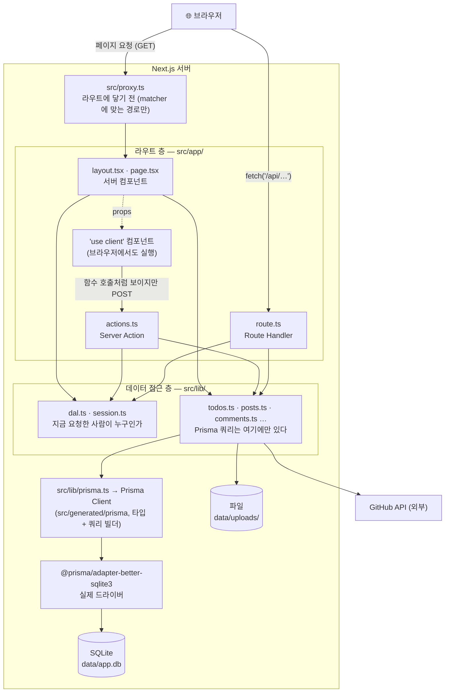

| 층 | 폴더 | 하는 일 | 하지 않는 일 |
| --- | --- | --- | --- |
| proxy | `src/proxy.ts` | 쿠키만 보고 리다이렉트, CORS 헤더 | DB 조회, 진짜 권한 검사 |
| 라우트 | `src/app/**` | 화면 그리기, 폼 받기, JSON 응답 | Prisma 직접 호출 |
| 데이터 접근 | `src/lib/**` | Prisma 쿼리, 파일, 외부 API, 세션 검증 | 화면 관련 코드 |
| Prisma | `prisma/`, `src/lib/prisma.ts`, `src/generated/` | 테이블 정의, 타입 생성, 쿼리를 SQL 로 번역 | 비즈니스 규칙 |
| 저장소 | `data/` | SQLite 파일, 업로드 이미지 | — |

### 0-2. 폴더 지도

```
prisma/
├── schema.prisma            ← 테이블 정의의 단일 출처 (main 의 src/lib/schema.ts 대체)
├── migrations/
│   ├── 0_init/migration.sql        ← 초기 테이블
│   ├── 1_refresh_tokens/migration.sql  ← 나중에 추가된 테이블 (이력이 남는다)
│   └── migration_lock.toml
└── seed.ts                  ← 샘플 데이터 (main 의 scripts/seed-db.mts 대체)
prisma.config.ts             ← Prisma CLI 설정 (스키마 위치, DATABASE_URL, seed 명령)
src/
├── generated/prisma/        ← `prisma generate` 산출물. git 에 없고 npm install 때 다시 만들어진다
├── proxy.ts                 ← 요청이 라우트에 닿기 전에 실행 (예전 이름: middleware)
├── app/                     ← URL = 폴더 경로 (main 과 같다)
│   ├── layout.tsx, page.tsx
│   ├── todos/, posts/, (auth)/, (demos)/, p/[id]/
│   └── api/ (todos, posts, uploads/[name], v1/)
├── components/, hooks/, stores/
├── lib/                     ← 데이터 접근 층
│   ├── prisma.ts            ← PrismaClient 싱글턴 (main 의 db.ts 대체)
│   ├── sql-now.ts           ← datetime('now') 형식 문자열 (기존 TEXT 날짜 컬럼과 호환)
│   ├── session.ts, dal.ts   ← 세션 쿠키, "현재 사용자"
│   ├── todos.ts, posts.ts, comments.ts, users.ts, api-keys.ts, refresh-tokens.ts  ← 전부 Prisma, 전부 async
│   ├── uploads.ts, github.ts, password.ts
│   ├── schemas/             ← Zod 검증 규칙 (화면과 API 가 같이 씀)
│   ├── api/                 ← 공개 API 공통 (봉투, 인증, 레이트 리밋, OpenAPI)
│   └── study-log.ts         ← 학습용 터미널 로그
└── test/                    ← 테스트 공통 설정 (마이그레이션 SQL 로 임시 DB 생성)
```

main 에 있던 `src/lib/db.ts`, `src/lib/schema.ts`, `scripts/` 는 이 브랜치에 없다.

### 0-3. 터미널 로그로 따라가기

`npm run dev` 터미널에는 `src/lib/study-log.ts` 가 찍는 학습용 로그와, 개발 모드에서 Prisma 가 찍는 실제 SQL 이 함께 나온다.

| 접두어 | 뜻 | 어디서 찍히나 |
| --- | --- | --- |
| `[proxy]` | 라우트에 닿기 전 | `src/proxy.ts` |
| `[render]` | 서버 컴포넌트가 데이터 함수를 호출함 | page.tsx 와 서버 컴포넌트들 |
| `[cache]` | `"use cache"` 함수의 몸체가 실제로 실행됨 (= 캐시 MISS) | `posts.ts`, `comments.ts`, `github.ts` |
| `[session]` | 세션 쿠키 발급·삭제·검증 | `session.ts`, `dal.ts` |
| `[action]` | Server Action 실행, 무엇을 무효화했는지 | `actions.ts` 들 |
| `[api]` | Route Handler 실행, 인증 방식, 레이트 리밋 | `src/lib/api/route.ts`, `api/**/route.ts` |
| `[build]` | 빌드 시점(또는 dev 첫 요청)에 실행되는 것 | `generateStaticParams` |
| `prisma:query` | Prisma 가 실제로 보낸 SQL | `src/lib/prisma.ts` 의 `log: ["query"]` (개발 모드만) |

`[cache] MISS` 뒤에 `prisma:query SELECT …` 가 따라오면 몸체가 실행된 것이고, HIT 일 때는 SQL 이 없다. 이 대응이 Prisma 브랜치만의 관찰 포인트다.

### 0-4. 다이어그램 읽는 법

- **시퀀스 다이어그램**: 위에서 아래로 시간이 흐른다. 실선 화살표는 요청, 점선은 응답.
- **흐름도**: 마름모는 분기. 실선은 호출, 점선은 데이터 전달.
- 이 문서의 그림은 Mermaid 로 그려서 GitHub, VS Code 미리보기, 대부분의 마크다운 뷰어에서 그림으로 보인다.

---

## 1장. 서버가 켜질 때

### 🚶 흐름

`npm run dev` 를 치면 아직 아무 요청도 없지만 몇 가지가 미리 준비된다. main 과 가장 다른 점은 **테이블을 앱이 만들지 않는다** 는 것이다. 테이블은 `npm run db:migrate` 가 미리 만들어 두고, 앱은 연결만 한다.

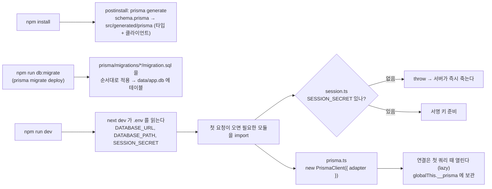

### 📄 파일

| 파일 | 역할 |
| --- | --- |
| `.env` | `DATABASE_URL="file:./data/app.db"` (Prisma CLI 가 읽음), `DATABASE_PATH` (앱이 `DATABASE_URL` 없을 때 대체로 씀), `SESSION_SECRET` |
| `prisma.config.ts` | CLI 설정. 스키마 위치, 마이그레이션 폴더, `seed: "tsx prisma/seed.ts"`, `datasource.url = env("DATABASE_URL")` |
| `prisma/schema.prisma` | 모델 6개(User, Todo, Post, Comment, ApiKey, RefreshToken). `@@map`/`@map` 으로 기존 snake_case 이름 유지 |
| `prisma/migrations/` | 스키마 변경 이력. `0_init` 과 `1_refresh_tokens` |
| `src/lib/prisma.ts` | `PrismaClient` 하나를 만들어 앱 전체가 공유. better-sqlite3 어댑터. 개발 모드에서 쿼리 로그 |
| `src/generated/prisma/` | `prisma generate` 가 만든 클라이언트와 타입. git 에 없다 |
| `src/lib/session.ts` | import 시점에 `SESSION_SECRET` 검사. 없으면 throw (main 과 같다) |
| `prisma/seed.ts` | 샘플 데이터. `npm run db:seed` 가 `prisma db seed` 를 거쳐 실행 |

DB 명령 한눈에:

| 명령 | 실제 명령 | 하는 일 |
| --- | --- | --- |
| `npm run db:migrate` | `prisma migrate deploy` | 아직 적용 안 된 마이그레이션 적용. 처음 clone 했을 때 이걸로 테이블을 만든다 |
| `npm run db:migrate:dev -- --name x` | `prisma migrate dev` | 스키마를 바꾼 뒤 새 마이그레이션 SQL 생성 + 적용 |
| `npm run db:seed` | `prisma db seed` | 비어 있는 테이블에만 샘플 삽입 |
| `npm run db:reset` | `prisma migrate reset --force` | DB 삭제 → 마이그레이션 → 시드 (터미널에서 직접) |
| `npm run db:studio` | `prisma studio` | 브라우저에서 테이블 보기·편집 |

### 💡 개념

**모듈은 한 번만 실행된다.** `import { prisma } from "@/lib/prisma"` 를 열 군데서 해도 `createPrismaClient()` 는 한 번만 돈다. 개발 서버의 HMR 로 모듈이 다시 로드돼도 `globalThis.__prisma` 에 보관한 것을 재사용한다. main 의 `db.ts` 와 같은 기법이다.

**ORM 과 마이그레이션.** main 은 `CREATE TABLE IF NOT EXISTS` 문자열을 앱이 연결할 때마다 실행해 테이블을 보장했다. Prisma 는 "스키마 파일 → 마이그레이션 SQL → DB" 순서를 도구가 관리하고, 앱은 스키마를 건드리지 않는다. 대신 clone 직후 `npm run db:migrate` 를 한 번 해야 한다.

**생성된 클라이언트.** `prisma generate` 는 `schema.prisma` 를 읽어 `prisma.post.findMany(...)` 같은 메서드와 그 반환 타입을 만든다. 컬럼 이름을 잘못 쓰면 실행이 아니라 **컴파일** 에서 에러가 난다. 이것이 main 의 `PostRow` 타입을 손으로 유지하던 일을 없앤다.

**Prisma 7 은 어댑터가 필수.** Prisma 가 드라이버를 내장하지 않고 어댑터로 받는다. SQLite 는 `@prisma/adapter-better-sqlite3` 다. main 이 쓰던 `node:sqlite` 는 아직 Prisma 어댑터가 없어서 이 브랜치에서는 better-sqlite3 네이티브 모듈이 설치된다.

**`server-only`.** 이 한 줄을 import 한 파일을 클라이언트 컴포넌트가 import 하면 빌드가 실패한다. Prisma Client 가 브라우저 번들에 들어가는 것을 막는다.

### 🔍 터미널에서 보기

`db:migrate` 를 안 하고 dev 를 켜면 첫 쿼리에서 "no such table" 류의 Prisma 에러가 난다. `SESSION_SECRET` 이 없으면 main 과 같은 에러가 난다.

```
Error: SESSION_SECRET 환경변수가 없습니다. .env 에 `openssl rand -base64 32` 결과를 넣으세요.
```

---

## 2장. 첫 접속: 홈 (`GET /`)

### 🚶 흐름

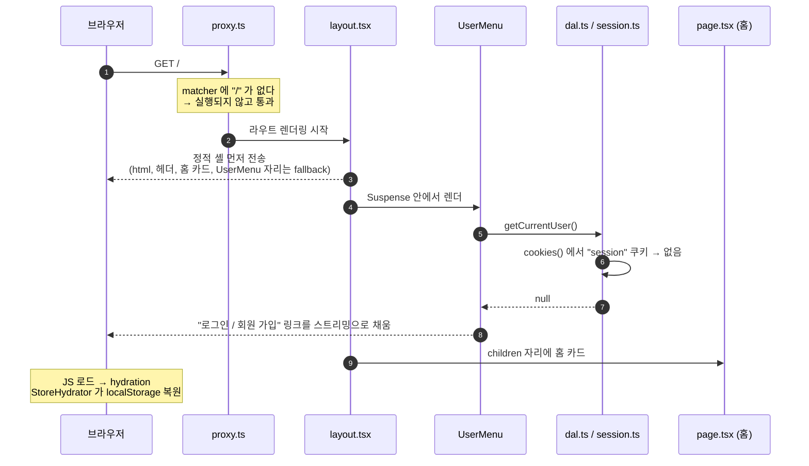

1. **proxy 는 실행되지 않는다.** `src/proxy.ts` 의 `config.matcher` 는 `/login`, `/signup`, `/posts/:id/edit`, `/api/v1/*` 만 잡는다.
2. **루트 레이아웃** `src/app/layout.tsx` 가 `<html>`, `<body>`, 상단 헤더를 그린다. 오른쪽 사용자 메뉴만 `<Suspense>` 로 감싸져 있다.
3. **사용자 메뉴** `src/components/user-menu.tsx` 는 서버 컴포넌트다. 아래 체인으로 로그인 여부를 확인한다. 마지막 줄이 main 과 다르다.

   ```
   UserMenu
     → getCurrentUser()        src/lib/dal.ts      react cache(): 한 요청에 한 번만 실행
       → getSessionUserId()    src/lib/session.ts  cookies() 에서 "session" 쿠키 읽기
         → decrypt()           jose 로 JWT 서명 검증. 위조·만료면 null
       → await findUserById()  src/lib/users.ts    prisma.user.findUnique({ where: { id }, select: { id, name, email } })
   ```

   `select` 로 컬럼을 고르면 반환 타입도 `{ id, name, email }` 로 좁혀진다. `passwordHash` 는 애초에 조회되지 않는다.
4. **홈 페이지** `src/app/page.tsx` 는 요청 데이터를 전혀 읽지 않는 순수 서버 컴포넌트라 정적 HTML 로 굳어 있다.
5. **브라우저에서 hydration.** `StoreHydrator` 의 `useEffect` 가 zustand persist 스토어를 localStorage 에서 복원한다.

### 📄 파일

| 파일 | 종류 | 역할 |
| --- | --- | --- |
| `src/app/layout.tsx` | 서버 | 모든 페이지의 껍데기. 페이지를 옮겨도 다시 그려지지 않는다 |
| `src/app/page.tsx` | 서버 | 홈 카드. 데이터 없음 → 정적 |
| `src/components/user-menu.tsx` | 서버 | 세션을 읽는 유일한 헤더 부품 |
| `src/lib/users.ts` | 서버 전용 | `findUserById` 가 async. NaN 이 들어오면 Prisma 가 거부하므로 먼저 `Number.isInteger` 로 거른다 |
| `src/components/store-hydrator.tsx` | 클라이언트 | 마운트 후 `rehydrate()` 호출 |

### 💡 개념

**서버 컴포넌트와 클라이언트 컴포넌트.** 파일 맨 위에 `"use client"` 가 없으면 서버 컴포넌트다. 서버에서만 실행되므로 Prisma 를 직접 부를 수 있고, 그 코드는 브라우저로 전송되지 않는다. 이 구분이 잘 안 와닿으면 **부록 A** 를 먼저 읽고 돌아와도 된다.

```
서버 컴포넌트 (기본)                  클라이언트 컴포넌트 ("use client")
├─ Prisma, 파일, 비밀 키 접근 가능     ├─ 이벤트 핸들러, 훅, 브라우저 API
├─ async 함수로 await 가능             ├─ 서버에서 HTML 로 먼저 그려짐 (SSR)
├─ 코드가 브라우저로 안 감              └─ 브라우저에서 hydration 후 상호작용
└─ 클라이언트 컴포넌트를 자식으로 둘 수 있음 (props 는 직렬화 가능한 값만)
```

**Cache Components 와 정적 셸.** `next.config.ts` 의 `cacheComponents: true` 가 이 앱의 렌더링 규칙이다. 기본은 "캐시 안 함". 요청이 있어야 알 수 있는 값(쿠키, `searchParams`, `params`, `connection()`)을 읽는 부분은 반드시 `<Suspense>` 안에 있어야 하고, 그 밖은 빌드 때 미리 그려 **정적 셸** 이 된다. 요청이 오면 셸을 먼저 보내고 Suspense 안쪽은 **스트리밍** 으로 채운다.

**hydration.** 서버가 보낸 HTML 은 "사진" 이다. 브라우저가 JS 를 내려받아 그 사진 위에 이벤트 핸들러와 상태를 붙이는 과정이다. localStorage 를 읽는 스토어는 hydration 이 끝난 **뒤** 복원한다.

### 🔍 터미널에서 보기

```
[session] getCurrentUser() → 비로그인 (세션 쿠키 없음). react cache(): 같은 요청 안에서는 이 로그가 한 번만 찍힌다
[render]  UserMenu ← 비로그인 (레이아웃 안이지만 쿠키를 읽으므로 Suspense 안에서 요청마다 실행)
```

로그인한 뒤에는 `getCurrentUser()` 로그 뒤에 `prisma:query SELECT "users"."id", "users"."name", "users"."email" FROM "users" WHERE …` 가 한 줄 붙는다.

---

## 3장. 할 일 목록: 읽고 바꾸기의 기본형 (`/todos`)

이 장이 앱 전체의 **원형** 이다. 서버 컴포넌트가 읽고, Server Action 이 바꾸고, `revalidatePath` 로 다시 그린다. 이 브랜치에서 처음 만나는 Prisma 특징 두 가지도 여기서 본다. **모든 데이터 함수가 async** 이고, **SQL 문자열이 객체** 로 바뀌었다.

### 🚶 흐름 1: 목록 읽기

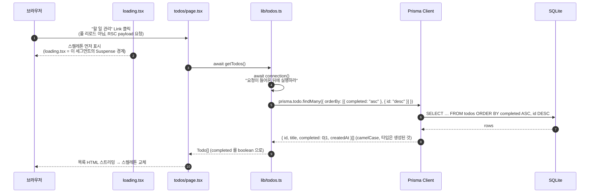

`src/app/todos/page.tsx` 는 `async` 서버 컴포넌트다. `getTodos()` 를 `await` 하고, 남은 개수를 세고, 클라이언트 컴포넌트들에 props 를 넘긴다. 이 파일은 main 과 한 글자도 다르지 않다. 함수 이름과 반환 타입을 그대로 두었기 때문이다.

| 클라이언트 컴포넌트 | 받는 props | 하는 일 |
| --- | --- | --- |
| `AddTodoForm` | 없음 | 폼 제출 → `addTodoAction` |
| `BulkActionBar` | 전체 id 배열 | 선택된 항목 일괄 완료/삭제 |
| `TodoItem` | 할 일 하나 | 체크, 인라인 수정, 삭제 |
| `ClearCompletedButton` | 완료 개수 | 완료 항목 일괄 삭제. 0 이면 렌더 안 함 |

### 🚶 흐름 2: 체크박스 클릭 (쓰기)

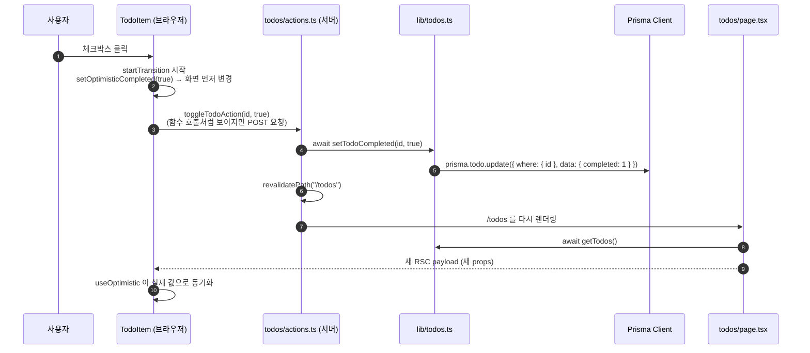

핵심 규칙 세 가지는 main 과 같다.

1. **Server Action 은 파일 맨 위에 `"use server"` 를 쓴 함수다.** 브라우저에서는 함수 호출처럼 보이지만 실제로는 POST 요청이다. 안에서 실제로 무슨 일이 일어나는지는 **부록 B** 에 있다.
2. **바꾼 뒤에는 `revalidatePath("/todos")`.** 액션이 끝나면 새 RSC payload 가 내려와 목록이 교체된다.
3. **서버에서 다시 검증한다.** `parseTitle`, `parseIds` 로 브라우저에서 온 값을 다시 본다.

여기에 이 브랜치의 규칙 하나가 더해진다.

4. **데이터 함수는 전부 `await` 한다.** `createTodo`, `setTodoCompleted`, `deleteTodos` 모두 Promise 를 돌려준다. `src/app/todos/actions.ts` 의 변경점은 사실상 `await` 추가뿐이다.

### 🚶 흐름 3: 형제끼리 상태 공유 (zustand)

`BulkActionBar` 와 `TodoItem` 들은 `page.tsx`(서버 컴포넌트)가 나란히 렌더링한 **형제** 다. 사이에 공통 클라이언트 부모가 없어서 `useState` 를 끌어올릴 곳이 없다.

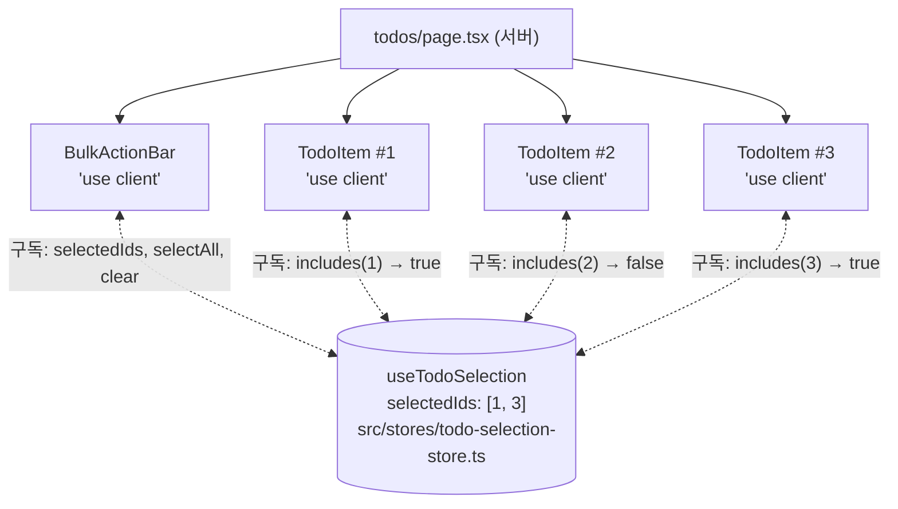

- 스토어에는 **"어떤 id 를 골랐는가"** 만 있다. 할 일 목록 자체(서버 데이터)는 넣지 않는다.
- `TodoItem` 은 boolean 하나만 구독해 다른 항목이 바뀌어도 리렌더되지 않는다.
- `BulkActionBar` 는 객체를 돌려주는 선택자라 `useShallow` 로 감싼다.

### 📄 파일

| 파일 | 종류 | 핵심 |
| --- | --- | --- |
| `src/app/todos/page.tsx` | 서버 | `await getTodos()`. `"use cache"` 없음 → 매 요청 조회. main 과 동일 |
| `src/app/todos/loading.tsx` | 서버 | 이 세그먼트를 자동으로 `<Suspense>` 로 감싼다. `connection()` 을 쓰는 페이지에 필수 |
| `src/app/todos/actions.ts` | `"use server"` | 추가·토글·수정·삭제·일괄 처리. 전부 `await` + `revalidatePath("/todos")` |
| `src/app/todos/todo-item.tsx` 등 | 클라이언트 | `useOptimistic`, `useTransition`, zustand 구독. main 과 동일 |
| `src/lib/todos.ts` | 서버 전용 | Prisma 쿼리 전부. 각 함수 위에 main 의 SQL 이 주석으로 남아 있어 나란히 읽을 수 있다 |
| `src/stores/todo-selection-store.ts` | 모듈 싱글턴 | main 과 동일 |
| `src/app/api/todos/route.ts` | Route Handler | `GET /api/todos` → JSON. `await getTodos()` |

### 💡 개념

**`await connection()` 은 여전히 필요하다.** Prisma 쿼리는 비동기지만, "비동기 = 요청 시점" 이 아니다. 캐시되지 않은 비동기 작업도 빌드 프리렌더 중에 실행될 수 있으므로, "이 아래는 실제 요청이 온 뒤에 실행하라" 는 신호가 여전히 필요하다. 이 줄을 지우고 빌드하면 `/todos` 가 `○ Static` 이 되고 DB 가 바뀌어도 화면이 안 바뀐다.

**SQL ↔ Prisma 대응 (todos).**

| main 의 SQL | 이 브랜치의 Prisma |
| --- | --- |
| `SELECT * FROM todos ORDER BY completed ASC, id DESC` | `findMany({ orderBy: [{ completed: "asc" }, { id: "desc" }] })` |
| `INSERT INTO todos (title) VALUES (?) RETURNING *` | `create({ data: { title } })` (만든 행을 돌려준다) |
| `UPDATE todos SET completed = ? WHERE id = ?` | `update({ where: { id }, data: { completed: 1 } })` |
| `DELETE FROM todos WHERE id = ?` | `deleteMany({ where: { id } })` |
| `UPDATE … WHERE id IN (?, ?, ?)` 자리표시자 조립 | `updateMany({ where: { id: { in: ids } } })` → `{ count }` |
| `Number(result.changes)` | `r.count` |

**`delete` 가 아니라 `deleteMany` 를 쓰는 이유.** `prisma.todo.delete({ where: { id } })` 는 행이 없으면 예외(P2025)를 던진다. main 의 "없어도 조용히 지나감" 의미를 지키려고 `deleteMany` 를 썼다.

**동기 → 비동기 전환의 함정.** main 의 `node:sqlite` 는 동기라 `if (findUserWithHashByEmail(email))` 처럼 바로 조건에 썼다. Prisma 에서는 Promise 가 돌아오므로 `await` 를 빠뜨리면 **항상 참** 이 되어 컴파일은 통과하고 동작만 틀린다. 이 브랜치에서 데이터 함수 30개가 async 가 되면서 호출부 26개 파일에 `await` 가 들어갔다.

**React 19 폼 훅 세 가지** (main 과 같다).

| 훅 | 돌려주는 것 | 이 앱에서 |
| --- | --- | --- |
| `useActionState(action, 초기값)` | `[state, formAction, pending]` | `<form action={formAction}>` 에 연결 |
| `useTransition()` | `[isPending, startTransition]` | 버튼 클릭에서 액션을 감싸 진행 중 표시 |
| `useOptimistic(실제값)` | `[낙관값, set낙관값]` | 서버 응답 전에 화면 먼저 바꾸고, 새 props 가 오면 동기화 |

### 🔍 터미널에서 보기

```
[render]  TodosPage → getTodos() 호출
[render]  getTodos() — connection() 통과 → 요청 시점 실행 (SSR). 캐시 없이 매번 Prisma 쿼리
prisma:query SELECT "todos"."id", "todos"."title", "todos"."completed", "todos"."created_at" FROM "todos" ORDER BY …
[render]  TodosPage ← 7건. "use cache" 가 아니라 revalidatePath 로 갱신되는 페이지

(체크박스 클릭)
[action]  toggleTodoAction(id=3, completed=true)
prisma:query UPDATE "todos" SET "completed" = ? WHERE …
[action]    ↳ revalidatePath "/todos" — 경로 단위 → 다음에 그 경로를 방문할 때 페이지를 다시 렌더링
```

---

## 4장. 글 목록: 캐시가 들어온다 (`/posts`)

3장의 `/todos` 는 매 요청 DB 를 읽었다. 글 목록은 **`"use cache"`** 로 결과를 보관해 두고 재사용한다. 캐시 규칙은 main 과 완전히 같고, 캐시 함수 **안** 의 조회만 Prisma 로 바뀌었다.

### 🚶 흐름 1: 목록 요청

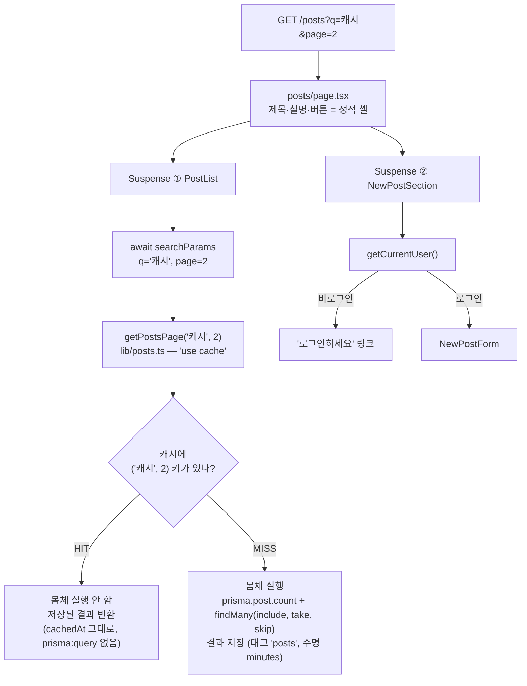

`src/app/posts/page.tsx` 는 세 부분으로 나뉜다.

| 부분 | 무엇을 읽나 | 어디에 있나 | 이유 |
| --- | --- | --- | --- |
| 제목, 설명, 캐시 버튼 | 아무것도 | Suspense 밖 | 정적 셸에 들어간다 |
| `PostList` | `searchParams` | Suspense ① | 요청 시점 값이라 셸에 못 들어간다 |
| `NewPostSection` | 세션 쿠키 | Suspense ② | 마찬가지 |

`PostList` 는 `searchParams` 에서 `q` 와 `page` 를 꺼낸 **뒤** `getPostsPage(query, page)` 에 **인자로** 넘긴다. `"use cache"` 함수 안에서는 `searchParams` 나 `cookies()` 를 읽을 수 없기 때문이다.

### 🚶 흐름 2: 캐시 함수 안에서 Prisma 가 하는 일

`getPostsPage` 의 몸체를 main 과 나란히 놓으면 이렇다.

| main 의 SQL | 이 브랜치의 Prisma |
| --- | --- |
| `WHERE p.title LIKE ? OR p.content LIKE ?` 문자열 조립 | `searchWhere(q)` → `{ OR: [{ title: { contains: q } }, { content: { contains: q } }] }` 객체 |
| `SELECT COUNT(*) …` | `prisma.post.count({ where })` |
| `SELECT p.*, u.name AS author_name FROM posts p LEFT JOIN users u …` | `prisma.post.findMany({ where, include: withAuthor, … })` |
| `ORDER BY p.id DESC LIMIT ? OFFSET ?` | `orderBy: { id: "desc" }, take: PAGE_SIZE, skip: (page-1)*PAGE_SIZE` |
| `PostRow` 타입을 손으로 선언 | `Prisma.PostGetPayload<{ include: typeof withAuthor }>` 로 자동 추론 |

`where` 를 객체로 만들어 두면 `count` 와 `findMany` 에 같은 것을 넘기고, 커서 조건과 `AND` 로 합치기도 쉽다 (9장의 `getPostsByCursor`).

### 🚶 흐름 3: 검색창에 타이핑

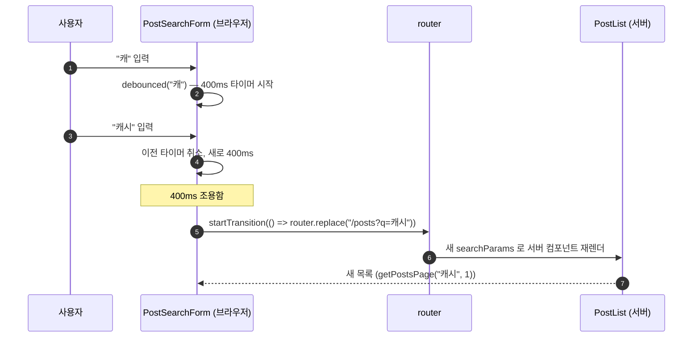

검색은 **서버** 가 한다. 브라우저는 URL 만 바꾼다. `router.replace` 라서 히스토리가 쌓이지 않고, `useTransition` 으로 감싸서 깜빡이지 않으며, `<form method="get">` 이라 JS 가 없어도 동작한다.

### 🚶 흐름 4: 캐시 무효화 두 가지

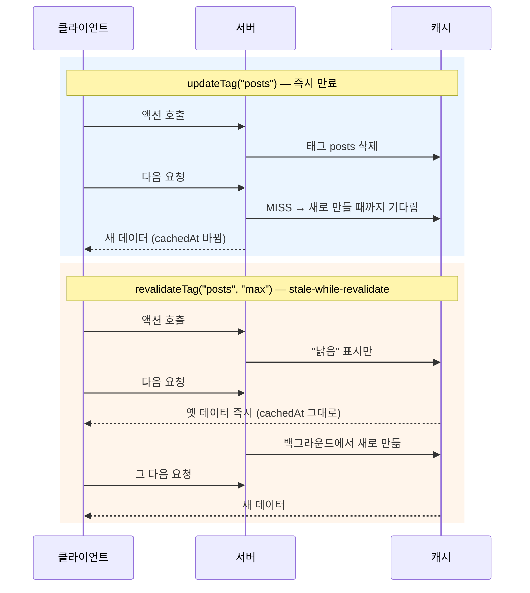

| 함수 | 다음 요청이 겪는 일 | 이 앱에서 |
| --- | --- | --- |
| `updateTag(tag)` | 새 데이터가 만들어질 때까지 기다렸다가 받음 | 글 작성·수정·삭제, 댓글 |
| `revalidateTag(tag, "max")` | 옛 데이터를 받고, 뒤에서 새로 만듦 | "백그라운드 갱신" 버튼 |
| `revalidateTag(tag, { expire: 0 })` | 옛 값을 주지 않고 바로 새로 만듦 | 공개 API (10장) |
| `revalidatePath(path)` | 그 경로를 다음에 볼 때 페이지 전체 재렌더 | `/todos` |

### 📄 파일

| 파일 | 핵심 |
| --- | --- |
| `src/lib/posts.ts` | `withAuthor` include, `searchWhere`, `Prisma.PostGetPayload`. `"use cache"`·`cacheLife`·`cacheTag` 는 main 과 동일 |
| `src/app/posts/page.tsx` | main 과 동일 |
| `src/app/posts/post-search-form.tsx`, `src/hooks/use-debounced-callback.ts` | 디바운스 검색. main 과 동일 |
| `src/app/posts/actions.ts` | `await getPost`, `await createPost` 등. 무효화 로직은 동일 |

### 💡 개념

**`"use cache"` 함수의 규칙** 은 main 과 같다. 첫 줄 지시어, `cacheLife`, `cacheTag`, 인자가 캐시 키, 안에서 요청 API 못 읽음. Prisma 쿼리는 그냥 안에서 부르면 된다.

**`include` 와 `select`.** 스키마에 `author User? @relation(...)` 을 선언해 두었기 때문에 `include: { author: { select: { name: true } } }` 라고만 쓰면 Prisma 가 JOIN 을 만든다. `author` 가 없는 글은 `author` 가 `null` 로 오므로 LEFT JOIN 과 같은 의미다.

**캐시된 값은 모두가 공유한다.** 그래서 캐시 함수 안에서 "현재 사용자" 를 읽으면 안 된다. 사용자별 정보는 캐시 밖에서 읽어서 합친다 (7장).

### 🔍 터미널에서 보기

```
[render]  PostList → getPostsPage(query="", page=1) 호출 (Suspense 안, searchParams 읽은 뒤)
[cache]   MISS(실행 시각 10:00:01.234) getPostsPage(query="", page=1) — 몸체 실행, Prisma 쿼리 2번 (count + findMany)
prisma:query SELECT COUNT(*) FROM "posts" …
prisma:query SELECT "posts"."id", … , "users"."name" FROM "posts" LEFT JOIN "users" … LIMIT ? OFFSET ?
[render]  PostList ← 12건, cachedAt=2026-09-15T01:00:01.234Z

(새로고침 — HIT)
[render]  PostList → getPostsPage(query="", page=1) 호출
[ Cache ] 10:00:01.234 [cache] MISS(...)     ← 개발 모드가 예전 로그를 "재생" 한 것
[render]  PostList ← 12건, cachedAt=2026-09-15T01:00:01.234Z   ← 시각 그대로, prisma:query 없음
```

HIT 과 MISS 를 구분하는 법: 로그 안의 **시각** 과 `prisma:query` 줄의 **유무**.

---

## 5장. 글 상세: 동적 라우트와 스트리밍 (`/posts/3`)

이 장의 라우트 층은 main 과 같다. 다른 점은 `generateStaticParams` 가 `getPostIds()` 를 `await` 한다는 것과, `getOtherPosts` 의 조건이 `where: { id: { not: excludeId } }` 라는 것뿐이다.

### 🚶 흐름 1: 어느 파일이 뜨는가

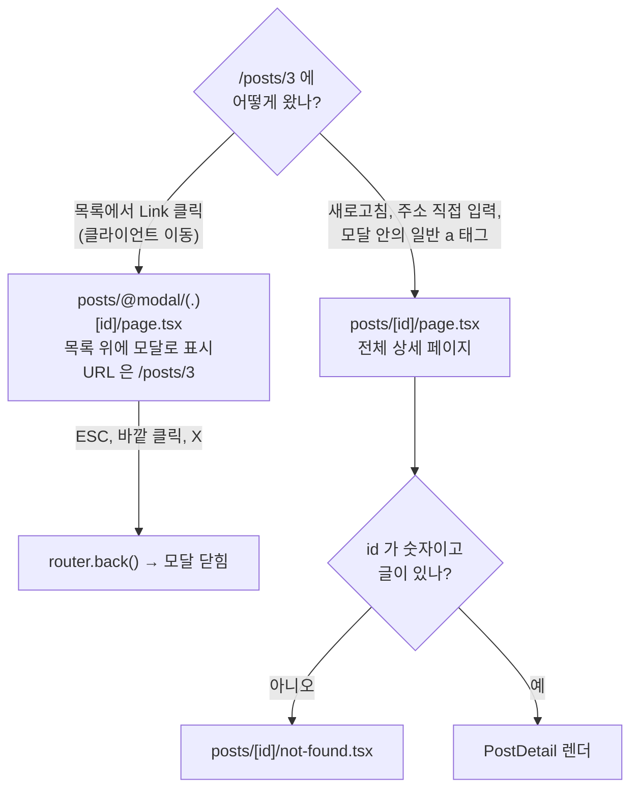

- `@modal` 폴더는 **병렬 라우트 슬롯**, `(.)[id]` 는 **인터셉팅 라우트** 다. 클라이언트 이동으로 `/posts/[id]` 에 가면 원래 페이지 대신 이 파일이 슬롯에 들어간다.
- `@modal/default.tsx` 가 `null` 을 돌려주므로 평소에는 모달이 없다.
- 모달 닫기는 `router.back()` 이다.

### 🚶 흐름 2: 전체 페이지의 스트리밍 순서

```
시간 →  0ms         ~50ms              ~100ms             ~1600ms
        │           │                  │                  │
셸      ████████████████████████████████████████████████████████  (레이아웃, 네비, 스켈레톤)
본문    ░░░░░░░░░░░░████████████████████████████████████████████  PostDetail: getPost(3) — 캐시 HIT 이면 거의 즉시
버튼    ░░░░░░░░░░░░░░░░░░░░░░░░░░████████████████████████████████  PostOwnerActions: 세션 읽기 (요청마다)
댓글    ░░░░░░░░░░░░░░░░░░░░░░░░░░████████████████████████████████  CommentsSection: 캐시 + 세션
다른글  ░░░░░░░░░░░░░░░░░░░░░░░░░░░░░░░░░░░░░░░░░░░░░░░░░░░░░░████  OtherPosts: connection() + 1.5초 지연
        ░ = fallback(스켈레톤) 표시 중     █ = 실제 내용 도착
```

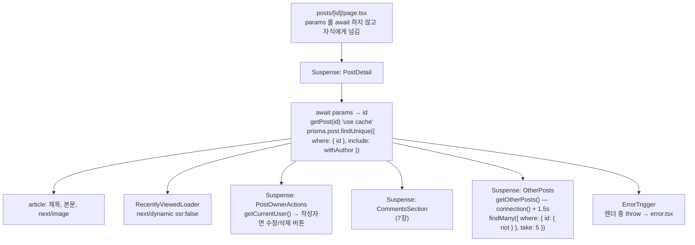

왜 이렇게 나누나. 글 본문은 캐시라 빠르고 모두에게 같다. 수정/삭제 버튼은 "내 글인가" 를 알아야 하므로 요청마다 세션을 읽는다. Suspense 로 나누면 각자 준비되는 대로 나간다.

### 🚶 흐름 3: 특수 파일이 끼어드는 순간

| 상황 | 무슨 일이 | 어느 파일 |
| --- | --- | --- |
| 목록에서 상세로 이동, 아직 서버 응답 전 | 스켈레톤 표시 | `posts/[id]/loading.tsx` |
| `/posts/9999` 또는 `/posts/abc` | `notFound()` 호출 | `posts/[id]/not-found.tsx` |
| "에러 발생시키기" 버튼 | 렌더 중 `throw` | `posts/error.tsx` |
| `/p/3` | `permanentRedirect` | `p/[id]/page.tsx` — Suspense **밖** 에서 호출해야 진짜 HTTP 308 |
| `/blog/3`, `/articles`, `/posts/feed` | 경로 패턴 리다이렉트 | `next.config.ts` 의 `redirects()` |

### 📄 파일

| 파일 | 핵심 |
| --- | --- |
| `src/app/posts/[id]/page.tsx` | `generateStaticParams` 가 `(await getPostIds()).slice(0, 2)`. 나머지는 main 과 동일 |
| `src/app/posts/[id]/edit/page.tsx` | `requireUser()` → 남의 글이면 상세로 `redirect`. `updatePostAction.bind(null, id)` |
| `src/app/posts/[id]/post-owner-actions.tsx` | 서버 컴포넌트. 세션 읽고 작성자만 버튼 |
| `src/app/posts/[id]/recently-viewed-loader.tsx` | `dynamic(() => import(...), { ssr: false })` |
| `src/app/posts/@modal/(.)[id]/page.tsx` | 인터셉팅 라우트. `generateStaticParams` 도 `await getPostIds()` |
| `src/lib/posts.ts` | `getPost(id)` — NaN 이면 먼저 `null`. Prisma 는 `where: { id: NaN }` 을 거부하지만 SQLite 는 빈 결과였으므로 동작을 맞췄다 |

### 💡 개념

**동적 라우트 `[id]`.** 폴더 이름을 대괄호로 감싸면 그 자리에 무엇이 와도 매칭된다. Next.js 16 에서 `params` 는 **Promise** 다.

**`generateStaticParams`.** "빌드 때 미리 만들 id 목록" 을 돌려준다. `getPostIds()` 가 `prisma.post.findMany({ select: { id: true } })` 라 async 이므로 `await` 가 붙었다. Cache Components 에서는 최소 1개를 돌려줘야 해서 DB 가 비었으면 `[{ id: "0" }]` 을 준다.

**태그를 두 개 다는 이유.** `getPost(3)` 은 `posts` 와 `post-3` 두 태그를 단다. 글 하나만 바뀌면 `post-3` 만, 목록에도 영향이 있으면 `posts` 도 지운다.

**`findUnique` vs `findMany`.** 유니크 컬럼(`id`, `email`, `keyHash`, `tokenHash`)으로 한 건을 찾을 때는 `findUnique`. 조건이 유니크가 아니거나 여러 건이면 `findMany`.

### 🔍 터미널에서 보기

```
[render]  PostDetail → getPost(3) 호출 (params 를 읽으므로 Suspense 안)
[cache]   MISS(...) getPost(3) — 몸체 실행, Prisma findUnique. 태그: posts, post-3
prisma:query SELECT … FROM "posts" LEFT JOIN "users" … WHERE "posts"."id" = ? LIMIT ? OFFSET ?
[render]  PostDetail ← "Cache Components 란?". 이어서 PostOwnerActions / CommentsSection / OtherPosts 가 각자 Suspense 안에서 스트리밍
[render]  getOtherPosts(excludeId=3) — connection() 통과 → 요청 시점 실행 (캐시 없음). 1.5초 지연 시작
[render]  OtherPosts(excludeId=3) ← 5건. 1.5초 뒤 도착 → 이 부분만 스트리밍으로 교체됨
```

---

## 6장. 인증: 누구인지 확인하기

인증의 구조는 main 과 완전히 같다. 세션은 JWT 쿠키, 검증은 세 층. 다른 점은 `users.ts` 의 조회가 Prisma 이고 async 라는 것뿐이다.

### 🚶 흐름 1: 회원 가입과 로그인

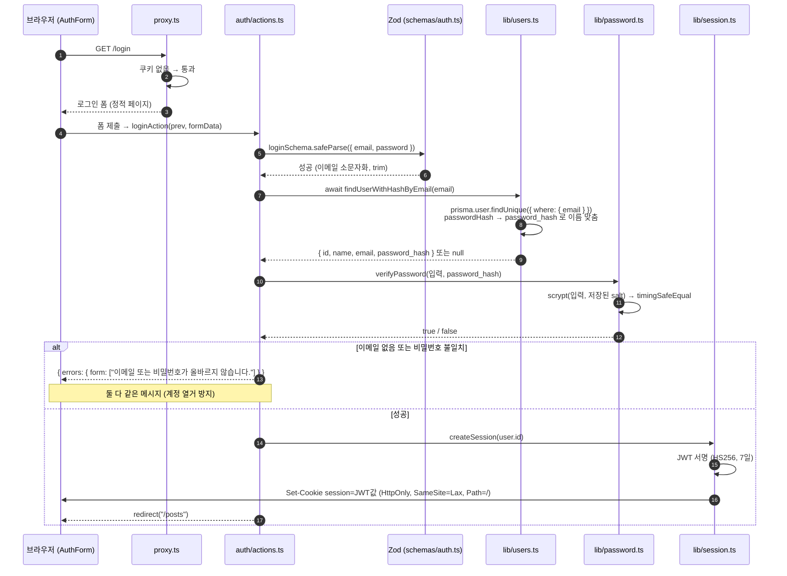

회원 가입은 여기에 "중복 이메일 확인(`await findUserWithHashByEmail`)" 과 "`hashPassword` 로 해시 저장(`await createUser`)" 이 추가된다. `createUser` 는 `prisma.user.create({ data, select: { id, name, email } })` 라 해시를 빼고 돌려준다.

### 🚶 흐름 2: 로그인 뒤의 모든 요청

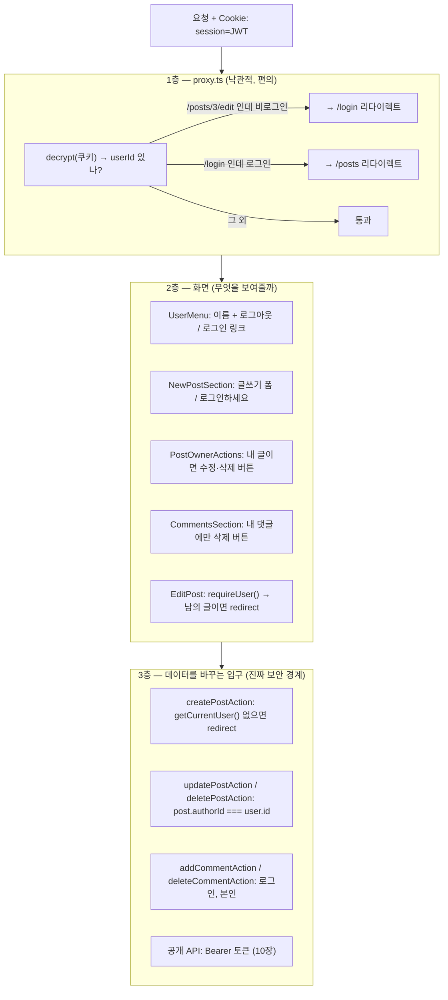

| 층 | 무엇을 보나 | DB 조회 | 뚫리면 |
| --- | --- | --- | --- |
| proxy | 쿠키 서명만 | 없음 | 아무 일 없음 |
| 화면 | `getCurrentUser()` | 있음 (요청당 1회) | 버튼이 보일 뿐 |
| 액션/API | `getCurrentUser()` + 소유자 비교 | 있음 | **여기가 뚫리면 데이터가 바뀐다** |

### 🚶 흐름 3: 인증이 녹아 있는 곳 전체 목록

| 어디 | 파일 | 무엇을 하나 | 실패 시 |
| --- | --- | --- | --- |
| 프록시 | `src/proxy.ts` | `/posts/:id/edit` 비로그인 → `/login`. 로그인 상태로 `/login`, `/signup` → `/posts` | 리다이렉트 |
| 헤더 | `src/components/user-menu.tsx` | 이름 표시, 로그아웃 폼 | 로그인/가입 링크 |
| 글 목록 | `src/app/posts/page.tsx` `NewPostSection` | 로그인 시 글쓰기 폼 | "로그인하세요" |
| 글 상세 | `src/app/posts/[id]/post-owner-actions.tsx` | 작성자면 수정·삭제 버튼 | 안내 문구 |
| 글 수정 페이지 | `src/app/posts/[id]/edit/page.tsx` | `requireUser()`, 작성자 비교 | redirect |
| 댓글 영역 | `src/app/posts/[id]/comments-section.tsx` | 내 댓글에 삭제 버튼, 로그인 시 폼 | "로그인하세요" |
| 글·댓글 액션 | `src/app/posts/actions.ts` | 작성: 로그인. 수정·삭제: 작성자 | `redirect("/login")` 또는 에러 객체 |
| 공개 API | `src/lib/api/auth.ts` | Bearer 토큰 → `Principal` | 401 / 403 JSON |
| 할 일 | `src/app/todos/actions.ts` | **검사 없음** | 소유자 개념이 없는 공유 목록 |

### 📄 파일

| 파일 | 핵심 |
| --- | --- |
| `src/app/(auth)/auth-form.tsx` | 로그인/가입 공용 폼. main 과 동일 |
| `src/app/(auth)/actions.ts` | `await findUserWithHashByEmail`, `await createUser`. 나머지 동일 |
| `src/lib/schemas/auth.ts` | Zod: 이름 2~30자, 이메일 형식+소문자, 비밀번호 8~72자 |
| `src/lib/password.ts` | `scrypt` + salt. `"server-only"` 를 안 붙인 이유: `prisma/seed.ts` 가 Next.js 밖에서 import |
| `src/lib/session.ts` | `jose` JWT. 쿠키 `session`, 7일, `httpOnly`, `sameSite: lax`. main 과 동일 |
| `src/lib/dal.ts` | `getCurrentUser()` 가 `await findUserById`. `requireUser()` |
| `src/lib/users.ts` | `findUserById`(select 로 해시 제외), `findUserWithHashByEmail`(camelCase → snake_case 로 맞춰 호출부 무변경), `createUser` |

### 💡 개념

**비밀번호는 저장하지 않는다.** `scrypt(비밀번호, salt)` 결과를 저장한다. 스키마에서는 `passwordHash String @map("password_hash")` 다.

**세션은 서명된 JWT 쿠키다 (stateless).** 서버 DB 에 세션 테이블이 없다. 스키마의 모델 6개 중 세션은 없다.

```
JWT = base64(헤더) . base64({ userId: 1, iat, exp }) . HMAC-SHA256(앞 두 부분, SESSION_SECRET)
```

**react `cache()`.** `getCurrentUser` 는 한 요청 안에서 여러 컴포넌트가 부르지만 첫 호출만 실제로 실행된다. Prisma 쿼리도 한 번만 나간다.

**Cache Components 에서 세션 다루기.** `cookies()` 를 읽는 컴포넌트는 Suspense 안에, `"use cache"` 함수 안에서는 `cookies()` 를 못 읽는다. 해법은 "데이터는 캐시하고, 사용자는 밖에서 읽고, 화면에서 합친다" (7장).

**계정 열거 방지와 `timingSafeEqual`.** main 과 같다.

### 🔍 터미널에서 보기

```
[action]  loginAction 시작
prisma:query SELECT … FROM "users" WHERE "users"."email" = ? LIMIT ? OFFSET ?
[action]    ↳ 성공: userId=1 → 세션 발급 → redirect(/posts)
[session] createSession(userId=1) → JWT 서명 → httpOnly 쿠키 "session" 설정 (7일)
```

---

## 7장. 댓글: 캐시와 사용자별 정보 합치기

### 🚶 흐름 1: 댓글 영역 렌더

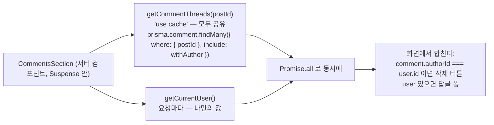

- 댓글 목록은 캐시된다. 누가 보든 같은 목록이니까.
- "내 댓글인가" 는 캐시 안에서 판단할 수 없다. 사용자마다 다르니까.
- 두 값을 따로 가져와 **렌더링 시점에** 합친다.

### 🚶 흐름 2: 댓글 작성

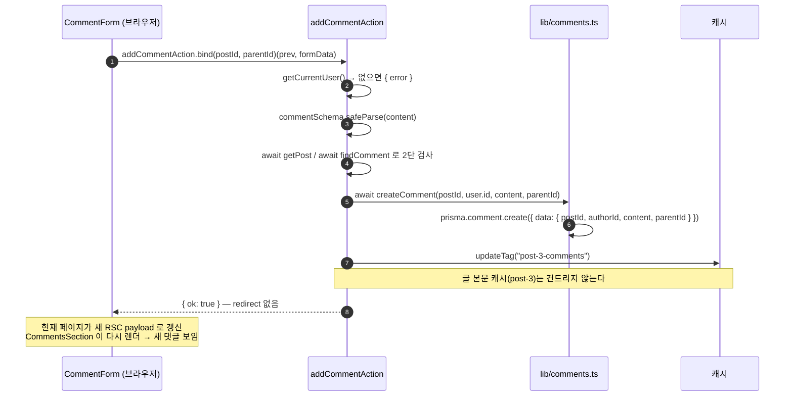

- `bind` 로 `postId` 와 `parentId` 를 미리 묶어 두면 폼은 `(prev, formData)` 만 넘기면 된다.
- 2단 제한: 부모가 (1) 존재하고 (2) 같은 글이고 (3) 그 자신이 최상위여야 한다.
- 삭제는 본인만. 최상위 댓글을 지우면 답글도 함께 지워진다.

### 🚶 흐름 3: CASCADE 는 어디에 있나

main 은 `CREATE TABLE` 의 `REFERENCES comments(id) ON DELETE CASCADE` 였다. 이 브랜치는 `prisma/schema.prisma` 의 관계 선언에 있다.

```prisma
model Comment {
  postId   Int  @map("post_id")
  parentId Int? @map("parent_id")
  post    Post      @relation(fields: [postId], references: [id], onDelete: Cascade)
  parent  Comment?  @relation("Replies", fields: [parentId], references: [id], onDelete: Cascade)
  replies Comment[] @relation("Replies")
  author  User      @relation(fields: [authorId], references: [id])
}
```

`prisma migrate` 가 이것을 `ON DELETE CASCADE` 가 붙은 SQL 로 바꿔 `migration.sql` 에 남긴다. DB 가 하는 일은 main 과 같다. **자기 참조 관계** 는 이름(`"Replies"`)을 붙여 두 방향(`parent`, `replies`)을 구분한다.

### 📄 파일

| 파일 | 핵심 |
| --- | --- |
| `src/lib/comments.ts` | `withAuthor` include, `Prisma.CommentGetPayload`, 트리 조립은 main 과 같은 로직. `commentsTag(postId)` |
| `src/app/posts/[id]/comments-section.tsx` | `Promise.all([캐시, 세션])` → 합치기. main 과 동일 |
| `src/app/posts/[id]/comment-form.tsx` | `useActionState(addCommentAction.bind(null, postId, parentId))` |
| `prisma/schema.prisma` | `Comment` 모델의 `@relation` 과 `onDelete: Cascade` |

### 💡 개념

**태그를 잘게 나누는 이유.** 댓글이 달릴 때 글 본문 캐시까지 지우면 낭비다. `post-3-comments` 만 지우면 `getPost(3)` 은 그대로 HIT 이다.

**JOIN 대신 관계.** `c.author.name` 처럼 중첩 객체로 온다. `toComment` 가 그것을 평탄한 `authorName` 으로 편다. 타입은 `Prisma.CommentGetPayload<{ include: typeof withAuthor }>` 가 만들어 주므로 `c.author` 가 존재한다는 것을 TypeScript 도 안다.

---

## 8장. 이미지 업로드

파일 저장은 Prisma 와 무관하다. 파일 시스템에 쓰고 DB 에는 파일명만 넣는다. main 과 다른 점은 `updatePost` 가 `updated_at` 을 갱신하는 방법 하나다.

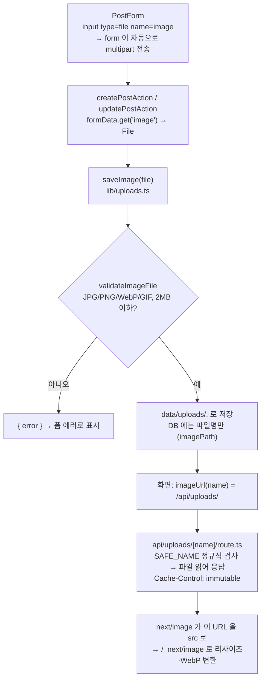

| 결정 | 이유 |
| --- | --- |
| `public/` 이 아니라 `data/uploads/` | `public` 은 빌드 시점 자산용 |
| 파일명은 서버가 만든 UUID | 경로 탈출 방지. 읽을 때도 정규식으로 다시 검사 |
| 수정 시 `updatedAt: sqlNow()` | main 은 SQL 에서 `datetime('now')` 를 직접 불렀다. Prisma 의 `update` 는 SQL 함수를 못 부르므로 같은 형식의 문자열을 만들어 넣는다 (`src/lib/sql-now.ts`) |
| 삭제 시 `deleteImage` | DB 행만 지우면 파일이 계속 남는다 |

### 📄 파일

`src/lib/uploads.ts`, `src/lib/uploads-validate.ts`, `src/app/api/uploads/[name]/route.ts`, `src/app/posts/post-form.tsx` 는 main 과 동일. `src/lib/posts.ts` 의 `updatePost` 와 `src/lib/sql-now.ts` 가 다르다.

---

## 9장. 브라우저가 직접 데이터를 가져올 때

`(demos)` 라우트 그룹의 세 페이지는 **브라우저** 가 `fetch` 로 가져온다. 클라이언트 쪽 코드는 main 과 같고, 그들이 부르는 Route Handler 안의 조회만 Prisma 다.

### 🚶 흐름 1: 데모 그룹의 공통 껍데기

```
src/app/(demos)/
├── layout.tsx      ← QueryProviders(TanStack Query) + PostsNav
├── template.tsx    ← 세그먼트가 바뀔 때마다 새로 마운트 → 진입 애니메이션 재생
├── client-fetch/, feed/, releases/
```

### 🚶 흐름 2: `/client-fetch` — 같은 일을 세 가지 방법으로

| 방법 | 파일 | 캐시 키 | 로딩 상태 |
| --- | --- | --- | --- |
| SWR | `post-search.tsx` | URL 문자열 | `isLoading`, `isValidating` |
| TanStack Query | `post-search-query.tsx` | `["posts", "search", query]` | `isPending`, `isFetching` |
| 직접 구현 | `post-count.tsx` | 없음 | `useState` 로 직접. `AbortController` 로 취소 |

세 컴포넌트가 부르는 `/api/posts` 는 `await searchPosts(q)`, `await countPosts()` 로 바뀌었다.

### 🚶 흐름 3: `/feed` — 서버 첫 페이지 + 브라우저 무한 스크롤

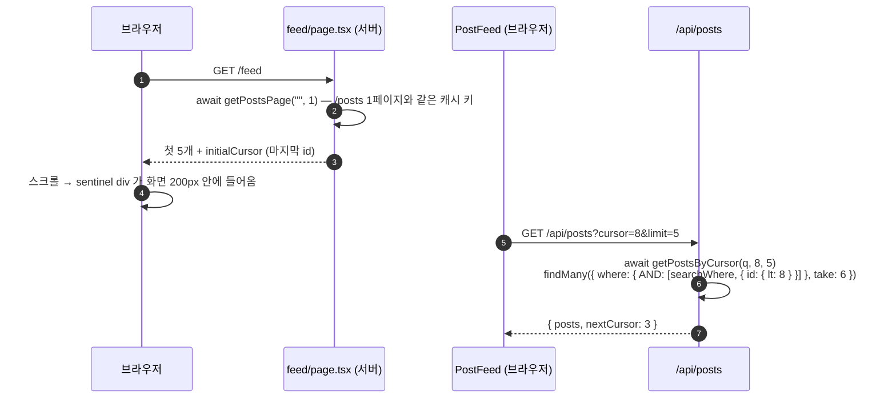

- **커서 페이지네이션**: "마지막으로 본 id 보다 작은 것 N개". main 의 `p.id < ?` 가 `{ id: { lt: cursor } }` 로, `" AND ".join` 이 `{ AND: [...] }` 배열로 바뀌었다.
- `take: limit + 1` 로 다음 페이지 유무를 판단한다.
- `use(io())` 로 프리렌더 중에는 suspend 한다 (main 과 같다).

### 🚶 흐름 4: `/releases` — 외부 API 를 서버에서 캐시하고 Promise 를 넘긴다

`src/lib/github.ts` 는 Prisma 와 무관하다. `"use cache"` 로 감싼 `fetch` 결과를 `await` 하지 않고 클라이언트 컴포넌트에 넘겨 `use()` 로 읽는다. main 과 동일.

### 💡 개념: 서버 페칭 vs 클라이언트 페칭

| | 서버 컴포넌트에서 읽기 | 브라우저에서 fetch |
| --- | --- | --- |
| 첫 화면 | 데이터가 HTML 에 포함 → 빠름, SEO 됨 | 빈 화면 → 로딩 → 데이터 |
| DB 접근 | Prisma 직접 | 불가. Route Handler 를 거쳐야 |
| 상호작용 후 갱신 | Server Action + 무효화 | 라이브러리가 자동 재요청 |

---

## 10장. 공개 API: 외부 개발자용 문 (`/api/v1`)

HTTP 규약, 인증 방식, 레이트 리밋은 main 과 완전히 같다. 이 장에서 Prisma 가 드러나는 곳은 **트랜잭션** 하나다.

### 🚶 흐름 1: 요청 하나가 지나는 파이프라인

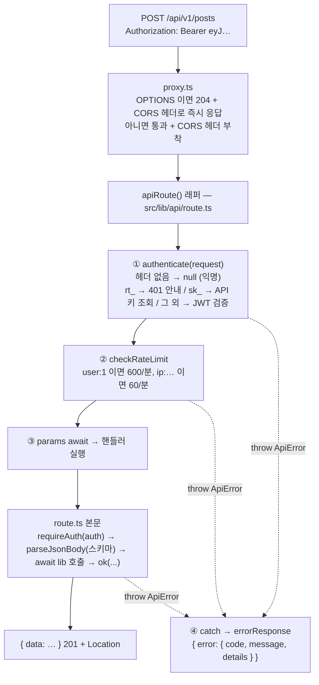

### 🚶 흐름 2: 응답 봉투와 에러 코드

```
성공(단건)  { "data": { ... } }
성공(목록)  { "data": [ ... ], "pagination": { "total", "limit", "offset", "hasMore" } }
실패        { "error": { "code": "not_found", "message": "...", "details": { ... } } }
```

| code | HTTP | 언제 |
| --- | --- | --- |
| `bad_request` | 400 | JSON 깨짐, id 가 정수 아님 |
| `unauthorized` | 401 | 토큰 없음·만료·위조 |
| `refresh_token_reused` | 401 | 소비된 리프레시 토큰 재사용 |
| `forbidden` | 403 | 남의 글 수정, API 키로 키 관리 시도 |
| `not_found` | 404 | 없는 글, 남의 API 키 |
| `conflict` | 409 | 중복 이메일 가입 |
| `unsupported_media_type` | 415 | `Content-Type` 이 JSON 아님 |
| `validation_failed` | 422 | Zod 실패 |
| `rate_limited` | 429 | `Retry-After` 헤더 포함 |
| `internal_error` | 500 | 예상 못 한 예외 (Prisma 에러도 여기로. 원인은 서버 로그에만) |

### 🚶 흐름 3: 세 가지 자격증명

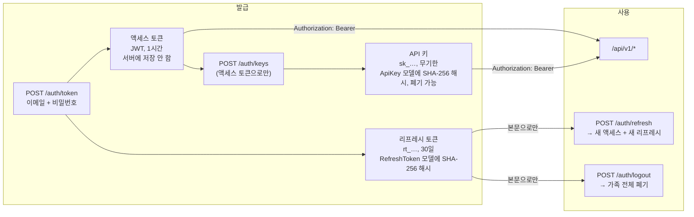

| | 세션 쿠키 (화면) | 액세스 토큰 | 리프레시 토큰 | API 키 |
| --- | --- | --- | --- | --- |
| 모양 | JWT in Cookie | JWT | `rt_` + 64자 hex | `sk_` + 64자 hex |
| 어디에 | `Cookie` 헤더 | `Authorization: Bearer` | 요청 본문 | `Authorization: Bearer` |
| 수명 | 7일 | 1시간 | 30일 (절대) | 무기한 |
| 서버 저장 | 없음 | 없음 | 해시 (`refresh_tokens`) | 해시 (`api_keys`) |
| 즉시 무효화 | 불가 | 불가 | 가능 | 가능 (`revokedAt`) |

### 🚶 흐름 4: 리프레시 토큰 회전 — Prisma 의 `$transaction`

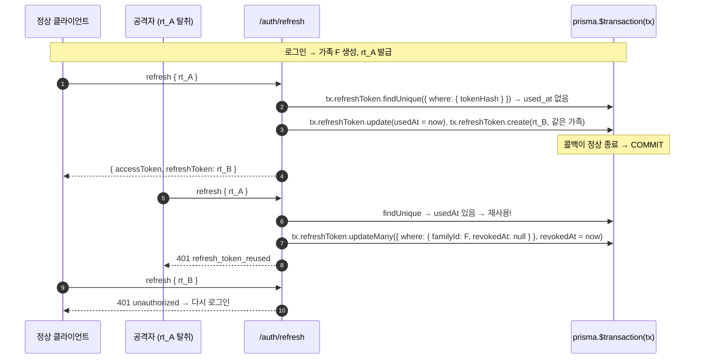

```mermaid
stateDiagram-v2
  state "유효" as valid
  state "소비됨 (usedAt)" as used
  state "폐기됨 (revokedAt)" as revoked
  state "만료됨" as expired
  [*] --> valid: 발급 (로그인 또는 회전)
  valid --> used: refresh 성공 (새 토큰 발급)
  valid --> revoked: logout / 가족 폐기
  valid --> expired: expiresAt 경과
  used --> revoked: 다시 오면 재사용 감지 → 가족 전체 폐기
  used --> [*]: pruneExpired (deleteMany lt sqlNow)
  revoked --> [*]
  expired --> [*]
```

**main 과의 차이가 여기 있다.** main 은 `db.exec("BEGIN IMMEDIATE") … COMMIT / ROLLBACK` 을 직접 감싸는 `transaction()` 헬퍼를 썼다. Prisma 는 `prisma.$transaction(async (tx) => …)` 가 그 역할을 한다. 콜백이 정상 종료하면 COMMIT, throw 하면 ROLLBACK. **콜백 안의 쿼리는 반드시 `tx` 로 보내야 한다.** `prisma.refreshToken…` 을 쓰면 트랜잭션 **밖** 에서 실행되어 조용히 원자성이 깨진다. 그래서 `insertToken`, `revokeFamily` 헬퍼가 `Prisma.TransactionClient` 타입의 첫 인자를 받는다.

### 🚶 흐름 5: 권한 규칙과 캐시 무효화

| 엔드포인트 | 읽기 | 쓰기 | 수정·삭제 | 화면 캐시 무효화 |
| --- | --- | --- | --- | --- |
| `/posts` | 누구나 | 로그인 | 작성자만 (403) | `revalidateTag("posts", { expire: 0 })` |
| `/posts/:id/comments`, `/comments/:id` | 누구나 | 로그인 | 작성자만 | `revalidateTag(commentsTag, { expire: 0 })` |
| `/todos` | 누구나 | 로그인 | 로그인 (소유자 없음) | `revalidatePath("/todos")` |
| `/auth/keys` | 액세스 토큰만 | 액세스 토큰만 | 본인 키만 (남의 것은 404) | — |

"남의 키는 404" 는 `revokeApiKey` 의 `updateMany({ where: { id, userId, revokedAt: null } })` 가 0건을 바꾸기 때문이다. main 의 `WHERE id = ? AND user_id = ?` 와 같은 원리다.

### 📄 파일

| 파일 | 핵심 |
| --- | --- |
| `src/proxy.ts`, `src/lib/api/route.ts`, `src/lib/api/http.ts`, `src/lib/api/rate-limit.ts`, `src/lib/api/serialize.ts` | main 과 동일 |
| `src/lib/api/auth.ts` | `await findUserIdByApiKey`, `await findUserById`, `await touchApiKey` |
| `src/lib/refresh-tokens.ts` | `$transaction`, `Prisma.TransactionClient`, `deleteMany({ where: { expiresAt: { lt: sqlNow() } } })` |
| `src/lib/api-keys.ts` | `findUnique({ where: { keyHash } })`, `updateMany` 로 touch/폐기 |
| `src/app/api/v1/**/route.ts` | lib 호출에 `await`. 나머지 동일 |

### 🔍 터미널에서 보기

```
[api]     POST /api/v1/auth/refresh → 인증: 익명 (Authorization 헤더 없음)
prisma:query BEGIN IMMEDIATE
prisma:query SELECT … FROM "refresh_tokens" WHERE "token_hash" = ? …
prisma:query UPDATE "refresh_tokens" SET "used_at" = ? WHERE "id" = ?
prisma:query INSERT INTO "refresh_tokens" …
prisma:query COMMIT
[api]       ↳ 리프레시 토큰 회전: 가족 3f2a1b9c 의 #12 소비 → 새 토큰 발급 (userId=1)
```

`BEGIN` 과 `COMMIT` 사이에 쿼리가 다 들어 있는지 보면 `tx` 를 제대로 썼는지 확인할 수 있다.

---

## 11장. 테스트: 어디서 무엇을 확인하나

```
            ▲  느리지만 전체를 본다
            │
      ┌─────┴─────┐
      │   E2E     │  Playwright, 프로덕션 빌드 + 진짜 브라우저 (e2e/*.spec.ts)
      │           │  DB 파일 삭제 → db:migrate → db:seed → build → start
      ├───────────┤
      │ Route     │  Vitest, 핸들러 함수를 직접 호출 (src/app/api/**/*.test.ts)
      │ Handler   │
      ├───────────┤
      │ 컴포넌트  │  Vitest + Testing Library + jsdom (src/app/**/*.test.tsx)
      ├───────────┤
      │ 단위      │  Vitest, node 환경 (src/lib/**/*.test.ts)
      │           │  순수 함수, Prisma 함수(임시 DB), 세션(cookies() mock)
      └───────────┘
            │
            ▼  빠르고 좁다
```

| 무엇을 | 어떻게 | 예 |
| --- | --- | --- |
| 순수 함수 | 그냥 호출 | `pushRecent`, `validateImageFile`, `checkRateLimit(…, now)` |
| Prisma 함수 | `src/test/setup.ts` 가 테스트 파일마다 **임시 SQLite 파일** 을 만들고 `prisma/migrations/*/migration.sql` 을 순서대로 실행해 테이블을 만든다. `DATABASE_URL` 과 `DATABASE_PATH` 둘 다 그 파일을 가리킨다 | `posts.test.ts`, `comments.test.ts`, `refresh-tokens.test.ts` |
| Next 런타임에 묶인 코드 | `vi.mock("next/headers")` | `session.test.ts` |
| 클라이언트 컴포넌트 | `vi.mock("./actions")` | `todo-item.test.tsx` |
| Route Handler | `apiRequest()` 로 요청 객체를 만들어 `POST(request)` 직접 호출 | `posts.test.ts`, `auth.test.ts` |
| async 서버 컴포넌트, 스트리밍, 캐시 | E2E | `e2e/rendering.spec.ts` |

설정에서 알아 둘 것:

- `src/test/setup.ts`: `prisma` CLI 를 테스트마다 부르지 않고 마이그레이션 SQL 을 better-sqlite3 로 직접 실행한다. 새 마이그레이션이 추가되면 자동으로 반영된다. **마이그레이션 파일이 스키마의 단일 출처** 라는 뜻이다.
- `vitest.config.mts`: `"server-only"` 를 빈 모듈로 alias. 기본 환경은 jsdom, `jose` 를 쓰는 파일은 `// @vitest-environment node`.
- `playwright.config.ts`: `prisma migrate reset` 대신 "DB 파일 삭제 + `migrate deploy` + seed" 를 쓴다. reset 은 파괴적 명령이라 자동화 환경에서 확인을 요구하기 때문이다. 포트는 `E2E_PORT` 로 바꿀 수 있어 다른 워크트리와 동시에 돌릴 수 있다.

---

## 12장. Prisma 층 자세히 보기

앞 장들에서 조금씩 만난 Prisma 를 한 번에 정리한다. main 브랜치와의 대응은 README "브랜치 feat/prisma 에서 달라진 점" 에 표로 있다.

### 12-1. 파일 넷이 어떻게 이어지나

```mermaid
flowchart LR
  S["prisma/schema.prisma<br/>모델 6개"]
  S -->|"npm run db:migrate:dev"| M["prisma/migrations/N_name/migration.sql<br/>변경 이력 (git 에 커밋)"]
  M -->|"npm run db:migrate<br/>(migrate deploy)"| DB[("data/app.db")]
  S -->|"prisma generate<br/>(postinstall)"| G["src/generated/prisma/<br/>PrismaClient + 타입 (git 제외)"]
  G --> P["src/lib/prisma.ts<br/>싱글턴 + better-sqlite3 어댑터"]
  P --> L["src/lib/posts.ts 등<br/>prisma.post.findMany(...)"]
  L --> R["페이지 · Server Action · Route Handler<br/>main 과 같은 함수 이름"]
  DB --> P
```

| 파일 | 언제 바뀌나 | 누가 만드나 |
| --- | --- | --- |
| `schema.prisma` | 테이블·컬럼·관계를 바꿀 때 | 사람 |
| `migrations/*.sql` | 스키마를 바꾼 뒤 `db:migrate:dev` | Prisma CLI (커밋한다) |
| `src/generated/prisma/` | `prisma generate` 때마다 | Prisma CLI (커밋 안 함) |
| `src/lib/prisma.ts` | 거의 안 바뀜 | 사람 |

### 12-2. 스키마 읽는 법

```prisma
model Post {
  id        Int     @id @default(autoincrement())      // 기본 키
  title     String
  authorId  Int?    @map("author_id")                  // 컬럼 이름은 snake_case 유지 (기존 DB 호환)
  imagePath String? @map("image_path")                 // ? = NULL 허용
  createdAt String  @default(dbgenerated("(datetime('now'))")) @map("created_at")
  author   User?     @relation(fields: [authorId], references: [id])  // FK → include 로 따라감
  comments Comment[]                                   // 반대 방향
  @@map("posts")                                       // 테이블 이름
}
```

- **모델 이름은 PascalCase 단수**, 코드에서는 `prisma.post` 로 부른다.
- **`@map` / `@@map`** 덕분에 main 과 같은 `data/app.db` 를 그대로 읽고 쓴다.
- **날짜가 `String`** 인 이유: 기존 DB 가 TEXT 로 저장하고 있어서다. 새 프로젝트라면 `DateTime` + `@updatedAt` 을 쓴다. 그 타협의 흔적이 `sql-now.ts` 다.
- **`@relation`** 을 선언해야 `include` 가 가능하다. 자기 참조(댓글 → 답글)는 이름을 붙인다.

### 12-3. SQL ↔ Prisma 대응표

| 하고 싶은 것 | main 의 SQL | Prisma |
| --- | --- | --- |
| 전체 목록 | `SELECT * FROM t ORDER BY id DESC` | `findMany({ orderBy: { id: "desc" } })` |
| 한 건 (유니크) | `SELECT * FROM t WHERE id = ?` | `findUnique({ where: { id } })` |
| 일부 컬럼만 | `SELECT id, name FROM …` | `findMany({ select: { id: true, name: true } })` |
| JOIN | `LEFT JOIN users u ON u.id = p.author_id` | `include: { author: { select: { name: true } } }` |
| 검색 | `WHERE title LIKE ? OR content LIKE ?` | `where: { OR: [{ title: { contains } }, { content: { contains } }] }` |
| 개수 | `SELECT COUNT(*)` | `count({ where })` |
| 페이지 | `LIMIT ? OFFSET ?` | `take, skip` |
| 커서 | `WHERE id < ?` | `where: { id: { lt: cursor } }` |
| 조건 결합 | `" AND ".join(...)` | `where: { AND: [a, b] }` |
| 부정 | `WHERE id != ?` | `where: { id: { not } }` |
| 여러 id | `IN (?, ?, ?)` 자리표시자 조립 | `where: { id: { in: ids } }` |
| 추가 | `INSERT … RETURNING *` | `create({ data })` (만든 행 반환, `include` 가능) |
| 변경 | `UPDATE … WHERE id = ?` | `update({ where, data })` |
| 여러 건 변경 | `UPDATE … WHERE id IN (…)` | `updateMany({ where, data })` → `{ count }` |
| 삭제 (없어도 조용히) | `DELETE … WHERE id = ?` | `deleteMany({ where: { id } })` → `{ count }` |
| 삭제 (없으면 에러) | — | `delete({ where })` (P2025) |
| 트랜잭션 | `BEGIN IMMEDIATE … COMMIT` | `$transaction(async (tx) => …)` |
| 행 타입 | `type PostRow = {...}` 손으로 | `Prisma.PostGetPayload<{ include }>` |
| `changes` | `Number(result.changes)` | `r.count` |

### 12-4. 직접 겪은 함정

| 함정 | 증상 | 대책 |
| --- | --- | --- |
| `await` 누락 | `if (findUser(...))` 가 항상 참. 컴파일은 통과 | 호출부 하나씩 확인. 반환 타입을 `Promise<…>` 로 명시 |
| `NaN` id | Prisma 가 "id 가 없다" 며 throw. SQLite 는 빈 결과였음 | `if (!Number.isInteger(id)) return null` 을 먼저 |
| `delete` 예외 | 없는 행을 지우면 P2025 | `deleteMany` |
| 트랜잭션 안에서 `prisma` 사용 | 조용히 트랜잭션 밖에서 실행 | 콜백의 `tx` 를 헬퍼에 넘긴다 |
| SQL 함수 호출 | `update` 에서 `datetime('now')` 못 씀 | `sqlNow()` 로 같은 형식 문자열 |
| `db:migrate` 안 함 | 첫 쿼리에서 "no such table" | clone 직후 `npm run db:migrate` |
| `prisma generate` 안 함 | `@/generated/prisma/client` 를 못 찾음 | `npm install` 이 postinstall 로 실행. 스키마를 바꿨으면 직접 |

### 12-5. 언제 이 방식이 이기나

테이블이 열 개를 넘고 관계가 늘어날 때. 이 프로젝트(테이블 6개)에서는 코드 양이 비슷하거나 조금 늘었다. 대신 컬럼 이름을 바꿔 보면 차이가 바로 드러난다. main 은 SQL 문자열을 검색해야 하고, 이 브랜치는 `schema.prisma` 를 고치고 `db:migrate:dev` 하면 틀린 곳이 전부 컴파일 에러로 나온다.

---

## 13장. 한눈에 보는 요약

### 13-1. 데이터가 바뀌면 무엇이 갱신되나

```mermaid
flowchart LR
  subgraph ENTRY["입구"]
    TA["todos/actions.ts"]
    PA["posts/actions.ts"]
    API["api/v1/**/route.ts"]
  end
  subgraph INV["무효화"]
    RP["revalidatePath('/todos')"]
    UT["updateTag(...)"]
    RT0["revalidateTag(..., expire: 0)"]
  end
  subgraph CACHE["'use cache' 엔트리 (태그)"]
    C1["getPostsPage — posts"]
    C2["getPost(id) — posts, post-N"]
    C3["getCommentThreads(id) — post-N-comments"]
    C4["getNextReleases — next-releases"]
  end
  subgraph VIEW["화면"]
    V1["/todos"]
    V2["/posts, /feed 첫 페이지"]
    V3["/posts/N 본문, 모달"]
    V4["/posts/N 댓글"]
    V5["/releases"]
  end
  TA --> RP --> V1
  API -->|"todos"| RP
  PA -->|"글"| UT --> C1 & C2
  PA -->|"댓글"| UT --> C3
  PA -->|"릴리스"| UT --> C4
  API -->|"글"| RT0 --> C1 & C2
  API -->|"댓글"| RT0 --> C3
  C1 --> V2
  C2 --> V3
  C3 --> V4
  C4 --> V5
```

캐시 무효화는 Prisma 와 무관하다. 캐시 함수 안의 조회가 SQL 이든 Prisma 든 태그가 지워지면 몸체가 다시 실행된다.

### 13-2. 렌더링 방식 지도

| 페이지 | 방식 | 근거 |
| --- | --- | --- |
| `/` | 정적 (SSG) | 요청 데이터 없음 |
| `/todos` | 정적 셸 + 요청 시 목록 (SSR) | `connection()`, `loading.tsx` |
| `/posts` | 정적 셸 + 캐시된 목록 (ISR) + 요청 시 세션 | `"use cache"` + `searchParams` + `cookies()` |
| `/posts/[id]` | 일부 id 는 빌드 시, 나머지 첫 요청 시 캐시 + 스트리밍 | `generateStaticParams`, `getPost` 캐시 |
| `/client-fetch` | 완전 정적 + 브라우저 fetch (CSR) | 서버 컴포넌트가 데이터를 안 읽음 |
| `/feed` | 첫 페이지 캐시 + 브라우저 fetch | `getPostsPage` + `useInfiniteQuery` |
| `/releases` | 외부 fetch 캐시 + `use()` | `"use cache"` + Promise props |
| `/api/v1`, `/api/v1/openapi.json` | 정적 | 요청을 안 읽음 |
| 나머지 `/api/**` | 요청마다 | 헤더·쿼리를 읽음 |

### 13-3. 개념 → 파일 색인

| 개념 | 장 | 파일 |
| --- | --- | --- |
| Prisma Client 싱글턴, 어댑터 | 1, 12 | `src/lib/prisma.ts` |
| 스키마, `@map`, `@relation` | 1, 7, 12 | `prisma/schema.prisma` |
| 마이그레이션 | 1, 11, 12 | `prisma/migrations/`, `prisma.config.ts` |
| 생성된 타입, `GetPayload` | 4, 7 | `src/lib/posts.ts`, `src/lib/comments.ts` |
| `include` / `select` | 2, 4, 7 | `users.ts`, `posts.ts`, `comments.ts` |
| `where` 객체, `OR`/`AND`/`lt`/`in`/`not` | 3, 4, 9 | `todos.ts`, `posts.ts` |
| `take` / `skip` | 4 | `posts.ts`, `comments.ts`, `todos.ts` |
| `deleteMany` vs `delete` | 3, 12 | `todos.ts` |
| `$transaction` + `tx` | 10 | `src/lib/refresh-tokens.ts` |
| `sqlNow()` | 8, 12 | `src/lib/sql-now.ts` |
| 동기 → 비동기 전환 | 3 | 모든 `actions.ts`, `route.ts` |
| 서버/클라이언트 컴포넌트, Suspense, hydration | 2 | `layout.tsx`, `store-hydrator.tsx` |
| `connection()` | 3 | `lib/todos.ts` |
| Server Action, `revalidatePath` | 3 | `todos/actions.ts` |
| React 19 훅, zustand | 3 | `todos/*.tsx`, `stores/` |
| `"use cache"`, 태그, `updateTag` vs `revalidateTag` | 4 | `lib/posts.ts`, `posts/actions.ts` |
| 동적 라우트, 특수 파일, 스트리밍, 모달 | 5 | `posts/[id]/`, `posts/@modal/` |
| 비밀번호 해시, JWT 세션, DAL, 3겹 방어 | 6 | `password.ts`, `session.ts`, `dal.ts`, `proxy.ts` |
| CASCADE, 트리 조립 | 7 | `schema.prisma`, `comments.ts` |
| 파일 업로드 | 8 | `uploads.ts` |
| SWR, TanStack Query, 커서, `use()` | 9 | `(demos)/` |
| Bearer, 리프레시 토큰, API 키, 레이트 리밋, CORS | 10 | `lib/api/`, `refresh-tokens.ts`, `api-keys.ts` |
| 테스트 4층, 마이그레이션 SQL 임시 DB | 11 | `src/test/setup.ts`, `e2e/` |

### 13-4. 자주 헷갈리는 것

**Q. Prisma 를 쓰면 `connection()` 이 필요 없나?**
아니다. 비동기와 "요청 시점" 은 다른 개념이다. 3장.

**Q. `prisma:query` 로그가 안 보인다.**
개발 모드(`NODE_ENV=development`)에서만 켜진다. 캐시 HIT 이면 몸체가 실행되지 않아 SQL 도 없다.

**Q. 스키마를 바꿨는데 타입이 안 바뀐다.**
`npx prisma generate` 를 다시 해야 한다. `db:migrate:dev` 는 generate 를 함께 하지만, 스키마만 고치고 마이그레이션을 안 만들었다면 직접 실행한다.

**Q. `data/app.db` 를 main 워크트리와 공유해도 되나?**
테이블 이름과 컬럼이 `@map` 으로 같게 맞춰져 있어 같은 파일을 읽고 쓸 수 있다. 다만 각 워크트리는 자기 `data/` 를 가지므로 보통은 따로 쓴다.

**Q. 같은 `/posts/3` 인데 어떨 땐 모달, 어떨 땐 페이지인 이유는?**
5장. Link 클릭만 인터셉팅 라우트가 가로챈다.

**Q. 로그인했는데 `/api/v1` 이 401 인 이유는?**
10장. 공개 API 는 쿠키를 보지 않는다.

**Q. 액션에서 `redirect()` 뒤의 코드가 실행되나?**
안 된다. 예외를 던지는 방식이다.

---

## 부록 A. 서버 컴포넌트와 클라이언트 컴포넌트, 제대로 이해하기

이름 때문에 오해가 생기기 쉬운 개념이다. "서버 컴포넌트는 서버에서, 클라이언트 컴포넌트는 브라우저에서 실행된다" 라고 외우면 절반은 틀린다. 질문을 바꿔야 한다. **"이 컴포넌트의 코드가 브라우저로 가는가?"** 이것 하나로 대부분이 설명된다.

### A-1. 한 문장씩

| | 서버 컴포넌트 | 클라이언트 컴포넌트 |
| --- | --- | --- |
| 표시 | 파일 맨 위에 아무것도 없음 (**기본값**) | 파일 맨 위에 `"use client"` |
| 어디서 실행되나 | **서버에서만**. 브라우저는 결과만 받는다 | **서버에서 한 번, 브라우저에서 또 한 번** |
| 브라우저로 가는 것 | 렌더링 결과 (HTML 조각과 RSC payload) | 결과 + **JS 코드 자체** |
| 비유 | 주방에서 완성해 내보내는 요리. 손님은 레시피를 모른다 | 테이블 위의 버튼과 리모컨. 손님이 직접 누른다 |
| 이 프로젝트에서 | `todos/page.tsx`: getTodos() 로 Prisma 를 읽어 목록을 그린다 | `todos/todo-item.tsx`: 체크박스 클릭에 반응한다 |

### A-2. 무엇이 브라우저로 가나

```mermaid
flowchart LR
  subgraph SRV["서버"]
    SC["서버 컴포넌트<br/>todos/page.tsx<br/>getTodos() 로 Prisma → JSX"]
    CCS["클라이언트 컴포넌트<br/>todo-item.tsx<br/>(서버에서도 한 번 그림 = SSR)"]
  end
  subgraph OUT["브라우저로 전송되는 것"]
    HTML["HTML<br/>첫 화면 (사진)"]
    RSC["RSC payload<br/>서버 컴포넌트의 렌더 결과 트리<br/>+ '이 자리에 어떤 클라이언트 컴포넌트를 어떤 props 로'"]
    JS["JS 번들<br/>클라이언트 컴포넌트 코드만"]
  end
  subgraph BR["브라우저"]
    H["hydration<br/>사진 위에 이벤트·상태 붙이기"]
    RUN["이후 클릭·입력·useEffect 는<br/>브라우저에서 실행"]
  end
  SC --> HTML
  SC --> RSC
  CCS --> HTML
  CCS -.->|"코드"| JS
  HTML & RSC & JS --> H --> RUN
```

- `todos/page.tsx` 의 `getTodos()` 와 그 안의 Prisma 코드는 브라우저에 **없다**. 개발자 도구 Sources 탭에서 검색해도 안 나온다.
- `todo-item.tsx` 의 `handleToggle` 은 브라우저에 **있다**. 그래야 클릭에 반응한다.
- 클라이언트 컴포넌트도 서버에서 한 번 HTML 로 그려진다. 그래서 첫 화면이 빈 화면이 아니다. 이것이 SSR 이다.

### A-3. 시간 순서로 보기

```
서버                                          브라우저
──────────────────────────────────────        ──────────────────────────────────────
① 서버 컴포넌트 실행 (Prisma 읽기, await)
② 클라이언트 컴포넌트도 HTML 로 한 번 그림
   (useState 초기값으로. useEffect 는 실행 안 함)
③ HTML + RSC payload 전송 ──────────────▶     ④ HTML 표시. 보이지만 아직 클릭은 안 됨
                                              ⑤ 클라이언트 컴포넌트 JS 다운로드
                                              ⑥ hydration: 같은 컴포넌트를 브라우저에서
                                                 다시 실행해 이벤트 핸들러를 붙임
                                              ⑦ useEffect 실행. 이제 클릭·입력이 동작
```

⑥ 에서 서버가 그린 HTML(②) 과 브라우저가 그린 결과가 **같아야** 한다. 다르면 "hydration mismatch" 에러다. 그래서 `localStorage` 처럼 브라우저에만 있는 값은 ②에서 읽으면 안 되고 ⑦(`useEffect`) 에서 읽는다. `components/store-hydrator.tsx` 가 정확히 그렇게 한다.

### A-4. 이름이 만드는 오해 세 가지

| 오해 | 실제 | 이 프로젝트에서 확인 |
| --- | --- | --- |
| "클라이언트 컴포넌트는 브라우저에서만 실행된다" | 서버에서도 한 번 실행된다 (SSR). 렌더 중에 `window` 를 읽으면 서버에서 터진다 | `posts/[id]/recently-viewed.tsx` 는 그래서 `next/dynamic` 의 `ssr: false` 로만 로드한다 |
| "서버 컴포넌트 = SSR" | 다른 개념이다. 서버 컴포넌트는 "코드가 브라우저로 안 감", SSR 은 "클라이언트 컴포넌트를 서버에서 HTML 로 미리 그림" | `todo-item.tsx` 는 클라이언트 컴포넌트이면서 SSR 된다 |
| "`"use client"` 는 그 파일만 클라이언트로 만든다" | **경계** 다. 그 파일이 import 하는 모듈도 전부 클라이언트 번들로 끌려간다 | `todo-item.tsx` 에서 `@/lib/prisma` 를 import 하면 `server-only` 가 빌드를 막는다 |

### A-5. 어느 쪽으로 만들까

```mermaid
flowchart TB
  Q1{"onClick, onChange 같은<br/>이벤트 핸들러가 필요한가?"}
  Q2{"useState, useEffect, useRef<br/>같은 훅이 필요한가?"}
  Q3{"window, localStorage,<br/>IntersectionObserver 같은<br/>브라우저 API 가 필요한가?"}
  Q4{"Prisma, 파일, 비밀 키,<br/>cookies() 도 함께 필요한가?"}
  C["'use client' 컴포넌트"]
  S["서버 컴포넌트 (기본값)"]
  SPLIT["둘로 나눈다:<br/>서버 컴포넌트가 데이터를 읽어 props 로 넘기고,<br/>클라이언트 컴포넌트가 상호작용을 맡는다"]
  Q1 -->|"예"| Q4
  Q1 -->|"아니오"| Q2
  Q2 -->|"예"| Q4
  Q2 -->|"아니오"| Q3
  Q3 -->|"예"| Q4
  Q3 -->|"아니오"| S
  Q4 -->|"예"| SPLIT
  Q4 -->|"아니오"| C
```

**기본값은 서버 컴포넌트다.** 필요한 것이 생겼을 때만 `"use client"` 를 붙인다. 붙이더라도 **가능한 한 트리의 아래쪽, 작은 조각** 에 붙인다. 페이지 전체에 붙이면 페이지의 모든 코드가 브라우저로 간다. `todos/page.tsx` 가 서버로 남고 `TodoItem`, `AddTodoForm` 만 클라이언트인 이유다.

### A-6. 할 수 있는 것, 없는 것

| | 서버 컴포넌트 | 클라이언트 컴포넌트 |
| --- | --- | --- |
| `async` / `await` 로 데이터 읽기 | ✅ `await getTodos()` | ❌ (`use()` 나 SWR, TanStack Query 로) |
| Prisma, 파일 시스템, 환경변수 비밀 | ✅ | ❌ |
| `cookies()`, `headers()` | ✅ (Suspense 안에서) | ❌ |
| `useState`, `useEffect`, `useRef` | ❌ | ✅ |
| `onClick`, `onChange`, `onSubmit` | ❌ | ✅ |
| `window`, `localStorage`, 브라우저 API | ❌ | ✅ (`useEffect` 안에서) |
| Context Provider 제공 | ❌ | ✅ |
| 다른 서버 컴포넌트 import | ✅ | ❌ (import 하면 그것도 클라이언트가 됨) |
| 다른 클라이언트 컴포넌트 import | ✅ | ✅ |
| 서버 컴포넌트를 children 으로 받기 | — | ✅ (A-7) |
| Server Action 호출 | `<form action={...}>` 으로 | 함수처럼 호출 |

### A-7. 트리 규칙과 샌드위치 패턴

가장 헷갈리는 규칙이다. **"클라이언트 컴포넌트는 서버 컴포넌트를 import 할 수 없다. 하지만 children 으로 받을 수는 있다."**

```mermaid
flowchart TB
  subgraph OK1["✅ 서버 → 클라이언트 import"]
    A1["todos/page.tsx (서버)"] --> B1["TodoItem (클라이언트)"]
  end
  subgraph NO["❌ 클라이언트 → 서버 import"]
    A2["TodoItem (클라이언트)"] -.->|"import 하는 순간<br/>이것도 클라이언트가 됨"| B2["user-menu.tsx (서버)<br/>→ cookies() 못 씀, server-only 빌드 에러"]
  end
  subgraph OK2["✅ 샌드위치: 클라이언트가 서버를 children 으로"]
    A3["(demos)/layout.tsx (서버)"] --> B3["QueryProviders (클라이언트)"]
    B3 -->|"children"| C3["데모 page.tsx (서버)<br/>서버에서 이미 렌더된 결과가 끼워진다"]
  end
```

왜 import 는 안 되고 children 은 되나. import 는 "이 코드를 내 번들에 넣어라" 는 뜻이라 클라이언트 번들에 서버 코드가 들어간다. children 은 "서버가 **이미 렌더링한 결과** 를 이 자리에 끼워라" 는 뜻이라 코드는 안 가고 결과만 간다.

이 프로젝트의 샌드위치:

| 바깥 (서버) | 가운데 (클라이언트) | 안 (children) |
| --- | --- | --- |
| `(demos)/layout.tsx` | `QueryProviders` (TanStack Provider) | 각 데모 `page.tsx` (서버) |
| `posts/@modal/(.)[id]/page.tsx` | `RouteModal` (Dialog) | 글 본문, 이미지, 링크 (서버가 렌더) |
| `posts/[id]/comments-section.tsx` | `ReplyToggle` (열고 닫기) | `CommentForm` (이것도 클라이언트지만, 부모가 만든 것을 그대로 통과시키는 같은 원리) |

### A-8. props 규칙: 넘길 수 있는 것

서버 컴포넌트가 클라이언트 컴포넌트에 props 를 넘기면 그 값은 네트워크를 건너간다. 그래서 **직렬화할 수 있는 값** 만 된다.

| 넘길 수 있다 | 넘길 수 없다 |
| --- | --- |
| 문자열, 숫자, boolean, null | 일반 함수 |
| 배열, 평범한 객체 | 클래스 인스턴스, `Map`, `Set` |
| `Date` | Prisma 클라이언트(`prisma`) 같은 서버 자원 |
| **Server Action** (특별 취급) | 이벤트 핸들러 |
| JSX (서버가 렌더한 결과) | — |

이 프로젝트의 예:

- `todos/page.tsx` → `<TodoItem todo={todo} />`: 평범한 객체라 넘길 수 있다.
- `posts/[id]/edit/page.tsx` → `<PostForm action={updatePostAction.bind(null, post.id)} />`: Server Action 은 함수지만 넘길 수 있다. Next.js 가 "이 액션을 부르는 참조" 로 바꿔 보내기 때문이다.
- `todos/page.tsx` 에서 `onDelete={() => ...}` 같은 일반 함수를 넘기면 빌드 에러. 그래서 삭제 로직은 `TodoItem` 안에서 Server Action 을 직접 import 해 호출한다.

### A-9. 이 프로젝트에서 찾아보기

| 파일 | 종류 | 왜 |
| --- | --- | --- |
| `app/layout.tsx`, `app/page.tsx` | 서버 | 구조와 링크만. 상호작용 없음 |
| `todos/page.tsx` | 서버 | `await getTodos()` 로 Prisma 를 읽는다 |
| `todos/todo-item.tsx` | 클라이언트 | 체크박스 클릭, 수정 모드 `useState`, `useOptimistic` |
| `todos/add-todo-form.tsx` | 클라이언트 | `useActionState`, `useRef` 로 폼 초기화, 토스트 |
| `components/user-menu.tsx` | 서버 | `cookies()` 로 세션을 읽는다. 로그아웃은 `<form action>` 이라 onClick 이 필요 없다 |
| `posts/[id]/post-owner-actions.tsx` | 서버 | 세션만 읽고 버튼을 그린다. 실제 클릭은 자식 `DeletePostButton`(클라이언트) |
| `posts/[id]/other-posts.tsx` | 서버 | 1.5초 걸리는 `await`. 서버 컴포넌트라 스트리밍이 된다 |
| `posts/post-search-form.tsx` | 클라이언트 | 타이핑 이벤트, 디바운스 타이머, `useRouter` |
| `posts/error.tsx` | 클라이언트 | Error Boundary 는 클라이언트여야 한다 (React 규칙) |
| `components/modal.tsx` | 클라이언트 | `useRouter().back()`, Dialog 열림/닫힘 |
| `components/store-hydrator.tsx` | 클라이언트 | `useEffect` 로 localStorage 복원. 화면에는 아무것도 안 그림 |
| `posts/[id]/recently-viewed.tsx` | 클라이언트 + `ssr: false` | localStorage 를 렌더 중에 읽으므로 서버에서 아예 안 그린다 |

패턴이 보인다. **"읽고 그리는 것" 은 서버, "누르고 바꾸는 것" 은 클라이언트.** 그리고 서버 컴포넌트는 되도록 크게, 클라이언트 컴포넌트는 되도록 작게.

### A-10. 스스로 확인하기

1. `todos/page.tsx` 에 `onClick` 을 넣으면? → 에러. 서버 컴포넌트에는 이벤트 핸들러가 없다. 버튼을 클라이언트 컴포넌트로 분리한다.
2. `todo-item.tsx` 에서 `@/lib/prisma` 를 import 하면? → 빌드 에러. `server-only` 가 막는다. 데이터는 props 로 받거나 Server Action 에 부탁한다.
3. `user-menu.tsx` 에 `"use client"` 를 붙이면? → `cookies()` 를 못 쓴다. 세션은 서버에서만 읽을 수 있다.
4. 클라이언트 컴포넌트 렌더 중에 `new Date().toLocaleTimeString()` 을 쓰면? → 서버와 브라우저의 시각이 달라 hydration mismatch 가 날 수 있다. `useEffect` 에서 설정한다 (`post-count.tsx` 가 그렇게 한다).
5. `(demos)/layout.tsx` 는 서버인데 안의 `QueryProviders` 는 클라이언트다. 그 안에 끼워진 데모 page.tsx 는? → 여전히 서버. children 으로 끼워졌기 때문이다.

---

## 부록 B. Server Action, 제대로 이해하기

부록 A 가 "코드가 어디로 가는가" 였다면, 여기서는 "브라우저가 서버의 함수를 어떻게 부르는가" 다. Server Action 은 이 앱에서 데이터를 **바꾸는** 거의 모든 일을 맡는다.

### B-1. 한 문장

**Server Action 은 `"use server"` 로 표시한 서버 함수인데, 브라우저에서 일반 함수처럼 부를 수 있는 것이다.** 부르면 Next.js 가 그 호출을 POST 요청으로 바꿔 서버에서 실행하고, 결과를 돌려준다. 함수 본문은 브라우저에 없다.

비유하면 식당 테이블의 호출 벨이다. 손님(브라우저)은 "할 일 추가해 주세요" 버튼만 누른다. 실제 조리(DB 변경)는 주방(서버)에서 일어나고, 손님은 레시피(SQL, 세션 검증)를 볼 수 없다.

| | 일반 함수 | Server Action |
| --- | --- | --- |
| 표시 | 없음 | 파일 맨 위 `"use server"` (이 프로젝트는 파일 단위) |
| 어디서 실행 | 부른 곳에서 | **항상 서버에서** |
| 브라우저가 가진 것 | 함수 본문 | 본문 대신 "이 액션을 호출하라" 는 작은 stub |
| 인자와 반환값 | 아무거나 | **직렬화 가능한 값만** (네트워크를 건너므로) |
| 이 프로젝트에서 | `parseTitle()` (export 안 함) | `addTodoAction()`, `loginAction()`, `createPostAction()` |

### B-2. 빌드 시와 실행 시에 무슨 일이 일어나나

```mermaid
flowchart LR
  subgraph BUILD["빌드 시"]
    F["todos/actions.ts<br/>'use server'<br/>export async function addTodoAction(...)"]
    F -->|"서버 번들"| SV["함수 본문 + 고유 액션 ID"]
    F -->|"클라이언트 번들"| ST["stub 함수<br/>'ID 를 POST 로 보내라' 만 있음<br/>본문 없음"]
  end
  subgraph RUN["실행 시 (브라우저)"]
    CALL["addTodoAction(prev, formData) 호출"] --> POST["POST 현재 URL<br/>헤더 Next-Action: ID<br/>본문: 직렬화한 인자"]
  end
  ST -.-> CALL
```

```mermaid
sequenceDiagram
  autonumber
  participant U as 사용자
  participant C as AddTodoForm (브라우저)
  participant N as Next.js 서버
  participant A as addTodoAction (서버)
  participant DB as Prisma

  U->>C: 폼 제출
  C->>N: POST /todos<br/>Next-Action: 〈액션 ID〉<br/>본문: [이전 상태, FormData]
  N->>A: ID 로 함수를 찾아 인자를 복원해 실행
  A->>A: parseTitle 로 검증 (브라우저 값은 믿지 않는다)
  A->>DB: await createTodo(title) → prisma.todo.create({ data: { title } })
  A->>N: revalidatePath("/todos")
  A-->>N: return null (에러 없음)
  N->>N: /todos 를 다시 렌더 → 새 RSC payload
  N-->>C: 응답 = 반환값 + 새 RSC payload (text/x-component)
  C->>C: state 갱신, 목록 교체. 새로고침 없음
```

개발자 도구 Network 탭에서 확인할 수 있다. 요청은 현재 페이지 URL 로 가는 POST 이고, 헤더에 `Next-Action` 이 있으며, 응답 본문은 JSON 이 아니라 RSC payload 다. 터미널에는 `[action] addTodoAction 시작` 이 찍힌다.

### B-3. 부르는 방법 세 가지

이 프로젝트에서 액션을 부르는 방식은 세 가지이고, 각각 어울리는 자리가 다르다.

| 방법 | 어디서 | 인자 | 얻는 것 | 이 프로젝트의 예 |
| --- | --- | --- | --- | --- |
| ① `<form action={액션}>` | 서버 컴포넌트에서도 가능 | `FormData` 자동 | JS 없이도 동작 (점진적 향상) | `user-menu.tsx` 의 로그아웃 |
| ② `useActionState(액션, 초기값)` | 클라이언트 컴포넌트 | `(이전 상태, FormData)` | `[state, formAction, pending]` — 서버가 돌려준 에러와 진행 중 표시 | `add-todo-form.tsx`, `auth-form.tsx`, `post-form.tsx`, `comment-form.tsx` |
| ③ 핸들러에서 직접 호출 + `useTransition` | 클라이언트 컴포넌트 | 자유 (`id`, `boolean` 등) | `isPending` 으로 진행 중 표시, 반환값을 바로 받음 | `todo-item.tsx` 의 토글·삭제, `clear-completed-button.tsx`, `delete-post-button.tsx` |

```mermaid
flowchart TB
  Q1{"폼인가?"}
  Q2{"서버가 돌려준 에러를<br/>입력란 옆에 보여 줘야 하나?"}
  Q3{"JS 없이도 동작해야 하나?"}
  A1["① form action<br/>(서버 컴포넌트에서도 OK)"]
  A2["② useActionState"]
  A3["③ startTransition(async () => await 액션(...))"]
  Q1 -->|"아니오 (버튼, 체크박스)"| A3
  Q1 -->|"예"| Q2
  Q2 -->|"예"| A2
  Q2 -->|"아니오"| Q3
  Q3 -->|"예"| A1
  Q3 -->|"아니오"| A2
```

**`bind` 로 인자를 미리 고정하기.** ②의 시그니처는 `(이전 상태, FormData)` 로 정해져 있다. `id` 같은 값을 더 넘기고 싶으면 `updatePostAction.bind(null, post.id)` 처럼 첫 인자를 서버에서 미리 묶는다. `edit/page.tsx` 와 `comment-form.tsx` 가 이렇게 한다. 묶인 값은 브라우저가 바꿀 수 없다.

### B-4. 반환값, 에러, 리다이렉트

| 하고 싶은 것 | 방법 | 예 |
| --- | --- | --- |
| "성공" 알리기 | `return null` 또는 `{ ok: true }` | `addTodoAction`, `addCommentAction` |
| 폼 에러 보여 주기 | `return { error: "..." }` 또는 `{ errors: { 필드: [...] } }` | `parseTitle` 실패, Zod 실패 |
| 값 돌려주기 | 직렬화 가능한 값 `return` | `clearCompletedAction` 이 삭제 개수 반환 → 토스트 |
| 다른 페이지로 | `redirect("/posts")` | 로그인 성공, 글 작성 성공 |
| 예상 못 한 실패 | `throw` | 가장 가까운 `error.tsx` 가 잡는다 |

주의 두 가지.

- **`redirect()` 는 예외를 던지는 방식이다.** 그 아래 줄은 실행되지 않는다. `try/catch` 로 감싸면 리다이렉트가 삼켜지므로 조심한다.
- **반환값은 네트워크를 건넌다.** 클래스 인스턴스, `Map`, 함수는 못 돌려준다. 이 프로젝트의 액션이 전부 평범한 객체나 `null` 을 돌려주는 이유다.

### B-5. 액션 뒤에 화면이 바뀌는 원리

액션이 데이터를 바꾼 것만으로는 화면이 안 바뀐다. **"무엇을 다시 그릴지"** 를 액션이 알려 줘야 한다.

```mermaid
flowchart LR
  A["액션 본문<br/>DB 변경"] --> I{"무효화 호출"}
  I -->|"revalidatePath('/todos')"| P["이 경로를 다시 렌더"]
  I -->|"updateTag('posts')"| T["이 태그의 'use cache' 를 지움"]
  I -->|"아무것도 안 함"| X["화면 그대로<br/>(DB 만 바뀜)"]
  P & T --> R["응답에 새 RSC payload 가 실려 감"]
  R --> V["브라우저가 새로고침 없이 교체"]
```

| 액션 | 무효화 | 왜 |
| --- | --- | --- |
| `todos/actions.ts` 전부 | `revalidatePath("/todos")` | 할 일 페이지는 캐시가 없어 경로 단위로 다시 그린다 |
| `createPostAction`, `updatePostAction`, `deletePostAction` | `updateTag("posts")`, `updateTag("post-N")` | 글 목록과 상세가 `"use cache"` 라 태그로 지운다 |
| `addCommentAction`, `deleteCommentAction` | `updateTag("post-N-comments")` | 댓글 캐시만. 글 본문 캐시는 건드리지 않는다 |
| `refreshPostsInBackgroundAction` | `revalidateTag("posts", "max")` | 데이터는 그대로, 백그라운드 갱신 비교용 |

`updateTag` 는 **Server Action 안에서만** 부를 수 있다. Route Handler 에서는 `revalidateTag(tag, { expire: 0 })` 를 쓴다 (10장).

### B-6. 보안: Server Action 은 공개 HTTP 엔드포인트다

가장 중요한 부분이다. 액션은 "브라우저가 부를 수 있는 함수" 이므로 **누구나 `curl` 로 POST 할 수 있다.** 화면에서 버튼을 숨기는 것은 아무 보호도 아니다.

```mermaid
flowchart TB
  REQ["POST + Next-Action: 〈deletePostAction 의 ID〉<br/>본문: [3]<br/>(버튼이 안 보여도, 로그인 안 했어도 보낼 수 있다)"]
  REQ --> S1{"① 세션 재검사<br/>getCurrentUser()"}
  S1 -->|"없음"| E1["{ error: '로그인이 필요합니다.' }"]
  S1 -->|"있음"| S2{"② 대상 확인<br/>getPost(3) 있나?"}
  S2 -->|"없음"| E2["{ error: '이미 삭제된 글입니다.' }"]
  S2 -->|"있음"| S3{"③ 소유자 비교<br/>post.authorId === user.id"}
  S3 -->|"다름"| E3["{ error: '본인이 작성한 글만…' }"]
  S3 -->|"같음"| OK["deletePost(3) → updateTag → redirect"]
```

이 프로젝트의 액션이 지키는 규칙 네 가지.

1. **입력을 다시 검증한다.** `parseTitle`, `parseIds`, Zod `safeParse`. 브라우저에서 온 값은 무엇이든 조작될 수 있다.
2. **세션을 액션 안에서 다시 읽는다.** 화면에서 이미 확인했더라도 `getCurrentUser()` 를 또 부른다. `react cache()` 덕분에 같은 요청에서는 비용이 없다.
3. **소유자를 데이터로 확인한다.** `post.authorId === user.id`. 클라이언트가 보낸 "내 글이에요" 는 믿지 않는다.
4. **헬퍼 함수는 export 하지 않는다.** `"use server"` 파일에서 export 된 함수는 **전부** 엔드포인트가 된다. `parseTitle`, `parseIds`, `imageFrom` 이 export 되지 않은 이유다.

### B-7. Server Action 과 다른 방법 비교

| | Server Action | Route Handler (`route.ts`) |
| --- | --- | --- |
| 부르는 쪽 | 이 앱의 화면 (폼, 버튼) | 브라우저 `fetch`, 외부 프로그램, `curl` |
| URL | 없음 (현재 페이지로 POST, 액션 ID 로 구분) | 있음 (`/api/todos`) |
| 메서드 | 항상 POST | GET / POST / PATCH / DELETE 자유 |
| 인자와 응답 | 함수 인자와 반환값 (직렬화) | `Request` / `Response` 를 직접 조립 |
| 화면 갱신 | `revalidatePath` / `updateTag` → 응답에 새 화면이 실려 옴 | 없음. 클라이언트가 알아서 다시 요청 |
| JS 없이 | 폼이면 동작 | 해당 없음 |
| 캐시 무효화 | `updateTag` 가능 | `revalidateTag(…, { expire: 0 })` |
| 인증 | 세션 쿠키 (브라우저가 자동으로 붙임) | 이 앱의 공개 API 는 Bearer 토큰 |
| 이 프로젝트에서 | 할 일, 글, 댓글, 로그인 | `/api/posts` (데모용), `/api/uploads`, `/api/v1` (공개) |

**언제 뭘 쓰나.** 이 앱의 화면에서 폼이나 버튼으로 데이터를 바꾼다면 Server Action. 브라우저의 `fetch` 나 외부 프로그램이 부른다면 Route Handler. Server Action 은 Next.js 만의 규약이라 외부에서 부르기 어렵고, Route Handler 는 표준 HTTP 라 누구나 부를 수 있다.

### B-8. 이 프로젝트에서 찾아보기

| 파일 | 액션 | 부르는 곳 | 방법 |
| --- | --- | --- | --- |
| `todos/actions.ts` | `addTodoAction` | `add-todo-form.tsx` | ② |
| | `toggleTodoAction`, `renameTodoAction`, `deleteTodoAction` | `todo-item.tsx` | ③ (rename 은 `<form action={handleRename}>` 안에서 ③) |
| | `clearCompletedAction` | `clear-completed-button.tsx` | ③, 반환값을 토스트에 |
| | `bulkSetCompletedAction`, `bulkDeleteAction` | `bulk-action-bar.tsx` | ③, zustand 가 고른 id 배열을 인자로 |
| `(auth)/actions.ts` | `signupAction`, `loginAction` | `auth-form.tsx` | ②, Zod 필드별 에러 |
| | `logoutAction` | `user-menu.tsx` (서버 컴포넌트) | ① |
| `posts/actions.ts` | `createPostAction` | `new-post-form.tsx` → `post-form.tsx` | ②, multipart 로 파일까지 |
| | `updatePostAction` | `edit/page.tsx` 가 `bind(null, id)` 해서 `post-form.tsx` 에 | ② + `bind` |
| | `deletePostAction` | `delete-post-button.tsx` | ③ |
| | `addCommentAction`, `deleteCommentAction` | `comment-form.tsx`, `delete-comment-button.tsx` | ② + `bind(null, postId, parentId)` / ③ |
| | `refreshPostsNowAction`, `refreshPostsInBackgroundAction`, `refreshReleasesAction` | `cache-controls.tsx`, `refresh-button.tsx` | ③, 데이터는 안 바꾸고 캐시만 |

패턴이 보인다. **액션 파일은 "화면 단위" 로 하나씩** (`todos/`, `posts/`, `(auth)/`), 액션은 항상 **검증 → 세션 → 데이터 변경 → 무효화 → 반환 또는 redirect** 순서다.

### B-9. 자주 하는 실수와 스스로 확인하기

1. 컴포넌트 파일 맨 위에 `"use server"` 를 붙이면? → 그 파일의 export 는 전부 `async` 함수여야 한다. 컴포넌트를 export 하면 에러. 액션은 별도 `actions.ts` 에 둔다.
2. 액션 안에서 `cookies().set(...)` 이 되나? → 된다. `createSession` 이 그렇게 한다. 서버 컴포넌트 **렌더 중** 에는 못 하고, 액션과 Route Handler 에서만 된다.
3. 액션이 `{ error }` 를 돌려줬는데 화면이 안 바뀐다? → ③ 방식이면 반환값을 직접 받아 토스트를 띄워야 한다. ② 방식이면 `state` 에 들어온다.
4. 액션에서 `throw new Error("검증 실패")` 를 하면? → `error.tsx` 가 뜬다. 사용자 입력 오류는 `return { error }` 로, 예상 못 한 실패만 `throw`.
5. 버튼을 안 보이게 했으니 남이 삭제 못 하겠지? → 아니다. B-6. 액션 안에서 다시 검사해야 한다.
6. 클라이언트 컴포넌트가 액션을 `import` 하면 서버 코드가 브라우저로 가나? → 안 간다. 부록 A 의 import 규칙에서 `"use server"` 파일만은 예외다. 본문 대신 stub 이 들어간다.
7. `redirect()` 뒤에 `return` 을 써야 하나? → 필요 없다. `redirect()` 가 예외를 던져 함수가 거기서 끝난다.

---

이 문서를 다 읽었다면 README 의 "브랜치 feat/prisma 에서 달라진 점" (main 과의 파일별 대응표) 과 `docs/NEXT_STEPS.md` 로 이어진다. main 워크트리의 같은 문서와 나란히 열어 `src/lib/` 대목만 비교해 보는 것도 좋다.
